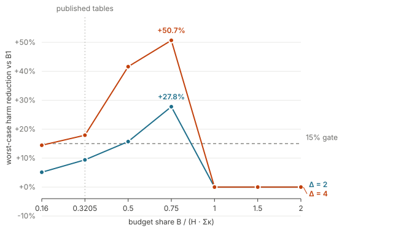

# Evaluation

> **Draft status.** Section numbering is provisional. Every number below is
> produced by a committed script and reproduced from a committed artifact under
> `auditgame/spikes/`; the artifact is named in the text at each claim. Numbers
> from the earlier draft that these supersede are listed in §6.7.

We evaluate AuditGame-SE with four questions:

- **RQ1** Does audit *allocation* reduce worst-case harm relative to auditing at
  the commit gate, and under what conditions?
- **RQ2** How does the trigger delay $\Delta$ change that answer?
- **RQ3** Which of the mechanisms in an allocation policy does the work?
- **RQ4** Does allocation compensate for a weak detector?

A fifth question is methodological and runs through all of them: **which
parameters of this game were measured, and which were assigned?** §6.6 reports
it separately because, as it turns out, four of our findings exist only because
a constant that had been assigned was replaced by a measurement.

## 6.1 Setup

**Workflows.** $N = 100$ workflows of $H = 8$ tasks, built from SWE-bench
Verified metadata (instances sorted by `created_at`, topics taken from the gold
patch, retrieval by Jaccard similarity at a threshold $\theta = 0.5$ fixed on
dev before any workflow was counted). The agent is a mock agent; §6.7 states
what that costs us.

**Cost scale.** Audit cost $\kappa(k)$ is measured, not assigned: the number of
items a stage inspects times the measured USD cost of one judgement. The game is
invariant under scaling $(\kappa, \kappa_{\text{commit}}, \eta_Q, B)$ by a
common factor, so only four dimensionless ratios matter, and we report all four
with every table:

$$\chi = 1.349, \qquad \frac{\kappa_{\text{commit}}}{\bar\kappa} = 4.00,
\qquad \frac{\eta_Q}{\bar\kappa} = 61.5, \qquad \frac{B}{H \sum_k \kappa(k)}.$$

The fourth is the budget share and is **swept**, for reasons that become the
main result. The first three are measured (`spikes/eta-q.json`,
`tools/measure_kappa.py`, `tools/measure_kappa_commit.py`).

**Attacker.** 18 scripted attacker rules, 9 held out by name hash. For each
workflow the attacker chooses the carrier $k$ and the placement
$(\iota, \sigma)$ with $\sigma - \iota = \Delta$ that is worst for the committed
policy — a genuine best response over the feasible set, not a draw from it
(`build.plan_poison_all`). Worst-case harm is the mean over workflows of that
maximum; confidence intervals resample **by workflow**, never by case, because
cases inside a workflow share a task chain and a clean-run outcome.

**Baselines.** B1 audits at the commit gate and is the baseline every reduction
is stated against. B2 audits a carrier uniformly at random. The allocation
policies are a minimax LP over the attacker class (B7) and four
receding-horizon variants that re-solve each step (SSG-full, SSG-G, SSG-up,
SSG-GU); `Sentinel` and `SentinelW` are the belief-driven designs of §4.

## 6.2 RQ1 — allocation pays, in a band

**The headline is a regime, not a number.** Sweeping the budget share while
holding the other three ratios fixed, the reduction in worst-case harm of the
best allocation policy over B1 is non-monotone and has an interior maximum
(Figure 1, `spikes/budget-sweep.json`):

| $B/(H\sum\kappa)$ | 0.16 | 0.3205 | 0.50 | 0.75 | $\ge 1.0$ |
|---|---:|---:|---:|---:|---:|
| $\Delta = 2$ | +5.1% | +9.4% | **+15.7%** | **+27.8%** | +0.0% |
| $\Delta = 4$ | +14.4% | +17.9% | **+41.6%** | **+50.7%** | +0.0% |
| B1 harm, $\Delta=4$ | 0.779 | 0.779 | 0.779 | 0.631 | 0.158 |

Three regimes, and each has a mechanical explanation:

- **Starved** ($\le 0.32$). No policy can buy enough auditing for its choices to
  matter; every policy is close to the no-audit ceiling and the gaps are small.
- **Contested** (0.5–0.75). The budget buys enough audits that *where* they go
  decides the outcome. This is the regime the model is about, and the reduction
  reaches +50.7%.
- **Saturated** ($\ge 1.0$). B1 can afford to audit the commit gate on nearly
  every task; its harm collapses to 0.158 and the SSG policies reach the same
  floor. The +0.0% is a **tie at the floor**, not policies becoming identical —
  §6.4 shows which policies never reach it.

The practical reading is that audit allocation is worth engineering in
organisations that can afford real but not exhaustive auditing, and is
approximately worthless at either extreme. We regard the non-monotonicity as
the paper's main empirical contribution, because it is the shape a reader can
use to decide whether the technique applies to them.

**A caveat we state rather than bury.** Nothing in this work prices the budget
share; 0.3205 is inherited from the earlier draft's absolute budget at $H = 8$.
The axis is therefore a map over an unpriced quantity, and we present it as a
map. It also means our own earlier tables — all run at 0.3205 — sat just below
the band where the effect is largest.

**At the published budget share, no policy clears the 15% bar.** At $N = 100$
with CI95 resampled by workflow (`spikes/certified-power.json`), the best cell
in the whole grid is SSG-full receding at +14.5% CI $[+9.7, +19.7]$
(strong detector, $\Delta = 4$), and the best cell the benign-corpus gate will
certify (§6.6) is SSG-G at +10.6% CI $[+6.5, +15.2]$. At $N = 40$ the same cell
read +17.8% and appeared to clear; it did not survive the larger sample, and we
report the $N = 100$ figure.

*Figure 1. Worst-case harm reduction over B1 as a function of the budget share,
for two trigger delays. The dashed rule is the 15% effect size this work set in
advance; the vertical rule marks the share at which all previously published
tables were run. Regenerated from `spikes/budget-sweep.json` by
`tools/plot_regime_map.py`.*

## 6.3 RQ2 — the trigger delay

Reduction grows with $\Delta$ at every budget share and every detector setting,
which is the direction Corollary 5 predicts: the longer a payload lies dormant,
the more an allocation policy can exploit the fact that the commit gate sees it
only once. At the published share and detector `mid`, the reduction over B1 runs
+0.0% / −1.2% / +1.7% / +3.5% at $\Delta = 0, 1, 2, 4$ for `Sentinel`, and
+5.5% / +2.5% / +9.4% / +17.8% for SSG-full (`spikes/grid-usd-scale.txt`).

$\Delta = 0$ is the degenerate edge: the payload detonates where it is planted,
the commit gate is sufficient, and no allocation helps. Under a best-responding
attacker this is sharper than "no help" — with eight feasible placements at
$H = 8$ the attacker always finds one that lands, and **every** policy goes to
harm 1.0000 (`spikes/best-response.json`).

We also ran $\Delta \in \{6, 8\}$, which requires $H \ge 9$ and therefore a
different corpus. On that corpus the effect is absent: no cell of eighteen
clears 15%, uniform random wins five of them, and at the same $\Delta = 4$
SSG-full is +4.0% against +17.8% at $H = 8$. We cannot currently separate
horizon from corpus, because the corpus generator draws different workflows at
different $H$; §6.7 records this as the most serious open threat.

## 6.4 RQ3 — which mechanism does the work

The policy of §4 declares three mechanisms: randomisation, a belief state, and
carrier rotation. We ablate each (`spikes/ablation.json`, $\Delta = 4$, published
budget share):

| removed | change in worst-case harm |
|---|---:|
| randomisation | +0.027 |
| belief state | **0.000** |
| carrier rotation | **0.000** |

Only randomisation moves the number, and by roughly one seventh of what the
earlier draft reported for the same ablation. Removing the belief state changes
nothing to four decimal places. This is consistent with a property of the weight
function we can state directly: on the posterior scale the belief term spans a
range of 1.86 while the $1/\kappa$ term spans 10.2, so cost dominates the
product and the belief contributes no ordering information.

**Randomisation does not do the job it is named for.** Its stated purpose is to
reduce what an attacker gains by observing the committed policy and routing to
its weakest configuration. Measured against exactly that quantity, the
randomised policy's harm rises *more* than its own deterministic ablation when
the attacker is allowed to best-respond: +0.0167 / +0.0417 / +0.0315 at
$\Delta = 0, 2, 4$ against +0.0083 / +0.0250 / +0.0315 for the deterministic arm
(`spikes/best-response.json`). We had pre-registered the opposite prediction.

**The belief-driven policies are structurally behind, not starved.** At twice
the published budget share, B1 and both SSG policies reach harm 0.158 while
`Sentinel` remains at 0.464 and `SentinelW` at 0.356
(`spikes/budget-sweep.json`). Additional budget does not close the gap, so the
deficit is in what the policy does with a budget rather than in its size. On
this evidence the receding-horizon minimax family, not the belief-driven design,
is the policy this benchmark supports.

**A fourth ablation could not be run as specified.** The earlier draft ablates
"benign drift", but the benchmark's world contains no benign drift to remove:
nothing in the corpus generator produces benign churn, and the drift rate
$\beta$ exists only as the prior mass of the null hypothesis inside the belief.
What plays that role here is detector false alarms, so we ran a counterfactual
world in which clean items never fire. It changes nothing, because at the
measured quarantine price no quarantine is affordable and $Q_{\text{false}}$ is
already 0. We report the arm as uninformative rather than as a measurement.

## 6.5 RQ4 — detector quality

Allocation does **not** help most where detection is weakest. At $\Delta = 4$ and
the published budget share, SSG-full's reduction over B1 is +12.7% / +17.8% /
+17.8% at the weak, mid and strong detector settings — flat-to-increasing in
detector quality, where the earlier draft predicted the largest advantage at the
weakest detector. Allocation and detection are complements here, not
substitutes: a policy can only exploit an alarm it can believe.

Two measurements bound how good a detector this setting actually admits. A
surface-feature detector on our corpus reaches $d' \le 0.50$, against a
break-even of $d'^{*} = 2.85$ at $\Delta = 2$; a content detector collapses to
chance (AUC 0.479 lexical, 0.518 LLM-judge) once the attacker stops announcing
itself. The regime in which this work is interesting is therefore the regime in
which detection is genuinely hard, which is the regime we can build.

## 6.6 Parameter provenance

Every parameter is established by one of four declared methods: **M1** measure
it, **M2** anchor and sweep it, **M3** derive it from the experiment design,
**M4** dissolve it into a threshold. Two rules govern changes: a prediction is
registered in a commit that precedes the run that tests it, and a quantity that
plays two roles becomes two variables.

The discipline was not cosmetic. Four findings in this section exist only
because a constant that had been assigned was replaced by a measurement:

1. **$\lambda_Q$** was assigned 0.10; the ratio $\lambda_Q/\lambda_T$ is
   measurable in this project's own cost unit and is 1.0973 — 5.5x higher. At
   the assigned value the ranking by loss is the near-reverse of the ranking by
   regret (Spearman $-0.43$) and looks like an average-case/worst-case frontier;
   at the measured value the two orderings agree ($+0.86$) and the frontier does
   not exist. We withdraw it.
2. **$\eta_Q$** was carried across scales as a ratio rather than measured. At the
   measured price one quarantine costs six times the entire episode budget, so
   quarantine is not an expensive action but not an action at all. It therefore
   enters as a swept axis (M2), with two scale-free thresholds: one quarantine
   costs a task's share of budget at $\eta_Q/\bar\kappa = 1.28$ and the whole
   episode budget at 10.26.
3. **The quarantine price was charged on one of two code paths.** Removal as a
   consequence of an audit was free while removal as an action was priced,
   though both were scored by $\lambda_Q$. Across a 54x change in $\eta_Q$ three
   policies kept exactly their quarantine counts. Charging both pro rata cut the
   headline reduction from +49.7% to +3.5%: the margin had been bought with an
   action nobody paid for.
4. **The attacker sampled its placement instead of choosing it**, using one
   feasible placement of eight at $\Delta = 0$. Against a true best response the
   $\Delta = 0$ column goes to harm 1.0000 for every policy.

$\beta$, the benign drift rate, is the one parameter two defensible measurement
rules disagree on — by 10x on one carrier — so it moves to M2. Sweeping it over
$[0.013, 1.0]$ moves no loss in four decimal places, and this is exact rather
than incidental: $\beta$ multiplies only the null hypothesis, so it scales the
normaliser and cancels in every carrier-vs-carrier comparison. A test pins the
invariance and also pins that $\beta$ *is* consumed, so the flat sweep cannot
later be produced by the parameter going unread.

**Benign-corpus gate.** Before any harm number is quoted, the injected corpus
must be indistinguishable from a benign one on surface features: AUC $\le 0.56$
over 20 splits. $\Delta \in \{0, 2\}$ certify (0.519, 0.529); $\Delta = 4$ does
not (0.587, 1 split of 20), and a 200-permutation test confirms the cell is
genuinely separable ($p = 0.010$) rather than failing a conservative parametric
bound. The cells with our largest reductions are therefore exactly the cells the
gate refuses, and readers should weight $\Delta = 4$ accordingly.

## 6.7 Threats to validity

**The agent is a mock agent.** In a pilot with a real LLM agent, 0 of 7
instances followed the injected advice. Every harm number is harm *under the
mock agent's reception model*, and the mock agent's willingness to act on a
poisoned memory is an assumption, not a measurement. This is the threat we would
most like to remove and cannot within this study.

**Horizon and corpus are confounded.** The $H = 12$ grid needed to reach
$\Delta = 8$ draws different workflows from the $H = 8$ grid, and the effect
that is present at $H = 8$ is absent at $H = 12$. Generating at $H = 12$ and
truncating to $H = 8$ would separate the two; we have not done it.

**The budget share is unpriced**, as §6.2 states. The regime map is a map.

**One gate cell is red.** $\Delta = 4$ does not pass the benign-corpus gate
(§6.6), and it carries our largest effects.

**Superseded numbers.** Tables in the earlier draft that this section replaces:
the 34.1% reduction for the belief-driven policy (measured: +3.5% at the same
budget share, and the policy is not the one we now recommend); the
average-case/worst-case frontier (does not exist, §6.6 item 1); the ablation
magnitudes (belief 0.099 measured as 0.000); and the claim that the advantage is
largest at the weakest detector (§6.5).

**Environment.** The integrity gate passes in full (593 of 593), including the
thirteen container-isolation tests that check an agent cannot reach the hidden
suites or the answer key from inside its sandbox. Two validity-gate tests are
red and are discussed in §6.6: they encode the benign-corpus gate, and the
$\Delta = 4$ cell genuinely fails it.
