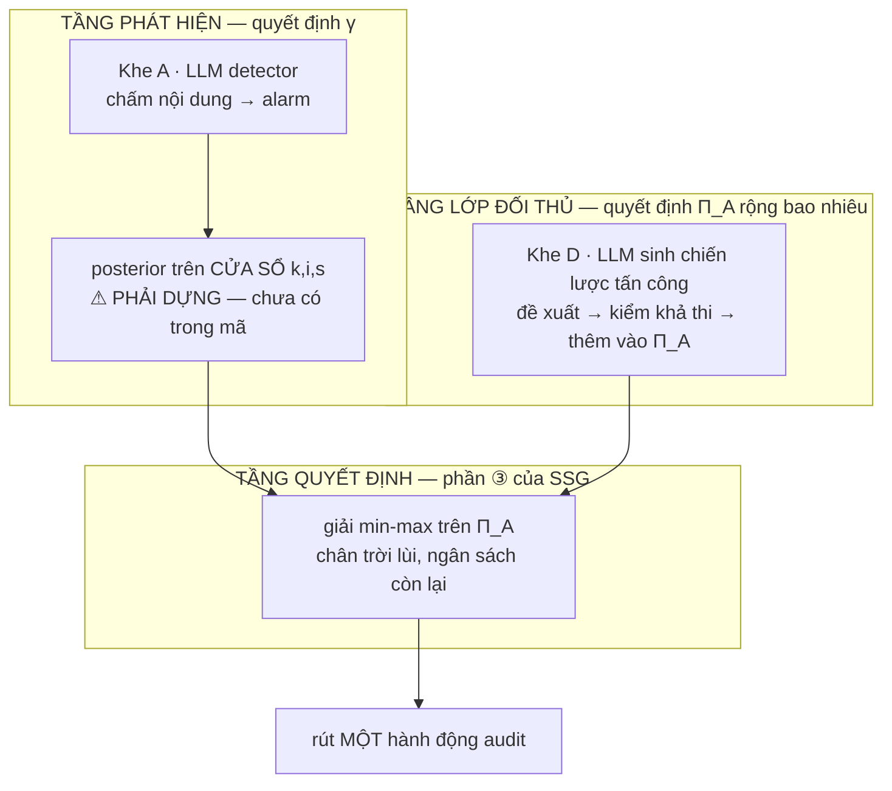

# THIẾT KẾ — Sentinel-SSG: đưa lý thuyết vào bên phòng thủ, và ghép LLM đúng chỗ

**Ngày:** 20/09/2026 · **Trạng thái:** ĐỀ XUẤT — **chưa đóng băng**. Bước 3/4a/4b mới ở mức pilot, mã ngoài repo (§8)
**Đọc cùng:** `eval/PLAN-Sau-Buoc-1.3.md` · `Toan-canh-…-Sentinel.md` §4.0, §4.3, §A.5, §G.2, Mục 16

> **Văn bản này là gì.** Phần 1–4 là **thiết kế**: SSG đang thiếu ở đâu, kiến trúc đề xuất, LLM cắm vào khe nào. Phần 5–9 là **tiền-đăng-ký**: tiêu chí, cỡ mẫu, cây phán quyết — chốt trước khi chạy, không sửa sau khi thấy số.

---

# PHẦN I — THIẾT KẾ

## 1. SSG gồm ba phần, và repo chỉ thiếu đúng một

| Thành phần | Ở đâu | Có? |
|---|---|---|
| ① Leader **cam kết chiến lược hỗn hợp** | `RANDOMIZED = True`, policy rút mỗi task | ✅ Sentinel, B7 |
| ② Follower **best-response** với cam kết | `runner.worst_case` lấy `max` trên lớp carrier mỗi workflow | ✅ toàn bộ lưới |
| ③ Leader **GIẢI** $\min_{\pi_D}\max_{\pi_A} L$ | `lp.solve_stackelberg_lp` | ❗ **chỉ B7** |

**Phần ③ là phần định nghĩa SSG.** Một chính sách ngẫu nhiên hoá mà không giải min-max thì chỉ đang ngẫu nhiên hoá.

Bốn policy trong lưới `sweep-loss` — B1 lịch cố định, B5/B6 ngưỡng, **Sentinel trọng số $b_c/\kappa_c$** — không cái nào có ③. Nên câu *"Sentinel thua B5 61/64 ô"*, căn cứ chính của phán quyết Khung B, **so hai heuristic với nhau**. Cái chưa từng đo là **nghiệm ③ trong lưới** — không phải các đại lượng worst-case nói chung; `b5-exploitability.md` (19/09) đã đo worst-case, BR gap và regret.

> 📐 Bằng chứng số, **cùng một ma trận** (`spikes/t4-minimax-lp.md`, $N=16$, seeds $(1,2)$, $V^\star = 0{,}7080$): `Sentinel` regret $0{,}2151$ · `B7 minimax-lp` $0{,}0612$.
>
> ⚠️ **PHẢN CHỨNG cho chính luận điểm trên, trong cùng bảng đó:** `B2 uniform random` có regret **$0{,}0647$** — ngang B7. Một policy **không giải gì cả** đạt worst-case bằng nghiệm minimax.
>
> Nên phát biểu *"③ là phần định nghĩa SSG"* đúng về **định nghĩa** nhưng chưa chứng minh được là có **giá trị đo được**. Giả thuyết cần kiểm: ở $K=4$ với lớp $\Pi_A$ hẹp, rải đều đã gần tối ưu, và ③ chỉ tách khỏi B2 khi $\Pi_A$ rộng hơn hoặc $\kappa$ lệch hơn. **B2 vì thế là control bắt buộc**, không phải baseline phụ.

## 2. Kiến trúc đề xuất — ba tầng, mỗi tầng một việc



Ranh giới bất khả xâm phạm, từ **§4.3** của doc:

$$\underbrace{\gamma \;=\; \psi - \phi}_{\text{ĐẦU VÀO — tầng phát hiện}} \qquad\qquad \underbrace{\pi_D}_{\text{cái ta TỐI ƯU — tầng quyết định}}$$

Tầng nào lấn việc tầng khác thì phép so mất nghĩa: một chính sách được đọc **nội dung thô** không phân bổ giỏi hơn, nó chỉ có $\gamma$ cao hơn.

## 3. LLM cắm vào đâu — bốn khe, hai khe ghép được

| Khe | LLM làm gì | Quan hệ với SSG | Chi phí |
|---|---|---|---|
| **A · Detector** | chấm nội dung → alarm → belief | ✅ **ghép** — nâng $\gamma$, ③ giữ nguyên | cao: cần Gate 4, **38 nhãn người** |
| B · Ước lượng belief | lịch sử quan sát → posterior | ✅ ghép, nhưng chồng lấn A | trung bình |
| **D · Sinh lớp đối thủ** | đề xuất tấn công → thêm vào $\Pi_A$ | ✅ **ghép — khe đáng làm nhất** | thấp: không cần nhãn người |
| C · Bộ phân bổ | tự chọn carrier | ⚠️ **thay** ③, không ghép — đây là B8, một **đối thủ** | trung bình |

### Vì sao khe D là chỗ đáng làm nhất

Điểm yếu lớn nhất của minimax do chính doc thừa nhận ở **§A.5**:

> *"mỗi lần thấy chữ worst-case, hãy hỏi ngay — **worst trong tập nào?** Nếu bài báo không trả lời được trong một câu, khẳng định đó rỗng."*

Hiện $\Pi_A$ là một **liệt kê tay**: $\Delta \times$ carrier, 12–16 cấu hình. Bảo đảm chỉ rộng bằng cái liệt kê đó. Và ta đã thấy tận mắt lớp khai báo quyết định nghiệm ra sao — có $\Delta{=}0$ thì LP dồn $100\%$ vào commit ($\sum u = 0$); bỏ ra thì rải upstream ($\sum u = 10{,}26$, $m$ tăng $0{,}55 \to 0{,}85$).

**Vòng lặp sinh–kiểm–giải:** LLM đề xuất chiến lược tấn công → `build.plan_poison` kiểm khả thi (trả `None` nếu không dựng được) → cái nào hợp lệ thì thêm vào $\Pi_A$ → giải lại.

> ⛔ **Chốt biểu diễn attacker TRƯỚC — hai lựa chọn là hai bài toán khác hẳn.**
>
> | | LLM đề xuất trong | Hệ quả |
> |---|---|---|
> | **D-hẹp** | không gian cửa sổ $(k,i,s)$ mà LP đã nhận | tập đầy đủ chỉ $H \times K = 32$ phần tử — **liệt kê hết rẻ hơn gọi LLM**. Khe D vô nghĩa |
> | **D-rộng** | ngoài đó: đa carrier, chèn theo nội dung, lịch thích nghi | LP hiện tại **không tiêu hoá được** ⇒ phải mở rộng biểu diễn |
>
> **Chốt D-rộng**, kèm cái giá: phải sửa biểu diễn $\Pi_A$ trong LP. Nên lý do 3 dưới đây đọc là *"không đổi **khái niệm nghiệm**"*, không phải *"không đụng gì"*.
>
> ⚠️ **Cảnh báo §9.2 chỉ áp một nửa — đo được 20/09.** Câu *"đối thủ yếu tâng bốc mọi defender"* nói về **phân bổ**: attacker LLM chèn dự đoán được, hiếm khai thác tính không đồng nhất carrier. Điều đó vẫn đứng, và khe D phải đối diện nó: nếu chiến lược LLM sinh ra **yếu hơn** lớp liệt kê tay thì $\Pi_A$ rộng ra mà bảo đảm **không** mạnh lên — §6.3 chốt ngưỡng cho chuyện đó.
>
> Nhưng ở chiều **nguỵ trang** thì ngược lại, và đây là tin tốt cho khe D: 19 payload LLM qua $F_{\text{match}}$ của Gate 2 cho AUC $0{,}465$–$0{,}502$ tại $\Delta \in \{0,2\}$, **dưới trần $0{,}56$, dứt khoát 20/20 split**, bằng hai cách gỡ confound độc lập. Tức chiến lược do LLM sinh **khó phát hiện hơn** mọi $\varepsilon$ trong lưới tổng hợp.
>
> Nên khe D có hai mặt phải đo riêng, đừng gộp: **chiến lược** LLM đề xuất có thể yếu (cảnh báo §9.2), nhưng **payload** nó viết thì nguỵ trang tốt hơn hẳn thứ benchmark đang dựng. Một $\Pi_A$ mở rộng bằng LLM vì thế có thể **rộng hơn về nguỵ trang mà không rộng hơn về chiến thuật** — và §6.3 phải tách hai chuyện đó ra khi chấm.
>
> *Dữ liệu: `auditgame/spikes/diag-llm-eps.json`. Chi tiết và cảnh báo mất-marker: §9.2 doc tổng quan.*

Ba lý do đáng làm:

1. Tấn công đúng chỗ yếu nhất mà đề tài **tự thừa nhận**
2. Biến một hạn chế (*lớp hẹp do liệt kê tay*) thành một **cơ chế**
3. **Không đổi khái niệm nghiệm** — Định nghĩa 1 y nguyên; cái đổi là biểu diễn $\Pi_A$

## 4. Tầng quyết định: năm phương án

| | Phần ③ giải trên cái gì | Bảo đảm | Sửa lý thuyết | Công sức |
|---|---|---|---|---|
| **⓪** Không đổi Sentinel | Sentinel: không giải · B7: toàn $\Pi_A$ | — | không | ~0 |
| **③** Chân trời lùi | cửa sổ gốc còn mở, ngân sách **còn lại** | worst-case **vô điều kiện** | không | ✅ đã cài · ⚠️ **hồi quy trên lớp upstream** |
| **①a** Ngưỡng $\tau$ | $\Pi_A$ thu hẹp: $\{k : b_t[k] \ge \tau\}$ | worst-case, có điều kiện | không | nhỏ |
| **①b** Tập khả tín $\alpha$ | tập **nhỏ nhất** có khối lượng posterior $\ge 1-\alpha$ | worst-case **với xác suất $\ge 1-\alpha$** | không | **trung bình — phải DỰNG posterior trước** |
| **②** Bayes-Stackelberg | toàn $\Pi_A$, **kỳ vọng** trên loại attacker | kỳ vọng dưới belief | **Định nghĩa 1 + Phụ lục F** | lớn |

### Chọn: **③ + ①b**, xếp chồng

**③ đã hiện thực, đã đo có artifact — và kết quả NGƯỢC với giả định ban đầu.**

`spikes/ssg-gates.json`, 40 workflow, seeds $(1,2,3)$, ba ô:

| $\Delta$, $d'$ | lớp $(0,2,4)$ | lớp $(2,4)$ |
|---|---|---|
| $2$, $2{,}2$ | $-0{,}158$ | $-0{,}058$ |
| $4$, $2{,}2$ | $-0{,}068$ | **$+0{,}122$** |
| $4$, $1{,}0$ | $-0{,}059$ | **$+0{,}050$** |

> ⛔ **Chân trời lùi giúp trên lớp commit-only nhưng HẠI trên lớp upstream ở $2/3$ ô** — đúng cái lớp dùng để phán quyết chính.
>
> Không phải thiếu tiền: lùi tiêu **nhiều hơn** tĩnh ($15{,}4$ vs $15{,}0$) mà harm **tệ hơn** ⇒ **phân bổ sai**, không phải tiêu thiếu. Giả thuyết: giải lại làm policy **tham lam sớm** — mỗi bước nó thấy một ngân sách đầy cho một chân trời ngắn hơn, nên dồn vào đầu ván.
>
> **Hệ quả cho thiết kế:** ③ **không còn là thứ "làm bất kể ①/②"**. Nó phải được kiểm riêng trên từng lớp, và trên lớp upstream nó hiện là một **hồi quy**. Bước 6 không được xây chồng lên ③ khi chưa gỡ chuyện này.
>
> Đo trên lớp $(0,2,4)$ — nơi nó giúp — vẫn khớp khoảng cách knapsack ở **Phụ lục F.5**, nhưng lớp đó là commit-only nên kết luận đúng là *"B1 có giải lại tốt hơn B1 tĩnh"*, **không** nói gì về minimax.
>
> Muốn kiểm ③ cho minimax thì phải chạy trên **lớp upstream**, tức đúng biến thể `SSG-up` đăng ký ngay dưới.

> ⛔ **HIỆU ỨNG ĐUÔI — phải sửa công thức giải lại TRƯỚC khi chạy upstream.**
>
> Giải lại như **một ván mới** với $H' = H - t$ thì khi chân trời còn lại ngắn hơn $\Delta$, **không cửa sổ nào khả thi**. Đo được với `deltas=(2,4)`:
>
> | $H'$ | số cửa sổ khả thi | $\Sigma u$ | $\Sigma v$ | $m$ |
> |---|---|---|---|---|
> | 8 | 40 | $3{,}514$ | $2{,}935$ | $0{,}768$ |
> | 4 | 8 | $2{,}000$ | $1{,}250$ | $1{,}000$ |
> | **2** | **0** | **$0{,}000$** | **$0{,}000$** | **$1{,}000$** |
>
> Ở $H' \le 2$ policy **ngừng audit hoàn toàn**, và LP báo $m = 1{,}000$ — *"phủ hoàn hảo"*. Đó là $\min$ trên **tập rỗng**, nhận cận trên của biến. Một thất bại **im lặng**: chỉ số nói tốt nhất có thể trong khi không làm gì.
>
> **Công thức đúng:** giải lại trên các **cửa sổ gốc còn mở**, tức mọi $(k,i,s)$ **chưa nổ** — điều kiện duy nhất là $s \ge t$:
> $$m \;\le\; \sum_{t' = \max(i,\,t)}^{s-1} u[k][t'] \;+\; v[s] \;+\; C(k,i,s), \qquad \forall (k,i,s) \text{ với } s \ge t$$
>
> ⚠️ **Không ràng $i < t$.** Attacker chốt $(k,i,s)$ **trước ván** (§4.0, mũi tên 1), nên tại $t$ mọi cửa sổ chưa nổ đều còn mở — **kể cả $i \ge t$**, tức chưa chèn. Chính $\max(i,t)$ trong cận dưới của tổng là để xử lý đúng trường hợp đó.
>
> ⚠️ **$C(k,i,s)$ là SỐ AUDIT ĐÃ THỰC HIỆN, không phải marginal đã lên kế hoạch.** Trước $t$ thì thăm đã rút xong — thứ tồn tại là **audit đã xảy ra**, không còn là xác suất. Trộn xác suất *ex-ante* với kết quả *ex-post* trong cùng một ràng buộc là lỗi **cùng họ với bẫy 8**: nghiệm nằm ngoài không gian thực. Khai báo: $C = \big|\{t' < t : \text{đã audit } k \text{ tại } t' \in [i,s)\}\big|$. Bỏ hẳn $C$ là phương án bảo thủ chấp nhận được, **nhưng phải khai báo là đã bỏ**.
>
> Thêm một `assert` bắt buộc: **số cửa sổ khả thi $> 0$** trước mỗi lần giải. Nếu bằng $0$ thì trả `None` (không audit) chứ **không** nhận $m$ từ LP.

**①b hơn ①a** vì $\tau$ là ngưỡng **tuỳ tiện trên giá trị posterior** (không ai biết $\tau = 0{,}1$ nghĩa là gì, phải quét mò), còn $\alpha$ là **mức phủ** đọc được ngay: *"bảo đảm worst-case đúng với xác suất ít nhất $1-\alpha$"*. Và điều kiện của bảo đảm có sẵn **theo xây dựng**, không phải đo sau.

> ⛔ **①b đòi một posterior mà mã nguồn KHÔNG CÓ.** `Sentinel.belief` là EMA $b \leftarrow (1-\beta)b + \beta\,p_c/\pi_0$, giá trị $\approx[0,5]$, **không chuẩn hoá**, một số cho mỗi *carrier* — không phải phân bố trên loại attacker $(k,\iota,\sigma)$. *"Tập nhỏ nhất có khối lượng $\ge 1-\alpha$"* **không định nghĩa được** trên nó.
>
> Thêm: *"particle filter"* ở sơ đồ §2 và ở **Mục 7 doc tổng quan** (*"particle filter 2048 hạt"*) **không tồn tại trong mã** — `grep -r particle --include=*.py` chỉ khớp trong `workspace/sympy` vendored.
>
> **Hệ quả:** dựng posterior là bước **XÂY**, không phải phép đo. *"Kiểm hiệu chuẩn belief"* chỉ có nghĩa **sau khi** có posterior thật.

**Loại ②** không vì nó sai — nó vẫn là SSG, là Bayesian SSG, có văn liệu (DOBSS). Loại vì hai lý do cụ thể:
- nó đẩy Sentinel sang sân **trung bình**, nơi B5 đã thắng $61/64$;
- nó đòi viết lại Định nghĩa 1 và Phụ lục F trong lúc hạn FSE còn ~12 ngày.

Ghi ② vào hướng mở rộng.

### Lớp $\Pi_A$ mà Sentinel-SSG giải trên — đăng ký HAI biến thể, không chọn một

Đây là câu hỏi chặn, và câu trả lời **không phải** chọn một:

| Policy đăng ký | Lớp LP | Ô trong lớp / 64 | Nó trả lời câu gì |
|---|---|---|---|
| `SSG-full` | $(0,2,4)$ | 48 ($\Delta{=}1$ ngoài lớp) | belief đóng góp bao nhiêu **trên nền commit-only** |
| `SSG-up` | $(2,4)$ | 32 ($\Delta \in \{0,1\}$ ngoài lớp) | minimax thu hẹp có giá trị **ở chế độ upstream** không |

**Vì sao hai, không phải một.** §A.5 nói lớp khai báo **quyết định nghiệm** — ta đã đo tận mắt: $(0,2,4)$ cho $\Sigma u = 0$ (commit-only), $(2,4)$ cho $\Sigma u = 10{,}26$. Hai lớp là **hai bài toán**, và **báo cáo cả hai chính là kết quả**, không phải né tránh.

> ⚠️ **Hệ quả cho §6.3, phải đọc kèm:** với `SSG-full`, tiêu chí *"thắng B1"* chỉ còn đo **belief** (vì nền đã là commit-only $\equiv$ B1), và *"thắng B7-tĩnh"* gần như tự động (giải lại thu hồi ngân sách thừa). Nên **phán quyết chính tính trên `SSG-up`**; `SSG-full` báo cáo làm đối chứng.

**Giữ ⓪ làm đường lùi:** nếu ①b không hơn, thì việc đưa B7 vào lưới **tự nó** đã là đóng góp — lần đầu bảng kết quả của đề tài chứa một chính sách thật sự giải SSG.

---

# PHẦN II — TIỀN ĐĂNG KÝ

## 5. Nền bằng chứng — sáu số đo, và một phản chứng

| Bằng chứng | Nguồn |
|---|---|
| `Sentinel` $0{,}2151$ vs `B7` $0{,}0612$ — **cùng ma trận T4** | `spikes/t4-minimax-lp.md` |
| ⚠️ **`B2 uniform random` $0{,}0647$ — ngang B7** | cùng bảng · phản chứng cho §1 |
| `B1` regret $0{,}0499$ tại $(0,0)$ trong một ma trận **khác** | `b5-exploitability.md` — **B1 chưa có trong bảng T4; phải đo lại cùng ma trận trước khi so** |
| Không policy nào trong lưới giải min-max | `policies.py` |
| B7 **không có trong lưới** và **hỏng** tới 19/09 | Bẫy 8, 9 ở §G.2 |
| Sau khi vá: B7 từ $0/64$ lên $25/64$ · $28/64$ | `spikes/sweep-b7-fixed.json` |
| Chân trời lùi giảm harm $0{,}027$–$0{,}054$ — **nhưng trên lớp $(0,2,4)$ ⇒ đo B1-có-giải-lại** | pilot 20/09, **mã ngoài repo** |
| $d'^\star$ trải $0{,}00$–$1{,}20$ qua năm hạt corpus | `spikes/dprime-band.json` |

## 6. Chốt trước khi chạy

### 6.1 Cỡ mẫu và lưới

| Tham số | Giá trị đóng băng |
|---|---|
| Workflow / seed | $N = 40$, $H = 8$, seeds $(1,2,3)$ |
| Lưới $d'$ | 16 điểm $[0{,}0 \ldots 3{,}0]$ |
| $\Delta$ | $\{0, 1, 2, 4\}$ |
| **Corpus seed** | $2026$ là hạt **PILOT** (đã nhìn số) · bốn hạt **confirmatory** $(4051, 7793, 1409, 9137)$ |
| Ngân sách | $B = 17{,}95$ |
| Mức phủ $\alpha$ | $\{0{,}01,\ 0{,}05,\ 0{,}10,\ 0{,}20\}$ — báo cáo đường cong |

> ⚠️ **Năm hạt là bắt buộc.** Đo 20/09: $d'^\star$ tại $\Delta{=}4$ trải $0{,}00$–$1{,}20$; tại $\Delta{=}2$ **2/5 hạt** không có điểm hoà vốn; tại $\Delta \in \{0,1\}$ **5/5 hạt** không có. Một hạt là một lần rút.

> ⚠️ **Hạt $2026$ tách riêng vì nó đã bị nhìn.** `sweep-b7-fixed.json` ($25/64 \cdot 28/64$) chạy trên $2026$, và văn bản này viết **sau** khi thấy số đó. Đưa nó vào tập confirmatory là HARKing. Phán quyết tính trên **bốn hạt chưa nhìn**; $2026$ báo cáo riêng.

> ⚠️ **"Ngoài lớp" phải tính RIÊNG cho từng biến thể.** Lưới có $\Delta \in \{0,1,2,4\}$:
>
> | Policy | Lớp | Ô trong lớp | Ô **ngoài lớp** |
> |---|---|---|---|
> | `SSG-full`, `B7` | $(0,2,4)$ | 48 | 16 — $\Delta{=}1$ |
> | `SSG-up`, `B7U` | $(2,4)$ | 32 | 32 — $\Delta \in \{0,1\}$ |
>
> *"Worst-case $L$"* ở ô ngoài lớp **không phải** đại lượng Định nghĩa 1 bảo đảm. Báo cáo **tách riêng, nhãn "ngoài lớp"** (§A.5).

> 📐 **Quy tắc đếm ô thắng: *sole winner*** — hoà không tính cho ai. Đếm có tính hoà cho $26$ thay vì $25$ trên cùng dữ liệu.

### 6.2 Đại lượng bắt buộc báo cáo

| Đại lượng | Vì sao |
|---|---|
| $L$ tại $\lambda_Q \in \{0;\ 0{,}10\}$, $\lambda_T = 0{,}50$ | hai cột cố định — cột `lambda-bar` **không so được** giữa các tập policy khác nhau |
| **worst-case $L$**, BR gap, regret so với $V^\star$ | đại lượng framework thật sự tuyên bố (§4.0) |
| **Hiệu chuẩn belief**: $\Pr[(k,\iota,\sigma)_{\text{thật}} \in A_t]$ vs $1-\alpha$ danh nghĩa | điều kiện của bảo đảm, biến thành phép đo |
| $Q_{\text{false}}$, $T_{\text{lost}}$, chi thực | đã biết: lớp coverage có $Q_{\text{false}} \equiv 0$; chỉ policy audit commit chịu $T_{\text{lost}}$ |
| **Số attacker thêm được** (khe D) và bảo đảm dịch bao nhiêu | đo trực tiếp giá trị của việc mở rộng $\Pi_A$ |

> 📐 **$A_t$ là tập trên không gian CỬA SỔ $(k,i,s)$, không phải trên carrier.** Vì $\Pi_A$ gồm cửa sổ và LP ràng buộc theo cửa sổ — một tập trên carrier không cắt được không gian mà LP làm việc. Điều này làm bước dựng posterior **lớn hơn** nữa: cần phân bố trên $\approx H \times K$ cửa sổ, không phải $K$ số.

### 6.3 Cây phán quyết — không sửa sau khi thấy số

| Điều kiện | Kết luận |
|---|---|
| **`SSG-up`** thắng **B1 ∧ B7U-tĩnh ∧ B2** trên worst-case $L$ — tính trên **32 ô trong lớp** — ở $\ge 3/4$ hạt confirmatory, tại $\ge 2$ mức $\alpha$ liên tiếp | Lý thuyết SSG **đứng vững** sau khi được cài đúng |
| `SSG-full` thắng B1 | **chỉ đo belief**, không đo minimax — vì nền của nó đã là commit-only $\equiv$ B1. Báo cáo làm đối chứng, **không** dùng làm phán quyết chính |
| Chỉ thắng B5 | **điều kiện cần, không đủ.** B5 là policy ngưỡng, attacker best-response bằng cách nằm dưới ngưỡng ⇒ worst-case của nó $0{,}8267$/$0{,}9231$ ở cả hai báo cáo, và B7 **đã** thắng nó. Thắng B5 gần như định sẵn |
| Không tách được khỏi **B2 uniform random** | ③ **không có giá trị đo được** ở quy mô này — kết quả âm, và là kết quả đáng công bố |
| Thắng $L$ trung bình nhưng **không** worst-case | Ghi **cả hai**, nói rõ framework tuyên bố cái nào |
| Không thắng ở mức $\alpha$ nào | **Khung B được củng cố** — mạnh hơn hiện tại, vì lần này minimax được cài đúng |
| Đảo chiều giữa các hạt | `UNDECIDED_INSUFFICIENT_POWER` (Gate 3) — **không** chọn hạt thuận lợi |
| Khe D thêm attacker làm $V^\star$ tăng **quá $0{,}05$ tuyệt đối** | bảo đảm cũ quá lạc quan **ở mức đáng kể** |

> ⚠️ **Hàng cuối cần ngưỡng, vì nếu không nó là tautology:** mở rộng $\Pi_A$ thì $\max$ **chỉ có thể tăng** — đó là hệ quả toán học, không phải phát hiện. Ngưỡng $0{,}05$ chốt ở đây, trước khi chạy.
>
> ⚠️ **Thứ tự ưu tiên khi nhiều hàng cùng bắn:** hàng "đảo chiều" thắng hàng "$\ge 3/4$ hạt" nếu hạt thua có biên lớn hơn biên thắng trung bình. Định nghĩa này chốt trước.

## 7. Control bắt buộc giữ

| Control | Đo cái gì |
|---|---|
| `Sentinel` **bản cũ** (heuristic) | "SSG đóng góp bao nhiêu so với heuristic" |
| **`B7U minimax-lp upstream`** — minimax **tĩnh trên $(2,4)$** | control tĩnh **của `SSG-up`**. Dùng B7 trên $(0,2,4)$ làm control cho `SSG-up` sẽ **trộn** *"chân trời lùi đóng góp bao nhiêu"* với *"lớp đóng góp bao nhiêu"*. Policy này đã có: `spikes/sweep-b7u-fair.json` |
| `B7 minimax-lp` ($0,2,4$, tĩnh) | control tĩnh **của `SSG-full`** |
| `SSG-up` / `SSG-full` tại $\alpha \to 0$ | "belief đóng góp bao nhiêu", đo riêng cho từng biến thể |
| **`B2 uniform random`** | **bắt buộc** — regret $0{,}0647$ ngang B7 $0{,}0612$ trong T4. Nếu SSG không tách khỏi B2 thì ③ không có giá trị đo được, bất kể nó đúng về định nghĩa |
| **`B1 audit-at-commit`** | **mốc worst-case thật** — thắng harm sole-winner $23/64$ trong `sweep-b7-fixed.json`. Regret $0{,}0499$ của nó đo ở **ma trận khác**; **phải đo lại cùng ma trận T4** trước khi đặt cạnh $0{,}0612$ |
| `C4` · `C8` | giữ nguyên |

Sáu mốc, bốn câu hỏi tách bạch: **rải đều** → heuristic → minimax tĩnh → minimax lùi → minimax lùi + belief, với **B1 làm mốc worst-case**.

## 8. Thứ tự thi hành — không đảo

```
1. Thiết kế + tiền-đăng-ký (văn bản này), commit        ← cổng thật
2. Chốt phương án tầng quyết định                        ← ĐÃ CHỐT: ③ + ①b
3. Chân trời lùi  lp.solve_remaining_lp + SSGReceding    ✅ trong repo
4a. remaining-LP(t=0) ≡ static LP, cả hai lớp            ✅ PASS, khớp 1e-9
4b. Đo chênh lùi vs tĩnh trên CẢ HAI lớp                 ⚠️ HỒI QUY trên (2,4): +0,122 / +0,050
4c. Gỡ hồi quy ở 4b TRƯỚC khi sang bước 6                ← CHẶN
5. Đưa B7 vào POLICIES chính thức, chạy năm hạt          ← LÀM TIẾP
6. Tập khả tín α; quét α; kiểm hiệu chuẩn belief
7. Khe D — LLM sinh Π_A, vòng sinh–kiểm–giải
8. Khe A — F_detect, CHỈ sau khi T8 cho d' của nó
```

**Artifact cho bước 3–4b** (đã có, 20/09): `lp.solve_remaining_lp` · `policies.SSGReceding` · `policies.SSGRecedingUpstream` · `policies.MinimaxLPUpstream` · `spikes/ssg-gates.json`.

> ⛔ **Bước 4c là cổng mới, sinh ra từ chính phép đo 4b.** Chân trời lùi là hồi quy trên lớp upstream. Xây bước 6 (thu hẹp theo belief) chồng lên một hồi quy chưa gỡ thì khi số xấu, không ai biết do belief hay do ③.
>
> Hai giả thuyết cần phân định ở 4c: **(i)** tham lam sớm — kiểm bằng cách so đường chi tiêu theo $t$ giữa lùi và tĩnh; **(ii)** $C$ bị bỏ — bản cài hiện **không truyền** `done` cho lớp upstream trong mọi đường, kiểm bằng cách bật/tắt $C$.

Ghi lại một bài học từ pilot: lần chạy 4a đầu tiên **KHÁC** chỉ vì nhãn seed (`"ssg"` thay vì `"minimax_lp"`) — lệch tới $0{,}13$ harm, lớn hơn hầu hết hiệu ứng đang đi tìm. **Nhãn seed không phải chi tiết trang trí.**

**Bước 8 phụ thuộc T8.** Ghép một tầng chưa đo chất lượng thì khi kết quả đổi, không ai biết do SSG hay do LLM.

## 9. Không làm

| Không làm | Vì sao |
|---|---|
| Bayes-Stackelberg / DOBSS | đổi khái niệm nghiệm ⇒ Định nghĩa 1 + Phụ lục F viết lại. Hướng mở rộng |
| Đổi mặc định `MinimaxLP.DELTAS` | lớp attacker khai báo — cần tiền-đăng-ký riêng (§A.5). Thay vào đó **đăng ký thêm** biến thể upstream làm policy riêng, báo cáo cả hai |
| Cho LLM đọc nội dung thô ở khe C | phá ranh giới $\gamma$ / $\pi_D$ (§4.3) |
| Bỏ `Sentinel` cũ khỏi REGISTRY | nó là control của chính thí nghiệm này |

> ⚠️ **Mâu thuẫn doc↔code phải mở ticket, không im lặng.** §5.3 doc tổng quan mô tả Sentinel *"giải chính xác bằng quy nạp lùi… thư viện 28 chính sách, chọn minimax"*; mã là trọng số $b_c/\kappa_c$. Văn bản này đúng về code, nhưng khi tuyên bố *"không policy nào giải min-max"* thì đồng thời tuyên bố **§5.3 mô tả sai**. Phải sửa §5.3 — và Mục 7 (*"particle filter 2048 hạt"*) — chứ không để hai văn bản trái nhau.

---

## 10. THIẾT KẾ LẠI 20/09/2026 — gỡ cổng 4c, và chân trời lùi được đặt đúng chỗ

Mục có ngày, không sửa chữ nào ở trên. Chẩn đoán 4c đã xong; đây là thiết kế thay thế rút ra từ chính nó.

### 10.1 Cái đã đo, và nó nói gì

```
0,121622  =  0,027027 (bỏ ràng buộc C)  +  0,094595 (bản thân việc GIẢI LẠI)
```

Bốn phần năm độ hồi quy đến từ **chính việc giải lại**, không từ lỗi cài đặt. Cơ chế đã truy được tới cùng:

| | tĩnh (B7U) | lùi (SSG-up) |
|---|---|---|
| nghiệm tại $t{=}1$ | **bất đối xứng theo $\kappa$** | **đối xứng** `[0,25]×4` |
| độ phủ cuối tập | 0,332 | 0,267 |
| độ lệch chuẩn độ phủ | 0,129 | 0,110 |
| **cửa sổ tệ nhất** | **0,105** | **0,074** |

Giải lại làm phân bổ **đều ra**. Nghe hợp lý, nhưng mục tiêu minimax trả giá cho **độ sâu ở chỗ yếu nhất**, không trả giá cho sự đồng đều — nên nó bào mỏng đúng cái cửa sổ đang được chấm điểm.

### 10.2 Tên đúng của lỗi

> **Bất nhất thời gian trên một ngân sách dùng chung.**

Cam kết tĩnh tối ưu cho **toàn cuộc**. Mỗi lần giải lại, bài toán đuôi mất đi cấu trúc $\kappa$ vốn sinh ra tính bất đối xứng — vì cấu trúc ấy là thuộc tính của **cả chân trời**, không phải của phần còn lại. Tối ưu cho đuôi là **phá** chính bảo đảm worst-case mà cam kết ban đầu tạo ra.

Đây không phải lỗi cài đặt; đây là điều lý thuyết đã biết về MPC trên ràng buộc dùng chung, và phép đo 4b là một minh hoạ sạch của nó.

### 10.3 Thiết kế thay thế — giải lại CÓ SÀN, và CÓ CỚ

Hai sửa đổi, mỗi cái nhắm đúng một nửa của chẩn đoán.

**(a) Sàn bảo đảm.** Một lần giải lại chỉ được **cải thiện**, không bao giờ được hạ, độ phủ bảo đảm ở cửa sổ tệ nhất. Thêm một ràng buộc vào `solve_remaining_lp`:

$$m_{\text{lùi}} \;\ge\; m_{\text{tĩnh}}\big|_{\text{cửa sổ còn mở}}$$

trong đó $m$ là giá trị min-over-windows. Không khả thi ⇒ **giữ nguyên kế hoạch đã cam kết**. Nghĩa là biến thể này **không thể tệ hơn tĩnh theo cấu tạo** — hồi quy 4b bị chặn bằng ràng buộc, không bằng hy vọng.

**(b) Phải có cớ mới được giải lại.** Lý do duy nhất chính đáng để giải lại là **thông tin mới**. Giải lại vì *thời gian trôi* thì không có thông tin nào cả — và đó đúng là cái 4b đo được: mất mát thuần.

Nên: giải lại **chỉ khi belief đổi đáng kể**, tức chỉ khi có **báo động từ tầng phát hiện**. Đây cũng là chỗ **khe A (LLM detector) vào đúng vai**: nó không đổi phép toán phân bổ, nó **cung cấp sự kiện cho phép tái tối ưu**.

### 10.4 Vì sao thiết kế này trả lời đúng câu "SSG kết hợp LLM"

Bản cũ ghép LLM vào như một tầng song song, và §8 phải cấm bước 8 chạy trước T8 vì không tách được nguyên nhân. Bản này đặt LLM vào **vai kích hoạt**:

- $\gamma$ (chất lượng phát hiện) vẫn là **ĐẦU VÀO**, $\pi_D$ vẫn là cái được **TỐI ƯU** — ranh giới §4.3 không bị phá
- LLM không đọc nội dung để **phân bổ**; nó đọc nội dung để **báo có nên tính lại không**
- Sàn (a) bảo đảm một báo động sai không làm hỏng bảo đảm

### 10.5 Dự đoán, chốt trước

| | dự đoán |
|---|---|
| lùi-có-sàn so với tĩnh | **không bao giờ tệ hơn** (theo cấu tạo); hơn ở chế độ có báo động mang tín hiệu |
| số lần giải lại | **giảm mạnh** so với bản lùi hiện tại — hầu hết bước thời gian không có tin gì mới |
| dưới tấn công **ngầm** | suy biến về **đúng bằng tĩnh** |

Dòng cuối nối thẳng với phép đo nội dung 20/09: báo động của LLM chỉ mang tin khi attacker **tự khai báo**. Dưới lớp tấn công ngầm, AUC về 0,5, nên không có báo động, nên không giải lại, nên bằng tĩnh. **Suy biến êm, và kiểm được** — đó là một dự đoán có thể sai, không phải một lời hứa.

### 10.6 Ảnh hưởng tới lộ trình §8

| Bước | Trạng thái mới |
|---|---|
| 4c | **GỠ được** — chẩn đoán xong, thiết kế thay thế ở §10.3 |
| 5 | không đổi |
| 6 | **KHÔNG** xây trên chân trời lùi cũ. Xây trên lùi-có-sàn |
| 7 | không đổi |
| 8 | khe A đổi vai: **kích hoạt**, không phải tầng phát hiện song song |

### 10.7 Không làm

| Không làm | Vì sao |
|---|---|
| Giải lại mỗi bước thời gian | 4b đã đo: mất thuần 0,0946 |
| Bỏ sàn để "linh hoạt hơn" | sàn là thứ duy nhất biến dự đoán 10.5 thành tất định |
| Cho LLM chọn carrier | phá ranh giới $\gamma$ / $\pi_D$ (§4.3) |
| Báo cáo lùi-có-sàn mà không báo cáo tĩnh | tĩnh là control của chính thí nghiệm này |
