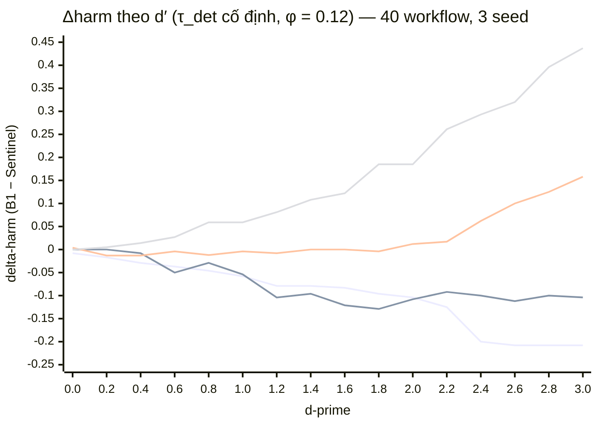

# Quét `d′` liên tục và ngưỡng hoà vốn `d′*`

**Ngày đo:** 17/09/2026 · **Lệnh:** `python3 dprime_sweep.py --n 40`
**Module:** `dprime_sweep.py` · **Test:** `tests/gate{1,2,3}_*/test_dprime_*.py`

---

## 1. Câu hỏi sai và cách nó tan đi

Luận văn đang báo kết quả tại **ba điểm khai báo** chép từ bản thảo gốc —
`weak (0.75, 0.20)`, `mid (0.85, 0.12)`, `strong (0.92, 0.06)` — và không có câu
trả lời cho phản biện *"0,85 ở đâu ra?"*.

Cách sửa **không phải** là bảo vệ 0,85 hay hơn. Là **thôi chọn**: `d′` trở thành
**tham số quét**, kết quả báo trên cả dải, và tuyên bố chính đổi sang **dạng
ngưỡng**. Câu hỏi không được trả lời — nó tan đi.

Việc này **không cần hệ con mới**: `detector.Detector(d_prime, tau_det)` đã nhận
`d′` bất kỳ. Tất cả phần dưới là **phép đo cộng thêm**, không con số đóng băng nào
xê dịch (xem §11).

---

## 2. Tham số hoá — chốt TRƯỚC, không chọn sau khi thấy số

Quét `d′` với **`τ_det` GIỮ CỐ ĐỊNH**:

```
τ_det = 1.17498679206609      (= z(1 − 0.12), lấy từ setting `mid`)
φ = Φ(−τ_det) = 0.12          KHÔNG ĐỔI tại mọi điểm trên đường cong
ψ = Φ(d′ − τ_det)             biến thiên: 0.120 (d′=0) → 0.966 (d′=3)
```

**Vì sao phải là tham số hoá này.** Đây mới là **quét một chiều đúng nghĩa**. Ba
setting khai báo cũ dịch chuyển `ψ` **và** `φ` cùng lúc, nên chênh lệch giữa hai
setting không quy được cho bên nào. Ở đây quy được: **mọi điểm trên đường cong có
cùng một tỉ lệ báo động giả**. Nếu `φ` trôi theo `d′` thì `d′*` là ngưỡng trên hai
đại lượng một lúc, và tuyên bố ngưỡng sẽ **sai như đang viết**.

Test `test_the_sweep_holds_the_false_alarm_rate_fixed_at_every_point_of_the_grid`
(gate 2) giữ điều này.

**Cái KHÔNG cố định được — khai báo ở đây, không phát hiện sau.** Chuỗi `setting`
đồng thời là khoá tra **bảng `tau_sel` đóng băng** (`scoring.tau_sel`) — ngưỡng
chọn-carrier ở mức posterior. Bảng đó chỉ có ba hàng weak/mid/strong và **được hiệu
chỉnh theo `d′`**. Quét này giữ `setting="mid"` ở mọi `d′`, nên ngưỡng chọn-carrier
của policy đứng yên ở mức hiệu chỉnh cho `d′ = 2.211` trong khi detector chạy theo
`d′` quét. Đây là **cái giá** của "chỉ đổi `d′`, không đổi gì khác" mà không được
sửa `scoring.py`; nó là một **confound thật** ở vùng `d′` xa 2,211 và được ghi ra
như một confound (§10). *(Cập nhật 18/09/2026: confound này đã được **đo** và hoá
ra **TRƠ** với `Δharm` của cặp `B1`/`Sentinel` — xem §10.1 và
`docs/reports/tau-sel-follows-dprime.md`.)* `d′` của detector **có** đi vào policy, qua
`runner → scoring.carrier_score(raw, det.d_prime)`, nên mô hình niềm tin bám theo
đường quét dù ngưỡng thì không.

---

## 3. Định nghĩa `d′*` — chốt TRƯỚC khi nhìn bất kỳ con số nào

> **`d′*` = giá trị `d′` NHỎ NHẤT trong lưới sao cho cận dưới CI95 của `Δharm`
> lớn hơn 0 tại đó VÀ tại MỌI `d′` lớn hơn trong lưới.**

Mệnh đề **"và giữ được ở mọi `d′` lớn hơn"** là toàn bộ trọng tâm. Không có nó,
một giao cắt do nhiễu ở đáy lưới được báo thành ngưỡng. Dự án này **đã bị một lần**
vì chọn luật tóm tắt sau khi thấy dữ liệu (kết luận P7) — nên luật nằm trong hàm
`dprime_sweep.break_even()` và **được viết trước khi đo**.

`break_even` quét **từ trên xuống**, nối dài dải khi cận dưới còn dương và **dừng
ở điểm đầu tiên phá vỡ** — cùng một phát biểu, nhưng biến mệnh đề "và giữ được"
thành **cấu trúc** chứ không phải một dòng chú thích: một điểm dương đơn độc nằm
dưới một điểm âm không bao giờ trả về được.

`d′*` = `None` khi không có hậu tố nào của lưới thoả. **"Không có ngưỡng hoà vốn
trong dải này" là một câu trả lời**, một con số nội suy thì không.

Ô nào **không dựng được attack** (N3) thì mang **LÝ DO**, không mang `harm = 0`, và
**phá vỡ dải** y như một cận dưới không dương: một phép đo vắng mặt không chống đỡ
được mệnh đề "và giữ được".

`Δharm(d′) = harm_B1(d′) − harm_Sentinel(d′)`, CI95 bằng `runner.bootstrap_paired`
— **lấy lại mẫu THEO WORKFLOW**, giữ nguyên đơn vị lấy mẫu.

---

## 4. Lưới quét

| | |
|---|---|
| Lưới thô | `d′ ∈ {0.0, 0.2, 0.4, …, 3.0}` — bước 0,2, **16 điểm** |
| Mịn hoá cục bộ | bước **0,05**, chỉ **bên trong khoảng chứa `d′*`** |
| Δ | `{0, 1, 2, 4}` — **BÁO TỪNG Ô, KHÔNG GỘP** |
| Corpus | 40 workflow, `H = 8`, `B = 17.95`, 3 seed, carrier `memory·skill·queue·branch` |
| Policy | `B1 audit-at-commit` và `Sentinel` (Δharm định nghĩa qua đúng cặp này) |

**Mịn hoá, không nội suy.** Nếu `d′*` thô rơi vào điểm lưới `g`, giao cắt thật nằm
trong khoảng mở `(g − 0.2, g]`; đúng khoảng đó — và chỉ nó — được **đo lại** ở bước
0,05, rồi **áp lại cùng một luật `d′*`** lên lưới đã trộn. Không nội suy tuyến
tính, vì một `d′*` nội suy là con số có **độ chính xác bịa**.

Hàng có dấu `ᵣ` trong bảng là điểm mịn hoá.

---

## 5. Bảng đầy đủ `d′ × Δ`

#### Δ = 0

| `d′` | `ψ = Φ(d′−τ)` | harm B1 | harm Sentinel | **Δharm** | CI95 thấp | CI95 cao | feasible |
|---:|---:|---:|---:|---:|---:|---:|:--:|
| 0.00 | 0.120 | 0.983 | 0.992 | **−0.008** | −0.025 | +0.000 | 40/40 |
| 0.20 | 0.165 | 0.975 | 0.992 | **−0.017** | −0.042 | +0.000 | 40/40 |
| 0.40 | 0.219 | 0.963 | 0.992 | **−0.029** | −0.067 | +0.000 | 40/40 |
| 0.60 | 0.283 | 0.954 | 0.992 | **−0.037** | −0.079 | −0.008 | 40/40 |
| 0.80 | 0.354 | 0.946 | 0.992 | **−0.046** | −0.088 | −0.008 | 40/40 |
| 1.00 | 0.431 | 0.933 | 0.992 | **−0.058** | −0.108 | −0.017 | 40/40 |
| 1.20 | 0.510 | 0.912 | 0.992 | **−0.079** | −0.133 | −0.033 | 40/40 |
| 1.40 | 0.589 | 0.912 | 0.992 | **−0.079** | −0.133 | −0.033 | 40/40 |
| 1.60 | 0.665 | 0.908 | 0.992 | **−0.083** | −0.142 | −0.037 | 40/40 |
| 1.80 | 0.734 | 0.896 | 0.992 | **−0.096** | −0.158 | −0.042 | 40/40 |
| 2.00 | 0.795 | 0.887 | 0.992 | **−0.104** | −0.167 | −0.050 | 40/40 |
| 2.20 | 0.847 | 0.867 | 0.992 | **−0.125** | −0.192 | −0.067 | 40/40 |
| 2.40 | 0.890 | 0.792 | 0.992 | **−0.200** | −0.292 | −0.117 | 40/40 |
| 2.60 | 0.923 | 0.783 | 0.992 | **−0.208** | −0.300 | −0.125 | 40/40 |
| 2.80 | 0.948 | 0.783 | 0.992 | **−0.208** | −0.300 | −0.125 | 40/40 |
| 3.00 | 0.966 | 0.783 | 0.992 | **−0.208** | −0.300 | −0.125 | 40/40 |

> **`d′*` = không có trong `[0.0, 3.0]`.** Cận dưới CI95 **không bao giờ** giữ
> được trên 0. Hơn thế, `Δharm` **âm và càng âm thêm** khi `d′` tăng: harm của B1
> giảm từ 0,983 xuống 0,783 khi audit tốt lên, còn Sentinel đứng nguyên ở 0,992.

#### Δ = 1

| `d′` | `ψ = Φ(d′−τ)` | harm B1 | harm Sentinel | **Δharm** | CI95 thấp | CI95 cao | feasible |
|---:|---:|---:|---:|---:|---:|---:|:--:|
| 0.00 | 0.120 | 1.000 | 1.000 | **+0.000** | +0.000 | +0.000 | 40/40 |
| 0.20 | 0.165 | 1.000 | 1.000 | **+0.000** | +0.000 | +0.000 | 40/40 |
| 0.40 | 0.219 | 0.992 | 1.000 | **−0.008** | −0.025 | +0.000 | 40/40 |
| 0.60 | 0.283 | 0.942 | 0.992 | **−0.050** | −0.100 | −0.004 | 40/40 |
| 0.80 | 0.354 | 0.933 | 0.963 | **−0.029** | −0.079 | +0.017 | 40/40 |
| 1.00 | 0.431 | 0.908 | 0.963 | **−0.054** | −0.113 | +0.000 | 40/40 |
| 1.20 | 0.510 | 0.854 | 0.958 | **−0.104** | −0.167 | −0.046 | 40/40 |
| 1.40 | 0.589 | 0.854 | 0.950 | **−0.096** | −0.163 | −0.033 | 40/40 |
| 1.60 | 0.665 | 0.829 | 0.950 | **−0.121** | −0.188 | −0.058 | 40/40 |
| 1.80 | 0.734 | 0.817 | 0.946 | **−0.129** | −0.200 | −0.058 | 40/40 |
| 2.00 | 0.795 | 0.817 | 0.925 | **−0.108** | −0.188 | −0.025 | 40/40 |
| 2.20 | 0.847 | 0.808 | 0.900 | **−0.092** | −0.183 | +0.004 | 40/40 |
| 2.40 | 0.890 | 0.787 | 0.887 | **−0.100** | −0.196 | −0.000 | 40/40 |
| 2.60 | 0.923 | 0.775 | 0.887 | **−0.112** | −0.204 | −0.017 | 40/40 |
| 2.80 | 0.948 | 0.771 | 0.871 | **−0.100** | −0.200 | +0.004 | 40/40 |
| 3.00 | 0.966 | 0.758 | 0.863 | **−0.104** | −0.204 | +0.000 | 40/40 |

> **`d′*` = không có trong `[0.0, 3.0]`.** `Δharm` âm ở **mọi** điểm từ `d′ = 0.4`
> trở lên và không có dấu hiệu tiến về 0 ở đầu trên của lưới.

#### Δ = 2

| `d′` | `ψ = Φ(d′−τ)` | harm B1 | harm Sentinel | **Δharm** | CI95 thấp | CI95 cao | feasible |
|---:|---:|---:|---:|---:|---:|---:|:--:|
| 0.00 | 0.120 | 0.967 | 0.963 | **+0.004** | −0.025 | +0.037 | 40/40 |
| 0.20 | 0.165 | 0.950 | 0.963 | **−0.013** | −0.050 | +0.025 | 40/40 |
| 0.40 | 0.219 | 0.950 | 0.963 | **−0.013** | −0.050 | +0.025 | 40/40 |
| 0.60 | 0.283 | 0.908 | 0.912 | **−0.004** | −0.062 | +0.054 | 40/40 |
| 0.80 | 0.354 | 0.900 | 0.912 | **−0.012** | −0.071 | +0.050 | 40/40 |
| 1.00 | 0.431 | 0.900 | 0.904 | **−0.004** | −0.062 | +0.054 | 40/40 |
| 1.20 | 0.510 | 0.871 | 0.879 | **−0.008** | −0.079 | +0.058 | 40/40 |
| 1.40 | 0.589 | 0.871 | 0.871 | **+0.000** | −0.071 | +0.067 | 40/40 |
| 1.60 | 0.665 | 0.858 | 0.858 | **+0.000** | −0.071 | +0.067 | 40/40 |
| 1.80 | 0.734 | 0.838 | 0.842 | **−0.004** | −0.071 | +0.062 | 40/40 |
| 2.00 | 0.795 | 0.829 | 0.817 | **+0.012** | −0.050 | +0.075 | 40/40 |
| 2.20 | 0.847 | 0.821 | 0.804 | **+0.017** | −0.050 | +0.083 | 40/40 |
| 2.40 | 0.890 | 0.817 | 0.754 | **+0.062** | −0.008 | +0.133 | 40/40 |
| 2.45 ᵣ | 0.899 | 0.812 | 0.754 | **+0.058** | −0.017 | +0.133 | 40/40 |
| 2.50 ᵣ | 0.907 | 0.812 | 0.738 | **+0.075** | −0.000 | +0.150 | 40/40 |
| **2.55 ᵣ** | 0.915 | 0.812 | 0.713 | **+0.100** | **+0.017** | +0.179 | 40/40 |
| 2.60 | 0.923 | 0.812 | 0.713 | **+0.100** | +0.017 | +0.179 | 40/40 |
| 2.80 | 0.948 | 0.812 | 0.688 | **+0.125** | +0.042 | +0.208 | 40/40 |
| 3.00 | 0.966 | 0.812 | 0.654 | **+0.158** | +0.067 | +0.246 | 40/40 |

> **`d′*` = 2.55.**
> **Đọc kỹ con số này.** Tại `d′ = 2.50` cận dưới là `−1.4 × 10⁻¹⁸` — **bằng 0 tới
> độ chính xác máy**, không phải âm một cách có ý nghĩa. Luật `> 0` nghiêm ngặt là
> cái đẩy ngưỡng lên 2,55. Vì vậy phải đọc là **`d′* ∈ [2.50, 2.55]`**, và bước
> mịn 0,05 là **giới hạn phân giải** của phép đo này, không phải độ chính xác của
> nó. Luật được áp **đúng như đã chốt**; ghi chú này là để người đọc không hiểu
> 2,55 chính xác hơn dữ liệu cho phép.

#### Δ = 4

| `d′` | `ψ = Φ(d′−τ)` | harm B1 | harm Sentinel | **Δharm** | CI95 thấp | CI95 cao | feasible |
|---:|---:|---:|---:|---:|---:|---:|:--:|
| 0.00 | 0.120 | 0.779 | 0.779 | **+0.000** | +0.000 | +0.000 | 37/40 |
| 0.20 | 0.165 | 0.779 | 0.775 | **+0.005** | +0.000 | +0.014 | 37/40 |
| 0.40 | 0.219 | 0.779 | 0.766 | **+0.014** | +0.000 | +0.036 | 37/40 |
| 0.45 ᵣ | 0.234 | 0.779 | 0.766 | **+0.014** | +0.000 | +0.036 | 37/40 |
| 0.50 ᵣ | 0.250 | 0.779 | 0.766 | **+0.014** | +0.000 | +0.036 | 37/40 |
| 0.55 ᵣ | 0.266 | 0.779 | 0.766 | **+0.014** | +0.000 | +0.036 | 37/40 |
| **0.60** | 0.283 | 0.779 | 0.752 | **+0.027** | **+0.005** | +0.059 | 37/40 |
| 0.80 | 0.354 | 0.779 | 0.721 | **+0.059** | +0.018 | +0.108 | 37/40 |
| 1.00 | 0.431 | 0.779 | 0.721 | **+0.059** | +0.018 | +0.108 | 37/40 |
| 1.20 | 0.510 | 0.779 | 0.698 | **+0.081** | +0.032 | +0.140 | 37/40 |
| 1.40 | 0.589 | 0.779 | 0.671 | **+0.108** | +0.045 | +0.185 | 37/40 |
| 1.60 | 0.665 | 0.779 | 0.658 | **+0.122** | +0.054 | +0.203 | 37/40 |
| 1.80 | 0.734 | 0.779 | 0.595 | **+0.185** | +0.104 | +0.275 | 37/40 |
| 2.00 | 0.795 | 0.779 | 0.595 | **+0.185** | +0.104 | +0.275 | 37/40 |
| 2.20 | 0.847 | 0.779 | 0.518 | **+0.261** | +0.167 | +0.369 | 37/40 |
| 2.40 | 0.890 | 0.779 | 0.486 | **+0.293** | +0.194 | +0.401 | 37/40 |
| 2.60 | 0.923 | 0.779 | 0.459 | **+0.320** | +0.216 | +0.432 | 37/40 |
| 2.80 | 0.948 | 0.779 | 0.383 | **+0.396** | +0.284 | +0.518 | 37/40 |
| 3.00 | 0.966 | 0.779 | 0.342 | **+0.437** | +0.324 | +0.559 | 37/40 |

> **`d′*` = 0.60.** Từ `d′ = 0.2` đến `0.55` cận dưới là **đúng 0.0** (không phải
> âm): ít nhất 2,5% số lần lấy lại mẫu cho chênh lệch bằng không, nên luật `> 0`
> chưa được thoả. Từ 0,60 trở lên nó dương và **giữ được đến hết lưới**.
>
> **`37/40`** là N3 ở mức workflow: 3 workflow **không dựng được attack** ở Δ=4
> (`plan_poison` không tìm ra `σ` thoả ràng buộc ngủ đông trong `H = 8` task). Ba
> workflow đó bị **loại khỏi mẫu số**, không bị ghi `harm = 0` — chúng không phải
> "phòng thủ đã giữ".

---

## 6. Đường cong



Nếu trình xem không dựng được `xychart-beta`, đọc hình từ bảng ASCII sau
(`|` là mốc 0, `@` là giá trị `Δharm`; trục ngang từ −0,25 đến +0,45):

```
  Delta = 0
      d'   d-harm   -0.25                                                +0.45
     0.0   -0.008                       @|                                      
     0.2   -0.017                       @|                                      
     0.4   -0.029                      @#|                                      
     0.6   -0.037                     @##|                                      
     0.8   -0.046                    @###|                                      
     1.0   -0.058                   @####|                                      
     1.2   -0.079                 @######|                                      
     1.4   -0.079                 @######|                                      
     1.6   -0.083                 @######|                                      
     1.8   -0.096                @#######|                                      
     2.0   -0.104               @########|                                      
     2.2   -0.125              @#########|                                      
     2.4   -0.200       @################|                                      
     2.6   -0.208       @################|                                      
     2.8   -0.208       @################|                                      
     3.0   -0.208       @################|                                      

  Delta = 1
      d'   d-harm   -0.25                                                +0.45
     0.0   +0.000                        @                                      
     0.2   +0.000                        @                                      
     0.4   -0.008                       @|                                      
     0.6   -0.050                    @###|                                      
     0.8   -0.029                      @#|                                      
     1.0   -0.054                    @###|                                      
     1.2   -0.104               @########|                                      
     1.4   -0.096                @#######|                                      
     1.6   -0.121              @#########|                                      
     1.8   -0.129             @##########|                                      
     2.0   -0.108               @########|                                      
     2.2   -0.092                @#######|                                      
     2.4   -0.100                @#######|                                      
     2.6   -0.112               @########|                                      
     2.8   -0.100                @#######|                                      
     3.0   -0.104               @########|                                      

  Delta = 2
      d'   d-harm   -0.25                                                +0.45
     0.0   +0.004                        @                                      
     0.2   -0.013                       @|                                      
     0.4   -0.013                       @|                                      
     0.6   -0.004                        @                                      
     0.8   -0.012                       @|                                      
     1.0   -0.004                        @                                      
     1.2   -0.008                       @|                                      
     1.4   +0.000                        @                                      
     1.6   +0.000                        @                                      
     1.8   -0.004                        @                                      
     2.0   +0.012                        |@                                     
     2.2   +0.017                        |@                                     
     2.4   +0.062                        |####@                                 
     2.6   +0.100                        |########@                             
     2.8   +0.125                        |##########@                           
     3.0   +0.158                        |############@                         

  Delta = 4
      d'   d-harm   -0.25                                                +0.45
     0.0   +0.000                        @                                      
     0.2   +0.005                        @                                      
     0.4   +0.014                        |@                                     
     0.6   +0.027                        |#@                                    
     0.8   +0.059                        |####@                                 
     1.0   +0.059                        |####@                                 
     1.2   +0.081                        |######@                               
     1.4   +0.108                        |########@                             
     1.6   +0.122                        |#########@                            
     1.8   +0.185                        |###############@                      
     2.0   +0.185                        |###############@                      
     2.2   +0.261                        |#####################@                
     2.4   +0.293                        |########################@             
     2.6   +0.320                        |##########################@           
     2.8   +0.396                        |################################@     
     3.0   +0.437                        |####################################@ 
```

**Hình dạng đọc được ra:** hai họ đường **tách hẳn nhau**. `Δ ∈ {0, 1}` chạy
**xuống** (Sentinel thua B1, càng thua thêm khi audit tốt lên). `Δ ∈ {2, 4}` chạy
**lên**. Điểm cắt 0 của Δ=4 nằm sát gốc; của Δ=2 nằm gần đầu trên của lưới.

---

## 7. `d′*` từng ô Δ, và tính đơn điệu

| Δ | `d′*` | `ψ` tại `d′*` | Đơn điệu theo `d′`? | Ghi chú |
|:--:|:--:|:--:|:--:|---|
| **0** | **không có trong [0, 3]** | — | **KHÔNG** | `Δharm` **âm** và **càng âm thêm** khi `d′` tăng |
| **1** | **không có trong [0, 3]** | — | **KHÔNG** | âm ở mọi `d′ ≥ 0.4`, dao động quanh −0,10 |
| **2** | **2.55** (đọc là 2,50–2,55) | 0.915 | **KHÔNG** | phẳng-âm đến ~2,0 rồi bốc lên |
| **4** | **0.60** | 0.283 | **CÓ** | tăng đều từ +0,000 lên +0,437 |

**`Δharm` KHÔNG đơn điệu theo `d′` ở 3 trên 4 ô.** Đây là **một kết quả về phương
pháp**, không phải lỗi cần làm mượt:

- **Ở Δ = 0 chiều đơn điệu bị ĐẢO.** Audit tốt hơn làm Sentinel **thua đậm hơn**,
  vì `d′` lớn làm audit-at-commit của B1 trở nên gần như hoàn hảo tại đúng thời
  điểm payload được commit, trong khi Sentinel vẫn tiêu ngân sách để rải quan sát
  qua thời gian — một khoản đầu tư **không có gì để thu hồi** khi Δ = 0 (trồng và
  kích hoạt cùng lúc). Harm của B1 đi từ 0,983 → 0,783; Sentinel đứng ở 0,992.
- **Ở Δ = 1 và Δ = 2, đường cong gợn.** Δ=1 có một bướu tại `d′ = 0.8` (−0,029)
  nằm giữa hai điểm thấp hơn; Δ=2 dao động quanh 0 suốt nửa dưới lưới. Với 40
  workflow và 3 seed đây **nằm trong bề rộng CI** — gợn không được đọc là cấu
  trúc, và đúng vì thế mà luật `d′*` đòi "giữ được ở mọi `d′` lớn hơn".

---

## 8. Ba setting cũ nằm ở đâu — trả lời trực tiếp *"0,85 ở đâu ra"*

| Setting | `(ψ, φ)` khai báo | `d′` | Δ=0 | Δ=1 | Δ=2 (`d′*`=2.55) | Δ=4 (`d′*`=0.60) |
|---|---|---:|:--:|:--:|:--:|:--:|
| `weak` | (0.75, 0.20) | **1.516** | không có ngưỡng | không có ngưỡng | **DƯỚI** `d′*` | **trên** `d′*` |
| `mid` | (0.85, 0.12) | **2.211** | không có ngưỡng | không có ngưỡng | **DƯỚI** `d′*` | **trên** `d′*` |
| `strong` | (0.92, 0.06) | **2.960** | không có ngưỡng | không có ngưỡng | **trên** `d′*` | **trên** `d′*` |

**Đây là câu trả lời.** `ψ = 0,85` không "ở đâu ra" cả — và **không cần ở đâu ra**.
Nó là **một điểm trên một đường cong**, và bảng trên nói chính xác nó đứng ở đâu so
với ngưỡng: `mid` **nằm dưới** ngưỡng hoà vốn của ô Δ=2 và **nằm trên** ngưỡng của
ô Δ=4. Một phản biện hỏi "vì sao 0,85" bây giờ nhận được cả dải, cộng với ngưỡng,
thay vì một lời biện hộ.

Lưu ý so sánh `ψ` cho đúng: `ψ` trong bảng ba setting cũ **không** bằng `ψ` trên
đường quét tại cùng `d′`, vì ba setting cũ có ba `φ` khác nhau còn đường quét giữ
`φ = 0,12`. Cột so sánh đúng là **`d′`**, không phải `ψ`.

---

## 9. Phát biểu lại tuyên bố chính — dạng ngưỡng, sẵn để dán vào luận văn

> **Tuyên bố chính (dạng ngưỡng).** Lợi thế của Sentinel so với baseline
> `B1 audit-at-commit` **không phải một tính chất của phương pháp**, mà là một
> **hàm của chất lượng audit và của độ trễ kích hoạt**. Với tỉ lệ báo động giả giữ
> cố định ở `φ = 0,12` (`τ_det = 1,175`) và `d′` quét liên tục trên `[0,0; 3,0]`,
> tồn tại một **ngưỡng hoà vốn `d′*(Δ)`** — giá trị `d′` nhỏ nhất mà từ đó trở lên
> cận dưới CI95 của `Δharm` giữ được trên 0 — và:
>
> - với **Δ = 4**: `d′* = 0,60` (`ψ ≈ 0,28`). Sentinel giảm hại với hầu như mọi
>   audit dùng được, và lợi thế tăng đơn điệu tới `Δharm = +0,437`
>   (CI95 `[+0,324; +0,559]`) tại `d′ = 3,0`;
> - với **Δ = 2**: `d′* ≈ 2,5–2,55` (`ψ ≈ 0,91`). Chỉ audit **rất mạnh** mới hoà
>   vốn; cả `weak` (`d′ = 1,516`) lẫn `mid` (`d′ = 2,211`) đều **nằm dưới** ngưỡng;
> - với **Δ ∈ {0, 1}**: **không tồn tại `d′*` trong `[0,0; 3,0]`**. Sentinel
>   **không** giảm hại ở bất kỳ chất lượng audit nào trong dải này; ở Δ = 0 lợi thế
>   còn **âm thêm** khi audit tốt lên (`Δharm = −0,208`, CI95 `[−0,300; −0,125]`
>   tại `d′ = 3,0`), vì khi payload trồng-và-kích-hoạt cùng lúc thì audit-at-commit
>   đã là đúng chỗ để tiêu ngân sách.
>
> Nói gọn: **Sentinel giảm hại khi và chỉ khi `Δ` đủ lớn VÀ audit đạt
> `d′ > d′*(Δ)`, với `d′*` giảm theo `Δ`.** Phần "`Δ` đủ lớn" không phải điều kiện
> thêm vào cho tiện — nó là lý do tồn tại của phương pháp: phân bổ ngân sách qua
> thời gian chỉ thu hồi được vốn khi có **thời gian** giữa lúc trồng và lúc kích
> hoạt.

*(Nếu luận văn muốn một câu duy nhất theo đúng dạng thầy nêu: **"Sentinel giảm hại
khi và chỉ khi audit đạt `d′ > d′*`"**, với `d′*` là bảng §7 — báo trên lưới, không
gộp.)*

---

## 10. Giới hạn và điều còn nghi

1. ~~**`tau_sel` đóng băng ở `mid`** (§2)~~ — **ĐÃ GIẢI QUYẾT 18/09/2026, xem
   `docs/reports/tau-sel-follows-dprime.md`.** Bảng tham chiếu đã được sinh lại với 16
   hàng khoá theo `d′` (`d0.0 … d3.0`, cùng `φ = 0.12`) và phép quét đã chạy lại ở
   chế độ `--tau-follows-dprime`. **Hai đường cong trùng từng chữ số ở cả 64 ô.**
   Lý do là **cấu trúc**: `scoring.tau_sel` chỉ tới được policy qua `Policy.tau`,
   mà chỉ `B5 risk-score` và `B6 two-stage` gọi hàm đó — `B1 audit-at-commit` và
   `Sentinel`, tức đúng cặp định nghĩa `Δharm`, **không đọc bảng**. Vậy confound
   này **có thật nhưng TRƠ** với con số mà spike này báo cáo: nó **không** góp phần
   vào chiều đi xuống ở Δ=0, và `d′*` của Δ=2 trên lưới thô là **2.60 ở cả hai chế
   độ**. Ba bảng `weak/mid/strong` giữ **byte-identical**, nên mọi con số ở §5 vẫn
   đứng nguyên. Confound vẫn **sống** với mọi kết quả có dính B5/B6.
2. **`d′* = 2.55` ở Δ=2 sát mép** (§5). Cận dưới tại 2,50 là `−1,4 × 10⁻¹⁸`. Đọc
   là khoảng `[2,50; 2,55]`.
3. **Mock agent.** Toàn bộ đường cong đo trên `agent.MockAgent` với oracle
   marker-AST, không phải hidden test suite thật. Không được đặt cạnh số chấm điểm
   bằng hidden test trong cùng một bảng không nhãn.
4. **40 workflow, 3 seed.** CI ở Δ=0 và Δ=1 rộng cỡ 0,08–0,10; các gợn không đơn
   điệu ở hai ô đó nằm trong bề rộng đó.
5. **Dải dừng ở `d′ = 3,0`.** Với Δ ∈ {0, 1} không thể loại trừ một `d′*` nằm
   **ngoài** dải; báo cáo nói "không có trong `[0,0; 3,0]`", **không** nói "không
   tồn tại". Với Δ=1 xu hướng ở đầu trên của lưới là **đi ngang quanh −0,10**, nên
   một ngưỡng ngoài dải là không có bằng chứng ủng hộ.

---

## 11. Tái lập

```bash
cd auditgame
find . -name __pycache__ -type d -exec rm -rf {} +
python3 dprime_sweep.py --n 40 --json sweep40.json
python3 tests/run_all.py
```

Đã chạy hai lần, **khớp từng ký tự**. Mọi bốc thăm đi qua `core.seed_of`; `hash()`
và `itertools.count` không xuất hiện trong lõi đo (gate 1).

**Bất biến số đóng băng.** `experiment.py --n 20` và
`experiment.py --dataset swebench --n 20` giữ nguyên md5 trước và sau (xem báo cáo
`task-dprime-sweep-report.md` §md5). Đây là phép đo **cộng thêm**: không sửa
`detector.py`, `scoring.py`, `metrics.py`, `oracle.py`, `core.py`, `runner.py`,
`carrier_store_fs.py`, `experiment.py`.
