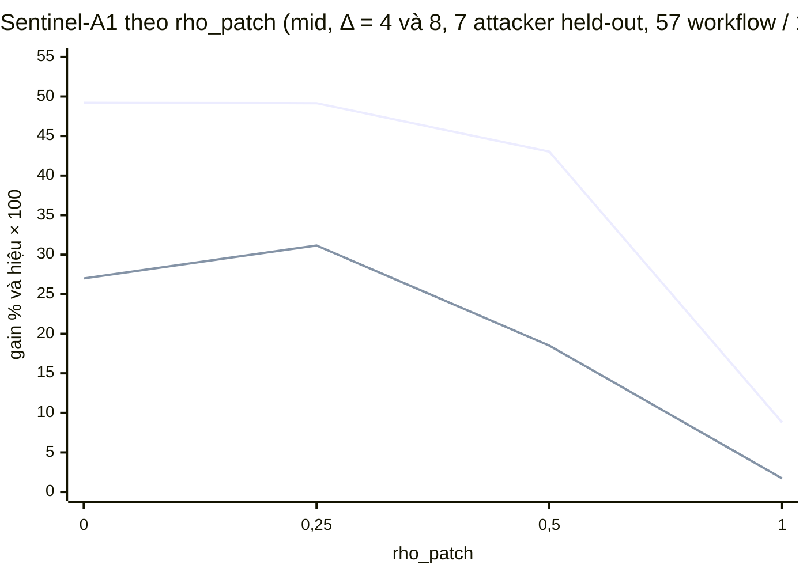

# v2 so với draft FSE-2027-15: lượt eval duy nhất

## 0. Đầu mục

- **Ngày:** 25/09/2026. Lượt chạy duy nhất trên tập eval, 16:00–16:29 (`auditgame/spikes/v2/eval-log.txt`).
- **Đã chạy gì** (khối `run` của `eval-summary.json`):
  - tập eval: **57 workflow / 16 repo**; dev là họ django và không nằm trong tập này;
  - 10 seed (1–10); Δ ∈ {0, 1, 2, 4, 8}; ρ_patch ∈ {0; 0,25; 0,5; 1}; 3 detector (weak, mid, strong);
  - ô headline: detector mid, χ = 1,34, ngân sách b1, drift tạm thời, match 1, lớp 7 attacker held-out, Δ ∈ {4, 8};
  - lưới chính, best response cross-fit (D27), bốn phép quét, và thế giới phụ (D29).
- **Đóng băng:** manifest `sha256:c789fa7362e0`.
  - Header `freeze: clean sha256:c789fa7362e0` ở cả lúc bắt đầu (`run.header_start`) lẫn lúc tóm tắt (`run.header_summary`).
  - Git HEAD lúc chạy là `5c99042`; cây `auditgame/` sạch (`run.git_clean = true`).
- **Thống kê:** mọi CI là bootstrap theo họ repo, **10.000** lượt, max lại theo attacker trong mỗi lượt (D14).
  - Đường endpoint (`curve_rho`) và đường so với baseline tốt nhất (`curve_rho_vs_best`) dùng alpha họ **0,0125**, tức Bonferroni 0,05/4, CI hai phía **98,75%** (D25).
  - Mọi CI khác trong báo cáo (Bảng 3, gain theo Δ, chuyển giao, detector, Verified, các phép quét) là CI hai phía **95%** (`alpha = 0.05` trong JSON), không hiệu chỉnh đa kiểm định.
- **`HEADLINE_RHO = None`**: thầy chưa chọn trước Task 10, nên kết quả chính là **cả đường theo ρ_patch** (D20). ρ tham chiếu cho đối chứng là 0,25 (D23).
- **Record** (`run.records_read`):
  - `main` 8.501.064 dòng, trong đó 4.512.456 dòng vào tóm tắt; 16 cột BR của lưới chính không nuôi số nào nên bị bỏ khi đọc;
  - `br` 260, `sweep-eta` 122.528, `sweep-match` 91.896, `sweep-persistent-drift` 30.632, `sweep-budget-EXPLORATORY` 605.760, `gate` 61.264.
- **Ký hiệu:**
  - V = harm tệ nhất: max theo attacker của trung bình theo workflow (D13). S = Sentinel-A1.
  - Hiệu tuyệt đối = V(baseline) − V(S); dương nghĩa là Sentinel ít harm hơn. Gain = 1 − V(S)/V(baseline), tính bằng %.
- **Quy tắc trình bày** (plan, Task 12 Step 6):
  - mỗi dòng in N workflow và N repo;
  - gain tương đối luôn đi kèm hiệu tuyệt đối và CI của nó;
  - gain có `rel_reliable = false` thì in "không đọc được".
  - Trong lượt này mọi dòng gain của hai file tóm tắt có `rel_reliable = true`, nên không dòng nào phải in "không đọc được".
- **Số của draft là số dự phóng.**
  - Banner trang 1: "All numeric results in this manuscript are projected values … no experiment has yet been executed" (tr. 1). Bảng 2 và Bảng 3 ghi "projected" (tr. 8).
  - Mỗi số draft dưới đây ghi trang của `docs/FSE-2027-15-paper.pdf`.
  - Báo cáo đặt số v2 cạnh số draft, không chấm bên nào đúng hay sai.

## 1. Đối chứng (D28) và thế giới phụ (D29)

Hai phần này được đọc trước mọi số khác, đúng thứ tự D28 đòi.

### 1.1 Hai đối chứng D28: cả hai đạt

<!-- tbl:ctrl -->
| Đối chứng (D28) | Điều kiện khai trước | Giá trị đo | N (workflow / repo / episode) | Kết quả |
| --- | --- | --- | --- | --- |
| (+) Oracle, được cho biết carrier bị tấn công; ô headline (mid, Δ ∈ {4, 8}) tại ρ tham chiếu 0,25 | V(Oracle) ≤ 0,05 | V(Oracle) = **0,0054** | 57 / 16 / 3.829 | đạt (`positive_ok = true`) |
| (−) ở Δ = 0, hai baseline chỉ quét (B3, B4) không thắng B1 | V(B3), V(B4) ≥ V(B1) | V(B3) = **0,8592**, V(B4) = **0,8592**, V(B1) = **0,6444** | 57 / 16 / 2.472 | đạt (`negative_ok = true`) |

- `controls.ok = true`, nên pipeline được phép in số Sentinel.
- N trong JSON (`controls.n_*`) là **57 / 16 / 6.301**. Đó là hợp của hai ô trong bảng: 3.829 episode ở Δ ∈ {4, 8} cho Oracle và 2.472 episode ở Δ = 0 cho B1, B3, B4.
- Đối chứng âm đạt với khoảng cách lớn: ở Δ = 0, B3 và B4 có harm tệ nhất **cao hơn** B1. Đây là điều D28 dự kiến: lần quét chạy sau agent, nên khi ι = σ nó không kịp.

### 1.2 Thế giới phụ D29: bốn baseline cố định của thế giới cổng

Dự đoán khai trước (D29, lấy từ pilot 1 trên dev), ở mọi ρ và Δ ∈ {4, 8}:
- B4g có V ≤ 0,05 và bác nhầm ≥ 2 đối tượng mỗi episode;
- B1g có V ≥ 0,1 khi ρ ≤ 0,5.

B2g và B3g không có dự đoán.

<!-- tbl:gate -->
| ρ_patch | Baseline | V (harm tệ nhất) | Bác nhầm / episode | N (workflow / repo / episode) | Dự đoán D29 | Kết quả |
| --- | --- | --- | --- | --- | --- | --- |
| 0 | B1g commit | 0,7981 | 0,00 | 57 / 16 / 3.829 | V ≥ 0,1 (khi ρ ≤ 0,5) | khớp |
| 0 | B2g uniform | 0,6238 | 2,70 | 57 / 16 / 3.829 | không có | — |
| 0 | B3g insertion | 0,8560 | 5,45 | 57 / 16 / 3.829 | không có | — |
| 0 | B4g retrieval | 0,0144 | 4,75 | 57 / 16 / 3.829 | V ≤ 0,05 và bác nhầm ≥ 2 / episode | khớp |
| 0,25 | B1g commit | 0,7154 | 0,00 | 57 / 16 / 3.829 | V ≥ 0,1 (khi ρ ≤ 0,5) | khớp |
| 0,25 | B2g uniform | 0,5938 | 2,70 | 57 / 16 / 3.829 | không có | — |
| 0,25 | B3g insertion | 0,8560 | 5,45 | 57 / 16 / 3.829 | không có | — |
| 0,25 | B4g retrieval | 0,0144 | 4,75 | 57 / 16 / 3.829 | V ≤ 0,05 và bác nhầm ≥ 2 / episode | khớp |
| 0,5 | B1g commit | 0,5387 | 0,00 | 57 / 16 / 3.829 | V ≥ 0,1 (khi ρ ≤ 0,5) | khớp |
| 0,5 | B2g uniform | 0,5589 | 2,70 | 57 / 16 / 3.829 | không có | — |
| 0,5 | B3g insertion | 0,8560 | 5,45 | 57 / 16 / 3.829 | không có | — |
| 0,5 | B4g retrieval | 0,0144 | 4,75 | 57 / 16 / 3.829 | V ≤ 0,05 và bác nhầm ≥ 2 / episode | khớp |
| 1 | B1g commit | 0,1943 | 0,00 | 57 / 16 / 3.829 | không có (dự đoán chỉ cho ρ ≤ 0,5) | — |
| 1 | B2g uniform | 0,4563 | 2,70 | 57 / 16 / 3.829 | không có | — |
| 1 | B3g insertion | 0,8560 | 5,45 | 57 / 16 / 3.829 | không có | — |
| 1 | B4g retrieval | 0,0144 | 4,75 | 57 / 16 / 3.829 | V ≤ 0,05 và bác nhầm ≥ 2 / episode | khớp |

Đọc:
- **Mọi dự đoán của D29 khớp ở cả bốn ρ.**
- B4g gần như chặn hết harm (V = 0,0144), nhưng bác nhầm 4,75 đối tượng mỗi episode. B3g bác nhầm nhiều nhất (5,45) mà harm vẫn là 0,8560.
- V của B1g trùng đến mọi chữ số với V của B1 trong thế giới carrier (Bảng 2) ở cả bốn ρ. Điều đó nhất quán với việc audit chỉ ở commit là như nhau trong hai thế giới.
- Thế giới này chỉ trả lời câu hỏi "vì sao không đọc §8 như cổng" (Q3). Nó không dùng để so Sentinel.

## 2. Hình chính: hai đường theo ρ_patch

Ô: mid, Δ ∈ {4, 8}, χ = 1,34, b1, 7 attacker held-out. Mọi điểm có N = 57 workflow / 16 repo / 3.829 episode. CI mức 98,75% (Bonferroni, D25).



Cách đọc hình:
- Đường trên là gain so với B1 (%). Đường dưới là hiệu tuyệt đối so với baseline tốt nhất, nhân 100 (điểm phần trăm của harm).
- Hình không vẽ được CI và không có chú giải màu. Trục ngang là bốn điểm lưới, không theo tỉ lệ.
- Mọi số đọc ở hai bảng dưới.

**Đường 1, `curve_rho`: Sentinel-A1 so với B1**

<!-- tbl:curve -->
| ρ_patch | N (workflow / repo / episode) | V(B1) | V(S) | Gain % [CI 98,75%] | Hiệu V(B1) − V(S) [CI 98,75%] | Sự kiện harm của B1 ở cột tệ nhất | `rel_reliable` | `meets_margin` |
| --- | --- | --- | --- | --- | --- | --- | --- | --- |
| 0 | 57 / 16 / 3.829 | 0,7981 | 0,4054 | **49,20** [40,80; 54,92] | **0,3927** [0,3080; 0,4465] | 128 | `true` | `true` |
| 0,25 | 57 / 16 / 3.829 | 0,7154 | 0,3638 | **49,15** [36,89; 54,13] | **0,3517** [0,2302; 0,4194] | 115 | `true` | `true` |
| 0,5 | 57 / 16 / 3.829 | 0,5387 | 0,3069 | **43,03** [23,82; 47,10] | **0,2318** [0,1136; 0,2710] | 102 | `true` | `true` |
| 1 | 57 / 16 / 3.829 | 0,1943 | 0,1772 | **8,79** [−27,32; 18,86] | **0,0171** [−0,0390; 0,0372] | 66 | `true` | `false` |

**Đường 2, `curve_rho_vs_best`: Sentinel-A1 so với baseline tốt nhất trong B1–B6 (D22)**

Baseline tốt nhất được chọn theo V ở điểm ước lượng, rồi chọn lại trong mỗi lượt bootstrap, nên CI đã trả giá cho việc chọn.

<!-- tbl:best -->
| ρ_patch | N (workflow / repo / episode) | Baseline tốt nhất | V_best | V(S) | Hiệu V_best − V(S) [CI 98,75%] |
| --- | --- | --- | --- | --- | --- |
| 0 | 57 / 16 / 3.829 | B2 uniform random | 0,6754 | 0,4054 | **0,2700** [0,1656; 0,3579] |
| 0,25 | 57 / 16 / 3.829 | B2 uniform random | 0,6754 | 0,3638 | **0,3116** [0,2106; 0,3692] |
| 0,5 | 57 / 16 / 3.829 | B5 risk-score | 0,4920 | 0,3069 | **0,1851** [0,0493; 0,2566] |
| 1 | 57 / 16 / 3.829 | B1 audit-at-commit | 0,1943 | 0,1772 | **0,0171** [−0,0390; 0,0372] |

Đọc:
- **Biên 15% đạt ở ρ = 0; 0,25 và 0,5** (`meets_margin = true`). Cận dưới CI 98,75% của gain là 40,80%, 36,89% và 23,82%.
- **Ở ρ = 1 thì không đạt.** Gain là 8,79% với CI [−27,32; 18,86]; hiệu tuyệt đối 0,0171 có CI [−0,0390; 0,0372], chứa 0.
- So với baseline tốt nhất, Sentinel thấp hơn với CI dương ở ρ ≤ 0,5. Baseline tốt nhất là B2 uniform random ở ρ = 0 và 0,25, B5 risk-score ở ρ = 0,5. Ở ρ = 1 baseline tốt nhất là chính B1 audit-at-commit, nên hai đường cho cùng một hiệu.
- Phần lớn biến thiên theo ρ đến từ B1. Khi ρ tăng từ 0 lên 1, V(B1) giảm từ 0,7981 xuống 0,1943, còn V(S) giảm từ 0,4054 xuống 0,1772.

Draft, để đặt cạnh (draft không có trục ρ_patch):
- "Against B1, Sentinel lowers worst-case harm from 0.412 to 0.272 (−34.1% relative, CI [-42.6%, -25.1%], exceeding the 15% margin)" (tr. 7). Tức là V(B1) = 0,412, V(S) = 0,272, gain 34,1% với CI [25,1; 42,6].
- Bảng 2 của draft ghi ô là Δ > 2, χ = 1,34, attacker held-out (tr. 8). Nhưng §10.3 gọi 34,1% là số trên attacker development, và 27,6% là số held-out (tr. 7). Endpoint của v2 là lớp held-out, nên cả hai số draft được đặt cạnh ở §5.2.
- D20 đã khai trước: không hiệu chỉnh ρ để V(B1) ra 0,412.

## 3. Bảng 2 theo ρ_patch

Ô headline: mid, Δ ∈ {4, 8}, 7 attacker held-out. Mỗi dòng có N = 57 workflow / 16 repo / 3.829 episode.

Cột:
- **V**: harm tệ nhất (D13).
- **V_BR cross-fit**: best response Stackelberg trên menu mọi (k, ι, σ) khả thi. Vị trí được chọn trên seed lẻ và chấm trên seed chẵn, rồi làm ngược lại (D27). Lấy max theo Δ ∈ {4, 8}.
- **Exploitability** = V_BR − V (D13).
- **FQ %**: item lành tính bị gỡ, chia cho số đối tượng lành tính đã xem (D15).
- **Clean completion %** = 100·(1 − T_lost / số task đã giải). T_lost là patch sạch đã giải mà bị chặn.
- **Độ trễ phát hiện**: trung bình (lúc phát hiện − ι), chỉ tính trên các episode có phát hiện; đơn vị là task.
- **L tệ nhất**: L = harm + λ_Q·(số item gỡ nhầm) + λ_T·T_lost, với λ_Q = 0,54865 và λ_T = 0,5 (`run.lambda_Q`, `run.lambda_T`); lấy max theo attacker held-out (D15).
- Tóm tắt không có CI cho V của từng hệ thống, cho V_BR, hay cho L.

Hai điều phải nói thẳng:
- **Exploitability có thể âm theo cấu tạo.**
  - Menu best response cố định ε = 0,6 (`attackers_v2.placements`). Lớp held-out có cả ε ∈ {0,3; 1,0}: `memory-last-ingress-e0.3`, `memory-mid-write-e0.3`, `skill-last-write-e1.0`.
  - Vì vậy V (max trên lớp held-out) có thể lớn hơn V_BR. Trong lượt này exploitability âm với B1–B4, Sentinel và Oracle ở cả bốn ρ.
  - Con số này vì thế **không cùng nghĩa** với cột Exploitability của draft.
- **V_BR không có N riêng.** Tóm tắt chỉ giữ giá trị V_BR. Số vị trí của menu nằm ở khối `denominators.br`: ở Δ = 4 thử 9.160 bộ (workflow, vị trí, seed), còn 5.772 sau lọc N4; ở Δ = 8 thử 2.800, còn 1.804.

### ρ_patch = 0

<!-- tbl:t2-0 -->
| Hệ thống | V (harm tệ nhất) | V_BR cross-fit | Exploitability = V_BR − V | FQ % | Clean completion % | Độ trễ phát hiện (task) | L tệ nhất | N (workflow / repo) |
| --- | --- | --- | --- | --- | --- | --- | --- | --- |
| B1 audit-at-commit | 0,7981 | 0,7928 | −0,0053 | 0,00 | 89,43 | 5,51 | 1,1839 | 57 / 16 |
| B2 uniform random | 0,6754 | 0,5848 | −0,0906 | 14,37 | 97,17 | 2,45 | 3,4087 | 57 / 16 |
| B3 audit-on-insertion | 0,8833 | 0,8672 | −0,0161 | 18,57 | 100,00 | 0,00 | 6,0967 | 57 / 16 |
| B4 audit-on-retrieval | 0,8833 | 0,8672 | −0,0161 | 14,57 | 100,00 | 0,00 | 2,2664 | 57 / 16 |
| B5 risk-score | 0,7769 | 0,7828 | 0,0059 | 14,17 | 97,78 | 2,27 | 3,6528 | 57 / 16 |
| B6 two-stage | 0,8658 | 0,8672 | 0,0014 | 15,70 | 100,00 | 2,03 | 4,5380 | 57 / 16 |
| **Sentinel-A1** | **0,4054** | **0,3709** | **−0,0345** | **8,58** | **94,00** | **3,09** | **1,5592** | 57 / 16 |
| Oracle (đối chứng) | 0,0054 | 0,0051 | −0,0003 | 16,92 | 98,59 | 0,71 | 5,2067 | 57 / 16 |

### ρ_patch = 0,25

<!-- tbl:t2-0.25 -->
| Hệ thống | V (harm tệ nhất) | V_BR cross-fit | Exploitability = V_BR − V | FQ % | Clean completion % | Độ trễ phát hiện (task) | L tệ nhất | N (workflow / repo) |
| --- | --- | --- | --- | --- | --- | --- | --- | --- |
| B1 audit-at-commit | 0,7154 | 0,6560 | −0,0594 | 0,00 | 89,42 | 5,46 | 1,1012 | 57 / 16 |
| B2 uniform random | 0,6754 | 0,5848 | −0,0906 | 14,37 | 97,17 | 2,46 | 3,4087 | 57 / 16 |
| B3 audit-on-insertion | 0,8833 | 0,8672 | −0,0161 | 18,57 | 100,00 | 0,00 | 6,0967 | 57 / 16 |
| B4 audit-on-retrieval | 0,8833 | 0,8672 | −0,0161 | 14,57 | 100,00 | 0,00 | 2,2664 | 57 / 16 |
| B5 risk-score | 0,7769 | 0,7828 | 0,0059 | 14,17 | 97,78 | 2,27 | 3,6528 | 57 / 16 |
| B6 two-stage | 0,8658 | 0,8672 | 0,0014 | 15,70 | 100,00 | 2,03 | 4,5380 | 57 / 16 |
| **Sentinel-A1** | **0,3638** | **0,3621** | **−0,0017** | **8,40** | **93,73** | **3,21** | **1,4796** | 57 / 16 |
| Oracle (đối chứng) | 0,0054 | 0,0051 | −0,0003 | 16,92 | 98,59 | 0,71 | 5,2067 | 57 / 16 |

### ρ_patch = 0,5

<!-- tbl:t2-0.5 -->
| Hệ thống | V (harm tệ nhất) | V_BR cross-fit | Exploitability = V_BR − V | FQ % | Clean completion % | Độ trễ phát hiện (task) | L tệ nhất | N (workflow / repo) |
| --- | --- | --- | --- | --- | --- | --- | --- | --- |
| B1 audit-at-commit | 0,5387 | 0,4839 | −0,0548 | 0,00 | 89,42 | 5,44 | 0,9167 | 57 / 16 |
| B2 uniform random | 0,6754 | 0,5879 | −0,0875 | 14,37 | 97,17 | 2,46 | 3,4087 | 57 / 16 |
| B3 audit-on-insertion | 0,8833 | 0,8672 | −0,0161 | 18,57 | 100,00 | 0,00 | 6,0967 | 57 / 16 |
| B4 audit-on-retrieval | 0,8833 | 0,8672 | −0,0161 | 14,57 | 100,00 | 0,00 | 2,2664 | 57 / 16 |
| B5 risk-score | 0,4920 | 0,5006 | 0,0086 | 12,32 | 94,96 | 3,02 | 2,5950 | 57 / 16 |
| B6 two-stage | 0,8658 | 0,8672 | 0,0014 | 15,70 | 100,00 | 2,03 | 4,5380 | 57 / 16 |
| **Sentinel-A1** | **0,3069** | **0,2911** | **−0,0158** | **6,98** | **92,50** | **3,78** | **1,2286** | 57 / 16 |
| Oracle (đối chứng) | 0,0054 | 0,0051 | −0,0003 | 16,92 | 98,59 | 0,72 | 5,2067 | 57 / 16 |

### ρ_patch = 1

<!-- tbl:t2-1 -->
| Hệ thống | V (harm tệ nhất) | V_BR cross-fit | Exploitability = V_BR − V | FQ % | Clean completion % | Độ trễ phát hiện (task) | L tệ nhất | N (workflow / repo) |
| --- | --- | --- | --- | --- | --- | --- | --- | --- |
| B1 audit-at-commit | 0,1943 | 0,1175 | −0,0768 | 0,00 | 89,42 | 5,43 | 0,5601 | 57 / 16 |
| B2 uniform random | 0,6754 | 0,5879 | −0,0875 | 14,37 | 97,17 | 2,48 | 3,4087 | 57 / 16 |
| B3 audit-on-insertion | 0,8833 | 0,8672 | −0,0161 | 18,57 | 100,00 | 0,00 | 6,0967 | 57 / 16 |
| B4 audit-on-retrieval | 0,8833 | 0,8672 | −0,0161 | 14,57 | 100,00 | 0,00 | 2,2664 | 57 / 16 |
| B5 risk-score | 0,4920 | 0,5109 | 0,0189 | 12,32 | 94,96 | 3,03 | 2,5950 | 57 / 16 |
| B6 two-stage | 0,8658 | 0,8672 | 0,0014 | 15,70 | 100,00 | 2,03 | 4,5380 | 57 / 16 |
| **Sentinel-A1** | **0,1772** | **0,1477** | **−0,0295** | **0,36** | **91,34** | **4,80** | **0,4903** | 57 / 16 |
| Oracle (đối chứng) | 0,0054 | 0,0051 | −0,0003 | 16,92 | 98,59 | 0,72 | 5,2067 | 57 / 16 |

### Draft, Bảng 2 (tr. 8), để đặt cạnh

Draft ghi: "Δ > 2, χ = 1.34, against held-out attacker policies … All values projected" (tr. 8). Quy mô của draft là 4.500 instance × 8 hệ thống × 3 seed (tr. 6).

<!-- tbl:t2-draft -->
| Hệ thống (draft) | Worst-case harm [CI] | Clean completion % | False quarantine % | Detection delay | Exploitability |
| --- | --- | --- | --- | --- | --- |
| B1 Audit-at-commit | 0,412 [0,381; 0,444] | 94,1 | 3,2 | 4,6 | 0,34 |
| B2 Uniform random | 0,386 [0,356; 0,417] | 92,8 | 5,9 | 3,1 | 0,21 |
| B3 Audit-on-insertion | 0,441 [0,409; 0,474] | 95,2 | 2,4 | 5,8 | 0,47 |
| B4 Audit-on-retrieval | 0,398 [0,367; 0,430] | 93,6 | 4,6 | 3,9 | 0,39 |
| B5 Risk-score threshold | 0,359 [0,329; 0,390] | 91,4 | 8,1 | 2,8 | 0,29 |
| B6 Two-stage check | 0,344 [0,315; 0,375] | 92,1 | 6,4 | 2,6 | 0,24 |
| Sentinel | 0,272 [0,245; 0,300] | 92,6 | 5,1 | 2,1 | 0,09 |
| B7 Exact minimax (small games) | 0,249 | 93,0 | 4,8 | 2,0 | 0,00 |

Đọc (không chấm đúng sai):
- **Sentinel có V thấp nhất** trong B1–B6 và Sentinel ở cả bốn ρ. V của Oracle giống nhau ở cả bốn ρ (0,0054).
- **Sentinel gỡ nhầm nhiều hơn B1.** FQ của Sentinel là 8,58 / 8,40 / 6,98 / 0,36% (ρ = 0 / 0,25 / 0,5 / 1); B1 là 0,00% ở mọi ρ. Ở ρ ≤ 0,5 FQ của Sentinel nằm dưới trần 10% của D26. Draft: Sentinel 5,1%, B1 3,2% (tr. 8).
- **Clean completion của B1 thấp hơn Sentinel**: 89,43% so với 94,00% ở ρ = 0, và 89,42% so với 91,34% ở ρ = 1. Audit commit chặn cả patch sạch đã giải, và việc đó tính vào T_lost. Draft ghi chiều ngược lại: B1 94,1%, Sentinel 92,6% (tr. 8).
- **Độ trễ phát hiện**: Sentinel 3,09 / 3,21 / 3,78 / 4,80 task, B1 5,51 / 5,46 / 5,44 / 5,43. Draft: Sentinel 2,1, B1 4,6 (tr. 8). B3 và B4 có độ trễ gần 0; cột này chỉ tính trên các episode có phát hiện.
- B3 và B4 có cùng V (0,8833) và cùng V_BR (0,8672) ở cả bốn ρ, nhưng FQ và L khác nhau.

## 4. Bảng 3: năm ablation

Ô headline: mid, Δ ∈ {4, 8}, 7 attacker held-out.
- Hiệu = V(ablation) − V(S). Dương nghĩa là bỏ thành phần đó thì harm tệ nhất tăng.
- Gain = 1 − V(S)/V(ablation). CI 95%, không Bonferroni.
- FQ % và exploitability của ablation lấy từ Bảng 2 ở cùng ρ.

<!-- tbl:t3 -->
| Ablation | ρ_patch | V(ablation) | V(S) | Hiệu V(ablation) − V(S) [CI 95%] | Gain = 1 − V(S)/V(ablation), % [CI 95%] | FQ % (ablation) | Exploitability (ablation) | N (workflow / repo / episode) |
| --- | --- | --- | --- | --- | --- | --- | --- | --- |
| A1 -randomization | 0 | 0,8471 | 0,4054 | 0,4416 [0,3808; 0,5004] | 52,14 [46,58; 57,96] | 12,75 | 0,0201 | 57 / 16 / 3.829 |
| A1 -randomization | 0,25 | 0,8471 | 0,3638 | 0,4833 [0,4204; 0,5360] | 57,05 [51,80; 61,85] | 12,75 | 0,0201 | 57 / 16 / 3.829 |
| A1 -randomization | 0,5 | 0,5387 | 0,3069 | 0,2318 [0,1465; 0,2629] | 43,03 [30,06; 45,98] | 0,00 | −0,0548 | 57 / 16 / 3.829 |
| A1 -randomization | 1 | 0,1943 | 0,1772 | 0,0171 [−0,0200; 0,0333] | 8,79 [−13,60; 16,70] | 0,00 | −0,0768 | 57 / 16 / 3.829 |
| A1 -alarm memory | 0 | 0,4054 | 0,4054 | 0,0000 [0,0000; 0,0000] | 0,00 [0,00; 0,00] | 8,58 | −0,0345 | 57 / 16 / 3.829 |
| A1 -alarm memory | 0,25 | 0,3638 | 0,3638 | 0,0000 [0,0000; 0,0000] | 0,00 [0,00; 0,00] | 8,40 | −0,0017 | 57 / 16 / 3.829 |
| A1 -alarm memory | 0,5 | 0,3069 | 0,3069 | 0,0000 [0,0000; 0,0000] | 0,00 [0,00; 0,00] | 6,98 | −0,0158 | 57 / 16 / 3.829 |
| A1 -alarm memory | 1 | 0,1725 | 0,1772 | −0,0047 [−0,0147; 0,0000] | −2,73 [−9,77; 0,00] | 0,38 | −0,0248 | 57 / 16 / 3.829 |
| A1 -transition uncertainty | 0 | 0,4460 | 0,4054 | 0,0406 [0,0025; 0,0714] | 9,09 [0,57; 15,36] | 8,71 | −0,0529 | 57 / 16 / 3.829 |
| A1 -transition uncertainty | 0,25 | 0,4085 | 0,3638 | 0,0448 [0,0062; 0,0639] | 10,96 [1,68; 14,53] | 8,41 | −0,0819 | 57 / 16 / 3.829 |
| A1 -transition uncertainty | 0,5 | 0,3285 | 0,3069 | 0,0216 [−0,0298; 0,0420] | 6,59 [−9,48; 11,94] | 7,25 | −0,0052 | 57 / 16 / 3.829 |
| A1 -transition uncertainty | 1 | 0,1750 | 0,1772 | −0,0022 [−0,0206; 0,0595] | −1,23 [−12,48; 27,79] | 0,47 | −0,0247 | 57 / 16 / 3.829 |
| A1 -benign-drift | 0 | 0,4054 | 0,4054 | 0,0000 [0,0000; 0,0000] | 0,00 [0,00; 0,00] | 8,58 | −0,0345 | 57 / 16 / 3.829 |
| A1 -benign-drift | 0,25 | 0,3638 | 0,3638 | 0,0000 [0,0000; 0,0000] | 0,00 [0,00; 0,00] | 8,40 | −0,0017 | 57 / 16 / 3.829 |
| A1 -benign-drift | 0,5 | 0,3069 | 0,3069 | 0,0000 [0,0000; 0,0000] | 0,00 [0,00; 0,00] | 6,98 | −0,0158 | 57 / 16 / 3.829 |
| A1 -benign-drift | 1 | 0,1725 | 0,1772 | −0,0047 [−0,0147; 0,0000] | −2,73 [−9,77; 0,00] | 1,56 | −0,0305 | 57 / 16 / 3.829 |
| A1 -regime estimate | 0 | 0,7981 | 0,4054 | 0,3927 [0,3267; 0,4350] | 49,20 [42,87; 53,86] | 0,27 | −0,0053 | 57 / 16 / 3.829 |
| A1 -regime estimate | 0,25 | 0,7154 | 0,3638 | 0,3517 [0,2515; 0,4067] | 49,15 [39,97; 52,97] | 0,09 | −0,0507 | 57 / 16 / 3.829 |
| A1 -regime estimate | 0,5 | 0,5387 | 0,3069 | 0,2318 [0,1465; 0,2629] | 43,03 [30,06; 45,98] | 0,00 | −0,0548 | 57 / 16 / 3.829 |
| A1 -regime estimate | 1 | 0,1943 | 0,1772 | 0,0171 [−0,0200; 0,0333] | 8,79 [−13,60; 16,70] | 0,00 | −0,0768 | 57 / 16 / 3.829 |

Draft, Bảng 3 (tr. 8, "Projected"). "−regime estimate" là arm mới của v2 (Q9), draft không có.

<!-- tbl:t3-draft -->
| Biến thể (draft) | Worst-case harm | False quar. % | Exploit. |
| --- | --- | --- | --- |
| Full Sentinel | 0,272 | 5,1 | 0,09 |
| − randomization (deterministic) | 0,456 | 4,8 | 0,51 |
| − alarm memory (stateless) | 0,371 | 6,2 | 0,19 |
| − transition uncertainty (nominal kernel) | 0,318 | 5,4 | 0,16 |
| − benign-drift modelling | 0,264 | 19,8 | 0,11 |

Cột "Exploit." của Bảng 3 draft đè lên chữ của cột bên cạnh trong bản PDF; bốn giá trị dưới dòng đầu được đọc từ lớp chữ của trang 8.

Đọc:
- **"−randomization":**
  - Ở ρ ≤ 0,25 hiệu lớn: 0,4416 và 0,4833. Member thuần ở đó là `L-SW-nomemory`, chạy một lịch cho mọi workflow (bảng mixture ở §4.1).
  - Ở ρ ≥ 0,5 ablation này trùng B1 ở mọi cột Bảng 2, nên hiệu của nó bằng đúng hiệu của Sentinel so với B1. Member thuần ở đó là `L-BT-0.5-f0` (xem diễn giải ở §4.1).
  - Draft: bỏ randomization làm V lên 0,456 và exploitability lên 0,51, tức "costs 0,184" (tr. 7).
- **"−transition uncertainty":** hiệu dương với CI nằm trên 0 ở ρ = 0 và 0,25 (0,0406 và 0,0448); CI chứa 0 ở ρ = 0,5 và 1. Draft: V 0,318 (tr. 8).
- **"−regime estimate":** V bằng đúng V(B1) ở cả bốn ρ. Ở ρ ≥ 0,5 mọi cột Bảng 2 của nó trùng B1.
- **"−alarm memory" và "−benign-drift":** xem §4.1.

### 4.1 Hai ablation bằng đúng 0 ở ρ ≤ 0,5

Ở ρ = 0; 0,25 và 0,5, cả hai cho hiệu **0,0000 với CI [0,0000; 0,0000]**. Ở ba ρ đó, mọi cột Bảng 2 của chúng trùng Sentinel đến mọi chữ số: V, V_BR, exploitability, FQ %, clean completion, độ trễ, L. Ở ρ = 1 chúng **không** bằng 0.

Mixture đã tinh chỉnh trên dev ở detector mid (`auditgame/reference/v2_tuned.json`, cùng số với `spikes/v2/select-log.txt`):

<!-- tbl:mix -->
| ρ_patch | η_Q tinh chỉnh | Mixture Δ = 0 | Mixture Δ = 4 | Mixture Δ = 8 | Mixture "all" (dùng cho −regime estimate) | Member thuần Δ = 4 · 8 (dùng cho −randomization) |
| --- | --- | --- | --- | --- | --- | --- |
| 0 | 0 | `L-BT-0.5-f0` 1,0000 | `L-BT-0.5-f0` 0,4853; `L-RO-c4-p1-d3` 0,5147 | `L-BT-0.5-f0` 0,3483; `L-RO-c4-p2-d3` 0,1582; `L-SW-nomemory` 0,4935 | `L-BT-0.5-f0` 0,9924; `L-SW-commit3` 0,0076 | `L-SW-nomemory` · `L-SW-nomemory` |
| 0,25 | 0 | `L-BT-0.5-f0` 1,0000 | `L-BT-0.5-f0` 0,5179; `L-RO-c4-p1-d3` 0,4821 | `L-BT-0.5-f0` 0,4050; `L-RO-c4-p2-d3` 0,1440; `L-SW-nomemory` 0,4511 | `L-BT-0.5-f0` 0,9928; `L-SW-nomemory` 0,0064; `L-SW-queue` 0,0007 | `L-SW-nomemory` · `L-SW-nomemory` |
| 0,5 | 0 | `L-BT-0.5-f0` 1,0000 | `L-BT-0.5-f0` 0,6398; `L-RO-c4-p1-d3` 0,3602 | `L-BT-0.5-f0` 0,5330; `L-RO-c4-p2-d3` 0,1117; `L-SW-nomemory` 0,3553 | `L-BT-0.5-f0` 1,0000 | `L-BT-0.5-f0` · `L-BT-0.5-f0` |
| 1 | 0,3543 | `L-BT-0.5-f0` 1,0000 | `L-BT-0.5-f0` 0,8602; `L-RO-c3-p1-d3` 0,1094; `L-SW-queue` 0,0304 | `L-BT-0.5-f0` 0,7652; `L-RO-c4-p2-d3` 0,2348 | `L-BT-0.5-f0` 1,0000 | `L-BT-0.5-f0` · `L-BT-0.5-f0` |

> **Diễn giải (từ code và bảng tinh chỉnh; không kiểm trên record thô).**
> 1. η_Q tinh chỉnh là 0 ở ρ ≤ 0,5 và 0,3543 ở ρ = 1 (ghi nhận Task 10; bảng trên). Với η_Q = 0, dòng 8 gỡ mọi item nổ có hậu nghiệm dương, bất kể belief ở dòng 7 nói gì.
> 2. Khi đó belief chỉ còn đổi được quyết định qua việc chọn hành động. Nhưng không member nào trong các mixture trên dùng belief để chọn hành động:
>    - RO và SW không đọc belief;
>    - `L-BT-0.5-f0` commit khi p_attack ≤ 0,5 (`carrier_policies.BeliefThreshold`), tiên nghiệm của p_attack là 0,5 (`belief.WindowBelief`, `pi_attack = 0.5`), và một lần commit không cho tín hiệu carrier nào (D17). Vậy p_attack đứng yên ở 0,5, và member này commit ở mọi task.
>    - Kiểm nhanh trên code, không đụng dữ liệu eval: nếu chỉ mua commit thì p_attack giữ đúng 0,5 sau mọi lần cập nhật, có hay không có β̂, có hay không có trí nhớ.
> 3. Vì vậy, ở ρ ≤ 0,5 không quyết định nào phụ thuộc belief. Bỏ trí nhớ alarm hay đặt β̂ = 0 chỉ đổi belief, nên không đổi gì.

**Kiểm diễn giải ở ρ = 1.** Ở đây η_Q = 0,3543, nên dòng 8 so hậu nghiệm với một ngưỡng dương, và belief phải có tác dụng. Các member ở ρ = 1 vẫn thuộc ba loại trên, nên khác biệt, nếu có, phải đến từ dòng 8.
- Hai ablation **khác** Sentinel: V = 0,1725 so với 0,1772. Hiệu là −0,0047 với CI [−0,0147; 0,0000] cho cả hai.
- FQ: "−alarm memory" 0,38%, "−benign-drift" 1,56%, Sentinel 0,36%.
- L tệ nhất: 0,4873, 0,5854 và 0,4903. V_BR: 0,1477, 0,1420 và 0,1477.
- **Dữ liệu nhất quán với diễn giải:** khi η_Q > 0, belief quyết định item nào bị gỡ, và hai ablation đổi kết quả.
- Chiều của hiệu: bỏ cơ chế thì harm tệ nhất hơi **thấp hơn** (cận trên CI bằng 0), và bỏ β̂ thì gỡ nhầm nhiều hơn.
- Draft (tr. 7): "−alarm memory" "costs 0,099" (V 0,371 so với 0,272, tr. 8); "−benign-drift" "slightly improves harm and quadruples false quarantine (5.1% → 19.8%)", V 0,264 (tr. 8).

## 5. RQ1–RQ4

### 5.1 Endpoint (RQ2)

Endpoint là cả đường theo ρ (§2), vì `HEADLINE_RHO = None`.
- **Đạt biên 15% ở ρ = 0; 0,25; 0,5**, với gain 49,20 / 49,15 / 43,03% và hiệu 0,3927 / 0,3517 / 0,2318.
- **Không đạt ở ρ = 1**: gain 8,79%, hiệu 0,0171 với CI chứa 0.
- N ở mọi điểm là 57 workflow / 16 repo. B1 có 128 / 115 / 102 / 66 sự kiện harm ở cột tệ nhất (ngưỡng D21 là 10), và không lượt bootstrap nào có V(B1) = 0.
- Diễn giải (§4.1, không kiểm trên record thô): ở ô headline, không member nào của mixture đọc belief để chọn hành động; `L-BT-0.5-f0` commit ở mọi task. Vậy gain ở đây đến từ việc trộn commit với các lịch carrier cố định (RO, SW). Ở ρ ≤ 0,5 dòng 8 gỡ mọi item nổ có hậu nghiệm dương, gần với luật của baseline, và phần thích nghi theo belief không đổi quyết định nào.
- Draft: 34,1% với CI [25,1; 42,6] (tr. 7).

### 5.2 Chuyển giao attacker (RQ3)

Tinh chỉnh chạy trên django (dev), nên mọi dòng dưới đây đã là **chuyển giao từ django sang 16 repo** (D8). Ba lớp attacker cùng chạy trên 57 workflow eval; chúng chỉ khác nhau ở lớp attacker.
- **Dòng của plan:** 11 attacker development. `transfer_note` ghi 3 attacker trong số đó có thể thể hiện khoá hành vi (k, luật ι, ε) của attacker held-out: `memory-last-ingress-e0.6`, `uniform-last-ingress-e0.6`, `uniform-mid-write-e0.6`. Vì vậy dòng này không phải chuyển giao sạch.
- **Dòng D18:** 6 cột tinh chỉnh (`branch-last-ingress`, `branch-mid-ingress`, `memory-first-write`, `queue-first-write`, `skill-first-write`, `skill-last-ingress`, đều ε = 0,6). Không cột nào có khoá hành vi của attacker held-out.

<!-- tbl:transfer -->
| ρ_patch | Lớp attacker | N (workflow / repo / episode) | V(B1) | V(S) | Gain % [CI 95%] | Hiệu V(B1) − V(S) [CI 95%] |
| --- | --- | --- | --- | --- | --- | --- |
| 0 | 11 attacker development (dòng của plan) | 57 / 16 / 6.020 | 0,7776 | 0,4268 | 45,12 [37,64; 49,65] | 0,3509 [0,2845; 0,4168] |
| 0 | 6 cột tinh chỉnh D18 | 57 / 16 / 3.301 | 0,7776 | 0,4268 | 45,12 [37,67; 49,65] | 0,3509 [0,2847; 0,4168] |
| 0 | 7 attacker held-out (endpoint) | 57 / 16 / 3.829 | 0,7981 | 0,4054 | 49,20 [42,99; 53,91] | 0,3927 [0,3288; 0,4350] |
| 0,25 | 11 attacker development (dòng của plan) | 57 / 16 / 6.020 | 0,6840 | 0,3897 | 43,03 [30,65; 48,89] | 0,2943 [0,1930; 0,3710] |
| 0,25 | 6 cột tinh chỉnh D18 | 57 / 16 / 3.301 | 0,6840 | 0,3897 | 43,03 [30,88; 49,49] | 0,2943 [0,1947; 0,3759] |
| 0,25 | 7 attacker held-out (endpoint) | 57 / 16 / 3.829 | 0,7154 | 0,3638 | 49,15 [40,28; 52,97] | 0,3517 [0,2564; 0,4067] |
| 0,5 | 11 attacker development (dòng của plan) | 57 / 16 / 6.020 | 0,5264 | 0,3223 | 38,77 [23,80; 44,89] | 0,2041 [0,1144; 0,2647] |
| 0,5 | 6 cột tinh chỉnh D18 | 57 / 16 / 3.301 | 0,5264 | 0,3223 | 38,77 [23,80; 44,92] | 0,2041 [0,1144; 0,2647] |
| 0,5 | 7 attacker held-out (endpoint) | 57 / 16 / 3.829 | 0,5387 | 0,3069 | 43,03 [30,06; 45,98] | 0,2318 [0,1465; 0,2629] |
| 1 | 11 attacker development (dòng của plan) | 57 / 16 / 6.020 | 0,1643 | 0,1547 | 5,82 [−34,82; 22,33] | 0,0096 [−0,0478; 0,0439] |
| 1 | 6 cột tinh chỉnh D18 | 57 / 16 / 3.301 | 0,1643 | 0,1547 | 5,82 [−34,82; 22,33] | 0,0096 [−0,0478; 0,0439] |
| 1 | 7 attacker held-out (endpoint) | 57 / 16 / 3.829 | 0,1943 | 0,1772 | 8,79 [−13,60; 16,70] | 0,0171 [−0,0200; 0,0333] |

Đọc:
- Ở cả bốn ρ, gain trên lớp held-out **không thấp hơn** gain trên lớp development: 49,20 so với 45,12 ở ρ = 0, 49,15 so với 43,03 ở ρ = 0,25, 43,03 so với 38,77 ở ρ = 0,5, 8,79 so với 5,82 ở ρ = 1. Hiệu tuyệt đối cũng theo chiều đó.
- Dòng 11 attacker và dòng 6 cột có cùng điểm ước lượng ở mọi ρ (ở ρ = 0: V(B1) = 0,7776, V(S) = 0,4268). Tức là cột tệ nhất của lớp development, với cả B1 lẫn Sentinel, nằm trong 6 cột tinh chỉnh. CI khác nhau chút ít vì bootstrap max lại trên hai tập cột khác nhau.
- Ở ρ = 1 mọi CI của hiệu chứa 0.
- Draft: 27,6% trên held-out so với 34,1% trên development, "so roughly a fifth of the advantage does not transfer" (tr. 7).

### 5.3 Gain theo Δ và điểm giao (RQ1)

Ô: mid, 7 attacker held-out, từng Δ riêng. Ở Δ = 8 chỉ có 34 workflow / 12 repo khả thi.

<!-- tbl:delta -->
| ρ_patch | Δ | N (workflow / repo / episode) | V(B1) | V(S) | Gain % [CI 95%] | Hiệu V(B1) − V(S) [CI 95%] |
| --- | --- | --- | --- | --- | --- | --- |
| 0 | 0 | 57 / 16 / 2.472 | 0,7625 | 0,7625 | 0,00 [0,00; 0,00] | 0,0000 [0,0000; 0,0000] |
| 0 | 1 | 57 / 16 / 2.478 | 0,7713 | 0,5754 | 25,40 [18,42; 29,18] | 0,1959 [0,1387; 0,2297] |
| 0 | 2 | 57 / 16 / 2.481 | 0,7828 | 0,4928 | 37,05 [30,92; 39,85] | 0,2900 [0,2351; 0,3196] |
| 0 | 4 | 57 / 16 / 2.486 | 0,7611 | 0,3716 | 51,18 [44,62; 53,97] | 0,3896 [0,3400; 0,4043] |
| 0 | 8 | 34 / 12 / 1.343 | 0,7981 | 0,4054 | 49,20 [43,06; 56,20] | 0,3927 [0,3231; 0,4499] |
| 0,25 | 0 | 57 / 16 / 2.472 | 0,6444 | 0,6444 | 0,00 [0,00; 0,00] | 0,0000 [0,0000; 0,0000] |
| 0,25 | 1 | 57 / 16 / 2.478 | 0,6580 | 0,5988 | 9,00 [0,65; 16,48] | 0,0592 [0,0040; 0,1138] |
| 0,25 | 2 | 57 / 16 / 2.481 | 0,6774 | 0,4606 | 32,01 [21,94; 33,83] | 0,2168 [0,1434; 0,2381] |
| 0,25 | 4 | 57 / 16 / 2.486 | 0,6592 | 0,3543 | 46,25 [41,30; 49,94] | 0,3049 [0,2641; 0,3293] |
| 0,25 | 8 | 34 / 12 / 1.343 | 0,7154 | 0,3638 | 49,15 [39,56; 55,66] | 0,3517 [0,2443; 0,4181] |
| 0,5 | 0 | 57 / 16 / 2.472 | 0,4725 | 0,4725 | 0,00 [0,00; 0,00] | 0,0000 [0,0000; 0,0000] |
| 0,5 | 1 | 57 / 16 / 2.478 | 0,5125 | 0,5354 | −4,46 [−16,01; 3,21] | −0,0229 [−0,0777; 0,0170] |
| 0,5 | 2 | 57 / 16 / 2.481 | 0,5034 | 0,4320 | 14,20 [5,82; 22,13] | 0,0715 [0,0290; 0,1201] |
| 0,5 | 4 | 57 / 16 / 2.486 | 0,4867 | 0,3069 | 36,94 [30,73; 42,04] | 0,1798 [0,1435; 0,2168] |
| 0,5 | 8 | 34 / 12 / 1.343 | 0,5387 | 0,3018 | 43,98 [30,36; 47,37] | 0,2369 [0,1498; 0,2689] |
| 1 | 0 | 57 / 16 / 2.472 | 0,1493 | 0,1493 | 0,00 [0,00; 0,00] | 0,0000 [0,0000; 0,0000] |
| 1 | 1 | 57 / 16 / 2.478 | 0,1662 | 0,1662 | 0,00 [0,00; 0,00] | 0,0000 [0,0000; 0,0000] |
| 1 | 2 | 57 / 16 / 2.481 | 0,1806 | 0,1806 | 0,00 [0,00; 0,00] | 0,0000 [0,0000; 0,0000] |
| 1 | 4 | 57 / 16 / 2.486 | 0,1943 | 0,1772 | 8,79 [−8,89; 17,22] | 0,0171 [−0,0134; 0,0340] |
| 1 | 8 | 34 / 12 / 1.343 | 0,1744 | 0,1465 | 15,99 [−41,43; 22,06] | 0,0279 [−0,0447; 0,0385] |

Draft, để đặt cạnh:
- "The crossover in Figure 3 occurs at Δ = 2.1 (interpolated) against Corollary 5's prediction of Δ ≈ 2" (tr. 7).
- Ở Δ = 0, adaptive allocation "is worse than commit-time audit by 1.2%" (tr. 6).
- Ở Δ = 4, harm giảm 34,8% với carrier đồng giá và 24,8% với carrier không đồng giá; ở Δ = 8 là 42,4% và 33,1% (tr. 6).
- Khi độ trễ không vượt khoảng hai task, mức giảm là 4,2%, "within noise" (tóm tắt, tr. 1).

Đọc:
- Ở Δ = 0, gain bằng đúng 0 với CI [0; 0] ở cả bốn ρ: Sentinel chơi đúng như B1 (xem P2 ở §7). Ở ρ = 1 điều đó còn đúng ở Δ = 1 và Δ = 2.
- **Điểm giao, đọc trên lưới rời rạc và không nội suy:** Δ nhỏ nhất mà CI 95% của hiệu tuyệt đối nằm hẳn trên 0 là Δ = 1 ở ρ = 0 và 0,25, Δ = 2 ở ρ = 0,5. Ở ρ = 1 không có Δ nào trong lưới. Quy tắc đọc này là của báo cáo, không có trong tiền đăng ký.
- Ở ρ = 0,5, Δ = 1, gain âm: −4,46%, hiệu −0,0229 với CI [−0,0777; 0,0170], chứa 0.
- Lưới chính chạy ở một χ (1,34). Ở ngân sách b1, χ không có tác dụng (D4b); §6.3 cho thấy phần ngân sách 1 cho cùng một số ở cả ba mức χ. Vì vậy lưới chính không tách được hai đường "carrier đồng giá" và "không đồng giá" của draft.

### 5.4 Gain theo detector (RQ4)

Ô: Δ ∈ {4, 8}, 7 attacker held-out, từng detector riêng. Dòng mid chính là endpoint, ở mức CI 95%.

<!-- tbl:det -->
| ρ_patch | Detector | N (workflow / repo / episode) | V(B1) | V(S) | Gain % [CI 95%] | Hiệu V(B1) − V(S) [CI 95%] | Sự kiện harm của B1 ở cột tệ nhất |
| --- | --- | --- | --- | --- | --- | --- | --- |
| 0 | weak | 57 / 16 / 3.829 | 0,7583 | 0,3862 | 49,07 [40,63; 52,86] | 0,3721 [0,2706; 0,4249] | 122 |
| 0 | mid | 57 / 16 / 3.829 | 0,7981 | 0,4054 | 49,20 [42,99; 53,91] | 0,3927 [0,3288; 0,4350] | 128 |
| 0 | strong | 57 / 16 / 3.829 | 0,8181 | 0,4104 | 49,83 [44,63; 54,52] | 0,4077 [0,3577; 0,4505] | 131 |
| 0,25 | weak | 57 / 16 / 3.829 | 0,6574 | 0,3598 | 45,26 [35,13; 48,86] | 0,2975 [0,2061; 0,3542] | 106 |
| 0,25 | mid | 57 / 16 / 3.829 | 0,7154 | 0,3638 | 49,15 [40,28; 52,97] | 0,3517 [0,2564; 0,4067] | 115 |
| 0,25 | strong | 57 / 16 / 3.829 | 0,7473 | 0,3843 | 48,57 [40,57; 53,87] | 0,3630 [0,2730; 0,4190] | 120 |
| 0,5 | weak | 57 / 16 / 3.829 | 0,5387 | 0,3129 | 41,91 [29,49; 45,91] | 0,2258 [0,1452; 0,2643] | 102 |
| 0,5 | mid | 57 / 16 / 3.829 | 0,5387 | 0,3069 | 43,03 [30,06; 45,98] | 0,2318 [0,1465; 0,2629] | 102 |
| 0,5 | strong | 57 / 16 / 3.829 | 0,5387 | 0,3054 | 43,31 [30,91; 46,50] | 0,2333 [0,1516; 0,2677] | 102 |
| 1 | weak | 57 / 16 / 3.829 | 0,2716 | 0,2607 | 4,05 [−34,85; 20,02] | 0,0110 [−0,0773; 0,0639] | 43 |
| 1 | mid | 57 / 16 / 3.829 | 0,1943 | 0,1772 | 8,79 [−13,60; 16,70] | 0,0171 [−0,0200; 0,0333] | 66 |
| 1 | strong | 57 / 16 / 3.829 | 0,1063 | 0,1224 | −15,15 [−91,38; 6,71] | −0,0161 [−0,0775; 0,0086] | 16 |

Đọc:
- Draft: "Sentinel's advantage over B1 ranges 21.4% to 39.8%, largest with the weakest detector" (tr. 7).
- v2, theo từng ρ:
  - ρ = 0: từ 49,07% (weak) đến 49,83% (strong);
  - ρ = 0,25: từ 45,26% (weak) đến 49,15% (mid);
  - ρ = 0,5: từ 41,91% (weak) đến 43,31% (strong);
  - ρ = 1: từ −15,15% (strong) đến 8,79% (mid).
- Detector weak không cho gain lớn nhất ở ρ nào.
- Ở ρ = 1 cả ba CI của hiệu chứa 0. Với detector strong, V(B1) chỉ là 0,1063 và B1 có 16 sự kiện harm ở cột tệ nhất. Con số đó vẫn trên ngưỡng 10 của D21, nên gain vẫn được in.

### 5.5 Quét η_Q (§11 của draft)

Ô: Sentinel ở mọi η_Q của lưới; Δ ∈ {4, 8}, mid, 7 attacker held-out. B1 không có dòng 8, nên gain ghép record B1 của lưới chính ở cùng ô với từng η_Q. Cột "Chọn trên dev" đánh dấu η_Q đã tinh chỉnh.

<!-- tbl:eta -->
| ρ_patch | η_Q | Chọn trên dev | V(S) | FQ % | Clean completion % | V(B1) | Gain so với B1, % [CI 95%] | Hiệu V(B1) − V(S) [CI 95%] | N (workflow / repo / episode) |
| --- | --- | --- | --- | --- | --- | --- | --- | --- | --- |
| 0 | 0 | có | 0,4054 | 8,58 | 94,00 | 0,7981 | 49,20 [42,99; 53,91] | 0,3927 [0,3288; 0,4350] | 57 / 16 / 3.829 |
| 0 | 0,01 |  | 0,4054 | 3,02 | 94,00 | 0,7981 | 49,20 [42,91; 52,57] | 0,3927 [0,3279; 0,4271] | 57 / 16 / 3.829 |
| 0 | 0,02 |  | 0,4054 | 2,62 | 94,00 | 0,7981 | 49,20 [42,88; 52,33] | 0,3927 [0,3270; 0,4262] | 57 / 16 / 3.829 |
| 0 | 0,05 |  | 0,4054 | 2,01 | 94,00 | 0,7981 | 49,20 [42,65; 51,89] | 0,3927 [0,3243; 0,4225] | 57 / 16 / 3.829 |
| 0 | 0,10 |  | 0,4054 | 1,22 | 94,01 | 0,7981 | 49,20 [42,52; 51,37] | 0,3927 [0,3237; 0,4167] | 57 / 16 / 3.829 |
| 0 | 0,20 |  | 0,4175 | 0,83 | 94,01 | 0,7981 | 47,69 [41,10; 50,08] | 0,3806 [0,3149; 0,4083] | 57 / 16 / 3.829 |
| 0 | 0,3543 |  | 0,4366 | 0,71 | 94,02 | 0,7981 | 45,30 [39,23; 48,96] | 0,3616 [0,3043; 0,3961] | 57 / 16 / 3.829 |
| 0 | 0,50 |  | 0,4542 | 0,52 | 94,02 | 0,7981 | 43,10 [36,84; 47,78] | 0,3440 [0,2886; 0,3848] | 57 / 16 / 3.829 |
| 0,25 | 0 | có | 0,3638 | 8,40 | 93,73 | 0,7154 | 49,15 [40,28; 52,97] | 0,3517 [0,2564; 0,4067] | 57 / 16 / 3.829 |
| 0,25 | 0,01 |  | 0,3643 | 3,00 | 93,74 | 0,7154 | 49,08 [39,82; 52,18] | 0,3511 [0,2531; 0,4015] | 57 / 16 / 3.829 |
| 0,25 | 0,02 |  | 0,3665 | 2,61 | 93,74 | 0,7154 | 48,78 [39,52; 51,94] | 0,3490 [0,2496; 0,4006] | 57 / 16 / 3.829 |
| 0,25 | 0,05 |  | 0,3712 | 2,00 | 93,74 | 0,7154 | 48,12 [39,03; 51,49] | 0,3443 [0,2451; 0,3963] | 57 / 16 / 3.829 |
| 0,25 | 0,10 |  | 0,3842 | 1,21 | 93,74 | 0,7154 | 46,30 [38,34; 50,44] | 0,3312 [0,2430; 0,3865] | 57 / 16 / 3.829 |
| 0,25 | 0,20 |  | 0,3924 | 0,82 | 93,75 | 0,7154 | 45,15 [37,34; 49,85] | 0,3230 [0,2381; 0,3808] | 57 / 16 / 3.829 |
| 0,25 | 0,3543 |  | 0,4114 | 0,68 | 93,75 | 0,7154 | 42,49 [35,20; 48,27] | 0,3040 [0,2273; 0,3665] | 57 / 16 / 3.829 |
| 0,25 | 0,50 |  | 0,4290 | 0,49 | 93,75 | 0,7154 | 40,03 [32,37; 47,03] | 0,2864 [0,2099; 0,3545] | 57 / 16 / 3.829 |
| 0,5 | 0 | có | 0,3069 | 6,98 | 92,50 | 0,5387 | 43,03 [30,06; 45,98] | 0,2318 [0,1465; 0,2629] | 57 / 16 / 3.829 |
| 0,5 | 0,01 |  | 0,3094 | 2,56 | 92,50 | 0,5387 | 42,57 [29,97; 45,75] | 0,2293 [0,1464; 0,2618] | 57 / 16 / 3.829 |
| 0,5 | 0,02 |  | 0,3116 | 2,24 | 92,50 | 0,5387 | 42,16 [29,67; 45,59] | 0,2271 [0,1444; 0,2611] | 57 / 16 / 3.829 |
| 0,5 | 0,05 |  | 0,3163 | 1,72 | 92,50 | 0,5387 | 41,29 [28,97; 45,07] | 0,2224 [0,1409; 0,2580] | 57 / 16 / 3.829 |
| 0,5 | 0,10 |  | 0,3188 | 1,04 | 92,51 | 0,5387 | 40,83 [28,68; 44,42] | 0,2199 [0,1390; 0,2541] | 57 / 16 / 3.829 |
| 0,5 | 0,20 |  | 0,3210 | 0,73 | 92,51 | 0,5387 | 40,42 [27,91; 44,03] | 0,2177 [0,1354; 0,2530] | 57 / 16 / 3.829 |
| 0,5 | 0,3543 |  | 0,3378 | 0,64 | 92,52 | 0,5387 | 37,29 [26,40; 42,49] | 0,2009 [0,1285; 0,2429] | 57 / 16 / 3.829 |
| 0,5 | 0,50 |  | 0,3467 | 0,46 | 92,52 | 0,5387 | 35,63 [25,77; 41,14] | 0,1920 [0,1267; 0,2342] | 57 / 16 / 3.829 |
| 1 | 0 |  | 0,1693 | 5,53 | 91,34 | 0,1943 | 12,83 [−12,76; 19,29] | 0,0249 [−0,0189; 0,0369] | 57 / 16 / 3.829 |
| 1 | 0,01 |  | 0,1693 | 2,18 | 91,34 | 0,1943 | 12,83 [−12,76; 19,29] | 0,0249 [−0,0189; 0,0369] | 57 / 16 / 3.829 |
| 1 | 0,02 |  | 0,1693 | 1,81 | 91,34 | 0,1943 | 12,83 [−12,76; 19,29] | 0,0249 [−0,0189; 0,0369] | 57 / 16 / 3.829 |
| 1 | 0,05 |  | 0,1693 | 1,31 | 91,34 | 0,1943 | 12,83 [−12,76; 19,29] | 0,0249 [−0,0189; 0,0369] | 57 / 16 / 3.829 |
| 1 | 0,10 |  | 0,1693 | 0,74 | 91,34 | 0,1943 | 12,83 [−12,76; 19,26] | 0,0249 [−0,0189; 0,0369] | 57 / 16 / 3.829 |
| 1 | 0,20 |  | 0,1693 | 0,47 | 91,34 | 0,1943 | 12,83 [−12,76; 19,26] | 0,0249 [−0,0189; 0,0369] | 57 / 16 / 3.829 |
| 1 | 0,3543 | có | 0,1772 | 0,36 | 91,34 | 0,1943 | 8,79 [−13,60; 16,70] | 0,0171 [−0,0200; 0,0333] | 57 / 16 / 3.829 |
| 1 | 0,50 |  | 0,1772 | 0,23 | 91,34 | 0,1943 | 8,79 [−13,60; 16,65] | 0,0171 [−0,0200; 0,0333] | 57 / 16 / 3.829 |

Draft: "sweeping η_Q shows Sentinel's advantage over B1 growing from 34.1% to 44.0% as quarantine becomes cheap" (tr. 7). Ở v2, η_Q Bayes = λ_Q/(1 + λ_Q) = 0,3543 (Q5), nên "quarantine rẻ đi" tương ứng với η_Q nhỏ đi.

Đọc:
- Ở mọi ρ, gain không giảm khi η_Q giảm:
  - ρ = 0: từ 43,10% (η_Q = 0,5) lên 49,20% (η_Q = 0);
  - ρ = 0,25: từ 40,03% lên 49,15%;
  - ρ = 0,5: từ 35,63% lên 43,03%;
  - ρ = 1: từ 8,79% lên 12,83%.
- Cái giá là gỡ nhầm: ở ρ = 0, FQ đi từ 0,52% (η_Q = 0,5) lên 8,58% (η_Q = 0).
- **Ở ρ = 0, trên eval, η_Q ∈ {0,01; 0,02; 0,05; 0,1} cho cùng V với η_Q = 0 đã chọn** (0,4054), nhưng FQ chỉ 3,02%, 2,62%, 2,01% và 1,22%, thay vì 8,58%.
  - Trên dev, η_Q = 0 cho harm tệ nhất thấp hơn hẳn: 0,4117 so với 0,4197 ở η_Q = 0,01 (`select-log.txt`). Luật khai trước (D11) vì thế chọn 0.
  - Eval chỉ để đọc; η_Q không được chỉnh lại.
- **Ở ρ = 1,** η_Q = 0,3543 đã chọn cho V = 0,1772; mọi η_Q ≤ 0,2 cho 0,1693. Trên dev, η_Q từ 0 đến 0,3543 hoà nhau ở harm tệ nhất (0,1589), và luật hoà chọn FQ nhỏ nhất, tức 0,3543 (`select-log.txt`).
- Ở η_Q đã chọn, phép quét cho lại đúng V và FQ của Sentinel trong lưới chính, ở cả bốn ρ.

## 6. Kiểm độ nhạy

### 6.1 Drift match

Thế giới và defender cùng đổi match; headline là match 1 (Q8). Tóm tắt của phép quét này chỉ có gain và hiệu, không có FQ.

<!-- tbl:match -->
| ρ_patch | match | N (workflow / repo / episode) | V(B1) | V(S) | Gain % [CI 95%] | Hiệu V(B1) − V(S) [CI 95%] |
| --- | --- | --- | --- | --- | --- | --- |
| 0 | 0,0 | 57 / 16 / 3.829 | 0,7981 | 0,4054 | 49,20 [42,99; 53,91] | 0,3927 [0,3288; 0,4350] |
| 0 | 0,5 | 57 / 16 / 3.829 | 0,7981 | 0,4054 | 49,20 [42,99; 53,91] | 0,3927 [0,3288; 0,4350] |
| 0 | 1,0 | 57 / 16 / 3.829 | 0,7981 | 0,4054 | 49,20 [42,99; 53,91] | 0,3927 [0,3288; 0,4350] |
| 0,25 | 0,0 | 57 / 16 / 3.829 | 0,7154 | 0,3638 | 49,15 [40,28; 52,97] | 0,3517 [0,2564; 0,4067] |
| 0,25 | 0,5 | 57 / 16 / 3.829 | 0,7154 | 0,3638 | 49,15 [40,28; 52,97] | 0,3517 [0,2564; 0,4067] |
| 0,25 | 1,0 | 57 / 16 / 3.829 | 0,7154 | 0,3638 | 49,15 [40,28; 52,97] | 0,3517 [0,2564; 0,4067] |
| 0,5 | 0,0 | 57 / 16 / 3.829 | 0,5387 | 0,3069 | 43,03 [30,06; 45,98] | 0,2318 [0,1465; 0,2629] |
| 0,5 | 0,5 | 57 / 16 / 3.829 | 0,5387 | 0,3069 | 43,03 [30,06; 45,98] | 0,2318 [0,1465; 0,2629] |
| 0,5 | 1,0 | 57 / 16 / 3.829 | 0,5387 | 0,3069 | 43,03 [30,06; 45,98] | 0,2318 [0,1465; 0,2629] |
| 1 | 0,0 | 57 / 16 / 3.829 | 0,1943 | 0,1725 | 11,22 [−12,77; 17,72] | 0,0218 [−0,0191; 0,0347] |
| 1 | 0,5 | 57 / 16 / 3.829 | 0,1943 | 0,1725 | 11,22 [−12,77; 17,72] | 0,0218 [−0,0191; 0,0347] |
| 1 | 1,0 | 57 / 16 / 3.829 | 0,1943 | 0,1772 | 8,79 [−13,60; 16,70] | 0,0171 [−0,0200; 0,0333] |

Đọc:
- Ở ρ ≤ 0,5, gain và hiệu giống hệt nhau ở cả ba mức match, và bằng số headline.
- Ở ρ = 1: match 0 và 0,5 cho 11,22% (V(S) = 0,1725); match 1 cho 8,79%. Mọi CI của hiệu chứa 0.
- Điều này nhất quán với diễn giải ở §4.1: khi η_Q = 0, drift chỉ có thể đổi item lành tính nào bị gỡ, không đổi harm tệ nhất.

### 6.2 Drift vĩnh viễn

Kiểm độ nhạy khai trước ở Q8: item drift nổ suốt đời thay vì chỉ trong task nó xảy ra. Dòng headline in lại ở mức CI 95% để so.

<!-- tbl:persist -->
| ρ_patch | Drift | N (workflow / repo / episode) | V(B1) | V(S) | Gain % [CI 95%] | Hiệu V(B1) − V(S) [CI 95%] |
| --- | --- | --- | --- | --- | --- | --- |
| 0 | tạm thời, 1 task (headline) | 57 / 16 / 3.829 | 0,7981 | 0,4054 | 49,20 [42,99; 53,91] | 0,3927 [0,3288; 0,4350] |
| 0 | vĩnh viễn | 57 / 16 / 3.829 | 0,7981 | 0,4054 | 49,20 [42,99; 53,91] | 0,3927 [0,3288; 0,4350] |
| 0,25 | tạm thời, 1 task (headline) | 57 / 16 / 3.829 | 0,7154 | 0,3638 | 49,15 [40,28; 52,97] | 0,3517 [0,2564; 0,4067] |
| 0,25 | vĩnh viễn | 57 / 16 / 3.829 | 0,7154 | 0,3638 | 49,15 [40,28; 52,97] | 0,3517 [0,2564; 0,4067] |
| 0,5 | tạm thời, 1 task (headline) | 57 / 16 / 3.829 | 0,5387 | 0,3069 | 43,03 [30,06; 45,98] | 0,2318 [0,1465; 0,2629] |
| 0,5 | vĩnh viễn | 57 / 16 / 3.829 | 0,5387 | 0,3069 | 43,03 [30,06; 45,98] | 0,2318 [0,1465; 0,2629] |
| 1 | tạm thời, 1 task (headline) | 57 / 16 / 3.829 | 0,1943 | 0,1772 | 8,79 [−13,60; 16,70] | 0,0171 [−0,0200; 0,0333] |
| 1 | vĩnh viễn | 57 / 16 / 3.829 | 0,1943 | 0,1740 | 10,41 [−12,86; 17,21] | 0,0202 [−0,0193; 0,0341] |

Đọc: ở ρ ≤ 0,5 drift vĩnh viễn cho đúng số headline. Ở ρ = 1 gain là 10,41% so với 8,79% ở headline, và CI của hiệu chứa 0.

### 6.3 Ngân sách × χ: EXPLORATORY (D4b)

**Nhãn EXPLORATORY.** Ở ngân sách b1 (phần 1), một hành động không bao giờ vượt B/H, nên lưới chính không đo được tác dụng của χ. χ và phần phụ thuộc ngân sách của Định lý 4 chỉ đọc ở đây (D4b). Phép quét này không có kiểm định nào được khai trước.

Hai nhãn χ cho cùng một điểm lưới:
- χ theo 2·MAD/κ̄ là nhãn của v2 (D2): 0; 0,5; 1,34;
- range/κ̄ theo công thức §4 của draft (`chi_range` trong JSON): 0,0000; 0,7889; 2,1143.
- Draft lấy χ = 1,34 từ bốn giá 0,4 / 0,9 / 1,6 / 4,1 (tr. 5).

Ô: mid, 7 attacker held-out, Δ ∈ {2, 4, 8}, mỗi Δ đọc riêng; CI 95%. Mọi dòng có `rel_reliable = true`.

<!-- tbl:budget -->
| ρ_patch | χ (2·MAD/κ̄) | range/κ̄ | Phần ngân sách | Δ = 2: gain % · hiệu [CI 95%] | Δ = 4: gain % · hiệu [CI 95%] | Δ = 8: gain % · hiệu [CI 95%] | N (workflow / repo), Δ = 2 · 4 · 8 |
| --- | --- | --- | --- | --- | --- | --- | --- |
| 0 | 0,00 | 0,0000 | 0,25 | 36,05 · 0,2822 [0,2244; 0,3042] | 48,07 · 0,3659 [0,3086; 0,3842] | 42,28 · 0,3374 [0,2916; 0,3816] | 57 / 16 · 57 / 16 · 34 / 12 |
| 0 | 0,00 | 0,0000 | 0,50 | 37,05 · 0,2900 [0,2351; 0,3196] | 51,18 · 0,3896 [0,3400; 0,4043] | 49,20 · 0,3927 [0,3231; 0,4499] | 57 / 16 · 57 / 16 · 34 / 12 |
| 0 | 0,00 | 0,0000 | 0,75 | 37,05 · 0,2900 [0,2351; 0,3196] | 51,18 · 0,3896 [0,3400; 0,4043] | 49,20 · 0,3927 [0,3231; 0,4499] | 57 / 16 · 57 / 16 · 34 / 12 |
| 0 | 0,00 | 0,0000 | 1,00 | 37,05 · 0,2900 [0,2351; 0,3196] | 51,18 · 0,3896 [0,3400; 0,4043] | 49,20 · 0,3927 [0,3231; 0,4499] | 57 / 16 · 57 / 16 · 34 / 12 |
| 0 | 0,50 | 0,7889 | 0,25 | 35,47 · 0,2777 [0,2300; 0,3074] | 49,73 · 0,3785 [0,3087; 0,3936] | 40,88 · 0,3263 [0,2710; 0,3738] | 57 / 16 · 57 / 16 · 34 / 12 |
| 0 | 0,50 | 0,7889 | 0,50 | 37,05 · 0,2900 [0,2351; 0,3196] | 51,18 · 0,3896 [0,3400; 0,4040] | 48,37 · 0,3860 [0,3180; 0,4427] | 57 / 16 · 57 / 16 · 34 / 12 |
| 0 | 0,50 | 0,7889 | 0,75 | 37,05 · 0,2900 [0,2351; 0,3196] | 51,18 · 0,3896 [0,3400; 0,4043] | 49,20 · 0,3927 [0,3231; 0,4499] | 57 / 16 · 57 / 16 · 34 / 12 |
| 0 | 0,50 | 0,7889 | 1,00 | 37,05 · 0,2900 [0,2351; 0,3196] | 51,18 · 0,3896 [0,3400; 0,4043] | 49,20 · 0,3927 [0,3231; 0,4499] | 57 / 16 · 57 / 16 · 34 / 12 |
| 0 | 1,34 | 2,1143 | 0,25 | 32,57 · 0,2599 [0,2107; 0,3027] | 13,68 · 0,1058 [0,0532; 0,2086] | 14,34 · 0,1178 [0,0695; 0,1886] | 57 / 16 · 57 / 16 · 34 / 12 |
| 0 | 1,34 | 2,1143 | 0,50 | 37,05 · 0,2900 [0,2349; 0,3193] | 51,18 · 0,3896 [0,3331; 0,4007] | 42,28 · 0,3374 [0,2916; 0,3816] | 57 / 16 · 57 / 16 · 34 / 12 |
| 0 | 1,34 | 2,1143 | 0,75 | 37,05 · 0,2900 [0,2351; 0,3196] | 51,18 · 0,3896 [0,3400; 0,4040] | 49,20 · 0,3927 [0,3231; 0,4499] | 57 / 16 · 57 / 16 · 34 / 12 |
| 0 | 1,34 | 2,1143 | 1,00 | 37,05 · 0,2900 [0,2351; 0,3196] | 51,18 · 0,3896 [0,3400; 0,4043] | 49,20 · 0,3927 [0,3231; 0,4499] | 57 / 16 · 57 / 16 · 34 / 12 |
| 0,25 | 0,00 | 0,0000 | 0,25 | 28,06 · 0,1901 [0,1299; 0,2185] | 44,07 · 0,2905 [0,2109; 0,3102] | 39,72 · 0,2842 [0,1917; 0,3495] | 57 / 16 · 57 / 16 · 34 / 12 |
| 0,25 | 0,00 | 0,0000 | 0,50 | 32,01 · 0,2168 [0,1434; 0,2381] | 46,25 · 0,3049 [0,2641; 0,3293] | 49,15 · 0,3517 [0,2443; 0,4181] | 57 / 16 · 57 / 16 · 34 / 12 |
| 0,25 | 0,00 | 0,0000 | 0,75 | 32,01 · 0,2168 [0,1434; 0,2381] | 46,25 · 0,3049 [0,2641; 0,3293] | 49,15 · 0,3517 [0,2443; 0,4181] | 57 / 16 · 57 / 16 · 34 / 12 |
| 0,25 | 0,00 | 0,0000 | 1,00 | 32,01 · 0,2168 [0,1434; 0,2381] | 46,25 · 0,3049 [0,2641; 0,3293] | 49,15 · 0,3517 [0,2443; 0,4181] | 57 / 16 · 57 / 16 · 34 / 12 |
| 0,25 | 0,50 | 0,7889 | 0,25 | 31,09 · 0,2106 [0,1310; 0,2262] | 45,65 · 0,3009 [0,2048; 0,3223] | 38,17 · 0,2730 [0,1693; 0,3444] | 57 / 16 · 57 / 16 · 34 / 12 |
| 0,25 | 0,50 | 0,7889 | 0,50 | 32,01 · 0,2168 [0,1434; 0,2381] | 46,25 · 0,3049 [0,2636; 0,3292] | 49,15 · 0,3517 [0,2443; 0,4181] | 57 / 16 · 57 / 16 · 34 / 12 |
| 0,25 | 0,50 | 0,7889 | 0,75 | 32,01 · 0,2168 [0,1434; 0,2381] | 46,25 · 0,3049 [0,2641; 0,3293] | 49,15 · 0,3517 [0,2443; 0,4181] | 57 / 16 · 57 / 16 · 34 / 12 |
| 0,25 | 0,50 | 0,7889 | 1,00 | 32,01 · 0,2168 [0,1434; 0,2381] | 46,25 · 0,3049 [0,2641; 0,3293] | 49,15 · 0,3517 [0,2443; 0,4181] | 57 / 16 · 57 / 16 · 34 / 12 |
| 0,25 | 1,34 | 2,1143 | 0,25 | 27,76 · 0,1986 [0,1526; 0,2384] | 4,61 · 0,0321 [0,0102; 0,1262] | 7,46 · 0,0557 [−0,0033; 0,1361] | 57 / 16 · 57 / 16 · 34 / 12 |
| 0,25 | 1,34 | 2,1143 | 0,50 | 32,01 · 0,2168 [0,1409; 0,2375] | 46,25 · 0,3049 [0,2373; 0,3279] | 40,65 · 0,2908 [0,1989; 0,3547] | 57 / 16 · 57 / 16 · 34 / 12 |
| 0,25 | 1,34 | 2,1143 | 0,75 | 32,01 · 0,2168 [0,1434; 0,2381] | 46,25 · 0,3049 [0,2635; 0,3292] | 49,15 · 0,3517 [0,2443; 0,4181] | 57 / 16 · 57 / 16 · 34 / 12 |
| 0,25 | 1,34 | 2,1143 | 1,00 | 32,01 · 0,2168 [0,1434; 0,2381] | 46,25 · 0,3049 [0,2641; 0,3293] | 49,15 · 0,3517 [0,2443; 0,4181] | 57 / 16 · 57 / 16 · 34 / 12 |
| 0,5 | 0,00 | 0,0000 | 0,25 | 13,40 · 0,0675 [0,0245; 0,1082] | 34,79 · 0,1693 [0,1211; 0,1966] | 30,97 · 0,1669 [0,1111; 0,2210] | 57 / 16 · 57 / 16 · 34 / 12 |
| 0,5 | 0,00 | 0,0000 | 0,50 | 14,20 · 0,0715 [0,0290; 0,1201] | 36,94 · 0,1798 [0,1435; 0,2168] | 43,98 · 0,2369 [0,1498; 0,2689] | 57 / 16 · 57 / 16 · 34 / 12 |
| 0,5 | 0,00 | 0,0000 | 0,75 | 14,20 · 0,0715 [0,0290; 0,1201] | 36,94 · 0,1798 [0,1435; 0,2168] | 43,98 · 0,2369 [0,1498; 0,2689] | 57 / 16 · 57 / 16 · 34 / 12 |
| 0,5 | 0,00 | 0,0000 | 1,00 | 14,20 · 0,0715 [0,0290; 0,1201] | 36,94 · 0,1798 [0,1435; 0,2168] | 43,98 · 0,2369 [0,1498; 0,2689] | 57 / 16 · 57 / 16 · 34 / 12 |
| 0,5 | 0,50 | 0,7889 | 0,25 | 13,01 · 0,0655 [0,0237; 0,1101] | 36,94 · 0,1798 [0,1171; 0,2092] | 27,88 · 0,1502 [0,0959; 0,2073] | 57 / 16 · 57 / 16 · 34 / 12 |
| 0,5 | 0,50 | 0,7889 | 0,50 | 14,20 · 0,0715 [0,0290; 0,1201] | 36,94 · 0,1798 [0,1435; 0,2168] | 43,98 · 0,2369 [0,1498; 0,2689] | 57 / 16 · 57 / 16 · 34 / 12 |
| 0,5 | 0,50 | 0,7889 | 0,75 | 14,20 · 0,0715 [0,0290; 0,1201] | 36,94 · 0,1798 [0,1435; 0,2168] | 43,98 · 0,2369 [0,1498; 0,2689] | 57 / 16 · 57 / 16 · 34 / 12 |
| 0,5 | 0,50 | 0,7889 | 1,00 | 14,20 · 0,0715 [0,0290; 0,1201] | 36,94 · 0,1798 [0,1435; 0,2168] | 43,98 · 0,2369 [0,1498; 0,2689] | 57 / 16 · 57 / 16 · 34 / 12 |
| 0,5 | 1,34 | 2,1143 | 0,25 | 5,76 · 0,0352 [0,0166; 0,1214] | 0,59 · 0,0041 [−0,0349; 0,0531] | −0,80 · −0,0057 [−0,0549; 0,0794] | 57 / 16 · 57 / 16 · 34 / 12 |
| 0,5 | 1,34 | 2,1143 | 0,50 | 14,20 · 0,0715 [0,0281; 0,1190] | 36,94 · 0,1798 [0,1309; 0,2137] | 31,86 · 0,1716 [0,1164; 0,2247] | 57 / 16 · 57 / 16 · 34 / 12 |
| 0,5 | 1,34 | 2,1143 | 0,75 | 14,20 · 0,0715 [0,0290; 0,1201] | 36,94 · 0,1798 [0,1435; 0,2168] | 43,98 · 0,2369 [0,1496; 0,2643] | 57 / 16 · 57 / 16 · 34 / 12 |
| 0,5 | 1,34 | 2,1143 | 1,00 | 14,20 · 0,0715 [0,0290; 0,1201] | 36,94 · 0,1798 [0,1435; 0,2168] | 43,98 · 0,2369 [0,1498; 0,2689] | 57 / 16 · 57 / 16 · 34 / 12 |
| 1 | 0,00 | 0,0000 | 0,25 | 0,00 · 0,0000 [0,0000; 0,0000] | −10,52 · −0,0204 [−0,0931; 0,0195] | −35,97 · −0,0627 [−0,1350; 0,0029] | 57 / 16 · 57 / 16 · 34 / 12 |
| 1 | 0,00 | 0,0000 | 0,50 | 0,00 · 0,0000 [0,0000; 0,0000] | 8,79 · 0,0171 [−0,0134; 0,0340] | 15,99 · 0,0279 [−0,0447; 0,0385] | 57 / 16 · 57 / 16 · 34 / 12 |
| 1 | 0,00 | 0,0000 | 0,75 | 0,00 · 0,0000 [0,0000; 0,0000] | 8,79 · 0,0171 [−0,0134; 0,0340] | 15,99 · 0,0279 [−0,0447; 0,0385] | 57 / 16 · 57 / 16 · 34 / 12 |
| 1 | 0,00 | 0,0000 | 1,00 | 0,00 · 0,0000 [0,0000; 0,0000] | 8,79 · 0,0171 [−0,0134; 0,0340] | 15,99 · 0,0279 [−0,0447; 0,0385] | 57 / 16 · 57 / 16 · 34 / 12 |
| 1 | 0,50 | 0,7889 | 0,25 | 0,00 · 0,0000 [0,0000; 0,0000] | −13,53 · −0,0263 [−0,0987; 0,0161] | −45,53 · −0,0794 [−0,1090; −0,0151] | 57 / 16 · 57 / 16 · 34 / 12 |
| 1 | 0,50 | 0,7889 | 0,50 | 0,00 · 0,0000 [0,0000; 0,0000] | 8,79 · 0,0171 [−0,0161; 0,0338] | 15,99 · 0,0279 [−0,0447; 0,0385] | 57 / 16 · 57 / 16 · 34 / 12 |
| 1 | 0,50 | 0,7889 | 0,75 | 0,00 · 0,0000 [0,0000; 0,0000] | 8,79 · 0,0171 [−0,0134; 0,0340] | 15,99 · 0,0279 [−0,0447; 0,0385] | 57 / 16 · 57 / 16 · 34 / 12 |
| 1 | 0,50 | 0,7889 | 1,00 | 0,00 · 0,0000 [0,0000; 0,0000] | 8,79 · 0,0171 [−0,0134; 0,0340] | 15,99 · 0,0279 [−0,0447; 0,0385] | 57 / 16 · 57 / 16 · 34 / 12 |
| 1 | 1,34 | 2,1143 | 0,25 | 0,00 · 0,0000 [0,0000; 0,0000] | −2,35 · −0,0164 [−0,0437; −0,0025] | 0,64 · 0,0046 [−0,0267; 0,0322] | 57 / 16 · 57 / 16 · 34 / 12 |
| 1 | 1,34 | 2,1143 | 0,50 | 0,00 · 0,0000 [0,0000; 0,0000] | −9,23 · −0,0179 [−0,0910; 0,0235] | −29,42 · −0,0513 [−0,1307; 0,0130] | 57 / 16 · 57 / 16 · 34 / 12 |
| 1 | 1,34 | 2,1143 | 0,75 | 0,00 · 0,0000 [0,0000; 0,0000] | 8,79 · 0,0171 [−0,0168; 0,0336] | 15,99 · 0,0279 [−0,0588; 0,0368] | 57 / 16 · 57 / 16 · 34 / 12 |
| 1 | 1,34 | 2,1143 | 1,00 | 0,00 · 0,0000 [0,0000; 0,0000] | 8,79 · 0,0171 [−0,0134; 0,0340] | 15,99 · 0,0279 [−0,0447; 0,0385] | 57 / 16 · 57 / 16 · 34 / 12 |

Đọc:
- Ở phần ngân sách 1 (b1), ba mức χ cho cùng một số ở mọi ρ và Δ, đúng như D4b nói.
- Tác dụng chỉ hiện ra khi ngân sách chặn. Ví dụ ở ρ = 0, Δ = 4, với phần 0,25 và χ = 1,34, gain chỉ còn 13,68%, so với 51,18% ở b1.
- Trong cả lưới, đúng hai ô có CI 95% của hiệu nằm hẳn dưới 0 (Sentinel nhiều harm hơn B1). Cả hai ở ρ = 1, phần 0,25:
  - χ = 0,5, Δ = 8: −0,0794 [−0,1090; −0,0151];
  - χ = 1,34, Δ = 4: −0,0164 [−0,0437; −0,0025].

### 6.4 Chỉ Verified

Endpoint chỉ trên các repo Python của SWE-bench Verified.

<!-- tbl:verified -->
| ρ_patch | N (workflow / repo / episode) | V(B1) | V(S) | Gain % [CI 95%] | Hiệu V(B1) − V(S) [CI 95%] | Cùng ô trên cả 16 repo (CI 95%): gain % · hiệu (N) |
| --- | --- | --- | --- | --- | --- | --- |
| 0 | 42 / 7 / 2.970 | 0,8114 | 0,4123 | 49,19 [44,91; 54,40] | 0,3991 [0,3569; 0,4307] | 49,20 · 0,3927 [0,3288; 0,4350] (57 / 16) |
| 0,25 | 42 / 7 / 2.970 | 0,7523 | 0,3741 | 50,27 [44,37; 54,59] | 0,3782 [0,2965; 0,4098] | 49,15 · 0,3517 [0,2564; 0,4067] (57 / 16) |
| 0,5 | 42 / 7 / 2.970 | 0,5680 | 0,3088 | 45,63 [34,42; 47,31] | 0,2592 [0,1875; 0,2771] | 43,03 · 0,2318 [0,1465; 0,2629] (57 / 16) |
| 1 | 42 / 7 / 2.970 | 0,2071 | 0,1833 | 11,50 [−29,32; 18,54] | 0,0238 [−0,0434; 0,0389] | 8,79 · 0,0171 [−0,0200; 0,0333] (57 / 16) |

Đọc:
- N là **42 workflow / 7 repo** ở mọi ρ.
  - Tiền đăng ký (D8, Q6) ghi "9 repo" cho dòng này. Corpus thực tế chỉ có 7 repo Verified trong eval: sympy, sphinx, scikit-learn, matplotlib, xarray, pytest, astropy (danh sách cụm eval ở ghi nhận Task 11).
  - Số 9 của tiền đăng ký không khớp dữ liệu; báo cáo in số của dữ liệu.
- Gain chỉ trên Verified gần với gain trên cả 16 repo ở ρ ≤ 0,5. Ở ρ = 1 CI của hiệu chứa 0.

## 7. Dự đoán khai trước P1–P6

| # | Dự đoán (nguyên văn tiền đăng ký) | Quan sát | Kết quả | Ghi chú về cơ chế |
|---|---|---|---|---|
| P1 | "Hai đối chứng D28 đạt." | `controls.ok = true`; V(Oracle) = 0,0054; ở Δ = 0, V(B3) = V(B4) = 0,8592 ≥ V(B1) = 0,6444 | khớp | — |
| P2 | "Ở Δ = 0, Sentinel ≈ B1: mixture của regime Δ = 0 là commit." | Ở Δ = 0, gain bằng 0 với CI [0; 0] ở cả bốn ρ; hiệu 0,0000 | kết cục khớp | Cơ chế không khớp nguyên văn. Mixture Δ = 0 là `L-BT-0.5-f0` với trọng số 1, ở mọi ρ và mọi detector, chứ không phải member commit `L-SW-commit`. Ở detector mid, `d32-effect.txt` ghi 10 policy hoà ở harm tệ nhất trong ô Δ = 0, cả 10 có FQ 0,00, ở cả bốn ρ. Theo diễn giải ở §4.1, `L-BT-0.5-f0` commit ở mọi task, nên kết cục vẫn ra như dự đoán. |
| P3 | "Gain so với B1 giảm khi ρ tăng, vì B1 yếu nhất với patch uỷ quyền; ở ρ = 1 gain có thể ≈ 0 hoặc âm." | Gain 49,20 → 49,15 → 43,03 → 8,79%; ở ρ = 1, CI [−27,32; 18,86] và hiệu 0,0171 [−0,0390; 0,0372] | khớp | Bước đầu gần như phẳng (49,20 và 49,15). V(B1) giảm từ 0,7981 xuống 0,1943 khi ρ tăng, nhất quán với cơ chế đã nêu. |
| P4 | "'A1 −regime estimate' ≈ B1: mixture gộp mọi Δ co về commit." | V(−regime estimate) = V(B1) ở cả bốn ρ: 0,7981 / 0,7154 / 0,5387 / 0,1943; ở ρ ≥ 0,5 mọi cột Bảng 2 trùng B1 | kết cục khớp | Cơ chế không khớp nguyên văn: mixture "all" ở mid là `L-BT-0.5-f0` với trọng số 0,9924 và 0,9928 ở ρ ≤ 0,25 (phần còn lại là member SW), và 1 ở ρ ≥ 0,5 (bảng mixture ở §4.1). Cùng diễn giải như P2. |
| P5 | "Dưới best response cross-fit, 'A1 −randomization' có V_BR lớn hơn Sentinel." | V_BR(−randomization) = 0,8672 / 0,8672 / 0,4839 / 0,1175; V_BR(S) = 0,3709 / 0,3621 / 0,2911 / 0,1477 | khớp ở ρ ≤ 0,5; không khớp ở ρ = 1 | Ở ρ ≥ 0,5 "−randomization" trùng B1 ở mọi cột Bảng 2. Ở ρ = 1, V_BR của B1 thấp hơn V_BR của Sentinel. V_BR không có CI, nên đây là so điểm ước lượng. |
| P6 | "Thế giới phụ đúng như D29." | xem §1.2 | khớp | — |

## 8. Hàm mất L (D15)

L được khai trước là đại lượng **báo kèm, không dùng để tinh chỉnh** (D15; Q5 giải thích vì sao bỏ tinh chỉnh trên L). Mục tiêu tinh chỉnh là harm tệ nhất với FQ % ≤ 10% (D26). L = harm + λ_Q·(số item gỡ nhầm) + λ_T·T_lost, với λ_Q = 0,54865 và λ_T = 0,5; "L tệ nhất" là max theo attacker held-out. Ô headline như Bảng 2.

<!-- tbl:L -->
| ρ_patch | L(B1) | L(B2) | L(B3) | L(B4) | L(B5) | L(B6) | L(Sentinel) | L(S) − L(B1) | Gỡ nhầm / episode: S · B1 | FQ %: S · B1 | V: S · B1 | N (workflow / repo) |
| --- | --- | --- | --- | --- | --- | --- | --- | --- | --- | --- | --- | --- |
| 0 | 1,1839 | 3,4087 | 6,0967 | 2,2664 | 3,6528 | 4,5380 | **1,5592** | 0,3754 | 1,57 · 0,00 | 8,58 · 0,00 | 0,4054 · 0,7981 | 57 / 16 |
| 0,25 | 1,1012 | 3,4087 | 6,0967 | 2,2664 | 3,6528 | 4,5380 | **1,4796** | 0,3784 | 1,49 · 0,00 | 8,40 · 0,00 | 0,3638 · 0,7154 | 57 / 16 |
| 0,5 | 0,9167 | 3,4087 | 6,0967 | 2,2664 | 2,5950 | 4,5380 | **1,2286** | 0,3119 | 1,09 · 0,00 | 6,98 · 0,00 | 0,3069 · 0,5387 | 57 / 16 |
| 1 | 0,5601 | 3,4087 | 6,0967 | 2,2664 | 2,5950 | 4,5380 | **0,4903** | −0,0698 | 0,05 · 0,00 | 0,36 · 0,00 | 0,1772 · 0,1943 | 57 / 16 |

Đọc:
- **Ở ρ = 0; 0,25; 0,5, L tệ nhất của Sentinel cao hơn B1:** 1,5592 so với 1,1839, 1,4796 so với 1,1012, 1,2286 so với 0,9167.
  - Ở ba ρ này B1 có L tệ nhất thấp nhất trong B1–B6 và Sentinel; Sentinel đứng thứ hai.
  - Lý do nằm ngay trong bảng: Sentinel gỡ nhầm 1,57 / 1,49 / 1,09 item mỗi episode, còn B1 không gỡ gì. Mức giảm harm của Sentinel đi kèm gỡ nhầm nhiều hơn, và L cho thấy điều đó.
- **Ở ρ = 1, L tệ nhất của Sentinel thấp nhất** (0,4903 so với 0,5601 của B1). η_Q = 0,3543 hạ FQ của Sentinel xuống 0,36%.
- B2–B6 có L tệ nhất cao hơn cả Sentinel lẫn B1 ở mọi ρ.
- Tóm tắt không có CI cho L, nên không đọc được hiệu L có vượt nhiễu hay không.
- Draft không có cột L. Draft ghi Sentinel gỡ nhầm nhiều hơn B1 1,9 điểm (5,1% so với 3,2%, tr. 6 và tr. 8).

## 9. B7 trên game nhỏ (mô hình covering)

**Đây là mô hình covering:** dòng 3 của Algorithm 1 (giải chính xác) chỉ chạy trên game nhỏ. Lưới eval của thế giới carrier không có B7, nên Bảng 2 của v2 không có dòng B7. `spikes/v2/small-games.json` trùng `spikes/small-games.json` của v1, trừ commit và thời điểm sinh (commit `fa6b4ef`, sinh lúc 2026-09-25T15:50:19).

<!-- tbl:b7 -->
| Đại lượng | v2 (`spikes/v2/small-games.json`) | Draft |
| --- | --- | --- |
| Số game giải chính xác | 240 | 240 (tr. 7) |
| Kích thước thư viện được đo | 8 (thư viện của mô hình game nhỏ) | 28 (tr. 5) |
| Bán kính phủ ρ của thư viện (TV trung bình theo task) | 0,7500 | 0,07 (tr. 5, tr. 7) |
| Regret lớn nhất trên 240 game | 0,3333 | — |
| Regret trung bình trên 240 game | 0,0280 | 0,09: "empirical regret" của Sentinel so với B7 (tr. 7) |
| Cận của Mệnh đề 6 | không tính trong file | 0,42 (tr. 5, tr. 7) |
| Double oracle: thêm 40 policy (trần 40) | ρ = 0,5000; regret lớn nhất 0,3333; trung bình 0,0219 | — |
| Số policy cần để ρ ≤ 0,10 | không đạt trong trần (`policies_needed_for_target = null`) | — |

Hai điều cần đọc đúng:
- ρ ở mục này là **bán kính phủ** của thư viện: khoảng cách TV từ nghiệm tối ưu tới member gần nhất. Nó không phải ρ_patch.
- Thư viện được đo có 8 policy (`setup.library_size`). Đó là thư viện của mô hình game nhỏ, không phải thư viện 28 policy theo carrier của v2 (D9). Draft đo ρ cho "our 28-policy library" (tr. 5).

Đọc: bán kính phủ là 0,7500, regret lớn nhất 0,3333, regret trung bình 0,0280. Double oracle thêm 40 policy thì bán kính phủ còn 0,5000, regret lớn nhất không đổi, và mục tiêu 0,10 không đạt trong trần. Draft: ρ = 0,07, cận 0,42, regret 0,09 (tr. 5, tr. 7).

## 10. Chỗ v2 vẫn khác draft

Theo danh sách ở plan (Task 12 Step 6, mục 7):
1. **Song ánh §8 → carrier (Q2), chờ thầy xác nhận.** Insertion → memory 0,4; retrieval → queue 0,9; delegation → skill 1,6; commit → branch 4,1. χ không phụ thuộc song ánh. Ở b1, song ánh chỉ có tác dụng trong phép quét ngân sách (§6.3).
2. **Dòng 1 dùng bộ ước lượng hoàn hảo** (D9b): Sentinel được cho regime (Δ, χ) của ô. Ablation "−regime estimate" bỏ điều đó.
3. **Drift là sự kiện tạm thời** (Q8): item drift chỉ nổ trong task nó xảy ra. Drift vĩnh viễn là kiểm độ nhạy (§6.2).
4. **ρ_patch chỉ tác động lên tấn công đặt thẳng vào skill hoặc queue** (D20, Q7). Chuỗi memory → skill → patch của Hình 1 không tạo patch uỷ quyền tại σ, vì ràng buộc ngủ yên.
5. **17 họ repo so với 15 của draft** (100 / 15, tr. 5). 85/100 workflow là Python (Verified), theo ghi nhận Task 2. Trong eval, 42/57 workflow là Verified; dòng "chỉ Verified" ở §6.4.
6. **MockAgent và oracle marker** (Q6): agent chạy trên metadata và topic thật; harm do oracle marker chấm.
7. **Không có attacker LLM.** Draft có (41,2% với attacker LLM, tr. 7).
8. **Dòng 3 chỉ chạy trên game nhỏ** (§9).
9. **Định nghĩa χ:** v2 dùng 2·MAD/κ̄ = 1,3429 trên bảng giá của draft, còn công thức §4 (range/κ̄) cho 2,114 (Q2). §6.3 in cả hai nhãn.
10. **Sai lệch D30.** Ngày 25/09, một lượt smoke của công cụ eval đã chạm tập eval với cấu hình chưa đóng băng (Q12).
    - Hồ sơ nằm ở `spikes/v2-pilot/eval-touch-2509/` và vẫn chưa được mở; báo cáo này cũng không mở nó.
    - Sau lượt chạm, lưới η_Q và τ₅ được nới xuống tới 0, với động cơ đã khai là từ dev (Q12). Giá trị được chọn là 0 ở nhiều ô: η_Q = 0 ở ρ ≤ 0,5 và τ₅ = 0 ở ρ ≥ 0,5 (`reference/v2_tuned.json`). Cả hai là mép dưới mới của lưới.
    - Theo diễn giải ở §4.1, η_Q = 0 là điều làm hai ablation ở đó bằng 0.

Sai lệch khai thêm:
- **D32, luật hoà của LP.** LP của D26 có thể có nhiều nghiệm; thêm bước giữ harm tệ nhất tối ưu rồi lấy FQ nhỏ nhất, và `pure` theo cùng thứ tự rồi theo tên.
  - Đổi thật 2/72 ô mixture (ρ = 0, strong, Δ = 0 và "all"): FQ 5,3% và 7,5% về 0%.
  - Không đổi `pure` ở ô nào; không đổi τ₅ hay η_Q được chọn. Ô endpoint (mid, Δ ∈ {4, 8}) không suy biến.
- **D33, công cụ eval được sửa cho khớp tiền đăng ký trước lượt chạy:**
  - D14: mọi CI dùng 10.000 lượt, và mỗi CI ghi `n_boot`;
  - D15: L tệ nhất in cạnh V;
  - D28: đối chứng hỏng thì không in số Sentinel nào;
  - N3/Q6: mọi dòng ghi N workflow, N repo, N episode, cùng số cấu hình bị loại và lý do;
  - chỉ chạy và chỉ tóm tắt khi header freeze sạch;
  - thêm dòng chuyển giao cho 6 cột tinh chỉnh D18;
  - record thô không commit, được ghim bằng sha256.

Các điểm provenance nhỏ còn mở:
- **V_BR không có N riêng.** Chỉ có tổng số vị trí ở `denominators.br` (§3).
- **N của đối chứng là hợp của hai ô** (3.829 + 2.472 = 6.301 episode, §1.1).
- **`--summarise-only` xoá hai file tóm tắt cũ trước khi kiểm đầu vào.** `summarise()` gọi `unlink` với `eval-summary.json` và `eval-sweeps-summary.json`, rồi mới so các giá trị ρ, Δ, seed có trong record với cờ của lượt chạy. Gọi nhầm cờ thì mất tóm tắt rồi mới dừng. Hai file này hiện chưa được commit.
- **Tiền đăng ký ghi "9 repo" cho dòng chỉ Verified**, dữ liệu có 7 (§6.4).

## 11. Nguồn gốc số và cách dựng lại

Mọi số v2 trong báo cáo đọc từ:
- `auditgame/spikes/v2/eval-summary.json` và `auditgame/spikes/v2/eval-sweeps-summary.json` (freeze, git HEAD, seed, Δ, ρ, `n_boot`, λ, header ở khối `run`);
- `auditgame/spikes/v2/small-games.json` (§9);
- `auditgame/reference/v2_tuned.json`, `auditgame/spikes/v2/select-log.txt`, `auditgame/spikes/v2/d32-effect.txt` (mixture, η_Q, số liệu dev ở §4.1, §5.5, §7);
- `auditgame/spikes/v2/eval-log.txt` (giờ chạy).

Số của draft đọc từ `docs/FSE-2027-15-paper.pdf`, trang ghi cạnh từng số.

Dựng lại, từ thư mục `auditgame/`:

```bash
# lượt đầy đủ: mô phỏng rồi tóm tắt; công cụ từ chối nếu header freeze không sạch
python3 tools/run_draft_eval.py --jobs 10 --split eval
# chỉ đọc lại record và viết lại hai file tóm tắt (xoá tóm tắt cũ trước, xem §10)
python3 tools/run_draft_eval.py --split eval --summarise-only
# B7 trên game nhỏ (log đi ra stderr)
python3 tools/solve_small_games.py > spikes/v2/small-games.json 2> spikes/v2/small-games.log
# kiểm 7 file record thô (≈ 5 GB, không commit) với sha256 đã ghim
cd spikes/v2 && shasum -a 256 -c eval-records.sha256
```

- Record thô được ghim bằng `auditgame/spikes/v2/eval-records.sha256`: sha256, số dòng và số byte của từng file.
- Khối `run` còn ghi sha256 của `tools/run_draft_eval.py` và `tools/select_mixture.py`, vì `freeze` không bao hai file này.
