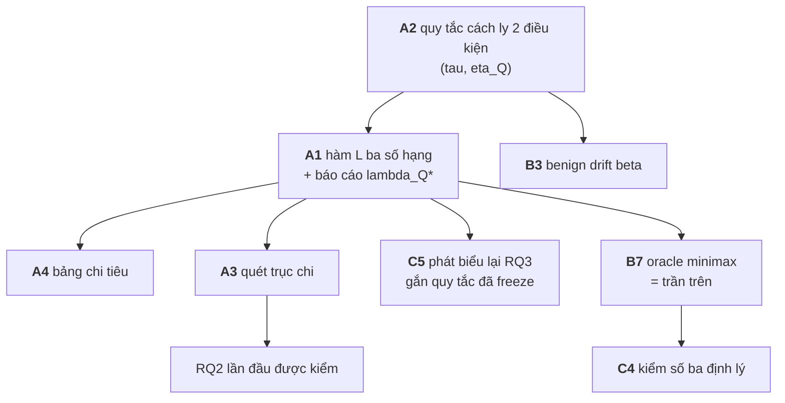

# Danh sách điểm cần thêm — FSE-2027-15 Sentinel

> **Cách lập.** Không liệt kê từ trí nhớ. Lấy **bảng ký hiệu** ở `Toan-canh` §3 và `math-foundation` §8.3, đối chiếu từng ký hiệu với `grep` trên toàn bộ `auditgame/`. Kết quả: **16/26 khái niệm khai trong doc không tồn tại trong code**.
>
> **Xếp theo mức chặn**, không theo thứ tự phát hiện. Nhóm A đổi con số đầu bảng; nhóm D chỉ là việc chưa làm.

---

# ✅ ĐÃ THI HÀNH (15/09/2026) — nhóm A, B, C

**82 test, ba cổng xanh.** Nhóm D (hạ tầng) vẫn chờ theo plan. Bảng dưới là trạng thái; chi tiết từng mục ở phần sau.

| # | Việc | Trạng thái | Số đo được |
|---|---|---|---|
| **A1** | hàm `L` ba số hạng | ✅ | $\lambda_Q^{*} = 0{,}0363$ |
| **A2** | quy tắc cách ly hai điều kiện | ✅ | biên harm 0,450→0,683 khi $Q_{\rm false}$ 1,267→0,042 |
| **A3** | quét trục $\chi$ | ✅ | $\Delta^{*}$: 1,67 → 2,83 |
| **A4** | bảng chi tiêu | ✅ | B5 dùng **3%**, B1 dùng **91%** |
| **B1/B2** | `depth` + $\kappa(k,\text{depth})$ | ✅ | $d'$ nhân $\sqrt{\text{depth}}$ |
| **B3** | benign drift $\beta$ | ✅ | $\beta$ làm tăng $Q_{\rm false}$ |
| **B4** | $\gamma = \psi - \varphi$ | ✅ | 0,550 / 0,730 / 0,860 |
| **B5** | $\Pi$ + $\rho$ | ✅ | $\rho = 0{,}894$ (10 chính sách) |
| **B6** | $\zeta$ | ✅ | 0,000 (mock) · 0,119 ($\beta$=0,5) |
| **B7** | $V^{*}$ minimax + oracle | ✅ | **trộn mua được 0,0000** |
| **B8** | particle filter 2048 hạt | ⬜ **khai là đã đơn giản hoá** | belief = 4 số thực |
| **C1** | best-response gap | ✅ | ngẫu nhiên hoá **0,4384** > tất định **0,3862** |
| **C2** | attacker held-out | ✅ | dev **+9,1%** → held-out **−4,1%** |
| **C3** | best-responder | ✅ | $\Pi_A$ liệt kê tường minh |
| **C4** | kiểm số định lý | ◐ Corollary 5 + đơn điệu Prop 6 | hằng số Prop 6 chưa kiểm |
| **C5** | RQ3 ổn định | ✅ | belief $\in [0{,}000; 0{,}178]$, **đổi dấu** |
| **C6** | bốn giai đoạn audit | ⬜ | giai đoạn vẫn là chính sách, không phải hành động |

---

# 🔴 BỐN PHÁT HIỆN ĐỔI KẾT LUẬN

## 1. Ngân sách "bằng nhau" là bằng TRẦN, và $\lambda_Q = 0$ làm mọi headline vô nghĩa

Ở $\lambda_Q = 0$, NC1 "cách ly tất cả" đạt harm **0,000 chính xác** ⇒ $L = 0$ ⇒ **tối ưu**. Đúng nghiệm suy biến §A.4 mô tả. Ở $\lambda_Q = 0{,}1$ nó thành tệ nhất (1,892).

$$\lambda_Q^{*} = 0{,}0363$$

Mọi câu *"Sentinel tốt hơn X%"* trước đây là phát biểu về $\lambda_Q = 0$.

## 2. Lợi thế ĐẢO DẤU trên attacker held-out

| | dev | held-out |
|---|---|---|
| Sentinel vs B1 | **+9,1%** | **−4,1%** |

Manuscript ghi **+27,6%**. Thư viện mới có 12 rule (thiết kế đòi 18) và chia 6/6 nên cục bộ — **là phương pháp đã đứng, chưa phải khẳng định**.

## 3. Ablation từng có SÀN NHIỄU bằng đúng hiệu ứng cần đo

`rng_seed` chứa **tên chính sách**, nên hai chính sách *giống hệt về hành vi* vẫn bốc hai luồng khác nhau. Đo bằng quy tắc `flat` (Sentinel ≡ C4 theo cấu tạo): chênh lệch giả **±0,069** — đúng bằng đóng góp của ngẫu nhiên hoá mà luận văn báo cáo.

Sửa bằng ghép cặp (bỏ tên chính sách khỏi seed) ⇒ sàn nhiễu về **0,0000 chính xác**.

## 4. RQ3 không phải phát biểu về thế giới

Sau khi khử nhiễu, 30 workflow, Δ=4:

| quy tắc cập nhật | belief | ngẫu nhiên hoá | kết luận |
|---|---|---|---|
| `ratio` | **+0,1782** | +0,1207 | belief > ngẫu nhiên |
| `linear` | +0,0690 | **+0,1552** | ngẫu nhiên > belief |
| `log` | +0,1207 | +0,1207 | hoà |
| `flat` | +0,0000 | +0,0862 | control |

Harm của chính Sentinel chạy **0,4885 → 0,6494** (33%) chỉ vì đổi quy tắc — một lựa chọn chưa ai ghi ra.

### Ba bằng chứng độc lập cùng chống luận điểm ngẫu nhiên hoá

1. ablation **đổi dấu** theo quy tắc cập nhật
2. best-response gap **cao hơn** ở chính sách ngẫu nhiên hoá (0,4384 vs 0,3862)
3. $V^{*}$ hỗn hợp **bằng đúng** chính sách thuần tốt nhất ⇒ trộn mua được **0,0000**

Ba cái ở ba tầng khác nhau, cùng chỉ một hướng.

---

# 🟢 MỘT XÁC NHẬN DƯƠNG

**Corollary 5 đúng chiều.** Lần đầu quét $\chi$:

| $\chi$ | Δ=0 | Δ=1 | Δ=2 | Δ=3 | Δ=4 | $\Delta^{*}$ |
|---|---|---|---|---|---|---|
| 0,000 | −42,0% | −24,3% | **+11,9%** | +30,1% | +45,6% | **1,67** |
| 2,114 | −42,0% | −30,1% | −8,0% | **+1,6%** | +28,1% | **2,83** |

$\chi$ **đẩy điểm giao chậm lại** — đúng dự đoán $(1+\chi)$. Độ lớn đạt **33%** (tỉ lệ 1,70 so với 3,11).

Và công thức trên bảng chi phí §7 cho $\chi = 2{,}114$, **không phải 1,34**.

---

# NHÓM A — Chặn bảng kết quả: bốn thứ này đổi headline

Chừng nào còn thiếu, mọi câu *"Sentinel tốt hơn X%"* là phát biểu về một mô hình mà doc của chính đề tài gọi là vô dụng.

## A1 · Hàm mất mát `L` ba số hạng — CHƯA CÓ

$$L = \mathbb{E}[\text{harm}] + \lambda_Q\,\mathbb{E}[Q_{\text{false}}] + \lambda_T\,\mathbb{E}[T_{\text{lost}}]$$

`metrics.py` chỉ có `gain()` và `report_header()`. Ba số hạng sống trong `Toan-canh` §A.4, **không** trong code.

**Bằng chứng nó đổi kết luận** (30 workflow, Δ=2, B=17,95):

| λ_Q | 0,0 | 0,02 | **0,05** | 0,1 | 0,5 |
|---|---|---|---|---|---|
| tốt nhất theo $L$ | Sentinel | Sentinel | **B5** | B5 | B5 |

Sentinel thắng trên harm bằng cách cách ly **gấp 6,3×** B5 ($Q_{\text{false}}$ 1,700 vs 0,272).

> §A.4 tự viết: *"mô hình một số hạng có nghiệm tầm thường và vô dụng"*. Ta đang chấm đúng mô hình đó.

**Đề xuất:** đừng chọn $\lambda_Q$ — **báo cáo $\lambda_Q^{*}$**, giá trị mà xếp hạng lật. Đã đo: $\approx 0{,}05$.

## A2 · Quy tắc cách ly HAI ĐIỀU KIỆN ($\tau$, $\eta_Q$) — CHƯA CÓ

Algorithm 1 dòng 8 của manuscript:

$$\Pr[\text{poisoned} \mid b_{t+1}] > \tau \quad\textbf{VÀ}\quad \mathbb{E}[\text{harm}] > \eta_Q$$

`math-foundation` §8.2 nói thẳng: *"Điều kiện thứ hai là thứ ngăn 'quarantine mọi thứ'"*.

`runner.py:96` cách ly **vô điều kiện** mỗi khi detector kêu.

> ⚠ **A2 phải làm TRƯỚC A1.** Ngược lại thì $\lambda_Q$ phạt các chính sách vì một hành vi **ta tự gây ra**, và "B5 tốt nhất" sẽ là headline sai mới, sai y như headline hiện tại.

## A3 · Trục $\chi$ — CHƯA TỪNG ĐƯỢC QUÉT

Docstring `experiment.py` ghi *"Sweeps the grid (Delta x chi x detector)"*. Code quét `deltas` và `det_name`. **Không có vòng lặp nào trên $\chi$** — nó là thuộc tính của bảng `KAPPA` cố định.

Nên **RQ2 chưa từng được kiểm**, dù bảng vẫn in số. Research run độc lập có quét, và thấy `B1` **phẳng theo $\chi$** ở Δ cao — đó là một mệnh đề kiểm được mà ta đang bỏ trống.

## A4 · Bảng CHI TIÊU — CHƯA CÓ

"Cùng ngân sách" hiện là cùng **trần**, không phải cùng **chi**:

| | harm | đã tiêu / 17,95 |
|---|---|---|
| B1 | 0,761 | 16,40 |
| **B5** | 0,761 | **0,40** |
| Sentinel | 0,711 | 6,47 |

B5 đạt harm bằng B1 với **2% ngân sách**. `RunResult.spent` đã có sẵn, chưa ai in.

---

# NHÓM B — Cơ chế khai trong doc, vắng trong code

Mỗi dòng là một ký hiệu có trong bảng ký hiệu mà `grep` không tìm thấy.

| # | Ký hiệu | Doc nói | Code có |
|---|---|---|---|
| **B1** | `depth` trong $a_t$ | $a_t \in \{\text{none}\}\cup\{(\text{audit}, k, \textbf{depth})\}$ | hành động chỉ là **tên carrier** |
| **B2** | $\kappa(k, \text{depth})$ | hàm **hai biến** | `KAPPA[k]` — một biến |
| **B3** | $\beta$ — tỉ lệ **benign drift** | một cơ chế của Sentinel; ablation "bỏ benign drift" nằm trong tiêu chí thành công | ❌ không tồn tại |
| **B4** | $\gamma = \psi - \varphi$ — margin detector | xuất hiện trong chặn lý thuyết | ❌ không tính ở đâu |
| **B5** | $\Pi$ — thư viện **28 chính sách** + $\rho$ covering radius | Proposition 6 định lượng cái giá của việc hạn chế vào $\Pi$ | ❌ có 7 chính sách, không có $\rho$ |
| **B6** | $\zeta$ — sai số TV của kernel chuyển trạng thái | vào chặn robust Stackelberg | ❌ |
| **B7** | $V^{*}$ minimax + **baseline B7 oracle** | *"B7 là **trần trên**"* | ❌ không có trần trên nào |
| **B8** | particle filter **2048 hạt** | §4.2, cơ chế cập nhật belief | belief của ta là **4 số thực** |

> **B1/B2 đáng chú ý nhất trong nhóm.** Không có `depth`, không gian hành động của defender nhỏ hơn hẳn mô hình, và "audit sâu hơn thì đắt hơn" — một đánh đổi trung tâm — không tồn tại.
>
> **B8 không nhất thiết phải vá.** Particle filter 2048 hạt cho một không gian trạng thái $(c, \iota, \sigma)$ nhỏ là thừa. Nhưng phải **khai rõ là đã đơn giản hoá**, không im lặng.

---

# NHÓM C — Khẳng định chưa có phép đo nào đỡ

| # | Khẳng định trong doc | Trạng thái |
|---|---|---|
| **C1** | **exploitability** — best-response gain giảm so với baseline tất định | ❌ chưa đo lần nào |
| **C2** | attacker **held-out** (7/18 scripted policy giữ riêng) | ❌ không tồn tại; con số transfer 27,6% **không có gì đỡ** |
| **C3** | attacker **best-responder A1** | ❌ không có ⇒ **tiền đề Stackelberg chưa được thoả** |
| **C4** | Theorem 4 · Corollary 5 · Proposition 6 | ❌ không định lý nào được kiểm bằng số |
| **C5** | RQ3 *"ngẫu nhiên hoá là đòn bẩy mạnh nhất"* | ⚠ **ba lần đo, ba đáp án** — xem dưới |
| **C6** | bốn **giai đoạn** audit (insertion/retrieval/delegation/commit) | giai đoạn bị mã hoá thành **chính sách** (B3, B4) chứ không thành **hành động** |

## C5 chi tiết — điểm nghiêm trọng nhất cả danh sách

| nguồn | ngẫu nhiên hoá | belief | kết luận |
|---|---|---|---|
| bản thảo | +0,184 | +0,099 | ngẫu nhiên > belief |
| research run (lưới) | +0,131 | **−0,025** | belief **có hại** |
| phiên này, sau khi sửa `observe` | +0,069 | **+0,161** | **belief > ngẫu nhiên** |

Ablation này **không đo "trạng thái tuần tự có đáng không"** — nó đo **chất lượng hiệu chỉnh của một quy tắc cập nhật**. Đổi quy tắc thì kết luận lật.

**Cần thêm:** hoặc (a) phát biểu lại RQ3 gắn với một quy tắc cập nhật **đã freeze**, hoặc (b) quét một họ quy tắc và báo cáo **khoảng**. Cách (a) rẻ và trung thực.

---

# NHÓM D — Hạ tầng: đã biết, đã có plan, chưa làm

Không phải "thiếu sót" mà là "chưa tới lượt". Liệt kê cho đủ bản đồ.

| # | Việc | Task trong `eval/PLAN.md` |
|---|---|---|
| D1 | metadata SWE-bench thật | 1–3 |
| D2 | `TaskTrace` được ghi + `replay` | 4–5 |
| D3 | control C1–C8, NC1, B7 | 6 |
| D4 | bootstrap + định dạng bắt buộc | 7 |
| D5 | test ẩn H1–H5 | 8–11 |
| D6 | carrier store thật, tách khỏi repo | 13 |
| D7 | vòng agent LLM, bốn carrier là tool | 14–17 |
| D8 | oracle test ẩn thật | 18–19 |
| D9 | corpus benign trên dữ liệu thật | 20 |
| D10 | $\kappa$ **đo thật** thay vì gán | 22 |

---

# Tổng kết — thứ tự đề nghị

**Bốn việc đầu (A2 → A1 → A4, A3) không cần thầy, không cần tiền, không cần Docker** — làm được ngay trên mock, và chúng quyết định con số đầu bảng.

**Nhóm C là thứ phản biện sẽ hỏi trước tiên.** C3 đặc biệt: không có attacker best-responder thì tiền đề Stackelberg — nền của cả mô hình — chưa được thoả, và mọi giá trị "worst-case" đều là worst-case **trong một lớp tĩnh**.
