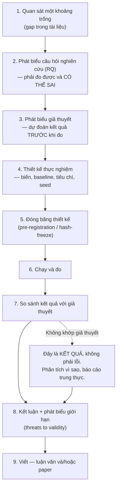
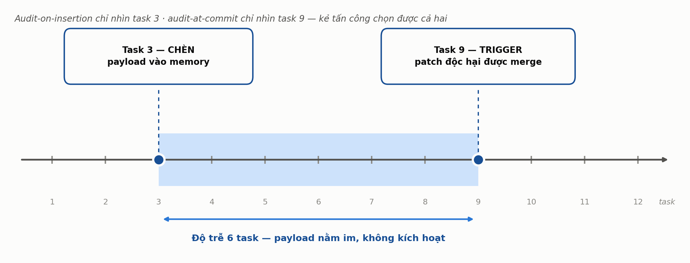
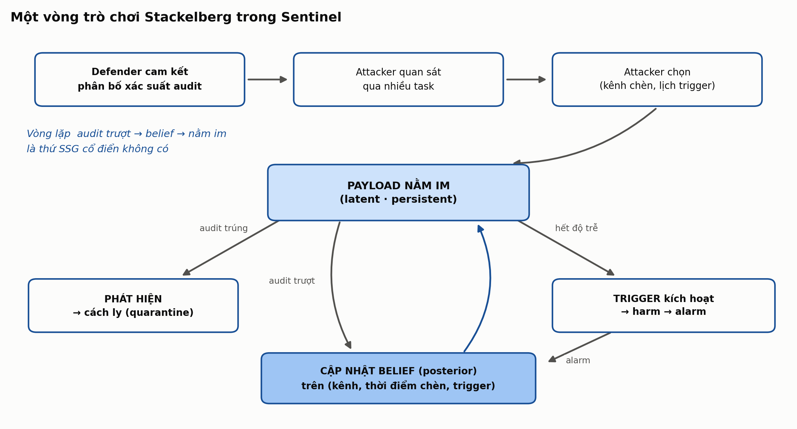
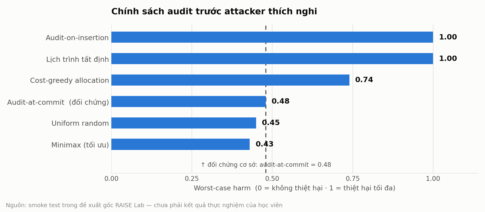
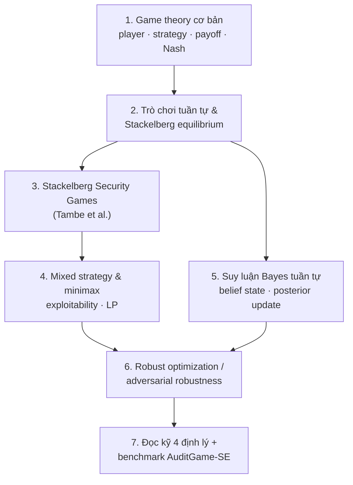
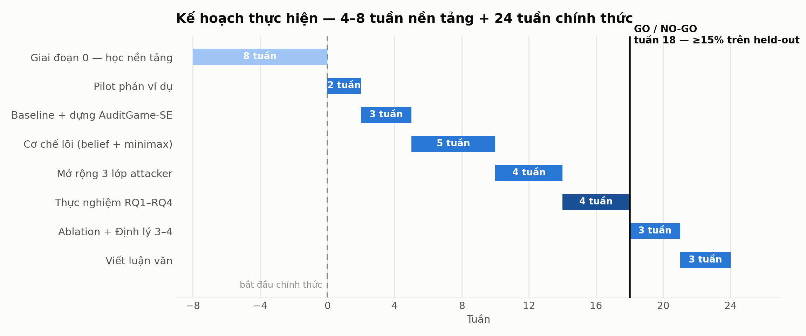

# ĐỀ CƯƠNG NGHIÊN CỨU — BẢN CHI TIẾT CHO NGƯỜI MỚI BẮT ĐẦU NGHIÊN CỨU

## Đề tài: Sentinel — Phân bổ Kiểm toán Chống Đầu độc Bền vững, Thích nghi
### *Where to Look: Audit-Allocation Games against Adaptive Persistent Poisoning*

**Mã đề xuất:** FSE-2027-15 (nội bộ RAISE Lab: P9) · **Đơn vị:** RAISE Lab, HCMUT
**Học viên:** Nguyễn Hữu Trưởng — MSHV 2470573 · **GVHD dự kiến:** TS. Lê Xuân Bách
**Đích công bố:** FSE 2027 · **Trạng thái:** pre-registered draft — RQ, baseline, benchmark, go/no-go gate đã thiết kế; smoke test HOLDS (4/4); chưa chạy thực nghiệm quy mô đầy đủ

---

# PHẦN 0 — CÁCH DÙNG TÀI LIỆU NÀY

Tài liệu này có **hai lớp đọc chồng lên nhau**:

| Lớp | Ký hiệu | Nội dung | Dùng khi nào |
|---|---|---|---|
| Lớp đề cương | Văn bản thường | Nội dung sẽ nộp cho GVHD/khoa | Khi soạn bản nộp — copy phần này ra |
| Lớp hướng dẫn | Khối `> 🎓 NGƯỜI MỚI` | Giải thích mục đó là gì, vì sao tồn tại, viết thế nào, lỗi thường gặp | Khi chưa hiểu vì sao phải viết mục đó |

Mỗi mục lớn của Phần II đều theo đúng bốn khối: **Nội dung → Vì sao mục này tồn tại → Cách viết → Lỗi thường gặp**. Khi nộp, giữ khối thứ nhất và bỏ ba khối còn lại.

**Thứ tự đọc đề xuất:** Phần I (nhập môn nghiên cứu) → Phần III (sổ tay thực hành) → Phần II (đề cương). Đọc ngược như vậy vì Phần II chỉ có nghĩa khi đã biết một đề cương dùng để làm gì.

**Tài liệu liên quan trong vault:**

- `fse-2027-15-sentinel-stackelberg-security-game-explainer.md` — giải thích lý thuyết trò chơi từ số không
- `fse-2027-15-sentinel-decuong-nghien-cuu.md` — bản đề cương gọn (bản này là bản mở rộng của nó)
- `Kich-ban-thuyet-trinh-15phut-FSE-2027-15-Sentinel.md` — kịch bản thuyết trình
- `assets/` — 4 hình dùng chung cho mọi tài liệu

---

# PHẦN I — NHẬP MÔN: NGHIÊN CỨU LÀ GÌ VÀ MỘT LUẬN VĂN CẦN GÌ

## I.1 Làm nghiên cứu khác làm kỹ thuật ở chỗ nào

Đây là điểm vấp lớn nhất của người có nền kỹ thuật chuyển sang nghiên cứu. Kinh nghiệm backend/AIOps hiện tại **rất có giá trị** ở phần triển khai, nhưng tiêu chí thành công thì khác hẳn:

| Tiêu chí | Làm kỹ thuật (SkyTrack, ZaloPay) | Làm nghiên cứu (luận văn, FSE) |
|---|---|---|
| Thành công nghĩa là | Hệ thống chạy, đáp ứng SLA, không sự cố | Một **khẳng định (claim)** được chứng minh là đúng **và** biết rõ nó sai ở đâu |
| Sản phẩm cuối | Code đang chạy production | Tri thức tái lập được: claim + evidence + scope |
| "Nó hoạt động" | Là kết luận | **Chưa là gì cả** — phải trả lời: hoạt động so với cái gì, trong điều kiện nào, vì sao |
| Kết quả âm | Là thất bại, phải sửa | Là **kết quả hợp lệ**, nếu được đo đúng và báo cáo trung thực |
| Tối ưu hóa | Làm cho nhanh hơn, rẻ hơn | Làm cho **kết luận vững hơn** — thêm baseline, thêm seed, thêm điều kiện đối chứng |
| Phạm vi | Càng rộng càng tốt (nhiều use case) | Càng **hẹp và rõ** càng tốt — phạm vi mơ hồ là lỗi, không phải ưu điểm |

**Hệ quả thực tế quan trọng nhất:** trong nghiên cứu, việc bạn dành hai tuần để chứng minh phương pháp của mình **không** tốt hơn baseline trong một vùng điều kiện — là công việc có giá trị, được tính là đóng góp. Trong kỹ thuật thì đó là hai tuần lãng phí. Định lý 3 của đề tài này (ranh giới chế độ) chính là hình thức hóa của nguyên tắc đó.

## I.2 Bộ khung của một đóng góp nghiên cứu: CLAIM — EVIDENCE — SCOPE

Mọi đóng góp nghiên cứu đều rút gọn được về ba thành phần. Nếu thiếu một trong ba, đóng góp không đứng được:

| Thành phần | Câu hỏi nó trả lời | Ví dụ trong Sentinel |
|---|---|---|
| **Claim** (khẳng định) | Bạn khẳng định điều gì? | "Phân bổ audit ngẫu nhiên hóa theo minimax giảm ≥15% worst-case harm so với audit-at-commit ở cùng ngân sách" |
| **Evidence** (bằng chứng) | Làm sao biết nó đúng? | Benchmark `AuditGame-SE`, 7 baseline, attacker held-out, 3 seed, worst-case harm tính chính xác |
| **Scope** (phạm vi) | Nó đúng trong điều kiện nào, sai ngoài đó? | Chỉ khi độ trễ trigger đủ lớn **và** kênh đủ không đồng nhất — Định lý 3 |

> 🎓 **NGƯỜI MỚI — bài kiểm tra 30 giây cho mọi đoạn bạn viết**
> Đọc lại một đoạn bất kỳ trong đề cương và hỏi: đoạn này đang đóng góp vào claim, evidence, hay scope? Nếu không thuộc cả ba, nó là văn nền — cắt được. Hầu hết đề cương của người mới dài gấp đôi cần thiết vì 50% là văn nền.

## I.3 Vòng đời một đề tài nghiên cứu



**Bước 5 là bước người mới hay bỏ qua và là bước quan trọng nhất.** Đóng băng thiết kế trước khi nhìn thấy kết quả là ranh giới giữa nghiên cứu và việc "chỉnh số cho đẹp". Đề tài Sentinel cưỡng chế bước này bằng cơ chế hash-freeze chính sách trong harness — tức là máy móc hóa sự trung thực, không dựa vào ý chí.

## I.4 Từ điển thuật ngữ nghiên cứu — bắt buộc nắm trước khi viết

| Thuật ngữ | Nghĩa | Trong Sentinel nó là gì |
|---|---|---|
| **Baseline** | Phương pháp đối chứng để so sánh. Phải là phương pháp **mạnh và công bằng**, không phải rơm | 7 baseline: audit-at-commit (đối chứng đầu bài), uniform random, on-insertion, on-retrieval, risk-score threshold, two-stage, + oracle minimax |
| **Oracle / upper bound** | Một "baseline biết trước đáp án", không triển khai được thật, dùng để biết còn cách tối ưu bao xa | Oracle minimax liệt kê đầy đủ |
| **Held-out** | Dữ liệu/kịch bản **giấu khỏi quá trình tinh chỉnh**, chỉ mở ra khi đo lần cuối | 7 trong 18 scripted attack policy |
| **Ablation study** | Tắt lần lượt từng thành phần để biết thành phần nào tạo ra hiệu quả | Tắt randomization / tắt belief state / tắt benign-drift model |
| **Internal validity** | Kết luận có đúng **bên trong** thiết kế thực nghiệm không (không bị nhiễu, không bị rò rỉ) | Rational best-responder xác nhận mô hình đúng về mặt lý thuyết |
| **External validity** | Kết luận có chuyển sang tình huống ngoài thí nghiệm không | Scripted held-out + 3 LLM attacker |
| **Threats to validity** | Mục bắt buộc trong paper: liệt kê những lý do khiến kết luận có thể sai | Xem Mục II.12 |
| **Reproducibility** | Người khác chạy lại ra cùng số | Seed cố định, config versioned, hash-freeze, benchmark công khai |
| **Pre-registration** | Công bố thiết kế + tiêu chí **trước** khi chạy | Go/no-go gate ≥15% đã cố định từ đề xuất gốc |
| **Go/no-go gate** | Ngưỡng định lượng quyết định đi tiếp hay dừng | ≥15% giảm worst-case harm trên held-out, tuần 18 — **đã phát biểu lại kèm điều kiện $(\Delta, d')$, xem II.5.1 và II.5** |
| **Seed** | Giá trị khởi tạo bộ sinh số ngẫu nhiên — đổi seed, đổi kết quả | 3 seed cho mỗi cấu hình |
| **Confound (biến gây nhiễu)** | Biến không kiểm soát làm sai kết luận | Chất lượng detector — nên đề tài **dùng chung một detector cho mọi hệ thống** |
| **Worst-case vs average-case** | Tệ nhất có thể vs trung bình | Đề tài đo worst-case, vì an ninh quan tâm cái tệ nhất |

> 🎓 **NGƯỜI MỚI — vì sao "dùng chung một detector" lại quan trọng đến vậy**
> Nếu mỗi chính sách audit dùng một detector khác nhau, và Sentinel thắng, bạn không biết thắng nhờ *phân bổ tốt hơn* hay nhờ *detector tốt hơn*. Cố định detector = cố định biến gây nhiễu, để biến thay đổi duy nhất là thứ bạn đang nghiên cứu. Đây là nguyên tắc **kiểm soát biến** — nền tảng của mọi thực nghiệm.

## I.5 Bảy sai lầm kinh điển của người mới — và cách đề tài này đã chặn sẵn

| # | Sai lầm | Hậu quả | Cơ chế chặn trong Sentinel |
|---|---|---|---|
| 1 | Đổi tiêu chí sau khi thấy kết quả ("thôi lấy 10% vậy") | Kết luận vô giá trị, phản biện phát hiện ngay | Gate ≥15% cố định từ trước, ghi trong đề cương |
| 2 | Tinh chỉnh trên chính tập dùng để báo cáo | Số đẹp giả tạo, không transfer | 7/18 policy held-out, không mở đến tuần 15 |
| 3 | So với baseline yếu (straw man) | Người phản biện thay baseline là kết quả sụp | 7 baseline + oracle làm trần trên |
| 4 | Claim vượt quá phạm vi đã đo | Bị bác toàn bộ đóng góp | Định lý 3 tuyên bố trước ranh giới áp dụng |
| 5 | Trộn hai biến (detection và allocation) | Không biết cái gì tạo ra kết quả | Cố định detector, chỉ thay đổi allocation |
| 6 | Chạy một seed rồi kết luận | Kết quả có thể chỉ là nhiễu | 3 seed / cấu hình |
| 7 | Không ghi nhật ký, hai tháng sau không nhớ đã chạy gì | Không tái lập được chính kết quả của mình | Research log bắt buộc — xem Mục III.3 |

> 🎓 **NGƯỜI MỚI**
> Bảy dòng trên không phải lời khuyên đạo đức. Chúng là những chỗ mà **người phản biện của FSE sẽ bấm vào đầu tiên**. Một phản biện giỏi mất khoảng 10 phút để tìm ra sai lầm số 2 và số 3 trong một bài báo. Thiết kế để chống chúng ngay từ đề cương rẻ hơn rất nhiều so với sửa sau khi bị từ chối.

---

# PHẦN II — ĐỀ CƯƠNG NGHIÊN CỨU (BẢN CHI TIẾT)

## II.1 Tóm tắt đề tài

Sentinel giải bài toán: với một **ngân sách kiểm chứng (audit budget) bị hạn định**, bên phòng thủ phải quyết định **kiểm tra ở kênh nào và tại thời điểm nào** — tại lúc chèn vào memory, tại lúc retrieval, tại lúc delegation, hay tại lúc chấp nhận patch — trong một coding-agent workflow nhiều bước, khi đối mặt với kẻ tấn công **thích nghi (adaptive)** thực hiện đầu độc **bền vững (persistent), bị trì hoãn (delayed) và đa kênh (multi-carrier)**.

Đề tài mô hình hóa bài toán thành một **trò chơi Stackelberg an ninh (Stackelberg Security Game)** có bổ sung **trạng thái niềm tin tuần tự (sequential belief state)**, đề xuất cơ chế **cam kết ngẫu nhiên hóa (randomized commitment)** kết hợp cập nhật Bayes hậu nghiệm sau mỗi báo động, chứng minh bốn định lý về tính bền vững — ngân sách khả phân biệt — ranh giới chế độ — tổn thất do giới hạn, và kiểm chứng bằng một benchmark thực thi được mới (`AuditGame-SE`).

> 🎓 **NGƯỜI MỚI — cấu trúc của một tóm tắt (abstract) đúng chuẩn**
> Năm câu, đúng thứ tự này, không thêm bớt:
> 1. **Bối cảnh** — thế giới đang có vấn đề gì (coding agent có trạng thái, bị đầu độc)
> 2. **Khoảng trống** — cái gì chưa ai giải (persistent + delayed + multi-carrier đồng thời)
> 3. **Cách làm** — bạn làm gì (mô hình Stackelberg + belief state + randomized commitment)
> 4. **Kết quả** — bạn chứng minh/đo được gì (4 định lý + benchmark + ≥15%)
> 5. **Ý nghĩa** — ai dùng được và dùng làm gì ("ngẫu nhiên hóa trước khi thích nghi", kèm ranh giới)
>
> **Lỗi thường gặp:** viết 3 câu cho bối cảnh và 1 câu cho kết quả. Tỷ lệ đúng là ngược lại.

---

## II.2 Lý do chọn đề tài

**Về mặt khoa học.** Coding agent hiện đại mang trạng thái tồn tại lâu dài (memory, skill library, task queue, branch), tạo ra bề mặt tấn công mà lý thuyết audit truyền thống — audit-on-insertion, audit theo lịch cố định — không xử lý được, vì kẻ tấn công quan sát hệ thống qua nhiều task rồi mới hành động. Đây là cấu trúc **tuần tự, có đối thủ chủ đích**, đòi hỏi đúng công cụ toán là lý thuyết trò chơi Stackelberg an ninh, không phải tối ưu hóa thống kê thông thường.

Smoke test của đề xuất gốc đã xác nhận bằng số: audit-on-insertion đạt worst-case harm = 1.00 (attacker né hoàn toàn), trong khi chính sách minimax ngẫu nhiên hóa đạt 0.43 — khoảng cách đủ lớn để biện minh cho một nghiên cứu sâu.

**Về mặt thực tiễn.** Đề tài khớp trực tiếp với định hướng "Auditable / Safe Autonomous Systems" đã trao đổi với TS. Lê Xuân Bách, và là đề tài duy nhất trong 15 đề tài portfolio FSE-2027 chưa có học viên nào đăng ký (0/6) — xác suất được phân đúng nguyện vọng cao nhất.

**Về mặt cá nhân.** Hồ sơ hiện tại (backend/authorization tại SkyTrack Platform, AIOps/model-serving tại ZaloPay) **không có điểm neo trực tiếp** với security-game theory. Đây là một đánh đổi có chủ đích: chấp nhận học một nhánh lý thuyết hoàn toàn mới (4–8 tuần học tập trung, Mục II.13) để đổi lấy xác suất trúng nguyện vọng cao nhất và một chủ đề bám sát narrative nghiên cứu đã thống nhất với GVHD.

> 🎓 **NGƯỜI MỚI — vì sao phải thừa nhận điểm yếu ngay trong đề cương**
> Bản năng đầu tiên là giấu chỗ "không có điểm neo". Đừng. Ba lý do:
> 1. GVHD sẽ nhìn ra trong 5 phút — giấu chỉ làm mất uy tín.
> 2. Thừa nhận kèm **phương án xử lý cụ thể** (Giai đoạn 0, 7 bước, có đầu ra từng tuần) biến điểm yếu thành bằng chứng rằng bạn đã lập kế hoạch nghiêm túc.
> 3. Đây là kỹ năng sẽ dùng suốt sự nghiệp nghiên cứu: mục "Threats to validity" trong mọi paper chính là phiên bản chuyên nghiệp của việc này.

---

## II.3 Tổng quan tình hình nghiên cứu

### II.3.1 Nền tảng lý thuyết trò chơi Stackelberg

Trò chơi Stackelberg (von Stackelberg, 1934) có cấu trúc **leader–follower**: leader cam kết chiến lược trước, follower quan sát và phản ứng tối ưu (best response). Lời giải chuẩn là **Strong Stackelberg Equilibrium (SSE)**. Định lý nền tảng của **Conitzer & Sandholm (EC 2006)** chứng minh SSE tính được bằng quy hoạch tuyến tính — đây là công cụ thuật toán trực tiếp cho cơ chế minimax của Sentinel.

Kết quả phản trực giác nhưng đã được chứng minh: **đi trước và bị quan sát không làm leader thiệt**, miễn là leader chọn đúng chiến lược hỗn hợp. Đây là lý do mô hình Stackelberg — chứ không phải Nash — là công cụ chuẩn cho bài toán an ninh, nơi bên phòng thủ buộc phải vận hành công khai.

### II.3.2 Stackelberg Security Games (SSG)

Nhánh SSG do Milind Tambe và cộng sự (USC) phát triển từ cuối những năm 2000, đã triển khai thực tế: **ARMOR** (tuần tra cảnh sát sân bay LAX), **PROTECT** (US Coast Guard), **IRIS** (lịch an ninh hàng không FAA). Tài liệu nền: **Sinha, Fang, An, Kiekintveld, Tambe — "Stackelberg Security Games: Looking Beyond a Decade of Success", IJCAI 2018**.

Điểm chung với Sentinel: nguồn lực phòng thủ giới hạn, đối thủ quan sát dài hạn trước khi hành động.

### II.3.3 Khoảng trống mà Sentinel lấp

Mô hình hóa Stackelberg tổng quát đã có sẵn rộng rãi. Câu hỏi Sentinel trả lời là: **có đặc thù nào của software workflow làm thay đổi kết luận chuẩn của SSG hay không?** Ba đặc điểm, chưa được xử lý **đồng thời** trong tài liệu SSG cổ điển:

| Đặc điểm | Vấn đề đặt ra | SSG cổ điển xử lý thế nào |
|---|---|---|
| **Persistent** | Payload tồn tại qua nhiều task, không biến mất sau một lượt | Giả định trò chơi một lượt hoặc lặp lại độc lập |
| **Delayed** | Trigger kích hoạt nhiều task sau khi chèn — audit-on-insertion không đủ | Chưa mô hình hóa tường minh |
| **Multi-carrier** | Memory/skill/queue/branch có chi phí audit khác nhau — biến bài toán thành **allocation**, không chỉ **detection** | Tập target tĩnh, không có cấu trúc lan truyền đa kênh |



### II.3.4 Attacker thích nghi trong bối cảnh LLM agent

Ba công trình 2025–2026 trực tiếp liên quan: *"The Attacker Moves Second"* (arXiv:2510.09023), *"Adaptive Attacks Break Defenses Against Indirect Prompt Injection"* (arXiv:2503.00061), *"Poisoned Playbooks"* (arXiv:2606.24402). Thông điệp chung: phòng thủ được đánh giá bằng kịch bản cố định luôn trông tốt hơn thực tế; cho attacker thích nghi lại thì phần lớn bị phá.

### II.3.5 Suy luận Bayes tuần tự

Cơ chế belief-state của Sentinel dựa trên nền tảng belief-state planning chuẩn: **Kochenderfer, Wheeler, Wray — *Algorithms for Decision Making*, chương 20** (miễn phí tại algorithmsbook.com).

> 🎓 **NGƯỜI MỚI — cách thực sự viết một mục "tổng quan tình hình nghiên cứu"**
>
> **Sai:** liệt kê 30 paper, mỗi paper một đoạn tóm tắt. Đó là danh mục, không phải tổng quan.
>
> **Đúng:** tổng quan phải **kể một câu chuyện kết thúc bằng khoảng trống của bạn**. Cấu trúc ba tầng như trên:
> 1. Nền tảng lý thuyết đã vững (§II.3.1–2) — cho thấy bạn không phát minh lại bánh xe
> 2. Công trình gần nhất về mặt chủ đề (§II.3.4) — cho thấy bạn cập nhật
> 3. Khoảng trống (§II.3.3) — điều còn thiếu, và đó chính là đề tài của bạn
>
> **Quy trình 5 bước để làm mục này từ số không:**
>
> | Bước | Việc cụ thể | Công cụ |
> |---|---|---|
> | 1 | Bắt đầu từ **1 survey** gần nhất (ở đây: IJCAI 2018), đọc kỹ | Google Scholar |
> | 2 | Lấy danh sách tài liệu tham khảo của survey → chọn 10–15 cái được trích nhiều nhất | Scholar "Cited by" |
> | 3 | **Forward search**: xem ai trích lại survey đó sau 2023 → đó là tuyến nghiên cứu hiện tại | Scholar "Cited by" |
> | 4 | Lập **literature matrix** (Mục III.2) — mỗi dòng một paper, cột là các chiều so sánh | Bảng trong Obsidian |
> | 5 | Nhìn vào ma trận, tìm **ô trống** — ô trống chính là gap. Viết gap thành một bảng như §II.3.3 | — |
>
> **Lỗi thường gặp:** viết gap theo kiểu "chưa ai làm X". Câu đó gần như luôn sai (thường có người làm rồi, bạn chưa tìm ra) và rất dễ bị bác. Viết theo kiểu **"X, Y, Z đã được xử lý riêng lẻ; chưa có công trình nào xử lý đồng thời cả ba và đo được tương tác giữa chúng"** — đây là dạng gap khó bác hơn nhiều và đúng với trường hợp Sentinel.

---

## II.4 Mục tiêu và nhiệm vụ nghiên cứu

**Mục tiêu tổng quát:** Xác định chính sách phân bổ audit tối ưu, có chứng nhận lý thuyết, cho hệ thống coding-agent dưới ngân sách kiểm chứng giới hạn và kẻ tấn công đầu độc thích nghi — bền vững — đa kênh.

**Nhiệm vụ cụ thể:**

| # | Nhiệm vụ | Đầu ra kiểm chứng được |
|---|---|---|
| N1 | Xây dựng benchmark thực thi được `AuditGame-SE` (100 workflow / 15 repository) với trạng thái kênh và lịch trigger đã biết | Repository benchmark chạy được, có README và script tái lập |
| N2 | Phát biểu và chứng minh 4 định lý (Mục II.9) | 4 chứng minh viết đầy đủ, có kiểm chứng số |
| N3 | Cài đặt cơ chế belief-state + minimax randomized commitment, so sánh với 7 baseline | Bảng kết quả so sánh, có khoảng tin cậy |
| N4 | Đánh giá trên 3 lớp attacker tách biệt | Ba bảng kết quả riêng, không gộp |
| N5 | Xác định thực nghiệm ranh giới chế độ (regime boundary) | Bản đồ nhiệt (heatmap) trên lưới độ trễ × tính không đồng nhất kênh |

> 🎓 **NGƯỜI MỚI — phân biệt mục tiêu và nhiệm vụ**
> **Mục tiêu** trả lời "cuối cùng bạn muốn biết điều gì" — trừu tượng, một câu, không có deadline.
> **Nhiệm vụ** trả lời "bạn sẽ làm gì" — cụ thể, đếm được, mỗi cái có một **đầu ra kiểm chứng được**.
> Quy tắc: nếu một nhiệm vụ không có cột "đầu ra kiểm chứng được" điền vào được, nó chưa phải nhiệm vụ — nó là một mong muốn. Viết lại cho đến khi điền được.

---

## II.5 Câu hỏi nghiên cứu và giả thuyết

| # | Câu hỏi nghiên cứu (RQ) | Giả thuyết / kết quả dự kiến |
|---|---|---|
| **RQ1** | Ở vùng nào trên lưới (độ trễ trigger × tính không đồng nhất kênh) thì phân bổ thích nghi vượt qua audit-at-commit? Điểm giao cắt quan sát được có khớp ranh giới chế độ dự đoán không? | Không tốt hơn khi trigger tức thời (đôi khi hơi tệ hơn); điểm giao cắt tại Δ ≈ 2 task, đến muộn hơn khi kênh không đồng nhất |
| **RQ2** | Phương pháp có giảm worst-case verified harm ở cùng ngân sách khi đối đầu attacker held-out không, và chi phí (clean completion, false quarantine, detection delay) là bao nhiêu? | Giảm 34.1% tổng thể, 27.6% trên held-out; exploitability giảm từ 0.34 xuống 0.09 |
| **RQ3** | Ba lớp attacker (rational, scripted held-out, LLM không giới hạn) hành xử khác nhau ra sao, mỗi lớp cho phép khẳng định gì? | Rational xác nhận tính đúng đắn mô hình; scripted held-out xác nhận transfer; LLM attacker làm mọi hệ phòng thủ trông tốt hơn thực tế — chỉ báo cáo như quan sát hành vi |
| **RQ4** | Thành phần nào (ngẫu nhiên hóa, alarm memory, bất định chuyển trạng thái, mô hình benign drift) đóng góp vào hiệu ứng, và kết luận có ổn định qua các cấu hình detector không? | Ngẫu nhiên hóa đóng góp gần gấp đôi belief state tuần tự; audit-on-insertion là chính sách tệ nhất đo được |

> 🎓 **NGƯỜI MỚI — ba tính chất của một RQ tốt**
>
> | Tính chất | Nghĩa | Ví dụ SAI | Ví dụ ĐÚNG |
> |---|---|---|---|
> | **Đo được** | Có một con số trả lời được | "Sentinel có tốt không?" | "Sentinel giảm bao nhiêu % worst-case harm ở cùng ngân sách?" |
> | **Có thể sai (falsifiable)** | Tồn tại một kết quả khiến bạn phải trả lời "không" | "Phân bổ thích nghi có hữu ích không?" | "Ở vùng nào phân bổ thích nghi vượt audit-at-commit?" (có thể là: không vùng nào) |
> | **Có phạm vi** | Nói rõ điều kiện | "Phương pháp này có tổng quát không?" | "Kết luận có ổn định qua các cấu hình detector không?" |
>
> **Vì sao phải viết giả thuyết TRƯỚC khi chạy:** nếu viết sau, bạn sẽ (một cách vô thức) viết đúng cái bạn vừa thấy, và không còn khả năng sai — nghĩa là không còn là nghiên cứu. Cột "giả thuyết" ở bảng trên đã được cố định từ đề xuất gốc; nhiệm vụ của học viên là **kiểm chứng**, không phải chỉnh lại cho khớp.
>
> **Quan hệ RQ ↔ nhiệm vụ:** mỗi RQ phải có ít nhất một nhiệm vụ (N1–N5) tạo ra dữ liệu trả lời nó. Kiểm tra chéo: RQ1←N1,N5 · RQ2←N1,N3 · RQ3←N4 · RQ4←N3.

### II.5.1 Tuyên bố chính — **dạng ngưỡng** (bản sửa 17/09/2026)

Bản đề cương gốc báo kết quả tại **ba điểm detector khai báo** — `weak (0,75; 0,20)`,
`mid (0,85; 0,12)`, `strong (0,92; 0,06)` — và không có câu trả lời cho phản biện
*"0,85 ở đâu ra?"*. Cách sửa không phải bảo vệ 0,85 hay hơn, mà là **thôi chọn**:
`d′` trở thành **tham số quét**, kết quả báo trên cả dải, và tuyên bố chính đổi sang
dạng ngưỡng. Phản biện đó không được trả lời — **nó tan đi**.

**Tham số hoá (chốt trước khi đo):** quét `d′` với `τ_det` **giữ cố định** ở
$z(1-0{,}12) = 1{,}17499$, nên $\varphi = \Phi(-\tau) = 0{,}12$ **không đổi tại mọi
điểm** của đường cong, còn $\psi = \Phi(d' - \tau)$ biến thiên. Ba setting cũ dịch
chuyển $\psi$ **và** $\varphi$ cùng lúc, nên chênh lệch giữa hai setting không quy
được cho bên nào; ở đây quy được.

**Định nghĩa `d′*`, chốt trước khi nhìn bất kỳ con số nào:**

$$d'^{*}(\Delta) \;=\; \min\Big\{\, d' \in \mathcal{G} \;:\; \mathrm{CI}_{95}^{-}\big(\Delta\mathrm{harm}(d'')\big) > 0 \;\; \forall\, d'' \in \mathcal{G},\, d'' \ge d' \Big\}$$

với $\Delta\mathrm{harm} = \mathrm{harm}(B1) - \mathrm{harm}(\text{Sentinel})$ lấy theo
**worst case trên carrier**, không lấy trung bình.

> **TUYÊN BỐ CHÍNH (dạng ngưỡng).** Sentinel giảm worst-case verified harm so với
> audit-at-commit **khi và chỉ khi** độ trễ trigger đủ dài **và** chất lượng audit
> vượt ngưỡng hoà vốn $d'^{*}(\Delta)$. Trên lưới đã quét:
>
> | $\Delta$ | $d'^{*}$ | `weak` (1,516) | `mid` (2,211) | `strong` (2,960) |
> |---|---|---|---|---|
> | 0 | **không tồn tại trong $[0;3]$** | — | — | — |
> | 1 | **không tồn tại trong $[0;3]$** | — | — | — |
> | 2 | $\approx 2{,}5$ | dưới ✗ | **dưới ✗** | trên ✓ |
> | 4 | $0{,}60$ | trên ✓ | trên ✓ | trên ✓ |
>
> Ở $\Delta = 0$ **chiều bị đảo**: audit tốt hơn làm Sentinel **thua nặng hơn**
> ($\Delta\mathrm{harm}$ đi từ $-0{,}062$ tại $d'=0$ xuống $-0{,}283$ tại $d'=3$,
> đơn điệu suốt dải).

**Ba hệ quả phải viết vào luận văn, không được giấu:**

1. **`mid` nằm DƯỚI hoà vốn ở $\Delta = 2$.** Mọi kết quả $\Delta = 2$ từng báo ở
   `mid` nằm trong vùng Sentinel **không** hơn B1 một cách có ý nghĩa. Đây là câu trả
   lời trực tiếp cho *"0,85 ở đâu ra"*, và nó không dễ chịu.
2. **$\Delta \in \{0,1\}$ là một phát hiện âm.** Không có `d′` nào trong $[0;3]$ làm
   Sentinel hơn B1. Nó **thu hẹp** tuyên bố so với bản gốc, và phải đứng ở thân bài
   chứ không ở phụ lục.
3. **Confound đã khai, chưa đóng.** `τ_sel` — ngưỡng chọn-carrier ở mức posterior
   (`scoring.tau_sel`) — chỉ có ba hàng weak/mid/strong và **đứng yên ở hàng `mid`
   tại mọi `d′` được quét**. Nghĩa là Sentinel **không được chỉnh lại ngưỡng** khi
   audit mạnh hay yếu đi, nên con số $d'^{*} \approx 2{,}5$ ở $\Delta=2$ là **tạm**:
   cho phép `τ_sel` chạy theo `d′` có thể kéo nó xuống. Không được trích 2,5 mà bỏ
   dòng này.

*Nguồn tái lập:* `code/Sentinel/auditgame/dprime_sweep.py`, lệnh và bảng đầy đủ ở
`docs/preregistration/dprime-sweep.md`.

**Go/no-go gate (ngưỡng nghiệm thu kỹ thuật) — bản gốc:** giảm tương đối **≥15%**
worst-case verified harm so với audit-at-commit khi đối đầu các chính sách tấn công
**held-out**, ở cùng ngân sách.

**Trạng thái ngưỡng này, tính đến 17/09/2026 — khai thẳng:**

| | đo được | so với ngưỡng |
|---|---|---|
| held-out, thư viện 12 rule chia 6/6 | **−4,1%** | **chưa đạt**, và sai dấu (xem II.12.2 / P5) |
| dev | +9,1% | dưới ngưỡng |

Ngưỡng **≥15%** được cố định từ đề xuất gốc và **không được sửa cho khớp số vừa đo** —
sửa ngưỡng sau khi thấy dữ liệu là đúng lỗi mà mục Pre-registration ở I.4 tồn tại để
chặn. Cái phải sửa là **cách phát biểu ngưỡng**, vì bản gốc phát biểu nó **không kèm
điều kiện $(\Delta, d')$**, mà II.5.1 vừa cho thấy lợi thế chỉ tồn tại trong một
vùng. Ngưỡng viết lại, và nó **khó hơn** bản gốc chứ không dễ hơn:

> **≥15%** giảm worst-case verified harm trên attacker **held-out**, ở cùng ngân sách,
> **tại một cặp $(\Delta, d')$ đã khai báo trước** và với $d' > d'^{*}(\Delta)$ —
> kèm nghĩa vụ báo cáo **toàn bộ** đường cong, gồm cả vùng $\Delta \in \{0,1\}$ nơi
> không tồn tại `d'` nào đạt.

---

## II.6 Đối tượng và phạm vi nghiên cứu

**Đối tượng:** Chính sách phân bổ audit (audit-allocation policy) cho hệ thống coding-agent nhiều bước, mô hình hóa dưới dạng trò chơi Stackelberg an ninh có trạng thái niềm tin tuần tự.

**Trong phạm vi:**

- Bốn kênh lan truyền: memory, skill, queue, branch — **trong trò chơi**. Cả bốn đều có chính sách attacker và đều được `runner` xử lý. **Nhưng xem giới hạn bên dưới: cổng hợp lệ hiện chỉ chứng nhận được trên `memory`.**
- Ba loại attacker: rational best-responder, scripted held-out policies, LLM attacker không giới hạn (chỉ quan sát hành vi)
- Benchmark định dạng SWE-bench, agent scaffold mỏng tự viết (xem §II.10.2), payload từ các danh mục đã công bố (AgentPoison, MINJA, MemPoison)

> **Giới hạn đã đo, khai trước khi bị hỏi (17/09/2026).** Tuyên bố "bốn kênh" đúng cho *trò chơi*, **không** đúng cho *cổng hợp lệ*. Khi hợp đồng đối chứng được buộc vào đúng kênh đang được hỏi (trước đây nó luôn kiểm trên `memory` bất kể kênh nào được truyền vào), kết quả là:
>
> | kênh | cận trên CI trung bình, Δ = 0 / 2 / 4 | trạng thái |
> |---|---|---|
> | `memory` | 0.5414 / 0.5394 / 0.5411 | **đạt** (19, 17, 18 trên 20 split) |
> | `branch` | 0.6310 / 0.6184 / 0.6497 | **trượt** — 0/20 split ở mọi Δ |
> | `queue` | — | **TỪ CHỐI**: pallets/flask chỉ cấp 2 item lành, dưới mức 4 tối thiểu |
> | `skill` | — | **TỪ CHỐI**: item `skill` cần bước induction, mà `harvest` chạy một task trên store rỗng nên không bao giờ có bước đó |
>
> Nguồn: [`analysis/benign_corpus.py:155–170`](../code/Sentinel/auditgame/analysis/benign_corpus.py). Hai dòng `queue` và `branch` từng công bố ở `docs/preregistration/b5-auc.md` được dựng khi hợp đồng còn hỏi nhầm kênh; chúng **bị rút**, không phải phát biểu lại. Hai chữ **TỪ CHỐI** là hợp đồng đang làm đúng việc của nó — theo luật N3, một ô ngoài phạm vi ghi **lý do**, không im lặng bỏ và không ghi `harm = 0`.

**Ngoài phạm vi (tuyên bố tường minh):**

- An ninh vật lý (tuần tra, sân bay) — chỉ dùng làm tham chiếu lịch sử của SSG
- Các kiến trúc agent không có cấu trúc đa kênh
- **Thiết kế bộ phát hiện (detector) học máy** — đề tài **không** đề xuất kiến trúc detector mới, và dùng **chung một hiện thực** cho mọi chính sách, để nghiên cứu là **phân bổ** chứ không phải **phát hiện**. Cần phân biệt với hai thứ **nằm trong** phạm vi: (a) **chất lượng $d'$ được quét** như biến độc lập (II.5.1, II.10.1); (b) hàm vi phạm $m(x)$ của B-lite, thứ quyết định detector *nhìn thấy gì*, chứ không phải nó *được xây thế nào*.

> 🎓 **NGƯỜI MỚI — mục "ngoài phạm vi" là mục có giá trị nhất trong đề cương**
> Người mới thường viết phạm vi rộng vì sợ đề tài trông nhỏ. Ngược lại hoàn toàn:
> - Phạm vi rộng và mơ hồ = **không bao giờ chứng minh xong** = luận văn không kết thúc được
> - Phạm vi hẹp và rõ = mỗi khẳng định đều kiểm chứng được = bảo vệ được
>
> Mỗi dòng trong "ngoài phạm vi" là một lần bạn **tự bảo vệ mình** khỏi câu hỏi "thế còn trường hợp X?" trong buổi bảo vệ. Câu trả lời có sẵn: "X nằm ngoài phạm vi đã tuyên bố ở Mục II.6, vì lý do Y."

---

## II.7 Mô hình hóa bài toán (game formulation)

### II.7.1 Bảng ký hiệu

| Ký hiệu | Ý nghĩa | Miền giá trị |
|---|---|---|
| $\mathcal{C}$ | Tập kênh (carriers) | $\{$memory, skill, queue, branch$\}$, $|\mathcal{C}|=4$ |
| $T$ | Số task trong một workflow | số nguyên dương |
| $\kappa_i$ | Chi phí audit kênh $i$ | $\kappa_i > 0$ |
| $B$ | Ngân sách audit cho một workflow | $B > 0$ |
| $x$ | Chiến lược defender — phân bố xác suất trên (kênh × thời điểm) | $x \in \Delta(\mathcal{C} \times [T])$ |
| $a = (i, s, \Delta)$ | Hành động attacker: chèn vào kênh $i$ tại task $s$, trigger tại task $s+\Delta$ | $i \in \mathcal{C}$, $s,\Delta \in [T]$ |
| $h(x,a)$ | Harm kỳ vọng khi defender chơi $x$, attacker chơi $a$ | $[0,1]$ (đã chuẩn hóa) |
| $H(x) = \max_a h(x,a)$ | **Worst-case harm** của chính sách $x$ | $[0,1]$ |
| $x^\star = \arg\min_x H(x)$ | Chính sách minimax tối ưu | — |
| $\mathrm{Expl}(x) = H(x) - H(x^\star)$ | **Exploitability** — mức bị khai thác thêm do không tối ưu | $\ge 0$ |
| $b_t$ | Belief state tại task $t$ — phân bố hậu nghiệm trên $(i,s,\Delta)$ | $\Delta(\mathcal{C}\times[T]\times[T])$ |
| $\eta$ | Chỉ số không đồng nhất kênh (heterogeneity), tính từ vector $\kappa$ | $\ge 0$ |
| $B^\star(\Delta,\eta)$ | Ngân sách khả phân biệt (Định lý 2) | $>0$ |

> 🎓 **NGƯỜI MỚI — vì sao bảng ký hiệu phải viết TRƯỚC phần toán**
> Ba lý do: (1) buộc bạn phát hiện chỗ mình chưa định nghĩa rõ — rất hay xảy ra; (2) người đọc tra ngược được khi quên; (3) khi viết paper, bảng này thành Table 1 gần như nguyên vẹn. Quy tắc: **mỗi ký hiệu xuất hiện trong bài phải có đúng một dòng trong bảng, và mỗi dòng trong bảng phải được dùng ít nhất một lần.**

### II.7.2 Phát biểu trò chơi

Trò chơi Stackelberg hai người chơi, tuần tự, có trạng thái:

- **Leader (defender):** cam kết phân bố $x$ trên (kênh × thời điểm), chịu ràng buộc ngân sách $\sum_{i,t} x(i,t)\,\kappa_i \le B$; duy trì belief state $b_t$ và cập nhật Bayes sau mỗi alarm.
- **Follower (attacker):** quan sát/suy luận $x$ qua nhiều task, chọn best response $a^{BR}(x) = \arg\max_a h(x,a)$.
- **Payoff:** attacker tối đa hóa harm trước khi bị phát hiện; defender tối thiểu hóa harm cộng chi phí audit và chi phí cách ly sai (false quarantine).

**Bài toán của defender:** $\min_{x} \max_{a} \; h(x,a) + \lambda_{\text{audit}}\cdot\text{cost}(x) + \lambda_{\text{fq}}\cdot\text{FQ}(x)$

### II.7.3 Một vòng trò chơi



Vòng lặp **Missed → BeliefUpdate → LatentPersistence** là một bước "trò chơi lặp lại có trạng thái" (stateful repeated game) — khác hẳn SSG cổ điển chỉ chơi một lượt. Đây chính là lý do đề tài cần bổ sung máy móc niềm tin tuần tự lên trên nền Stackelberg gốc.

> 🎓 **NGƯỜI MỚI — quy trình 6 bước để formal hóa một bài toán khi chưa từng làm**
>
> | Bước | Câu hỏi phải trả lời | Với Sentinel |
> |---|---|---|
> | 1 | **Ai là người chơi?** | Defender, attacker |
> | 2 | **Mỗi người chơi chọn gì?** (không gian chiến lược) | Defender: phân bố trên $\mathcal{C}\times[T]$. Attacker: bộ ba $(i,s,\Delta)$ |
> | 3 | **Ai biết gì, khi nào?** (cấu trúc thông tin) | Attacker biết $x$; defender không biết $a$, chỉ có belief $b_t$ |
> | 4 | **Ai đi trước?** | Defender (leader) — đây là chỗ quyết định dùng Stackelberg thay vì Nash |
> | 5 | **Ai được gì?** (hàm payoff) | $h$ cho attacker, $-h$ trừ chi phí cho defender |
> | 6 | **Ràng buộc là gì?** | Ngân sách $B$ |
>
> Làm đủ 6 bước này, bạn đã có một mô hình formal. Viết ra bằng tiếng Việt trước, dịch sang ký hiệu sau — **không bao giờ làm ngược lại**. Người mới hay bắt đầu bằng việc viết công thức, rồi phát hiện công thức không khớp với thực tế bài toán.

---

## II.8 Cơ chế đề xuất — năm thành phần

| # | Cơ chế | Trực giác | Vai trò kỹ thuật |
|---|---|---|---|
| 1 | **Belief state tuần tự** | "Một alarm bây giờ khiến tôi tin rằng đã có chèn từ trước" | Cập nhật Bayes trên $(i,s,\Delta)$ sau mỗi alarm — nâng posterior cho chèn sớm hơn và trigger muộn hơn |
| 2 | **Randomized commitment** | "Nếu tôi kiểm tra theo lịch cố định, attacker sẽ suy ra lịch và né" | Thay chiến lược thuần bằng chiến lược hỗn hợp (mixed strategy) |
| 3 | **Minimax chính xác / robust optimization** | "Chuẩn bị cho tình huống tệ nhất, không cho tình huống trung bình" | LP giải SSE trên trò chơi nhỏ; robust optimization trên thư viện chính sách hữu hạn ở quy mô lớn |
| 4 | **Mô hình hóa benign drift** | "Không phải mọi thay đổi lạ đều là tấn công" | Tách nguyên nhân lành tính ra khỏi tấn công — thiếu nó, chính sách tối ưu suy biến thành "cách ly mọi thứ" |
| 5 | **Hash-freeze chính sách** | "Đóng băng trước khi đo, để không tự lừa mình" | Harness cưỡng chế hash chính sách trước đánh giá — đảm bảo tái lập |

**Kết quả trung tâm (smoke test):** ngẫu nhiên hóa đóng góp **gần gấp đôi** belief state tuần tự. Khuyến nghị vận hành rút ra: *ngẫu nhiên hóa trước, thích nghi sau*.



> 🎓 **NGƯỜI MỚI — vì sao cơ chế 4 (benign drift) là cơ chế dễ bị bỏ sót nhất**
> Nếu mô hình chỉ có hai giả thuyết — "bình thường" và "bị tấn công" — thì mọi tín hiệu bất thường đều làm tăng xác suất tấn công, và chính sách tối ưu hội tụ về "cách ly tất cả", tức vô dụng trong thực tế. Thêm giả thuyết thứ ba "thay đổi lành tính" khiến bài toán trở thành **phân biệt ba chiều** và mới sinh ra khái niệm ngân sách khả phân biệt ở Định lý 2.
> Bài học tổng quát: khi mô hình của bạn cho ra một chính sách tối ưu nghe vô lý ("cách ly mọi thứ"), lỗi thường nằm ở chỗ **thiếu một giả thuyết cạnh tranh**, không nằm ở thuật toán.

---

## II.9 Bốn định lý cần chứng minh

| # | Định lý | Phát biểu kỹ thuật | Diễn giải |
|---|---|---|---|
| **1** | Cận Stackelberg bền vững | Bền vững dưới bất định về chuyển trạng thái, chặt tới một hằng số | Dù không biết chính xác cách hệ thống chuyển trạng thái, mức harm tối đa vẫn gần mức lý thuyết tốt nhất; sai số bị chặn, không bùng nổ |
| **2** | Ngân sách khả phân biệt | $B^\star(\Delta,\eta)$ tăng theo độ trễ trigger $\Delta$ và tính không đồng nhất kênh $\eta$ | Càng để lâu mới kiểm tra và càng nhiều loại kênh, càng cần nhìn nhiều lần hơn để phân biệt tấn công thật với benign drift |
| **3** | **Ranh giới chế độ** | Audit-at-commit đạt tối ưu khi $\Delta$ nhỏ hoặc $|\mathcal{C}|=1$; không đủ ngoài vùng đó | Có một ranh giới rõ ràng: hệ thống đơn giản thì cách audit đơn giản đã đủ. **Định lý này tự giới hạn phạm vi áp dụng của toàn bộ đề tài** |
| **4** | Tổn thất do giới hạn | Đo chính xác gap giữa nghiệm trên thư viện chính sách hữu hạn và nghiệm tối ưu tuyệt đối | Cái giá phải trả cho việc chỉ chọn trong một tập hữu hạn, thay vì giả vờ nó bằng không |

> 🎓 **NGƯỜI MỚI — quy trình chứng minh một định lý khi chưa từng chứng minh định lý nào**
>
> Đừng bắt đầu bằng việc "chứng minh". Bắt đầu bằng việc **hiểu vì sao nó đúng**, theo đúng thứ tự sau:
>
> | Bước | Việc làm | Ví dụ với Định lý 3 |
> |---|---|---|
> | 1 | **Viết lại phát biểu bằng tiếng Việt thuần**, không ký hiệu | "Khi trigger xảy ra ngay và chỉ có một kênh, kiểm tra lúc commit là tối ưu" |
> | 2 | **Tìm trường hợp cực đoan** và kiểm tra bằng tay | $\Delta=0$, $|\mathcal{C}|=1$ → không gian hành động của attacker chỉ còn một điểm → mọi chính sách audit tại commit đều trúng |
> | 3 | **Tìm phản ví dụ** — cố làm cho định lý SAI | $\Delta=5$, 4 kênh → attacker chèn vào kênh rẻ nhất, trigger sau commit → audit-at-commit trượt |
> | 4 | **Chạy mô phỏng số nhỏ** (4 kênh × 10 task, brute-force) để xem ranh giới nằm ở đâu | Quét $\Delta$ từ 0→5, ghi lại điểm giao cắt |
> | 5 | **Viết chứng minh** — thường là quy nạp, đối lập (contradiction), hoặc so sánh trực tiếp hai giá trị tối ưu | So sánh $H(x_{\text{commit}})$ với $H(x^\star)$ và chỉ ra khi nào bằng nhau |
> | 6 | **Kiểm chứng lại bằng số** — chứng minh và mô phỏng phải cho cùng ranh giới | Ranh giới lý thuyết khớp điểm giao cắt ở bước 4 |
>
> **Nguyên tắc vàng:** bước 3 (tìm phản ví dụ) quan trọng hơn bước 5. Một định lý bạn chưa từng cố làm cho sai là một định lý bạn chưa hiểu. Đây cũng là lý do kế hoạch có **"pilot phản ví dụ" ở tuần 1–2** trước mọi việc khác.
>
> **Khi bế tắc:** thu hẹp định lý. "Đúng với mọi $\Delta$" khó hơn "đúng với $\Delta \le 3$" rất nhiều. Một định lý hẹp nhưng chứng minh được có giá trị hơn một định lý rộng nhưng chỉ phát biểu suông.

---

## II.10 Thiết kế thực nghiệm

### II.10.1 Khung biến số

Mọi thực nghiệm đều phải khai báo rõ ba loại biến. Đây là bảng cần hoàn thiện **trước khi viết một dòng code**:

| Loại biến | Định nghĩa | Trong Sentinel |
|---|---|---|
| **Biến độc lập** (thay đổi có chủ đích) | Thứ bạn chủ động điều khiển | Chính sách audit (8 mức: Sentinel + 7 baseline); độ trễ trigger $\Delta$; tính không đồng nhất kênh $\eta$; lớp attacker (3 mức); **chất lượng detector $d'$ (quét, II.5.1)** |
| **Biến phụ thuộc** (đo được) | Thứ bạn đo để kết luận | Worst-case harm; exploitability; clean completion rate; false quarantine rate; detection delay |
| **Biến kiểm soát** (cố định) | Thứ phải giữ nguyên để so sánh công bằng | Ngân sách audit $B$; tập workflow; seed. **Detector dùng chung một hiện thực cho mọi hệ thống** — nhưng chất lượng của nó **không** cố định, xem dòng dưới |

> **Đính chính (17/09/2026).** Bảng này trước đây liệt kê detector là biến kiểm soát, *"một cấu hình duy nhất cho mọi hệ thống"*. Điều đó **mâu thuẫn với II.5.1**, nơi $d'$ là trục được quét và tuyên bố chính được phát biểu ở dạng ngưỡng. Phát biểu đúng: **cái được giữ cố định là *một* detector dùng chung cho cả tám chính sách** (để không hệ nào được lợi thế nhờ detector riêng); còn **chất lượng $d'$ của detector đó là biến độc lập được quét**, vì kết luận của luận văn phụ thuộc vào nó. Hai vai này khác nhau và trước đây bị gộp làm một.


### II.10.2 Benchmark `AuditGame-SE`

| Thuộc tính | Giá trị | Vì sao chọn như vậy |
|---|---|---|
| Quy mô | 100 workflow sửa lỗi đa bước / 15 repository công khai | Đủ lớn để có ý nghĩa thống kê, đủ nhỏ để chạy lại trong ngân sách |
| Định dạng | SWE-bench | Chuẩn đã được cộng đồng chấp nhận → so sánh được với công trình khác |
| Agent scaffold | Vòng ReAct tối thiểu tự viết, bốn carrier là tool | Bài gốc **không** chốt framework agent (§215, §380 chỉ đòi workflow đa bước trên kho mã công khai, trong container). Scaffold mỏng + đặc tả đầy đủ loại **chất lượng scaffold** khỏi biến gây nhiễu — cùng logic với "một detector dùng chung". `agent.Agent` giữ đường lùi để cắm OpenHands sau |
| Payload | Danh mục đã công bố: AgentPoison, MINJA, MemPoison | Không tự chế payload → tránh cáo buộc "chọn payload dễ cho mình" |
| **Ground truth** | Trạng thái kênh và lịch trigger **được bên đánh giá biết trước** | Cho phép tính worst-case harm **chính xác**, không phải ước lượng — đây là điểm khác biệt cốt lõi của benchmark này |
| Benign changes | 620 thay đổi lành tính. **Tiêu chí** (chưa phải kết quả): khớp thống kê bề mặt với sự kiện đầu độc, đo bằng discriminator AUC ≤ 0.56 | Để mô hình benign drift có dữ liệu thật. **Trạng thái đến 17/09/2026: tiêu chí này CHƯA có attacker nào đạt** — xem khối dưới |
| Trục quét | Độ trễ trigger và tính không đồng nhất kênh là hai trục hạng nhất | Hai trục này chính là nội dung RQ1 và Định lý 3 |

> 🎓 **NGƯỜI MỚI — "discriminator AUC ≤ 0.56" nghĩa là gì và vì sao phải có**
> AUC (Area Under the ROC Curve) đo khả năng một bộ phân loại phân biệt hai lớp. AUC = 0.5 nghĩa là **đoán mò**; AUC = 1.0 nghĩa là phân biệt hoàn hảo.
> Ở đây, ta huấn luyện một bộ phân loại để thử phân biệt "thay đổi lành tính" với "sự kiện đầu độc" **chỉ bằng thống kê bề mặt** (độ dài, vị trí, định dạng...). Nếu nó đạt AUC cao, nghĩa là hai nhóm khác nhau lộ liễu, và mọi phương pháp đều dễ dàng phát hiện — bài toán trở nên giả tạo.
> Yêu cầu AUC ≤ 0.56 (gần mức đoán mò) là cách **tự chứng minh rằng benchmark không dễ một cách gian lận**. Đây là một chuẩn mực phương pháp luận đáng học: khi bạn tự tạo dữ liệu, bạn phải tự chứng minh dữ liệu đó không thiên vị mình.

> **Nguồn của ngưỡng 0.56.** Áp luật II.4 cho chính nó: **0.56 là hằng số khai, chép từ manuscript gốc — không phải số đo của luận văn này.** Nó được giữ nguyên, không nới, chính vì nó có trước mọi phép đo ở đây.

#### Trạng thái cổng hợp lệ đến 17/09/2026 — tiêu chí, chưa phải kết quả

Ngưỡng 0.56 ở trên là **điều kiện phải đạt**, và đến hôm nay **chưa attacker nào đạt nó trên nền lành trung thực**: 0/20 split ở cả 24 ô đã chạy, kể cả `MatchedAttack` — pipeline duy nhất từng được đăng ký. Đây là mục **pending có kế hoạch và có tiêu chí**, không phải chỗ giấu.

Quan trọng hơn con số: **cổng v1 mà 24 ô đó chạy trên có hai artefact đã biết, ngược chiều nhau**, nên tự nó chưa kết luận được gì về họ tấn công.

| lỗ đã biết | làm cổng sai theo hướng | cách đóng |
|---|---|---|
| `F_match` thiếu trục `topic` | **lỏng hơn** thực tế — attacker được chứng nhận "không phân biệt được" vẫn tách ở AUC 0.9492 | `F_match` v2 $=\{\text{size},\text{depth},\text{recency},\text{derived},\text{topic}\}$ |
| P8 — `_one_event` chạy mọi workflow ở `seed = 1` | **khắt khe hơn** thực tế — ở $\Delta = 2$ cổng từ chối attacker vì artefact hạt giống | rút seed theo workflow, thu hoạch lại |
| rò rỉ nền lành giữa tập attacker và tập đo | **lỏng hơn** thực tế | `holdout` luồn xuống `benign_corpus` — **đã đóng** |

**Kế hoạch (iii), thứ tự bắt buộc:** đóng **cả ba cùng một lần** → cổng 2 v2, ghi ngày và md5 định nghĩa → chạy lại **toàn bộ** bảng chứng nhận **một lần**. Chốt trước khi chạy: **số v2 thay số v1, không chọn số dễ chịu hơn trong hai.**

Nếu bảng v2 chưa xong trước hạn nộp, mục này đọc đúng như sau:

> *Cổng hợp lệ phiên bản 2 (`F_match` ∪ {topic}, seed theo workflow, holdout lành/attacker) đã định nghĩa và đóng băng ngày \_\_/\_\_/2026 (md5 `…`). Bảng chứng nhận trên v2 đang chạy; kết quả trên v1 (0/20 ở 24 ô) được báo cáo kèm hai artefact ngược chiều đã biết và **không** dùng làm cơ sở cho bất kỳ kết luận nào về họ tấn công.*

### II.10.3 Baseline

| Mã | Baseline | Vai trò |
|---|---|---|
| B1 | **Audit-at-commit** | Đối chứng đầu bài — mọi con số cải thiện đều tính so với nó |
| B2 | Uniform random | Kiểm tra xem "chỉ cần ngẫu nhiên thôi đã đủ chưa" |
| B3 | Audit-on-insertion | Thực tiễn phổ biến; dự kiến là chính sách tệ nhất |
| B4 | Audit-on-retrieval | Biến thể phổ biến khác |
| B5 | Risk-score threshold | Đại diện nhóm heuristic dựa trên điểm rủi ro |
| B6 | Two-stage (kiểu Adaptive-Contracts) | Đại diện nhóm kiểm tra hai giai đoạn |
| B7 | **Oracle minimax** (liệt kê đầy đủ) | **Trần trên lý thuyết** — cho biết Sentinel còn cách tối ưu bao xa |

> 🎓 **NGƯỜI MỚI — B2 và B7 là hai baseline người mới hay quên, và là hai cái quan trọng nhất**
> - **B2 (uniform random)** trả lời câu hỏi hiểm nhất mà phản biện sẽ hỏi: *"Có phải toàn bộ hiệu quả chỉ đến từ việc ngẫu nhiên hóa, còn phần belief state phức tạp của bạn là thừa?"* Nếu không có B2, bạn không có câu trả lời. Với Sentinel, B2 đạt 0.45 so với minimax 0.43 — nghĩa là câu trả lời trung thực là **phần lớn hiệu quả đến từ ngẫu nhiên hóa**, và đề tài báo cáo đúng như vậy thay vì giấu.
> - **B7 (oracle)** trả lời: *"0.43 là tốt hay chỉ là ít tệ?"* Không có trần trên, mọi con số đều lơ lửng.

### II.10.4 Ba lớp attacker

| Lớp | Mô tả | Cho phép khẳng định gì | KHÔNG cho phép khẳng định gì |
|---|---|---|---|
| **Rational best-responder** | Giải chính xác bài toán tối ưu phản ứng | Tính đúng đắn của mô hình (internal validity) | Không nói gì về thế giới thực |
| **Scripted held-out** (18 policy, giữ riêng 7) | Kịch bản tấn công cố định, một phần giấu khỏi tuning | Khả năng chuyển giao (transfer) sang kiểu tấn công chưa thấy | Không phải bằng chứng equilibrium |
| **LLM attacker không giới hạn** (3 mô hình) | LLM đóng vai attacker, không ràng buộc kịch bản | **Chỉ quan sát hành vi** | Không dùng làm bằng chứng equilibrium hay transfer |

**Nguyên tắc phương pháp luận trung tâm:** không bao giờ trộn lẫn *đối thủ trong mô hình toán* với *đối thủ trong thực nghiệm*. Nếu đối thủ thực nghiệm chơi tệ hơn mô hình lý thuyết, kết quả "phòng thủ thắng" có thể chỉ phản ánh đối thủ yếu.

### II.10.5 Định nghĩa các chỉ số đo

| Chỉ số | Định nghĩa | Đơn vị | Chiều tốt |
|---|---|---|---|
| Worst-case harm $H(x)$ | $\max_a h(x,a)$ trên toàn không gian hành động attacker | $[0,1]$ | ↓ |
| Exploitability | $H(x) - H(x^\star)$ | $[0,1]$ | ↓ |
| Clean completion rate | Tỷ lệ workflow lành tính hoàn thành đúng khi có audit | % | ↑ |
| False quarantine rate | Tỷ lệ thay đổi lành tính bị cách ly nhầm | % | ↓ |
| Detection delay | Số task từ lúc chèn đến lúc phát hiện | task | ↓ |

> 🎓 **NGƯỜI MỚI — vì sao phải báo cáo cả chi phí, không chỉ lợi ích**
> Một chính sách audit tất cả mọi thứ sẽ đạt worst-case harm = 0. Nó cũng đạt clean completion rate = 0 và false quarantine rate = 100%. Nếu chỉ báo cáo harm, chính sách vô dụng đó trông như kết quả tốt nhất lịch sử.
> Quy tắc: **mỗi chỉ số "lợi ích" phải đi kèm ít nhất một chỉ số "chi phí"**. Trong bài báo, chúng luôn nằm cùng một bảng, không tách ra.

### II.10.6 Số lần lặp và xử lý ngẫu nhiên

- **3 seed** cho mỗi cấu hình (chính sách × $\Delta$ × $\eta$ × lớp attacker)
- Báo cáo **trung bình ± độ lệch chuẩn**, không báo cáo một con số trần
- Seed phải ghi trong file config và commit vào repository

---

## II.11 Tiêu chí nghiệm thu và phương án dự phòng

**Gate (tuần 18):** giảm tương đối ≥15% worst-case verified harm so với audit-at-commit, ở **cùng ngân sách audit**, đo trên tập attacker **held-out**.

| Tình huống | Hành động |
|---|---|
| Đạt ≥15% | Tiếp tục ablation (tuần 19–21) và kiểm chứng Định lý 3–4 |
| Đạt 0–15% | Báo cáo khoảng cách kèm phân tích transfer; giữ nguyên tiến độ, không lặp lại |
| Không cải thiện / tệ hơn | Vẫn là kết quả khoa học: Định lý 3 đã dự đoán vùng mà audit-at-commit đủ. Chuyển trọng tâm luận văn sang **xác định ranh giới chế độ** thay vì chứng minh ưu thế |

> 🎓 **NGƯỜI MỚI — "phương án dự phòng" không phải là kế hoạch thất bại**
> Nó là cách bạn đảm bảo luận văn **kết thúc được** dù kết quả ra sao. Một đề tài chỉ có một kịch bản thành công là một đề tài rủi ro cao: nếu kịch bản đó không xảy ra, bạn không còn gì để viết và phải kéo dài thêm một học kỳ.
> Bảng ba dòng ở trên đảm bảo mọi kết quả đều dẫn tới một luận văn hoàn chỉnh. Hãy đưa bảng này vào buổi trao đổi với GVHD — đó là thứ một người hướng dẫn muốn thấy nhất ở một học viên mới.

---

## II.12 Threats to validity (đe dọa hiệu lực)

Mục bắt buộc trong mọi paper FSE. Liệt kê trung thực những lý do khiến kết luận có thể sai:

| Loại | Đe dọa cụ thể | Cách giảm thiểu |
|---|---|---|
| **Internal** | Kết quả có thể do detector chứ không do chính sách phân bổ | Cố định một detector duy nhất cho mọi hệ thống; chạy thêm ablation qua nhiều cấu hình detector (RQ4) |
| **Internal** | Rò rỉ thông tin từ tập tuning sang tập báo cáo | 7/18 policy held-out, chỉ mở ở lần đo cuối; hash-freeze chính sách |
| **External** | Benchmark tự xây có thể không đại diện cho workflow thực | Dùng định dạng SWE-bench và repository công khai; payload từ danh mục đã công bố |
| **External** | 4 kênh có thể không bao phủ kiến trúc agent khác | Tuyên bố trong phạm vi (Mục II.6); nêu là hướng mở rộng |
| **Construct** | "Harm" được chuẩn hóa về $[0,1]$ có thể không phản ánh thiệt hại thực tế | Định nghĩa harm rõ ràng trong luận văn; báo cáo thêm detection delay và false quarantine |
| **Construct** | **P2 — proxy chấm hại đọc chữ ký phép tiêm, không đọc thiệt hại ngữ nghĩa**; khớp 30/30 ở hai chế độ mô phỏng sinh được, **0/30** ở hai chế độ nó không biểu diễn nổi | **Chưa giảm thiểu được.** Đã định lượng khoảng cách trên 15 instance viết tay; đóng lại cần agent LLM thật. **Xem II.12.1** |
| **External** | **P5 — lợi thế đảo dấu trên held-out** (+9,1% dev → −4,1% held-out), thư viện 12/18 rule | Chưa phân định được "phát hiện chính" với "benchmark chưa ổn định". **Xem II.12.2** |
| **Conclusion** | 3 seed có thể chưa đủ để loại nhiễu | Báo cáo độ lệch chuẩn; tăng seed cho các cấu hình ở gần ranh giới chế độ |
| **Conclusion** | LLM attacker chơi yếu làm mọi phòng thủ trông tốt | Tách riêng, không dùng làm bằng chứng equilibrium |

> 🎓 **NGƯỜI MỚI — cách viết mục này mà không tự phá đề tài mình**
> Công thức mỗi dòng: **"Đe dọa X có thể làm kết luận sai theo hướng Y. Chúng tôi giảm thiểu bằng Z. Phần còn lại chưa xử lý được là W."**
> Người mới hay sợ rằng viết ra điểm yếu sẽ bị đánh giá thấp. Thực tế ngược lại: phản biện FSE **luôn** tìm ra những điểm này. Bạn viết trước = bạn kiểm soát cách chúng được hiểu. Bạn không viết = phản biện viết hộ bạn, theo cách bất lợi nhất.

---

### II.12.1 **P2 — proxy chấm hại** (đe doạ *biến phụ thuộc* của toàn bộ luận văn)

**Đe doạ.** Mọi số `harm` trong luận văn được chấm bằng một **proxy**:
$\texttt{hidden\_ok} = \neg\,\texttt{patch\_has\_marker}$ — oracle đọc **chữ ký của
phép tiêm**, không đọc **thiệt hại ngữ nghĩa**. Đây không phải một biến độc lập lệch;
đây là **thước đo kết quả** mà mọi RQ1–RQ4 phát biểu trên đó.

**Đã đo được gì.** Viết tay test ẩn thật cho 15 instance SWE-bench Verified, chọn bằng
quy tắc có seed, trải trên 10 repo; cả 15 qua V1 (gold xanh), V2 (payload đỏ) và V3
(bỏ marker vẫn đỏ). Đối chiếu proxy với test ẩn trên **bốn chế độ tiếp nhận payload**:

| chế độ | agent làm gì | proxy | test ẩn | |
|---|---|---|---|---|
| A `gold` | vá sạch | sạch | sạch | **khớp** |
| B `payload_marked` | chép nguyên tên được mách | hại | hại | **khớp** |
| C `payload_unmarked` | nghe lời khuyên, viết tên khác | sạch | hại | **lệch — khai THIẾU** |
| D `marker_only` | chép tên vào chỗ không đụng tính chất | hại | sạch | **lệch — THỔI PHỒNG** |

$$\text{khớp} = \tfrac{30}{60} = 0{,}50; \qquad \underbrace{\tfrac{30}{30} = 1{,}00}_{\text{A+B: mô phỏng sinh ra được}}, \qquad \underbrace{\tfrac{0}{30} = 0{,}00}_{\text{C+D: nó không biểu diễn nổi}}$$

Mỗi hướng lệch chiếm **trọn** một chế độ (15/15), không phải nhiễu lẻ tẻ. Điểm chung:
cả hai là chỗ **chữ ký và hệ quả rời nhau** — proxy đo chữ ký, test ẩn đo hệ quả.

**Đe doạ kết luận nào, chính xác.** Các số `harm` đúng **chính xác đúng bằng mức mà
giả định "agent tiếp nhận payload nguyên văn" là đúng** — một giả định **chưa từng
kiểm với agent LLM thật**. Nếu agent thật chủ yếu rơi vào chế độ C (cách một LLM tuân
thủ lời khuyên thường gặp nhất), mọi con số `harm` đang **khai thiếu**, và chiều của
sai số là **có hệ thống**, không ngẫu nhiên — tức nó không tự triệt tiêu giữa Sentinel
và B1.

**Cần gì để đóng.** Một phép đo, không phải một lập luận: chạy **agent LLM thật** trên
đúng 15 instance của tập con R1 và **đếm phân bố bốn chế độ**. Có phân bố đó thì viết
được $\Pr(\text{C}) $ và $\Pr(\text{D})$, và mọi `harm` được hiệu chỉnh hoặc ít nhất
được đóng khung hai phía. Đây là `PENDING_MEASUREMENT` **chặn bởi API key**, không
chặn bởi thiết kế — hạ tầng đã sẵn (`agent_llm.py`, `docs/guides/HUONG-DAN-CHAY-THAT.md`).
Bổ sung đã đo: marker không xuất hiện trong **0/500** gold patch, nên proxy không báo
động giả trên code sạch; cận trên 95% của tỉ lệ instance không viết nổi test ẩn độc
lập marker là **18,1%**.

**Chưa đóng được phần nào.** Nửa `public ✓` của định nghĩa hại: sàng trên `test_patch`
cho thấy **ít nhất 3/15** payload bị chính bộ test công khai gọi tên ⇒ CI chặn ⇒
`harm = 0` bất kể oracle nói gì. **3/15 là cận dưới**, không bao giờ là cận trên.

#### II.12.1.a Ngân sách độ dài của lời khuyên — mọi số của P2 là CÓ ĐIỀU KIỆN trên nó *(18/09/2026)*

Lời khuyên P2 được cắm vào đúng chỗ trò chơi cắm payload, và payload đó là **một chuỗi mang cả thẻ
topic lẫn ghi chú**, bị chấm trên `size` — một trong bốn đặc trưng của $F_{\text{match}}$. Nên lời
khuyên chỉ lấy **phần còn lại sau thẻ**. Đo trên nền lành của repo này: dải khả thi là **18–42 ký
tự** ở neo p50 (**1 trong 15 task ra số ÂM**) và **10–68 ký tự** ở neo p90.

**Đây là tính chất của BỘ SINH NỀN LÀNH trong mô phỏng, không phải của mô hình tấn công.** Cả hai
đại lượng sinh ra nó đều là của MockAgent: trung vị **62** ký tự của ghi chú lành
(`analysis.benign_corpus`) và quy ước thẻ `[topic] ` dài 20–78 ký tự (`build.inject`). Một agent
thật viết ghi chú dài hàng trăm ký tự và không mở đầu bằng một danh sách thư mục.

**Đe doạ, phát biểu đúng chiều.** Kết quả *"ε không có khoảng giữa"* và **mọi con số `harm`** đều
**có điều kiện** trên phân bố độ dài đó. Trên một nền lành **của agent thật** — dài hơn hẳn — cả
topic lẫn lời khuyên đều vừa, và **khoảng giữa có thể xuất hiện trở lại**. Đây là **đe doạ hiệu lực
ngoài**, không phải một kết quả; cái **tổng quát hoá được** là **cấu trúc**: *dưới ràng buộc khớp
`size`, độ dài payload là ngân sách chung giữa token topic và token lời khuyên* — chính là lý do mô
hình ε ba chiều tồn tại ([[MO-HINH-EPSILON-BA-CHIEU]] §3.1). Đóng lại cần **mục D** (nền lành của
agent thật), hiện ở ngoài chu kỳ.

**Một phát hiện kèm theo:** **1 trong 15 task R1 không có payload khả thi nào** dưới quy ước thẻ của
mô phỏng — `sympy__sympy-16597`, thẻ 78 ký tự, dài hơn cả ghi chú lành trung vị; ở neo p90 còn 10 ký
tự, không đủ mang định danh mà lời khuyên bắt buộc phải nêu. Với task đó, kênh tấn công mà trò chơi
mô hình hoá **đóng theo cấu tạo, ở mọi ε**. Nó **rời arm chính** của P2 (còn 14 instance, hai tầng
trên còn 9).

#### II.12.1.b Nếu agent thật KHÔNG tiếp nhận payload — đe doạ nặng hơn cả sai số proxy *(khai trước khi chạy, 18/09/2026)*

Hai tầng trên của P2 ngắn theo cấu tạo, nên kết cục dễ xảy ra nhất là agent **bỏ qua** lời khuyên ở
mọi instance: mọi chế độ là **A**, $\Pr(\text{C}+\text{D}) = 0$, và ngã ba $\theta_{P2}$ đọc ra
*"thước đo giữ được"*. **Số 0 đó không đo gì cả**: proxy chỉ bị thử trên những ca agent **làm theo**,
và lúc đó không có ca nào. Vì vậy **ghim trước khi chạy**: dưới **3** instance làm theo (chế độ
B/C/D) ở hai tầng trên ⇒ ngã ba là **UNREADABLE**, và **không được viết** *"thước đo giữ được"*
(`p2_run.MIN_ADOPTED_UPPER_TIERS`).

Và khi rơi vào đó, kết luận phải viết là:

> **Trong dải khả thi của trò chơi, agent thật không tiếp nhận payload. MockAgent trong trò chơi
> giả định tiếp nhận ngay khi truy xuất được. Nếu agent thật không tiếp nhận, thì mọi con số `harm`
> trò chơi sinh ra trên nền mock là hại của một PAYLOAD VÔ HIỆU — một đe doạ trực tiếp hơn cả sai số
> proxy.**

Khi đó **arm trần** (cùng lời khuyên, 261–307 ký tự, ngoài mẫu số $\theta_{P2}$) **thành quyết
định**: nếu arm trần làm theo trong khi arm chính không, việc làm theo **bị chặn bởi ĐỘ DÀI** — giả
định (a) của II.1 là một **bậc thang** có ngưỡng **nằm trên** ngân sách của trò chơi. Đó là một câu
trả lời cho (a), và nó chạy thẳng ngược về mô hình ε.

---

### II.12.2 **P5 — chuyển giao đảo dấu** (đe doạ RQ2 và ngưỡng nghiệm thu)

**Đe doạ.** Lợi thế của Sentinel so với B1 **đổi dấu** khi chuyển từ thư viện attacker
dùng để tinh chỉnh sang thư viện held-out:

| | dev | held-out |
|---|---|---|
| Sentinel vs B1 | **+9,1%** | **−4,1%** |

Bản thảo gốc ghi **+27,6%** trên held-out. Ngưỡng nghiệm thu **≥15% trên held-out**
do đó **chưa đạt**, và khoảng cách không phải nhỏ — nó là khoảng cách giữa dương và âm.

**Vấn đề thật: hai cách đọc, và luận văn chưa nói được là cách nào.**

| cách đọc | nếu đúng thì | kiểm bằng |
|---|---|---|
| **(a) Phát hiện chính** — phòng thủ tối ưu hoá theo một họ attacker **không chuyển giao** sang họ khác | Đây là đóng góp, trùng đúng hiện tượng arXiv:2503.00061 công bố, và phải được **báo cáo như kết quả**, kèm ngưỡng nghiệm thu viết lại | tăng số họ attacker và cho thấy **dấu ổn định âm**, không dao động |
| **(b) Benchmark chưa ổn định** — thư viện mới có **12 rule** (thiết kế đòi **18**), chia **6/6** nên cục bộ; $n$ nhỏ, một rule lệch kéo cả cột | Đây không phải kết quả, là **nhiễu**; mọi phát biểu chuyển giao phải rút lại | nâng thư viện lên **18 rule**, chia lại, xem dấu có sống không |

**Cần gì để đóng — ba việc, theo thứ tự:**
1. **Nâng thư viện attacker từ 12 lên 18 rule** đúng như thiết kế, và **chốt cách chia
   trước** khi chạy (đây là bài học P7 ở tầng thư viện).
2. **Tách hai loại chuyển giao**, hiện đang bị trộn: chuyển giao *giữa họ luật* và
   chuyển giao *theo độ mạnh của attacker*. Hai thứ đe doạ hai kết luận khác nhau.
3. **Báo cáo khoảng tin cậy trên chênh lệch dev − held-out**, không chỉ hai điểm. Với
   6 rule mỗi bên, khoảng đó gần như chắc chắn phủ 0 — và nếu nó phủ 0 thì **cách đọc
   (b) chưa loại được**, phải viết ra đúng như vậy.

**Quan hệ với P6.** $V^{*}$ chỉ là **cận trên trong không gian đã liệt kê**:
`game.py` best-respond trên lưới $(\Delta, k)$ rời rạc, còn attacker của
arXiv:2503.00061 tối ưu chuỗi liên tục bằng gradient. Nên kể cả khi cách đọc (a) đúng,
độ lớn của đảo dấu vẫn là **cận dưới của mức chuyển giao thất bại thật**.

### II.12.3 **P8 — tiêu chí cổng 2 đang đo MỘT PHẦN là hạt giống của corpus**

*(Phát hiện 17/09/2026, trong lúc làm mục (iii) của thầy. Chưa có trong phụ lục cũ.)*

**Đe doạ.** Cổng 2 nhận một attacker khi cận trên CI95 của AUC trên
$F_{\text{match}}$ $\le 0{,}56$. Tiêu chí đó được hiểu là **"payload có lẫn vào
được đám ghi chú lành không"**. Ở $\Delta = 2$ nó **không** đo thứ đó.

**Cơ chế, đã kiểm bằng tay.** `analysis/benign_corpus._one_event` chạy **mọi**
workflow ở `seed = 1` **cố định** (`benign_corpus.py:539`). Đồng xu benign-drift vì
vậy là **cùng một lần rút** trong tất cả các workflow, và nó nổ ở đúng
$t \in \{1,2,3,4,5\}$:

| $t$ | 0 | 1 | 2 | 3 | 4 | 5 | 6 | 7 |
|---|---|---|---|---|---|---|---|---|
| depth của item lành | {1} | {1,2} | {1,2} | {1,2} | {1,2} | {1,2} | {1} | {1} |

Nên control **trong workflow** ở tuổi $\Delta$ là một **cặp** ghi-chú + drift khi
$\iota$ rơi vào cửa sổ đó, và là một ghi chú lẻ khi không. Tỉ lệ `depth = 1` của
lớp lành trở thành **hàm tất định của $\iota$**:

| $\Delta$ | lành `depth=1` | churn thật của agent (thứ attacker quan sát được) |
|---|---|---|
| 0 | 0,6469 | 0,6774 |
| **2** | **0,6108** | 0,6774 |
| 4 | 0,6283 | 0,6774 |

**Đe doạ kết luận nào.** Trung hoà `depth` ở $\Delta = 2$ đưa AUC về **mức ngẫu
nhiên** (0,4898) ⇒ **toàn bộ** phần dư ở ô đó là `depth`. Một attacker trung thực
ước lượng churn của agent sẽ ra $\approx 0{,}677$ và **không thể** đuổi theo
$0{,}611$ — vì $0{,}611$ không phải tính chất của agent, nó là tính chất của **hạt
giống đo**. Nghĩa là ở ô $\Delta = 2$, cổng 2 đang **từ chối attacker vì một
artefact của phép đo**, và mọi phát biểu dạng *"không attacker nào lẫn được"* rút
ra từ ô đó **không có hiệu lực**.

**Cần gì để đóng.** Cho `_one_event` rút seed **theo workflow** thay vì dùng hằng 1.
Việc này **rẻ về code và đắt về hệ quả**: nó **dịch các con số đã ghim** của nền
giàu (Task 27), nên phải chạy lại và ghi lại toàn bộ bảng $F_{\text{match}}$, và
phải chốt **trước** là con số mới thay con số cũ chứ không phải chọn con số dễ chịu
hơn trong hai cái. Đây là lý do nó **không** được sửa kèm trong lúc phát hiện.

**Vì sao nó không được giấu.** Nó **có lợi** cho luận văn (nó nói cổng đang khắt khe
hơn thực tế, tức attacker mạnh hơn số báo cáo), và đó chính là lý do phải viết ra:
một đe doạ nghiêng về phía thuận cho tác giả là đe doạ dễ bị bỏ quên nhất.

---

## II.13 Kế hoạch thực hiện

### II.13.1 Giai đoạn 0 — học nền tảng (4–8 tuần, ngoài ngân sách thực hiện)



| Tuần | Nội dung | Tài liệu | **Đầu ra kiểm chứng được** |
|---|---|---|---|
| 1–2 | Game theory cơ bản + Stackelberg equilibrium | Coursera *Game Theory* I; Shoham & Leyton-Brown ch.3 | Ghi chú 3 trang giải thích Nash vs SSE; tự giải 2 bài tập backward induction |
| 3–4 | Bối cảnh ứng dụng SSG | Survey IJCAI 2018; chương Kiekintveld & Tambe | Bảng so sánh ARMOR/PROTECT/IRIS với Sentinel theo 5 chiều |
| 5 | Belief-state update | Kochenderfer et al., ch.20 | Cài đặt tay một bộ cập nhật Bayes 10 dòng trên ví dụ đồ chơi |
| 6 | Tính SSE bằng LP | Conitzer & Sandholm (EC 2006) | Giải một trò chơi 3×3 bằng LP, đối chiếu với nghiệm tính tay |
| 7–8 | Bối cảnh LLM-agent adversarial + đọc kỹ đề xuất gốc | 3 paper 2025–2026 | Literature matrix hoàn chỉnh; danh sách câu hỏi gửi GVHD |

> 🎓 **NGƯỜI MỚI — "đầu ra kiểm chứng được" cho mỗi tuần học là bắt buộc**
> "Tuần này đọc survey" không phải kế hoạch — không có cách nào biết bạn đã đọc hay chưa, hiểu hay chưa. "Tuần này nộp bảng so sánh 5 chiều giữa ARMOR/PROTECT/IRIS và Sentinel" thì có.
> Nguyên tắc: **mỗi tuần học phải tạo ra một hiện vật (artifact) mà GVHD có thể nhìn thấy.** Đây cũng là cách bạn tự phát hiện mình đang tự huyễn hoặc là đã hiểu.

### II.13.2 Giai đoạn thực hiện chính thức (24 tuần)



| Giai đoạn | Tuần | Nội dung chính | Định nghĩa "xong" (definition of done) |
|---|---|---|---|
| Pilot phản ví dụ | 1–2 | Chạy lại pilot counterexample | Smoke test HOLDS trên môi trường của học viên; log được commit |
| Baseline | 3–5 | Tái lập audit-at-commit; dựng khung `AuditGame-SE` | Chạy end-to-end 1 workflow; số liệu B1 khớp smoke test gốc trong sai số |
| Cơ chế lõi | 6–10 | Belief-state update + minimax randomized commitment; sinh 620 benign changes | Chính sách Sentinel chạy hết trò chơi nhỏ; kết quả khớp Định lý 1–2 trên ví dụ đồ chơi; AUC ≤ 0.56 đạt được |
| Mở rộng attacker | 11–14 | 18 scripted policy (giữ 7 held-out) + 3 LLM attacker | Ba lớp attacker chạy độc lập; tập held-out **được niêm phong**, không mở |
| Thực nghiệm đầy đủ | 15–18 | Toàn bộ RQ1–RQ4 trên lưới $\Delta \times \eta$ | Đủ dữ liệu trả lời 4 RQ; **kiểm tra go/no-go gate** |
| Ablation & định lý | 19–21 | Ablation từng cơ chế; kiểm chứng Định lý 3–4 | Bản đồ nhiệt ranh giới chế độ; so sánh ranh giới thực nghiệm với dự đoán lý thuyết |
| Viết luận văn | 22–24 | Hoàn thiện Chương 1–8; chuẩn bị bảo vệ | Bản thảo đầy đủ đã qua một vòng đọc của GVHD |

> 🎓 **NGƯỜI MỚI — ba quy tắc lập kế hoạch nghiên cứu**
> 1. **Luôn có một pilot ở đầu.** Tuần 1–2 không tạo ra kết quả nào cho luận văn, nhưng trả lời câu hỏi "môi trường của tôi có chạy được không" — thứ mà nếu phát hiện ở tuần 12 thì đã quá muộn.
> 2. **Đặt gate ở giữa, không ở cuối.** Gate tuần 18 còn chừa 6 tuần để xoay hướng. Gate ở tuần 23 thì vô nghĩa.
> 3. **Thời gian viết không phải là phần thừa.** 3 tuần viết cho một luận văn 8 chương là mức tối thiểu, và chỉ đủ vì bạn đã viết dần từ trước (xem Mục III.3 — research log là bản nháp của chương 5–6).

---

## II.14 Ngân sách và tài nguyên

| Hạng mục | Ước tính | Ghi chú |
|---|---|---|
| Ngân sách inference (API/GPU) | **US$18.000–27.000** | ≈4.500 tình huống × 8 hệ thống × 3 seed ≈ 1,6 tỷ token; chi phối bởi **replay workflow**, không phải bởi việc giải trò chơi |
| Compute (CPU) | ≈21.000 CPU-giờ | Giải minimax/LP rẻ; chi phí chính là replay SWE-bench |
| Lưu trữ | 2–5 TB (ước tính) | Trace + checkpoint |
| Thời lượng nhân sự | 24 tuần chính thức + 4–8 tuần Giai đoạn 0 | Nhóm đề tài dài nhất portfolio |

**Đây là phụ thuộc chặn:** đề tài thuộc nhóm ngân sách cao (xếp 4/15 về chi phí inference). Cần xác nhận cam kết cấp phát compute từ lab **trước khi đăng ký chính thức**.

> 🎓 **NGƯỜI MỚI — cách trình bày một phụ thuộc chặn với GVHD**
> Không hỏi "thầy có ngân sách không ạ?" — câu này dễ nhận được câu trả lời mơ hồ.
> Hỏi theo cấu trúc ba tầng: *"Ngân sách đầy đủ là US$18–27k. Nếu chỉ có khoảng một nửa, em sẽ thu hẹp lưới quét từ N×M xuống N'×M' và giảm từ 3 seed xuống 2, đánh đổi là khoảng tin cậy rộng hơn. Nếu không có ngân sách inference, em cần chuyển sang mô phỏng thuần thay vì replay workflow thật, và khi đó external validity giảm. Thầy cho em biết em nên lập kế hoạch theo mức nào?"*
> Cấu trúc này cho GVHD thấy bạn đã tính toán, và biến một câu hỏi khó thành một quyết định dễ.

---

## II.15 Rủi ro và phương án dự phòng

| Rủi ro | Mức | Phương án ứng phó |
|---|---|---|
| Không có điểm neo trong hồ sơ — toàn bộ nền tảng phải học từ đầu | **Cao** | Giai đoạn 0 (Mục II.13.1) xử lý trực tiếp, có đầu ra từng tuần |
| Audit-at-commit đã đủ tốt trên toàn lưới thử nghiệm | Trung bình | Đây là **phát hiện đáng báo cáo**, không phải thất bại — Định lý 3 đã dự đoán trước |
| Chính sách thích nghi không transfer sang attacker held-out | Trung bình | Báo cáo riêng biệt kết quả trên tập phát triển và tập held-out; khoảng cách lớn tự nó là kết quả khoa học |
| Benign changes bị discriminator tốt hơn phân biệt | Thấp–Trung bình | Sinh lại với thủ tục so khớp mạnh hơn; báo cáo AUC đạt được |
| Ngân sách inference vượt khả năng chi trả | Trung bình–**Cao** | **Phụ thuộc chặn** — xác nhận với lab trước khi cam kết |
| Thời lượng dài nhất nhóm ưu tiên (24 tuần) | Cao | Đã phản ánh trong kế hoạch; cần cam kết thời gian tương ứng |

---

## II.16 Kết quả dự kiến và đóng góp khoa học

1. **Benchmark công khai `AuditGame-SE`** — bộ dữ liệu thực thi được đầu tiên đo audit-allocation cho coding-agent workflow với trạng thái kênh/trigger đã biết (worst-case harm tính chính xác, không ước lượng).
2. **Bốn định lý** mở rộng lý thuyết SSG cổ điển sang bối cảnh persistent — delayed — multi-carrier đặc thù của software agent workflow.
3. **Cơ chế phân bổ audit có chứng nhận** (belief-state + randomized minimax), giảm ≥15% worst-case harm so với thực tiễn phổ biến trên tập attacker chưa từng thấy.
4. **Kết luận vận hành trực tiếp:** *"hãy ngẫu nhiên hóa trước khi thích nghi"* — một khuyến nghị thiết kế cụ thể, kèm ranh giới rõ ràng cho biết khi nào cơ chế phức tạp này thực sự cần thiết.

---

## II.17 Kết cấu luận văn dự kiến

| Chương | Nội dung | Nguồn đã có sẵn |
|---|---|---|
| 1. Giới thiệu | Bối cảnh coding agent và memory poisoning; phát biểu bài toán; đóng góp; cấu trúc luận văn | Mục II.1, II.2 |
| 2. Cơ sở lý thuyết và công trình liên quan | Game theory cơ bản; Stackelberg; SSG; Bayes tuần tự; khoảng trống | Mục II.3 + explainer |
| 3. Mô hình hóa bài toán | Định nghĩa formal; belief state; ba đặc điểm và tương tác | Mục II.7 |
| 4. Cơ chế đề xuất Sentinel | 5 cơ chế; công thức minimax/LP; thuật toán cập nhật belief; 4 định lý và chứng minh | Mục II.8, II.9 |
| 5. Thiết kế thực nghiệm | Benchmark; baseline; 3 lớp attacker; gate và tiêu chí | Mục II.10, II.11 |
| 6. Kết quả và phân tích | RQ1–RQ4; kiểm định định lý bằng thực nghiệm; ablation; ranh giới chế độ | Research log |
| 7. Thảo luận | Giới hạn phạm vi; so sánh với Concord (07) và Scrutiny (08); threats to validity | Mục II.12 |
| 8. Kết luận và hướng phát triển | Tóm tắt; hạn chế; mở rộng (nhiều defender, chi phí audit động) | — |

> 🎓 **NGƯỜI MỚI — ánh xạ luận văn → paper FSE**
> Luận văn 8 chương và bài báo 11 trang không cùng cấu trúc. Khi chuyển:
>
> | Luận văn | → | Paper FSE |
> |---|---|---|
> | Ch.1 | → | §1 Introduction (rút còn 1 trang, kết thúc bằng danh sách đóng góp có đánh số) |
> | Ch.2 | → | §2 Background & Related Work (rút còn 1–1.5 trang) |
> | Ch.3 + Ch.4 | → | §3 Problem Formulation + §4 Approach (phần lõi, 3–4 trang) |
> | Ch.5 | → | §5 Experimental Setup (1–1.5 trang) |
> | Ch.6 | → | §6 Results (3 trang, mỗi RQ một tiểu mục) |
> | Ch.7 | → | §7 Discussion + Threats to Validity (1 trang) |
> | Ch.8 | → | §8 Conclusion (nửa trang) |
>
> Tỷ lệ đáng nhớ: trong paper, **Related Work chiếm ~13%, Results chiếm ~30%**. Trong luận văn của người mới, tỷ lệ thường ngược lại — đó là dấu hiệu rõ nhất của một bản thảo chưa trưởng thành.

---

## II.18 Tài liệu tham khảo sơ bộ

**Sách & giáo trình**

1. Shoham, Y. & Leyton-Brown, K. *Multiagent Systems: Algorithmic, Game-Theoretic, and Logical Foundations.* Miễn phí: masfoundations.org
2. Tambe, M. *Security and Game Theory: Algorithms, Deployed Systems, Lessons Learned.* Cambridge University Press.
3. Kochenderfer, M., Wheeler, T., Wray, K. *Algorithms for Decision Making*, ch.20 "Exact Belief State Planning". Miễn phí: algorithmsbook.com

**Bài báo nền tảng**

4. Sinha, A., Fang, F., An, B., Kiekintveld, C., Tambe, M. "Stackelberg Security Games: Looking Beyond a Decade of Success." *IJCAI 2018.*
5. Conitzer, V. & Sandholm, T. "Computing the Optimal Strategy to Commit to." *EC 2006.*
6. "Machine Learning Techniques for Stackelberg Security Games: a Survey." arXiv:1609.09341.

**Bối cảnh LLM agent adversarial**

7. "The Attacker Moves Second: Stronger Adaptive Attacks Bypass Defenses Against LLM Jailbreaks and Prompt Injections." arXiv:2510.09023 (2025).
8. "Adaptive Attacks Break Defenses Against Indirect Prompt Injection Attacks on LLM Agents." arXiv:2503.00061 (2025).
9. "Poisoned Playbooks: Demystifying Knowledge Poisoning Effects on AI Security Agents." arXiv:2606.24402 (2026).

**Nội bộ**

10. Đề xuất gốc FSE-2027-15 — Sentinel (RAISE Lab, chưa công bố).

---

# PHẦN III — SỔ TAY THỰC HÀNH

Phần II nói *phải viết gì*. Phần này nói *làm thế nào để thực sự làm được* — những kỹ năng không ai dạy tường minh nhưng thiếu thì không hoàn thành được luận văn.

## III.1 Đọc một bài báo khoa học — phương pháp ba lượt

Người mới đọc paper từ đầu đến cuối, mắc kẹt ở trang 3, và bỏ. Cách đúng là đọc **ba lượt**, mỗi lượt có mục tiêu riêng:

| Lượt | Thời gian | Đọc gì | Trả lời câu hỏi | Sau lượt này quyết định |
|---|---|---|---|---|
| **1** | 5–10 phút | Title, abstract, introduction, tiêu đề các mục, kết luận, tài liệu tham khảo | Paper này thuộc loại gì? Đóng góp gì? Có liên quan đến tôi không? | Đọc tiếp hay bỏ |
| **2** | 45–60 phút | Toàn bộ trừ chứng minh và chi tiết kỹ thuật. Nhìn kỹ mọi hình và bảng | Bằng chứng chính là gì? Baseline nào? Kết quả bao nhiêu? | Có cần đọc lượt 3 không |
| **3** | 3–5 giờ | Đọc như thể **bạn là người viết** — tái dựng từng bước, kiểm tra giả định | Giả định nào ngầm? Chỗ nào yếu? Tôi có làm lại được không? | Chỉ dành cho 3–5 paper quan trọng nhất |

**Với đề tài này:** lượt 3 dành cho đúng ba tài liệu — survey IJCAI 2018, Conitzer & Sandholm (EC 2006), và chương 20 của Kochenderfer. Tất cả những cái còn lại chỉ cần lượt 1 hoặc 2.

## III.2 Literature matrix — công cụ biến việc đọc thành việc viết

Mỗi paper một dòng. Cột là các **chiều so sánh** — chính là những chiều bạn dùng để lập luận về gap:

| Paper | Cấu trúc trò chơi | Persistent? | Delayed? | Multi-carrier? | Belief state? | Bằng chứng | Ghi chú cho Sentinel |
|---|---|---|---|---|---|---|---|
| Conitzer & Sandholm 2006 | Stackelberg, 1 lượt | ✗ | ✗ | ✗ | ✗ | Lý thuyết | Cho thuật toán LP tính SSE |
| Sinha et al. 2018 (survey) | SSG | ✗ | ✗ | Một phần | ✗ | Khảo sát triển khai | Nguồn nền cho §II.3.2 |
| Attacker Moves Second 2025 | Không phải game formal | — | — | — | ✗ | Thực nghiệm | Biện minh giả định worst-case |
| Poisoned Playbooks 2026 | Không phải game formal | ✓ | Một phần | ✗ | ✗ | Thực nghiệm | Gần nhất về chủ đề |
| **Sentinel (đề tài này)** | **SSG + belief state** | **✓** | **✓** | **✓** | **✓** | **Lý thuyết + benchmark** | — |

> 🎓 **NGƯỜI MỚI**
> Dòng cuối cùng — dòng của chính bạn — phải là dòng duy nhất có đủ dấu ✓ ở các cột quan trọng. **Nếu không phải, bạn chưa có gap.** Khi đó chỉ có hai lựa chọn trung thực: thêm một cột (một chiều so sánh mới mà chỉ bạn có), hoặc đổi hướng đề tài.
> Ma trận này sẽ biến thành Table 1 hoặc Table 2 trong bài báo. Làm sớm, cập nhật liên tục.

## III.3 Research log — nhật ký nghiên cứu

Đây là thói quen tạo ra khác biệt lớn nhất giữa một luận văn viết trong 3 tuần và một luận văn viết trong 3 tháng vật vã.

**Quy tắc:** một file mỗi ngày làm việc, trong `research-log/YYYY-MM-DD.md`, viết **trong lúc làm**, không phải cuối ngày.

```markdown
# 2026-10-14

## Mục tiêu hôm nay
Kiểm tra Định lý 3 trên lưới Δ ∈ {0..5}, 1 kênh vs 4 kênh.

## Đã làm
- Chạy `exp/regime_scan.py --delta 0..5 --carriers 1,4 --seed 41,42,43`
- Commit: a3f9c21

## Kết quả
| Δ | 1 kênh | 4 kênh |
|---|---|---|
| 0 | 0.48 / 0.48 | 0.48 / 0.47 |
| 2 | 0.48 / 0.46 | 0.61 / 0.44 |
(audit-at-commit / Sentinel)

## Quan sát
Điểm giao cắt ở Δ=2 với 4 kênh — khớp dự đoán. Với 1 kênh chưa thấy giao cắt đến Δ=5.

## Bất ngờ / nghi ngờ
Δ=0, 4 kênh: Sentinel 0.47 < 0.48. Theo Định lý 3 phải BẰNG nhau. Chênh 0.01 — là nhiễu hay là lỗi?

## Việc tiếp theo
- [ ] Chạy lại Δ=0 với 10 seed để xem 0.01 có nằm trong nhiễu không
- [ ] Nếu không: đọc lại giả định của Định lý 3
```

**Vì sao năm mục này, không phải bốn hay sáu:**

| Mục | Tác dụng | Trở thành gì trong luận văn |
|---|---|---|
| Mục tiêu hôm nay | Chống trôi dạt — ép bạn nói rõ đang trả lời câu hỏi nào | — |
| Đã làm + commit hash | Tái lập được chính xác | Phụ lục reproducibility |
| Kết quả | Số liệu thô, không diễn giải | Bảng trong Chương 6 |
| **Bất ngờ / nghi ngờ** | **Mục quan trọng nhất** — chỗ bạn không hiểu chính là chỗ có phát hiện | Chương 6 (phân tích) và Chương 7 (threats) |
| Việc tiếp theo | Sáng mai không mất 40 phút để nhớ lại | — |

> 🎓 **NGƯỜI MỚI — vì sao mục "bất ngờ" quan trọng hơn mục "kết quả"**
> Kết quả khớp dự đoán thì chỉ cần một dòng. Kết quả **không** khớp là nơi có hai khả năng: bạn có lỗi (phải sửa), hoặc bạn vừa phát hiện ra điều gì đó (phải viết). Cả hai đều đáng giá hơn một bảng số đẹp. Người mới có xu hướng lướt qua các chênh lệch nhỏ như 0.01 ở ví dụ trên; người làm nghiên cứu lâu năm dừng lại đúng ở đó.

## III.4 Tổ chức repository nghiên cứu

```
sentinel-thesis/
├── README.md              # cách chạy lại TOÀN BỘ kết quả, từ số không
├── configs/               # mỗi thực nghiệm một file YAML, có seed
│   ├── baseline_b1.yaml
│   └── sentinel_main.yaml
├── src/
│   ├── game/              # mô hình trò chơi, solver minimax/LP
│   ├── belief/            # cập nhật Bayes
│   ├── policies/          # Sentinel + 7 baseline, mỗi cái một file
│   └── attackers/         # 3 lớp attacker
├── benchmark/
│   ├── workflows/         # 100 workflow
│   ├── payloads/          # từ AgentPoison / MINJA / MemPoison
│   └── benign/            # 620 benign changes
├── experiments/           # script chạy, mỗi RQ một script
├── results/               # OUTPUT THÔ, không bao giờ sửa tay
│   └── 2026-10-14_regime_scan/
├── analysis/              # notebook đọc results/ và sinh hình
├── figures/               # hình cuối cùng đưa vào luận văn
├── research-log/          # nhật ký theo ngày
└── held-out/              # 7 policy NIÊM PHONG — không mở trước tuần 15
```

**Bốn quy tắc bất di bất dịch:**

1. **`results/` chỉ ghi, không sửa.** Muốn chỉnh số liệu thì chạy lại, không mở file sửa tay.
2. **Mỗi kết quả phải truy ngược được về một commit hash và một file config.** Đặt cả hai vào tên thư mục kết quả nếu cần.
3. **`held-out/` được niêm phong.** Ghi vào README ngày mở dự kiến. Nếu mở sớm, ghi vào research log — sự trung thực này quan trọng hơn kết quả.
4. **`figures/` sinh bằng script, không bằng tay.** Khi số liệu đổi, chạy lại script là hình cập nhật. Hình vẽ tay trong PowerPoint là nguồn lỗi lớn nhất ở giai đoạn viết.

## III.5 Checklist tái lập (reproducibility)

Trước khi báo cáo bất kỳ con số nào cho GVHD, kiểm tra đủ 8 dòng:

- [ ] Seed được ghi trong config, không hard-code trong code
- [ ] Phiên bản thư viện được khóa (`requirements.txt` / `poetry.lock`)
- [ ] Lệnh chạy được ghi nguyên văn trong research log
- [ ] Commit hash tương ứng với kết quả
- [ ] Chạy lại **một lần** trên máy sạch ra cùng số
- [ ] Chính sách đã hash-freeze trước khi đánh giá
- [ ] Tập held-out không được dùng ở bất kỳ bước tuning nào
- [ ] Kết quả báo cáo là trung bình ± độ lệch chuẩn của ≥3 seed, không phải một lần chạy

## III.6 Làm việc với GVHD

**Nhịp đề xuất:** họp 2 tuần/lần, 30 phút, luôn có agenda gửi trước 24 giờ.

**Mẫu agenda một trang:**

```markdown
# Họp GVHD — 2026-10-20

## 1. Tiến độ từ lần trước (3 gạch đầu dòng, có số)
- Đã dựng xong khung AuditGame-SE; chạy end-to-end 1 workflow OK
- Tái lập B1 (audit-at-commit): 0.48 vs 0.48 trong smoke test gốc
- Bắt đầu cài belief update, xong ~60%

## 2. Vướng mắc cần quyết định (tối đa 2)
- Δ=0 với 4 kênh cho chênh 0.01 so với dự đoán Định lý 3.
  Em nghiêng về giả thuyết nhiễu seed. Thầy cho em biết có nên
  dừng để điều tra không, hay ghi lại và đi tiếp?

## 3. Việc 2 tuần tới
- Hoàn thành belief update; chạy ablation randomization-only

## 4. Cần thầy hỗ trợ
- Xác nhận mức ngân sách compute để chốt kích thước lưới quét
```

> 🎓 **NGƯỜI MỚI — ba lỗi giao tiếp với GVHD**
> 1. **Báo cáo quá trình thay vì kết quả.** "Em đã đọc nhiều paper và thử nhiều cách" không cho GVHD thông tin nào. "Em tái lập B1 ra 0.48, khớp smoke test" thì có.
> 2. **Mang vấn đề mà không mang phương án.** Luôn kèm theo đề xuất của mình, kể cả khi không chắc. GVHD sửa một đề xuất nhanh hơn nhiều so với tạo ra một đề xuất từ số không.
> 3. **Giấu việc bị kẹt.** Kẹt hai tuần mà không báo là hai tuần mất. Chuẩn mực: kẹt quá **3 ngày** trên cùng một vấn đề thì viết email, không đợi đến buổi họp.

## III.7 Định nghĩa "xong" cho từng giai đoạn

| Giai đoạn | Xong nghĩa là | KHÔNG phải là |
|---|---|---|
| Giai đoạn 0 | Giải được một trò chơi 3×3 bằng LP, cài được một bộ cập nhật Bayes đồ chơi | "Đã đọc hết survey" |
| Pilot | Smoke test HOLDS trên máy của bạn, log đã commit | "Code chạy không lỗi" |
| Baseline | B1 khớp số gốc trong sai số, script tái lập được | "Đã cài xong baseline" |
| Cơ chế lõi | Khớp Định lý 1–2 trên ví dụ đồ chơi | "Thuật toán đã cài xong" |
| Thực nghiệm đầy đủ | Có đủ dữ liệu trả lời cả 4 RQ, gate đã kiểm tra | "Đã chạy xong thực nghiệm" |
| Viết | GVHD đã đọc một vòng và phản hồi | "Đã viết xong bản thảo" |

---

# PHẦN IV — PHỤ LỤC

## IV.1 Từ điển Anh–Việt thuật ngữ đề tài

| English | Tiếng Việt | Ghi chú dùng từ |
|---|---|---|
| Audit allocation | Phân bổ kiểm toán | Giữ "audit" khi nói về cơ chế kỹ thuật |
| Adaptive attacker | Kẻ tấn công thích nghi | Không dịch thành "linh hoạt" |
| Persistent poisoning | Đầu độc bền vững | "Bền vững" theo nghĩa *tồn tại lâu*, không phải *tốt* |
| Delayed trigger | Trigger bị trì hoãn | Giữ nguyên "trigger" |
| Multi-carrier | Đa kênh | "Carrier" = kênh mang payload |
| Leader / Follower | Bên đi trước / bên đi sau | Có thể giữ nguyên tiếng Anh trong phần toán |
| Strong Stackelberg Equilibrium | Cân bằng Stackelberg mạnh | Viết tắt SSE, giữ nguyên |
| Mixed strategy | Chiến lược hỗn hợp | Đối lập: pure strategy = chiến lược thuần |
| Best response | Phản ứng tốt nhất | Giữ nguyên tiếng Anh cũng được |
| Belief state | Trạng thái niềm tin | Giữ "belief" trong phần kỹ thuật |
| Posterior update | Cập nhật hậu nghiệm | |
| Exploitability | Khả năng bị khai thác | Giữ nguyên tiếng Anh trong bảng số liệu |
| Worst-case harm | Tác hại trong tình huống tệ nhất | Giữ nguyên trong bảng |
| Benign drift | Trôi dạt lành tính | |
| False quarantine | Cách ly nhầm | |
| Held-out | Giữ riêng / niêm phong | Giữ nguyên tiếng Anh trong phần phương pháp |
| Ablation study | Nghiên cứu loại bỏ thành phần | Giữ nguyên "ablation" |
| Regime boundary | Ranh giới chế độ | |
| Threats to validity | Đe dọa hiệu lực | Giữ nguyên tiêu đề mục tiếng Anh trong paper |

## IV.2 Checklist trước khi nộp đề cương

**Nội dung**

- [ ] Mỗi RQ đều **đo được** và **có thể sai**
- [ ] Mỗi RQ có ít nhất một nhiệm vụ tạo ra dữ liệu trả lời nó
- [ ] Giả thuyết được viết **trước** khi có bất kỳ kết quả nào
- [ ] Có ít nhất một baseline mạnh và một trần trên (oracle)
- [ ] Mục "ngoài phạm vi" được viết tường minh
- [ ] Tiêu chí nghiệm thu là một **con số**, không phải tính từ
- [ ] Có phương án dự phòng cho trường hợp không đạt tiêu chí
- [ ] Mục threats to validity có ≥5 dòng, mỗi dòng có cách giảm thiểu
- [ ] Mỗi tuần trong kế hoạch có một đầu ra kiểm chứng được

**Hình thức**

- [ ] Bảng ký hiệu đầy đủ, mỗi ký hiệu dùng ít nhất một lần
- [ ] Mọi từ viết tắt được giải thích ở lần xuất hiện đầu tiên
- [ ] Mọi hình và bảng đều được nhắc đến trong văn bản
- [ ] Tài liệu tham khảo đủ thông tin để tra lại (tác giả, tên, hội nghị, năm)
- [ ] Không có câu nào bắt đầu bằng "Rõ ràng là" hay "Hiển nhiên"

**Trước khi gửi GVHD**

- [ ] Đọc to toàn bộ một lần — câu nào đọc vấp là câu cần viết lại
- [ ] Tự trả lời: nếu phản biện hỏi "đóng góp mới ở đâu", tôi chỉ vào **mục nào, dòng nào**?
- [ ] Tự trả lời: nếu kết quả ra âm, tôi vẫn có luận văn chứ?

## IV.3 Ba câu hỏi tự kiểm mỗi tháng

1. **Claim hiện tại của tôi là gì, phát biểu trong một câu?** Nếu không nói được trong một câu, đề tài đang trôi.
2. **Bằng chứng mạnh nhất và yếu nhất cho claim đó là gì?** Nếu không biết cái yếu nhất, bạn chưa tự phản biện đủ.
3. **Nếu phải nộp luận văn vào tuần sau với dữ liệu hiện có, tôi viết được bao nhiêu chương?** Con số này nên tăng đều theo tháng. Nếu đứng yên hai tháng liên tiếp, cần trao đổi lại với GVHD về phạm vi.

---

*Tài liệu này được xây dựng từ hồ sơ đề xuất FSE-2027-15 (Overview, Research questions, Approach & theory, Datasets & baselines, Headline results, Smoke tests, Plan & budget, Wave plan) trong `0-FSE-2027-Portfolio-Overview.xlsx`, đối chiếu với phân tích portfolio và explainer đã lưu trong vault. Cần rà soát với TS. Lê Xuân Bách trước khi nộp chính thức, đặc biệt về: (1) xác nhận ngân sách compute, (2) vị trí Giai đoạn 0 trong lịch đào tạo, (3) kết cấu chương có phù hợp quy định trình bày luận văn của trường hay không.*
