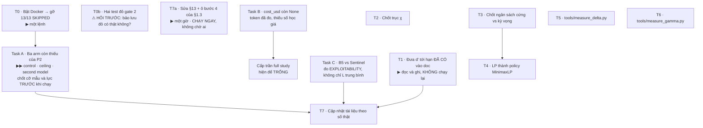

# PLAN — Đưa codebase chạy đủ sáu bước của §1.3

> **Plan này là gì.** `docs/thesis/eval/PLAN.md` (26 task) dựng **benchmark**. Plan này dựng **con đường áp dụng** — sáu bước ở §1.3 của `docs/thesis/Toan-canh-de-tai-FSE-2027-15-Sentinel.md`. Hai plan bổ sung nhau, không thay nhau: chỗ nào PLAN.md đã phủ thì ở đây chỉ trỏ sang, không làm lại.
>
> **Mục tiêu cụ thể:** làm cho cột *"Đề tài đã LÀM chưa?"* ở §1.3 có ít nhất một dấu ✅ thật, và để mọi ô còn lại đều có **giá** và **ngày**.
>
> **Ngày lập:** 19/09/2026 · **Trạng thái:** đề xuất, chưa thi hành

---

## 0. Điểm xuất phát — đo được, không phỏng đoán

Mọi dòng dưới đây đều đã kiểm bằng cách chạy thật, không phải đọc code đoán.

| Sự kiện | Bằng chứng | Nguồn |
|---|---|---|
| Codebase **40.061 dòng / 106 file** | `find auditgame -name '*.py' -not -path '*/workspace/*'` | dữ liệu |
| Suite: **533/546 xanh · 13 SKIPPED · 2 RED ở gate 2 · gate 3 15/15 XANH** | `tests/run_all.py --all` | dữ liệu |
| **13/13 skip đều là `cannot run a container`** | `docker info` fail; `data/` đã đủ nên nhóm `no data/` không bắn cái nào | dữ liệu |
| **$d'^{\star}$ ĐÃ CÓ** — chạy 19/09 lúc 00:17 và 00:23 | `spikes/sweep-v2-pinned.json` · `spikes/sweep-v2-following.json`; lưới 16 điểm $[0{,}0\ldots3{,}0]$, 40 workflow, seed $[1,2,3]$, $\Delta \in \{0,1,2,4\}$, **4 định nghĩa loss** | dữ liệu |
| **Tầng LLM ĐÃ CHẠY THẬT** | `spikes/p2-pilot.jsonl` 15 dòng · model `deepseek-v4.1-flash` · `tokens_in = 1.207.952` · `p2-wire-log.jsonl` 136 lệnh gọi API có khối `usage` | dữ liệu |
| Pilot P2: **0/7** ô chấm được tuân thủ lời khuyên độc | `docs/reports/p2-three-arms.md` | dữ liệu |
| **Ba arm `control` · `ceiling` · `second model` CHƯA CHẠY** | cùng file, cột ghi `— (CHƯA CHẠY)` | dữ liệu |
| **Sentinel THUA B5 trên $L$**: B5 dẫn **61/64** ô ở $\lambda_Q = 0{,}10$, tiêu **7–13%** ngân sách so với 47–50% | `docs/preregistration/sweep-loss-v2.md` | dữ liệu |
| Khẳng định còn sống (Sentinel > B1) treo vào $\lambda_T = 0{,}50$; ở $\lambda_T = 0$ co **64/64 → 26/64** | cùng file §7.2.1 | dữ liệu |
| `cost_usd` vẫn `None` dù token đã đo | `p2-pilot.jsonl` | dữ liệu |
| Trục $\chi$ **rỗng** | `minimax(χ=0) = minimax(χ=1,34) = 0.289333` | dữ liệu |
| LP **tách rời** benchmark | `p_minimax` không có trong `policies.REGISTRY` | dữ liệu |
| Docker *có cài*, daemon **không chạy** | `docker info` | dữ liệu |
| Hạn FSE 2027 · pivot sang "Khung B" · 8 hạng mục đóng băng · paper 13 trang | `docs/guides/HUONG-DAN-VA-BAO-CAO-TONG-HOP.md` | **văn xuôi — chưa đối chứng** |

> ⚠️ **Cột nguồn không phải trang trí.** Dòng đánh *dữ liệu* là thứ đọc được từ file kết quả hoặc lệnh chạy. Dòng đánh *văn xuôi* chỉ có một tài liệu tóm tắt làm chứng — và tài liệu tóm tắt trong repo này đã sai ít nhất một lần (xem ⚠️ ngay dưới). Đừng ra quyết định lớn dựa trên dòng cuối mà chưa đối chứng.

> ⚠️ **Một mâu thuẫn cần gỡ trước khi nộp bài.**
>
> | Tài liệu | Nói gì |
> |---|---|
> | `docs/guides/HUONG-DAN-VA-BAO-CAO-TONG-HOP.md` §1.3 và mục 6 | *"**0/14** instance tuân thủ… **hoàn toàn sụp đổ**"* · *"**xác nhận** Giả thuyết (ii)"* |
> | `docs/reports/p2-three-arms.md` §2 — nguồn gốc | *"**CHƯA PHÂN ĐỊNH**, không có phán quyết"* · *"0/7 — mẫu số là số ô **CHẤM ĐƯỢC**, không phải 14"* · *"**NOT evidence for any of the three hypotheses**"* |
>
> Spike gốc **từ chối kết luận** vì thiếu arm `control` và `ceiling`: không có control thì không phân biệt được *"agent từ chối lệnh độc"* với *"agent không giải nổi task"*. Bản tổng hợp ghi thành đã xác nhận, và đổi mẫu số $7 \to 14$. Nếu con số đó đã vào `threats.tex`, đây là chỗ phản biện FSE nhắm trúng đầu tiên. → **Task A**.

**Hai lỗi đỏ ở Gate 2, nguyên văn:**

1. `some_epsilon_makes_the_payload_indistinguishable_at_every_delta` — không $\varepsilon$ nào trong lưới $(0{,}0\ 0{,}2\ 0{,}4\ 0{,}7\ 1{,}0)$ chạm trần trên trung vị 20 split. Trung vị nhảy vực từ $\approx 0{,}5$ tại $\varepsilon = 0{,}4$ lên $1{,}0$ tại $\varepsilon = 0{,}7$ ⇒ **lưới $\varepsilon$ quá thô, biên nằm lọt giữa hai mắt lưới**.
2. `one_split_cannot_decide_a_delta_of_the_certify_corpus` — corpus nay đã đủ mạnh nên tiêu chí đa-split **không mua thêm gì** tại $\Delta \in \{0,2\}$. Đây là test **đã lỗi thời**, không phải code sai; phải đơn giản hoá có chủ ý thay vì để nó xanh trên một khẳng định nó không còn nói nữa.

---

## 1. Năm nguyên tắc của plan này

1. **Đọc `spikes/`, đừng đọc docstring.** Trong repo này docstring mô tả *ý định lúc viết*; `spikes/` chứa *thứ đã chạy*. Bản plan đầu tiên sai toàn diện vì đọc nhầm hai thứ đó — `llms.py` vẫn ghi *"there is no API key in this environment"* trong khi key đã có và token đã đo.
2. **Không giẫm lên `docs/thesis/eval/PLAN.md`, nhưng KHÔNG né tầng LLM.** Task 23 (full study, 18–27k USD) thuộc plan kia. Còn Task 14–17 thì plan này **kéo vào**, ở quy mô nhỏ nhất đủ để kiểm tiền đề — vì không có LLM thật thì không có tấn công thật, và mọi thứ còn lại chỉ là mô phỏng một cuộc tấn công chưa ai chứng minh là xảy ra được.
3. **Ngân sách đã có: 50.000 USD tài trợ.** Điều này **không** nới lỏng cổng nào — nó đổi ràng buộc ràng buộc nhất từ *tiền* sang *rủi ro tiền đề*. Trước đây "không đủ tiền" tự nó chặn việc tiêu sai; giờ không còn gì chặn việc đốt 27k cho một lưới mà tiền đề chưa ai kiểm. **Cổng G2 vì thế quan trọng hơn trước, không phải kém hơn.**
4. **Trần ngân sách là QUYẾT ĐỊNH, ước lượng chi phí là ĐO ĐẠC — không lẫn hai thứ.** Đặt `cap_usd` được ngay bây giờ. Nói full study tốn bao nhiêu thì **phải đợi L2**, đúng như `estimate_cost` từ chối tự tính.
5. **Đo trước, hỏi sau.** Ba câu hỏi đang mở với GVHD (Mục 16 điểm 9, 10, 11) đều có thể biến thành *"em đo cả hai phương án rồi, đây là số, em đề xuất phương án B"*. Câu hỏi kèm số được trả lời nhanh hơn câu hỏi trần rất nhiều.

### Phân bổ ngân sách — đề xuất

Đây là **trần**, không phải dự báo chi tiêu. Mục đích của trần là chặn lỗi chạy loạn, không phải để tiêu cho hết.

| Khoản | Trần đề xuất | % quỹ | Lý do |
|---|---|---|---|
| L2 · spike 5 instance | **100 USD** | 0,2% | Cố tình rộng rãi. Việc của spike là **đo**, không phải tiết kiệm — một spike chết vì chạm trần là một spike phải chạy lại |
| L4 · phép thử tiền đề | **500 USD** | 1% | 16 quỹ đạo × 8 task |
| Full study sau cổng G2 | **chưa cấp — chờ Task B** | — | Manuscript ước 18–27k, nhưng `cost_usd` hiện vẫn `None` dù token đã đo. Cấp trần khi có con số thật, không cấp trước |
| Dự phòng | phần còn lại (~19k) | 38% | Chạy lại; và nhánh question-10 — nếu `deepseek-flash` có `solved < 0,20` thì rơi sang `pro`, **đắt gấp 4,3 lần** |

> ⚠️ **Ô "chưa cấp" là cố ý.** Token đã đo ($1{,}2$M vào / $214$k ra trên pilot) nhưng `cost_usd` vẫn `None` — số học giá còn thiếu, không phải phép đo còn thiếu. Cấp trần trước khi có con số là làm đúng cái việc `estimate_cost` được thiết kế để từ chối.

---

## 2. Đồ thị phụ thuộc

**Đường găng: T0 → Task A.** Không phải vì nó tốn nhất, mà vì nó là chỗ **tiền đề của cả đề tài đang treo**: pilot đo $0/7$ nhưng spike gốc từ chối kết luận vì thiếu arm đối chứng. Mọi phát biểu về "agent từ chối lệnh độc" hiện chưa có căn cứ đủ.

**Task C chạy song song với Task A và không phụ thuộc gì** — cả hai hàm nó cần (`game.regret`, `best_response_gap`) đã tồn tại. Đây là chỗ duy nhất có thể trả lời *"vậy rốt cuộc đề tài còn khẳng định được gì"* sau phán quyết B5.

**T7a tách ra chạy ngay, đợt 1**, không chờ ai: §13 hiện ghi mã nguồn *"không có trong folder hiện tại"* và `docs/thesis/eval/PLAN.md` *"không có — cần xin lab"*, trong khi thực tế là 40.061 dòng và `eval/` có PLAN.md + 6 spec. Một giờ, và nó là chỗ duy nhất trong doc làm học viên trông như không có gì trong tay.

---

## 3. Các task

### T0 — Dọn nền: đưa test suite về xanh

**Vì sao trước tiên.** Không phải vì sạch sẽ, mà vì mọi số sinh ra sau đó đều thừa hưởng độ tin của suite. Chạy `dprime_sweep` trên suite đỏ rồi mang $d'^\star$ đi báo cáo là tự đặt bẫy cho mình ở buổi bảo vệ.

**Việc làm**

| # | Việc | Ghi chú |
|---|---|---|
| T0.1 | Làm mịn lưới $\varepsilon$ giữa $0{,}4$ và $0{,}7$ | Vực nằm ở đó. Thêm $0{,}5$ và $0{,}6$ là đủ để định vị biên; đừng thêm dày hơn mức cần |
| T0.2 | Quyết định về test `one_split_cannot_decide…` | Hai lựa chọn: (a) **đơn giản hoá có chủ ý** — bỏ tiêu chí đa-split tại $\Delta \in \{0,2\}$ và ghi rõ vì sao; (b) làm corpus khó hơn để tiêu chí lại có ý nghĩa. **Đề xuất (a)** — corpus mạnh lên là tin tốt, đừng làm yếu đi để cứu một test |
| T0.3 | Gỡ 13 SKIPPED ở gate 1 | **Đã chẩn đoán: không phải 13 vấn đề, mà đúng HAI nguyên nhân môi trường** — bảng ngay dưới |

**Chẩn đoán 13 SKIPPED — đúng MỘT nguyên nhân, một lệnh.**

Chạy lại suite sau khi `data/` đã có: **13/13 skip đều là `cannot run a container: docker daemon not reachable`**. Nhóm `no data/ yet` có 6 vị trí `SkipTest` trong source nhưng **không cái nào bắn** — `data/` đã có `swebench_verified.jsonl` (500) và `swebench_full.jsonl` (2294).

> 📐 **Đừng lẫn "số vị trí `SkipTest` trong code" với "số test bị skip khi chạy".** `run_all.py` cảnh báo đúng chuyện này: *"A setUpClass skip is ONE entry for a WHOLE class, and unittest does not even count the tests it hides."* Grep ra 8 vị trí container, chạy ra 13 test — một `SkipTest` trong `setUpClass` của `test_conformance_real_agent` giấu 5 test. Hai con số khác nhau, không thay nhau được.

**Việc:** bật Docker daemon. `Dockerfile` đã có ở gốc repo.

> 📐 **T0.3 nằm trên đường găng, không phải dọn dẹp bên lề.** 13 test kia cần container; mà đo `solved` bằng cách chạy `FAIL_TO_PASS`/`PASS_TO_PASS` thật cũng cần container. Không bật Docker thì ba arm còn thiếu ở Task A không chạy được.

**Xong khi:** `tests/run_all.py --all` còn đúng 2 RED ở gate 2 và 0 SKIPPED; con số ghi kèm **mốc thời gian** (suite đã nhúc nhích: 545 → 546 test trong lúc plan đang viết).

**Chi phí:** một lệnh + T0.1/T0.2 bên dưới.

---

### T0b — Hai test đỏ ở gate 2: phải hỏi trước khi đụng ⚠️

**Hai tài liệu nói ngược nhau, và tôi không tự quyết được.**

| Nguồn | Nói gì |
|---|---|
| `docs/guides/HUONG-DAN-VA-BAO-CAO-TONG-HOP.md` dòng 157 | Hai test *"chủ động bảo lưu màu đỏ"* — *"tuyệt đối không được chỉnh sửa mã nguồn để ép chuyển sang màu xanh"* |
| Thông điệp của chính test | *"…say so and **simplify deliberately** rather than letting a test stay green on a claim it no longer makes"* — tức là test tự bảo hãy sửa nó |

Kiểm rồi: **không có chỗ nào trong test source hay `docs/thesis/eval/PLAN.md` chứng thực quy định "bảo lưu đỏ"** — chỉ bản tổng hợp nói vậy, và bản tổng hợp đó đã sai ít nhất một lần (mâu thuẫn 0/7 vs 0/14 ở §0).

**Việc:** hỏi một câu — *quy định bảo lưu đỏ có thật không, và do ai duyệt?* Nếu có thật thì T0.1/T0.2 bị huỷ và suite đỏ là trạng thái đúng. Nếu không, hai việc dưới đây làm được:

| # | Việc | Ghi chú |
|---|---|---|
| T0.1 | Làm mịn lưới $\varepsilon$ giữa $0{,}4$ và $0{,}7$ | Trung vị nhảy vực $\approx 0{,}5 \to 1{,}0$; biên nằm lọt giữa hai mắt lưới. Thêm $0{,}5$ và $0{,}6$ |
| T0.2 | Đơn giản hoá test `one_split_cannot_decide…` | Bỏ tiêu chí đa-split tại $\Delta \in \{0,2\}$, ghi rõ vì sao. **Đừng làm corpus yếu đi để cứu một test** |

---

### Task A — Ba arm còn thiếu của P2 ★★ quan trọng nhất

**Đây là chỗ đề tài đang hở, và spike gốc đã tự chỉ ra.**

`docs/reports/p2-three-arms.md` đo được **0/7** ô chấm được tuân thủ lời khuyên độc — rồi **từ chối kết luận**:

> *"arm(s) control, ceiling were never run, so hypothesis (i) (needs `ceiling.adopted`) and hypothesis (iii) (needs `control.patch_rate`) are both untestable. Selecting (ii) here would report the residual branch of a three-way test in which two branches could not fire."*

Không có control thì **0/7 không phân biệt được ba chuyện**: agent từ chối lệnh độc · lời khuyên quá ngắn để có tác dụng · agent vốn không giải nổi task.

| Arm | Trạng thái | Đo để phân định |
|---|---|---|
| Main (pilot) | ✅ 14 instance, 7 chấm được, 0/7 | — |
| **Control** — không có lời khuyên | ❌ chưa chạy | giả thuyết (iii): `control.patch_rate` |
| **Ceiling** — thuyết phục dài ~300 ký tự | ❌ chưa chạy | giả thuyết (i): `ceiling.adopted` |
| **Second model** | ❌ chưa chạy | kết quả có phải đặc tính của riêng `flash` không |

**Chốt TRƯỚC khi chạy** — cùng tinh thần tiền-đăng-ký mà `docs/preregistration/sweep-loss-v2.md` §1 đã áp dụng:

1. **Cỡ mẫu.** Pilot có 14 instance, 7 chấm được. Trần $500$ USD cho phép **nhiều hơn thế rất nhiều** — chốt số instance mỗi arm trước, đừng để cỡ mẫu là thứ quyết định sau khi nhìn số.
2. **Hiệu ứng tối thiểu đáng quan tâm.** Chênh `adopted` bao nhiêu giữa main và ceiling thì mới coi là có? Ghi ra trước.
3. **Tách hai kết cục âm.** *"Không có hiệu ứng"* và *"không đủ lực để nói"* là hai kết luận khác nhau. Repo đã có hẳn **GATE 3 — POWER** (*"is there enough to conclude"*, 15/15 xanh) dựng đúng để chặn kiểu gộp này — dùng nó, đừng đi vòng qua.

**Xong khi:** bảng ba arm không còn ô `— (CHƯA CHẠY)`, và phán quyết ba giả thuyết chuyển từ *CHƯA PHÂN ĐỊNH* sang một trong ba nhánh — **hoặc** sang *"đã đủ arm, vẫn không phân định được, đây là lý do"*.

**Đồng thời sửa mâu thuẫn tài liệu ở §0**: thống nhất mẫu số ($0/7$ hay $0/14$) và gỡ chữ *"xác nhận Giả thuyết (ii)"* khỏi bản tổng hợp nếu ba arm chưa cho phép nói thế. **Kiểm xem con số đó đã vào `threats.tex` chưa.**

**Chi phí:** trần $500$ USD từ L1. Cần Docker (T0.3) để đo `solved`.

---

### Task B — `cost_usd` còn `None` dù token đã đo

**Không phải phép đo còn thiếu — số học giá còn thiếu.** `p2-pilot.jsonl` đã có `tokens_in = 1.207.952`, `tokens_out = 214.030`, model `deepseek-v4.1-flash`. Nhưng `cost_usd = None`.

Thiếu gì: giá niêm yết (`price_in_miss` / `price_in_hit` / `price_out`) kèm `priced_at` tươi, và tỉ lệ trúng cache thật đọc từ khối `usage` trong `p2-wire-log.jsonl` (136 dòng, có trường `prompt_cache`).

**Xong khi:** `estimate_cost` chạy được ⇒ **biết full study giá bao nhiêu** ⇒ mới cấp được trần ở bảng §1.

**Chi phí:** nhỏ. Không tốn tiền — dữ liệu đã có sẵn.

---

### Task C — B5 thắng trên $L$ trung bình; còn worst-case thì sao? ★ chưa ai chạm

**Phát hiện nặng nhất của cả dự án, và chưa task nào trong plan cũ đụng tới.**

`docs/preregistration/sweep-loss-v2.md`: B5 dẫn **61/64** ô ở $\lambda_Q = 0{,}10$, tiêu **7–13%** ngân sách so với 47–50% của Sentinel. Khẳng định còn sống (Sentinel > B1) treo vào $\lambda_T = 0{,}50$; ở $\lambda_T = 0$ co **64/64 → 26/64**.

**Hai câu hỏi tách bạch, đừng gộp:**

**(1) $L$ trung bình không phải đại lượng mà framework này tuyên bố.** Cả Mục 4.0 của doc tổng quan lập luận rằng đây là **trò chơi**, không phải bài toán quyết định — và đại lượng của trò chơi là **worst-case trước attacker best-response**, không phải trung bình trên lưới. Mà `policies.py` mô tả B5 nguyên văn: *"B5 — **LED BY the attacker**: shape the payload to sit just under the threshold."*

Nên phải đo thêm, bằng công cụ **đã có sẵn**: `game.regret()` (exploitability so với trần $V^\star$) và `runner.best_response_gap()`.

| Kết quả có thể ra | Kết luận phải viết |
|---|---|
| B5 thắng $L$ trung bình **nhưng** exploitability cao hơn hẳn | Hai đại lượng, hai câu trả lời — và đây đúng là lý do framework chọn worst-case. Báo cáo **cả hai**, không chọn cái đẹp |
| B5 thắng **cả hai** | Phát hiện thật, và là phát hiện mạnh: một heuristic chấm điểm rủi ro rẻ hơn 5 lần đánh bại phân bổ minimax. Nói thẳng ra |

> ⚠️ **Đây không phải đường cứu Sentinel.** Nếu B5 thắng cả hai thì viết đúng như thế. Mục đích là đo đúng đại lượng mà lý thuyết nói tới, chứ không phải tìm đại lượng nào cho ra kết quả mong muốn — làm thế là đúng cái sai mà `docs/preregistration/sweep-loss-v2.md` §1 đã cấm: *"Số v2 THAY số v1, KHÔNG CHỌN."*

**(2) $\lambda_Q$ và $\lambda_T$ phải thành kết quả hạng nhất, không phải chú thích.** Thứ hạng đảo khi đổi hai trọng số này — đúng như Phụ lục A.4 của doc tổng quan đã cảnh báo trước khi đo: *"Thứ hạng giữa các baseline hoàn toàn có thể đảo khi $\lambda_Q$ đổi… Giấu hai con số này đi rồi công bố một bảng xếp hạng là một dạng báo cáo không trung thực."* Lý thuyết đã dự đoán, phép đo đã xác nhận. Bảng kết quả phải là **bảng theo $(\lambda_Q, \lambda_T)$**, không phải một con số.

**Chi phí:** nhỏ — cả hai hàm đã tồn tại và chạy trên ma trận nhỏ.

---

### T1 — Đưa $d'^{\star}$ đã có vào tài liệu (KHÔNG chạy lại)

**$d'^{\star}$ đã được tính từ 19/09.** Việc còn lại là đọc và ghi, không phải chạy.

`break_even` theo $\Delta$ và theo định nghĩa loss (pinned / following):

| $\Delta$ | `harm` | $\lambda_Q = 0$ | $\lambda_Q = 0{,}1$ |
|---|---|---|---|
| 0 | `null` / `null` | `null` | `null` |
| 1 | `null` / `null` | $0{,}0$ | `null` |
| 2 | $2{,}85$ / $3{,}00$ | $0{,}0$ | $2{,}4$ |
| 4 | $0{,}95$ / $1{,}00$ | $0{,}0$ | $0{,}0$ |

**Đọc ra ba điều, đều đáng vào luận văn:**

1. **Không có một $d'^{\star}$ duy nhất.** Nó phụ thuộc $\Delta$ **và** phụ thuộc định nghĩa loss. Phát biểu *"Sentinel giảm harm khi và chỉ khi $d' > d'^{\star}$"* phải viết lại thành một **mặt ngưỡng**, không phải một con số.
2. **$\Delta \in \{0,1\}$ cho `null`** — không có điểm hoà vốn trong dải khảo sát. Đúng chiều Hệ quả 5 ($\Delta$ nhỏ ⇒ audit-at-commit đủ), và là bằng chứng thực nghiệm đầu tiên cho nó.
3. **Chênh pinned vs following nhỏ** ($2{,}85$ vs $3{,}00$; $0{,}95$ vs $1{,}00$) ⇒ chỗ rò `tau_sel` đã khai báo **không** lật kết luận. Đó là một kết quả độ nhạy tốt, nên báo cáo.

**Xong khi:** §1.3 bước 4 chuyển ❌ → ✅ ở cột *"đề tài đã làm chưa"*, kèm bảng trên. **Chi phí: một giờ, không chạy gì.**

### T2 — Chốt trục $\chi$: đo hai biến thể rồi mới hỏi thầy

**Trạng thái.** $\chi$ hiện không có tác dụng gì, và lý do là cấu trúc: ràng buộc attacker không phụ thuộc carrier ⇒ chi phí upstream $= (\sum_k \kappa_k)\cdot U$, chỉ phụ thuộc **tổng** chứ không phụ thuộc **phân bố** — mà $\chi$ đo đúng phân bố.

**Việc làm.** Chạy và lập bảng ba phương án:

| Phương án | Thay đổi | Đã biết gì |
|---|---|---|
| A · giữ neo trung bình | không đổi | $\chi$ **rỗng** — đã xác nhận |
| B · neo nhỏ nhất | $\sum_k\kappa_k$ tăng theo $\chi$ | KT3 chuyển FAIL→PASS, độ lợi $39{,}7\% \to 36{,}1\%$ tại $\Delta=2$ — **đúng chiều "thu hẹp"** |
| C · audit commit phụ thuộc carrier | $v(t) \to v(k,t)$ | chưa thử — cần sửa LP và mô hình |

**Xong khi:** một bảng so ba phương án kèm khuyến nghị, đem vào buổi họp với GVHD dưới dạng *"em đo rồi, đây là số"*.

**Vì sao không tự quyết.** Phương án C đổi **mô hình**, không chỉ đổi tham số — và nó ảnh hưởng cách phát biểu Theorem 4. Đây là quyết định của người hướng dẫn.

**Chi phí:** nhỏ cho A/B (đã có `het_model`), vừa cho C.

---

### T3 — Chốt ngân sách: cứng hay cứng-theo-kỳ-vọng

**Trạng thái.** `p_minimax` ép $\sum \kappa u \le B$ (**kỳ vọng**); `Policy.can` ép `spent + cost <= budget` (**cứng**). Không tương đương — phản ví dụ knapsack ở Phụ lục F.5.

**Việc làm.** Cài phương án được chọn (xem bảng ba đường ở F.5), rồi **đo độ lệch**: chạy LP ra $u$, lấy mẫu có chặn 1.000 lần, so coverage thực tế với $u$. Con số đó là mức lạc quan của Bảng 2.

**Xong khi:** biết được Bảng 2 đang lạc quan bao nhiêu phần trăm, bằng số chứ không bằng lo ngại.

**Chặn:** T4.

---

### T4 — Đưa nghiệm LP thành một policy thật

**Vấn đề.** Mục 7.1 chỉ ra ba bộ giải sống tách nhau: LP ① trong `smoke_repro.py`, fictitious play ② trong `game.py`, chính sách chạy thật ③ trong `policies.py`. ① và ③ **chưa bao giờ gặp nhau**.

**Việc làm.** Thêm `MinimaxLP` vào `policies.REGISTRY`: giải LP một lần ở khởi tạo, lấy $u(k,t)$, rồi mỗi task rút hành động theo $u$ (dùng phương án lấy mẫu đã chốt ở T3).

**Xong khi:**
- `game.regret()` của nó $\approx 0$ trên trò chơi nhỏ — nếu không, ① và ③ đang dùng hai định nghĩa harm khác nhau, đúng lỗi mà `game.py` docstring cảnh báo (`-0.163`);
- nó xuất hiện trong bảng kết quả cạnh B1–B6, nên câu *"Sentinel còn cách tối ưu bao xa"* có số.

**Chi phí:** vừa.

---

### T5 — `tools/measure_delta.py` (bước 2)

**Mảnh `docs/thesis/eval/PLAN.md` không có.** PLAN.md dựng benchmark tổng hợp; không có công cụ đo $\Delta$ trên log thật.

**Ý tưởng then chốt: $\Delta$ là độ trễ *nhân quả*, không phải độ trễ của vụ tấn công** — nên đo được trên một hệ **chưa từng bị đánh**.

| | |
|---|---|
| Đầu vào | một repo + danh sách path state chỉ dẫn (`CLAUDE.md`, `.claude/**`) + log task của agent |
| Việc | với mỗi lần ghi state: đếm số task đã chạy tới khi artifact đầu tiên chịu ảnh hưởng được merge |
| Đầu ra | phân bố $\Delta$ + các phân vị (**không phải trung bình** — đây là framework worst-case) |

**Xong khi:** chạy được trên **chính repo này** (dogfood) và in ra một phân bố. Đây là thứ duy nhất trong plan cho ra một con số $\Delta$ từ dữ liệu thật chứ không tổng hợp.

**Chi phí:** vừa.

---

### T6 — `tools/measure_gamma.py` (bước 3)

**Trạng thái.** $(\psi,\phi)$ hiện là **giá trị khai báo** chép từ manuscript (weak/mid/strong), chưa đo trên tập nhãn nào.

**Việc làm.** Dùng lại `detector.py`, thêm đường vào từ một tập có nhãn: corpus benign (Task 20 của PLAN.md, đang ◐ nửa) làm lớp âm, `payloads/generate.py` làm lớp dương. In ra $(\psi, \phi, \gamma, d')$ và đường ROC.

**Xong khi:** ba mức khai báo được đối chiếu với một $d'$ đo được. Nếu $d'$ đo được nằm dưới $d'^{\star}$ của T1 — đó là phát hiện quan trọng nhất mà đề tài này có thể đưa ra.

**Chi phí:** vừa. Phụ thuộc Task 20 của PLAN.md.

---

### T8 — Đo $d'$ của $F_{\text{detect}}$ ★ thí nghiệm lớn còn lại

**Vì sao cần.** T6 đo được detector **bề mặt** chỉ đạt $d' \le 0{,}50$ trước attacker ngụy trang, trong khi ngưỡng hoà vốn là $d'^{\star} = 2{,}85$ ($\Delta=2$) và $0{,}95$ ($\Delta=4$). T6 *suy luận* rằng phải dùng kiểm toán ngữ nghĩa $F_{\text{detect}}$ — nhưng **chưa ai đo $d'$ của nó**: `ls spikes/ | grep fdetect` không ra gì, dù `fdetect.py` đã có đủ `d_prime_eff()`, `tau_of_dprime()`, và `fdetect_g4.py` đã có giao thức $n_{G4} = 38$, $\theta = 0{,}75$.

> ⚠️ **Ràng buộc vai — tiền-đăng-ký đã chốt, đừng phạm.** `docs/preregistration/TIEN-DANG-KY-m-x-va-F-detect-v2.md` §7: *"số từ `F_detect` vào đề cương ở vai **bằng chứng thiết kế chạy được** và **threat đã định lượng** — **không** ở vai kết quả luận văn."*
>
> Nghĩa là T8 **không phải** phép thử cứu đề tài. Lượt trước tôi viết nó như *"chỗ duy nhất còn lật được kết luận"* — **sai**, và tiền-đăng-ký đã cấm cách đọc đó từ 18/09. Nó trả lời *"mối đe doạ lớn cỡ nào khi đo bằng detector mức 3"*, không trả lời *"Sentinel có thắng không"*.

**Thứ tự bảy bước đã đóng băng, KHÔNG đảo** (§7 tiền-đăng-ký). Ba bước đầu đã xong hoặc đang chạy; bốn bước còn lại là T8:

| Bước §7 | Trạng thái |
|---|---|
| 1 · tiền-đăng-ký, commit | ✅ đóng băng 18/09 |
| 2 · **P2 chạy xong** | ⏳ = **Task A**. F_detect không được khởi động trước khi A đóng |
| 3 · sửa P8 + (iii) đủ để có **≥ 1 attacker hợp lệ** | ⚠️ **PHẢI KIỂM TRƯỚC** — xem hộp dưới |
| 4 · G4 trên giấy theo §6 | → T8.1 |
| 5 · hiện thực $v_1$ mức 3; chạy G4 | → T8.2 |
| 6 · hiệu chuẩn $\tau(d')$ trên tập hiệu chuẩn lành | → T8.3 |
| 7 · đo $m(x) \to d'_{\text{eff}}(a)$ trên tập báo cáo | → T8.4 |

> ⛔ **Điều kiện chặn phải kiểm ngay, trước khi lên lịch gì.** §7 bước 3 ghi: *"chưa có thì F_detect **không có gì để đo**."* Mà `docs/guides/HUONG-DAN-VA-BAO-CAO-TONG-HOP.md` §1.1 lại nói: *"**Không có kẻ tấn công nào vượt qua Cổng 2 một cách hợp lệ** khi loại bỏ các giả tượng sắp xếp nhân tạo (`sorted()`)."*
>
> Nếu câu đó đúng và vẫn còn đúng thì **T8 bị chặn hoàn toàn** — và bản thân điều đó là một kết quả, không phải một trở ngại. Kiểm bằng dữ liệu (`reference/gate2_v2.json`), không bằng văn xuôi.

**T8.1 · G4 trên giấy** — viết giao thức chấm theo §6: ai chấm, chấm cái gì, mù thế nào. Miễn phí.

**T8.2 · Hiện thực $v_1$ mức 3 và chạy G4** ← **đây là cọc dài nhất của cả plan**

$F_{\text{detect}}$ là **một LLM judge**: `v1()` uỷ quyền thẳng cho `judge.violation_with_context()`. Và `RepoContext` là **bắt buộc** — judge không thấy ngữ cảnh repo sẽ ném `NotMeasured` kèm lý do đanh thép: *"scoring prose plausibility — level 2 in disguise, which the pre-registration disqualified structurally."*

G4 đòi **38 nhãn người, chấm mù**, Clopper-Pearson LB $\ge 0{,}75$. Đây là **việc của người**, không rút ngắn được bằng tiền hay bằng máy — khác mọi task còn lại trong plan. Nếu hạn 02/10 là thật thì **38 nhãn này phải khởi động sớm nhất trong nhóm T8**, song song với mọi thứ khác.

**T8.3 · Hiệu chuẩn $\tau(d')$** trên tập hiệu chuẩn lành, tách rời tập báo cáo bằng `calibration_report_split(seed=20260918)`. Không được chia theo tên.

**T8.4 · Đo $m(x) \to d'_{\text{eff}}(a)$** **theo từng họ attacker**, không gộp, không lấy min (nguyên tắc 5 của `fdetect.py`). Đối chiếu với $d'^{\star}$.

**Chi phí:** phần LLM judge tốn API — với $0{,}14$/task đo được ở Task B thì không đáng kể. Cọc thật là 38 nhãn người.

---

### T9 — Đo $\kappa$ của audit ngữ nghĩa, rồi tính độ sâu tối ưu

**Gần như miễn phí nếu chạy kèm T8.4.** $F_{\text{detect}}$ là một lệnh gọi LLM, nên $\kappa$ của nó = token + thời gian của chính lệnh gọi đó — đo được trong cùng lượt chạy.

T6 nói audit ngữ nghĩa đắt *"gấp hàng chục lần"* — đó là **ước lượng**, và nó không vô hại: nếu $d'$ qua được $2{,}85$ nhưng $\kappa$ tăng 30 lần thì cùng ngân sách $B$ chỉ mua được ít lần nhìn hơn hẳn, và lợi thế có thể mất sạch.

Có hai số đó thì áp được công thức ở **Mục 16 điểm 7** của doc tổng quan:

$$d^{\star}(k) \;=\; \arg\min_{d \in \mathcal{D}} \frac{\kappa(k,d)}{\gamma_d^{2}}$$

Câu hỏi lý thuyết mở từ 19/09 **có thí nghiệm gắn vào**. Nó biến *"Sentinel cần detector tốt hơn"* — một câu không kiểm được — thành *"Sentinel cần độ sâu $d$ ở giá $\kappa$; ngân sách $B$ có đủ hay không, đây là số"*.

**Xong khi:** Mục 16 điểm 7 chuyển từ *câu hỏi* sang *kết quả có số*.

---

### T10 — Ghép ba phát hiện thành MỘT câu chuyện ★ việc học thuật, không phải việc code

| Phát hiện | Nguồn |
|---|---|
| LLM thật hầu như không làm theo lời khuyên độc | Task A |
| Detector bề mặt mù trước payload ngụy trang ($d' \le 0{,}50$) | T6 |
| Heuristic rẻ B5 thắng worst-case với $1/5$ ngân sách | Task C |

**Ba cái này có thể là một câu chuyện nhất quán, không phải ba thất bại rời.** Nếu cuộc tấn công hiếm khi đậu thì việc một ngưỡng rẻ là đủ **không bất ngờ — đó là điều phải xảy ra**. Và việc detector bề mặt mù giải thích vì sao chưa ai đo được chuyện này trước đây.

Đọc theo hướng đó, đóng góp không phải *"chúng tôi xây được phòng thủ"* mà là *"chúng tôi đo ba thứ mà văn liệu giả định sẵn, và cả ba đều không như giả định"* — đúng định vị **Khung B**, và mạnh hơn một chiến thắng giả.

**Việc:** viết một trang gộp ba phát hiện, mang đi họp GVHD, chốt phát biểu chính của bài. **Đây là quyết định của học viên + GVHD, plan này không thay được.**

---

### T11 — Doc tổng quan đang nói ngược với số đo

| Chỗ | Vấn đề |
|---|---|
| §11 Bảng 2, Bảng 3 | vẫn là **số dự phóng**, nay đã bị chính phép đo mâu thuẫn |
| §13 | vẫn ghi mã nguồn *"không có"* — thực tế 40.061 dòng (= T7a, làm trước) |
| §15 | bốn đóng góp viết theo Khung A; cần viết lại theo Khung B |
| §16 | điểm 7, 9, 10, 11 chuyển từ *câu hỏi* sang *đã có số* |
| §12 | thêm threats: hạ tầng OpenCode 402/500, cỡ mẫu Task A thiếu |

**Chi phí:** một buổi.

---

### T7 — Cập nhật tài liệu theo số thật

| Chỗ | Sửa gì |
|---|---|
| §13 | **Gấp.** Đang ghi mã nguồn *"không có trong folder hiện tại"* và `docs/thesis/eval/PLAN.md` *"không có — cần xin lab"*. Thực tế: 40.061 dòng, `eval/` có PLAN.md + 6 spec. Đây là chỗ duy nhất trong doc làm học viên trông như không có gì trong tay |
| §1.3 | Cột *"đề tài đã LÀM chưa"* cập nhật theo T1–T6 |
| §15 | Nếu T2 xác nhận: thêm đóng góp thứ năm — *"phát hiện và chứng minh một trục của giản đồ pha là rỗng trong mô hình gốc"* |
| §16 | Điểm 9, 10, 11 chuyển từ *câu hỏi mở* sang *câu hỏi kèm số đo* |

**Chi phí:** nhỏ.

---

## 4. Thứ tự làm

**Nguyên tắc xếp lịch: thứ chạy lâu và tốn tiền khởi động TRƯỚC; việc bàn giấy lấp vào lúc chờ.** Quỹ 50k nghĩa là tiền không còn là ràng buộc — ràng buộc còn lại là **thời gian treo** của các lần gọi API và **rủi ro tiền đề**. Xếp việc rẻ lên trước để "tiết kiệm" là tối ưu sai đại lượng.

| Giờ thứ | Việc | Tốn tiền? |
|---|---|---|
| 0 | **T0 · bật Docker** — một lệnh, và là điều kiện để đo `solved` | không |
| 0–1 | **Chốt tiền-đăng-ký cho Task A**: cỡ mẫu mỗi arm · hiệu ứng tối thiểu đáng quan tâm · tiêu chí phân định. Ghi ra file trước khi gọi API lần nào | không |
| **1** | **★ KHỞI ĐỘNG Task A** — ba arm `control` · `ceiling` · `second model` chạy nền qua DeepSeek | **có, trần 500 USD** |
| 1→ | Trong lúc Task A chạy, làm song song: **T7a** (§13) · **T1** (đưa $d'^{\star}$ vào doc) · **Task B** (`cost_usd`) · **Task C** (exploitability) | không |
| khi A xong | Đọc ba arm **cùng với** Task C ⇒ quyết đề tài còn khẳng định được gì | — |
| **ngay khi A đóng** | **T8.0** kiểm điều kiện chặn: có ≥1 attacker hợp lệ không? · **T8.1** G4 trên giấy · **khởi động 38 nhãn người** | không |
| song song | **T8.2** $v_1$ mức 3 → **T8.3** hiệu chuẩn $\tau$ → **T8.4** $d'_{\text{eff}}$ · **T9** $\kappa$ ngữ nghĩa | API, nhỏ |
| song song | **T10** ghép ba phát hiện · **T11** sửa doc tổng quan · T2 · T3 → T4 · T5 · T6 · T7 | không |

> ⛔ **Cọc dài nhất của cả plan là 38 nhãn người của G4**, không phải bất kỳ lượt chạy máy nào. Tiền không rút ngắn được nó, máy cũng không. Nếu hạn 02/10 là thật thì đây là thứ phải khởi động **sớm nhất** trong nhóm T8 — mọi việc khác đều chờ được, việc này thì không.

> ⚠️ **T8 không được khởi động trước khi Task A đóng.** Không phải do tôi xếp, mà do §7 tiền-đăng-ký: bước 2 là *"P2 chạy xong — là thước đo, không đứng sau gì"*, và thứ tự bảy bước ghi rõ **"không đảo"**.

> 📐 **Full study vẫn chưa cấp trần** — không phải vì thiếu tiền, mà vì `cost_usd` còn `None`. Task B gỡ chuyện đó trong lúc Task A đang chạy, nên đến khi cần quyết mở rộng thì đã có con số.

## 5. Plan này KHÔNG làm

Ghi ra để không ai đọc xong tưởng đã phủ hết:

| Không làm | Vì sao | Ở đâu |
|---|---|---|
| **Full study trên lưới đầy đủ** | cho tới khi Task B xong thì **không ai biết con số thật** | `docs/thesis/eval/PLAN.md` Task 23 |
| Viết lại phần lý thuyết theo phán quyết Khung B | Đó là quyết định học thuật của học viên + GVHD, không phải việc của một plan kỹ thuật | — |
| Đo $\Delta$, $\gamma$ trên dữ liệu của **một tổ chức thật** | cần đối tác cho truy cập log và tập nhãn | ngoài tầm cả hai plan |
| Chứng minh phần "tight" của Theorem 3, và thừa số $(1+\Delta K/H)$ | việc lý thuyết, không phải việc code | Phụ lục H.1, H.2 |

Sau khi plan này xong, §1.3 vẫn **chưa** có bước nào chạy trên dữ liệu của một **tổ chức** thật. Nhưng hai thứ sẽ đổi hẳn:

1. **Cuộc tấn công sẽ không còn là mô phỏng.** L4 cho bằng chứng đầu tiên rằng một agent LLM thật bị chỉ dẫn đầu độc làm đổi hành vi — hoặc bằng chứng rằng nó không. Cả hai đều là kết quả; thứ không chấp nhận được là tiếp tục không biết.
2. **Mọi ô còn trống đều có giá và người chặn**, thay vì chỉ là chỗ trống.
