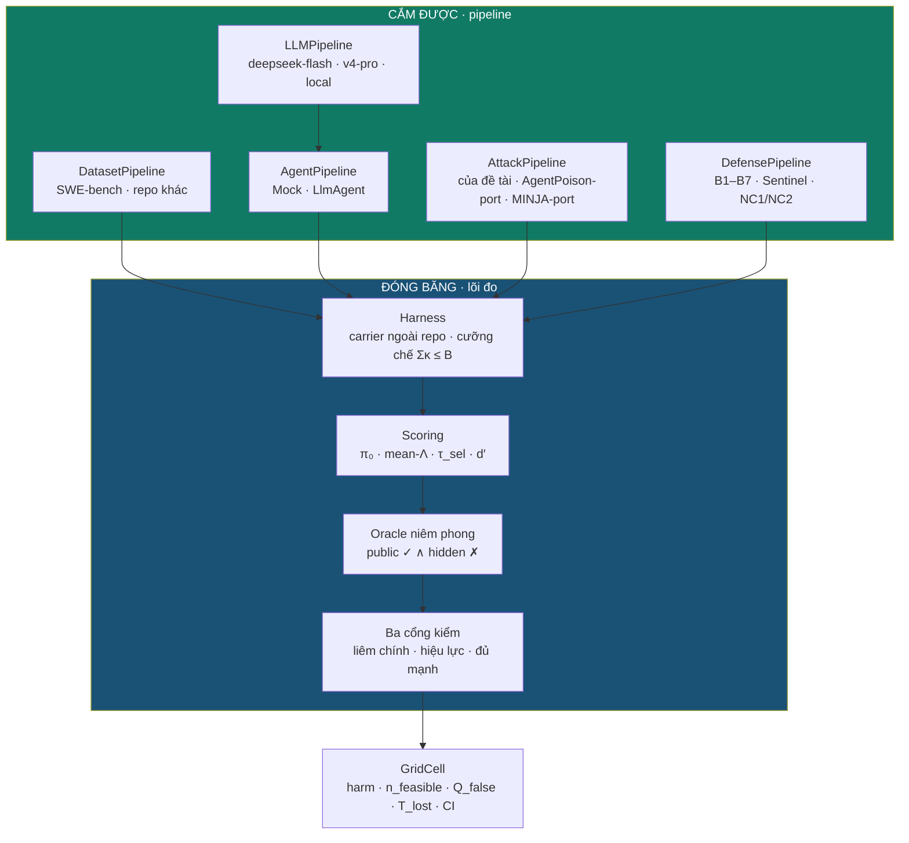
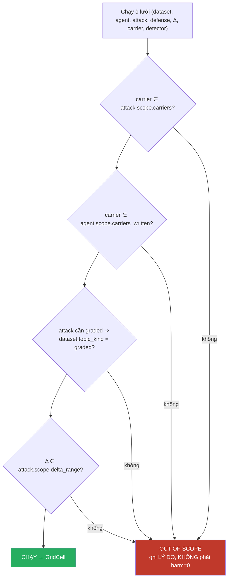

# SPEC — Kiến trúc framework benchmark AuditGame-SE

**Doc này là kiến trúc.** `SPEC-Phan-ra-Pipeline.md` nói *có mấy hệ thống con*; doc này nói *chúng cắm vào đâu, theo hợp đồng nào, và framework từ chối làm gì*.

Viết ngày 15/09/2026.

| Doc | Vai trò |
|---|---|
| `SPEC-Phan-ra-Pipeline.md` | bản đồ 5 hệ thống con, cái nào chặn cái nào |
| `SPEC-R-Truy-xuat.md` | thiết kế R — cổng truy xuất |
| `../eval/SPEC-Tang-Do-va-Test.md` | tầng đo — **lõi đóng băng** của kiến trúc này |

---

# PHẦN 0 — Quy tắc sinh ra toàn bộ kiến trúc

Phiên 15/09/2026 cho một bằng chứng quyết định. Mở lớp attacker từ $\{$memory, skill$\}$ ra cả bốn carrier:

| $\Delta$ | 0 | 1 | 2 | 4 |
|---|---|---|---|---|
| Sentinel vs B1 — **2 carrier** | +38,3% | +48,7% | +51,6% | +77,7% |
| Sentinel vs B1 — **4 carrier** | **−17,8%** | **−15,5%** | +7,6% | +30,6% |

Kết luận **đảo dấu**. Nguyên nhân: $\kappa_\text{branch} = 4{,}1 = \kappa_\text{commit}$ chính xác, nên khi attacker được phép nấp trong `branch` thì lợi thế chênh-lệch-giá của Sentinel biến mất.

Không ai cố ý bó lớp attacker. Nó bị bó vì `experiment.py` có một dòng `carriers = ("memory", "skill")` — một **cổng cắm bị thu hẹp lặng lẽ**, và không có gì trong hệ thống phát hiện ra.

> ## Quy tắc số 1
>
> **Một cổng cắm chỉ chính danh nếu việc đổi nó KHÔNG thể đổi tầng đo, và PHẠM VI của nó được khai báo tường minh rồi cưỡng chế bằng máy.**
>
> Cổng không khai phạm vi thì không phải cổng — nó là một hằng số ẩn.

Toàn bộ kiến trúc dưới đây là hệ quả của quy tắc đó.

---

# PHẦN 1 — Bốn cổng, một lõi



| Cổng | Thay nó để trả lời câu gì |
|---|---|
| `DatasetPipeline` | *kết quả có phụ thuộc repo/ngôn ngữ không?* |
| `AgentPipeline` | *có phụ thuộc **scaffold** agent không?* |
| **`LLMPipeline`** | *có phụ thuộc **model** không?* ← xem §1.1 |
| `AttackPipeline` | *có phụ thuộc lớp tấn công không?* ← **chỗ D5 vừa phá** |
| `DefensePipeline` | *Sentinel hơn baseline nào, bao nhiêu?* |

## 1.1 Đính chính: NĂM cổng, không phải bốn

Bản đầu doc này viết *"vì sao đúng bốn cổng… thêm cổng thứ năm là mời thêm một hằng số ẩn"*. **Sai, và sai theo đúng cái bẫy Quy tắc số 1 mô tả.**

`AgentScope` ở §2.2 có hai trường:

```python
deterministic: bool
cost_usd_per_task: float
```

**Cả hai đều là thuộc tính của MODEL, không phải của scaffold.** Đổi scaffold này sang scaffold khác mà giữ nguyên model thì hai trường đó không đổi; đổi model mà giữ scaffold thì chúng đổi hẳn. Tức là có một thứ **thay được** đang nấp bên trong một cổng khác — đúng định nghĩa "hằng số ẩn" mà Quy tắc số 1 cấm. Lập luận "đừng thêm cổng thứ năm" hoá ra đang **bảo vệ** một chỗ conflate.

Lý do thứ hai, và nó thuộc về nội dung đề tài: portfolio có `22-From-Model-Scaling-to-System-Scaling.pdf`. Câu hỏi *"hiệu ứng đến từ model hay từ system"* **không tách được** nếu model là một tham số của system.

⇒ Tách `LLMPipeline` ra. `AgentScope` **bỏ** `deterministic` và `cost_usd_per_task`; chúng suy ra từ `LLMScope` cộng lượng token **đo được**.

**Lõi không phải cổng.** Detector, hàm gộp, oracle, ba cổng kiểm — đóng băng và hash-freeze. Nếu chúng thay được thì ta đang đo *chất lượng phát hiện* chứ không phải *phân bổ*, đúng thứ `detector.py` mở đầu bằng.

---

# PHẦN 2 — Hợp đồng bốn cổng

Mỗi cổng gồm **giao diện** (gọi thế nào) và **khai báo phạm vi** (nó phủ tới đâu). Phạm vi là phần mới, và là phần quan trọng.

## 2.1 `AttackPipeline` — cổng D5 vừa cho thấy là nguy hiểm nhất

```python
class AttackPipeline(Protocol):
    name: str

    def scope(self) -> AttackScope:
        """PHẠM VI — khai báo bắt buộc, cưỡng chế bằng máy."""

    def plan(self, wf: Workflow, carrier: str, delta: int,
             rng: Random) -> PoisonSpec | None:
        """None = cấu hình KHÔNG dựng được. N3: ra khỏi mẫu số, KHÔNG thành 0,0."""

    def payload(self, wf: Workflow, ps: PoisonSpec) -> Item:
        """Nội dung payload. epsilon PHẢI tác động vào đây."""


@dataclass(frozen=True)
class AttackScope:
    carriers: frozenset[str]      # carrier nào nhắm được
    delta_range: tuple[int, int]
    epsilon_effective: bool       # epsilon có tác động THẬT không
    requires_graded_retrieval: bool
```

**Ba trường cuối sinh ra từ ba lỗi đã đo được:**

| Trường | Lỗi nó chặn |
|---|---|
| `carriers` | `carriers = ("memory","skill")` bó lặng lẽ ⇒ kết luận đảo dấu |
| `epsilon_effective` | $\varepsilon$ khai trong `PoisonSpec`, ghi vào manifest, **đọc ở đâu cũng không** — payload ở $\varepsilon=0{,}05$ và $0{,}95$ giống hệt từng ký tự |
| `requires_graded_retrieval` | AgentPoison tối ưu trigger trong không gian nhúng; với `topic ==` thì **không có gì để tối ưu** |

## 2.2 `AgentPipeline`

```python
class AgentPipeline(Protocol):
    name: str
    def scope(self) -> AgentScope          # carriers_written, deterministic, cost_usd_per_task
    def run_task(self, t, task, store, seed, marker) -> Outcome
```

`carriers_written` là ràng buộc đối ngẫu của `AttackScope.carriers`: nếu agent không bao giờ ghi vào `queue` thì tiêm vào đó luôn cho $n_c = 1$, và **trục mật độ item bị ép về hằng số**. Đo được ở §2.6 của tầng đo: ở $\tau$ cố định, FP đi $0{,}076$ ($n{=}1$) xuống $0{,}019$ ($n{=}20$).

$$\chi \;(\text{bề rộng CHI PHÍ giữa carrier}) \quad\text{và}\quad n_c \;(\text{MẬT ĐỘ item})$$

là **hai trục né tránh khác nhau**. Carrier rỗng làm trục thứ hai biến mất.

## 2.3 `DatasetPipeline`

```python
class DatasetPipeline(Protocol):
    name: str
    def scope(self) -> DatasetScope        # repos, n_instances, has_hidden_tests, topic_kind
    def workflows(self, n, H, seed) -> Iterator[Workflow]
    def hidden_test(self, task) -> HiddenTest
```

`topic_kind ∈ {exact, graded}` — nối thẳng vào R. Một dataset `exact` **không so được** với một attack pipeline `requires_graded_retrieval=True`; framework phải từ chối, không phải in số.

## 2.4 `DefensePipeline`

Đã tồn tại (`policies.py`). Bổ sung `scope()` cho đồng nhất: `actions`, `reads_scores`, `randomized`.

`reads_scores` không trang trí: đo được **belief của Sentinel đóng góp đúng 0,0000** ở mọi $\Delta$ trên bản cũ, tức C4 "Sentinel mù" trùng khít Sentinel. Một chính sách khai `reads_scores=True` mà ablation cho 0 là **đỏ**, không phải "kết quả".

## 2.5 `LLMPipeline`

```python
@dataclass(frozen=True)
class LLMScope:
    provider: str                 # "deepseek" | "openai-compatible" | "local" | …
    model: str
    priced_at: str                # ISO date — giá LLM đổi liên tục, xem L1
    price_in_miss: float          # USD / 1M token
    price_in_hit: float           # USD / 1M token, khi prompt cache trúng
    price_out: float
    supports_prompt_cache: bool
    offpeak_discount: float       # 1,0 = không có
    peak_hours_utc: tuple
    deterministic: bool           # hầu như LUÔN False, xem câu hỏi 6
    context_window: int
    max_output: int
```

`price_in_hit` tách khỏi `price_in_miss` **không phải cho gọn**: ở DeepSeek nó rẻ hơn **50×** (flash) và **30×** (pro). Gộp hai giá làm ước lượng ngân sách sai tới hai bậc.

`priced_at` bắt buộc vì giá là **dữ kiện ngoài**, hết hạn được — giá kiểm ngày 15/09/2026 đã khác hẳn giá trong trí nhớ mô hình.

### Hợp đồng L1–L4

| # | Bất biến | Sai thì |
|---|---|---|
| **L1** | `priced_at` không quá 90 ngày so lần chạy tính điểm | ngân sách báo cáo là số của quá khứ |
| **L2** | `supports_prompt_cache=True` ⇒ tỉ lệ cache-hit **đo được** vượt ngưỡng khai | ngân sách lệch tới **50×** |
| **L3** | `deterministic` khai đúng — gọi lại cùng input phải ra cùng output | I1 và replay mất chỗ dựa |
| **L4** | ước lượng chi phí **trước khi chạy**, từ chối nếu vượt trần | hết tiền giữa lưới ⇒ nửa bảng không đọc được |

**L2 là cái sắc nhất.** Khai có cache mà thực tế 0% hit làm toàn bộ con số ngân sách sai hai bậc, và nó **im lặng** — hoá đơn đến sau khi chạy xong.

---

# PHẦN 3 — Cưỡng chế phạm vi: framework TỪ CHỐI, không in số

Đây là phần làm kiến trúc này khác một bộ interface thông thường.



Đây là **N3 tổng quát hoá lên mức pipeline**. Bài học gốc: `plan_poison` trả `None` nhưng `worst_case` vẫn `append(0.0)`, nên *"không tấn công được"* bị đọc thành *"phòng thủ thành công"* — và tỉ lệ đó **tăng theo $\Delta$**, tức nhiễu tương quan với biến độc lập.

Cùng cái bẫy ở mức pipeline: một attack pipeline không nhắm được `branch` mà bị âm thầm tính 0 sẽ làm Sentinel trông tốt lên đúng ở ô nó yếu nhất.

**Quy tắc so sánh:** hai pipeline chỉ so được trên **giao** của phạm vi, và bảng phải in giao đó. So trên hợp là so trên hai tập ô khác nhau — đúng lỗi I6 đã bắt ở mức instance.

$$\text{cells}(\text{so sánh}) \;=\; \bigcap_{p \in \text{pipelines}} \text{scope}(p)$$

---

# PHẦN 4 — Hợp đồng tuân thủ: mỗi pipeline phải qua cổng 1

Một pipeline mới **không được vào bảng kết quả** cho tới khi qua bộ kiểm tuân thủ. Đây là cổng 1 của tầng đo, áp lên pipeline thay vì lên lõi.

## 4.1 `AttackPipeline` — K1–K6

| # | Bất biến | Vì sao có mặt |
|---|---|---|
| **K1** | cùng seed ⇒ output giống hệt, qua 3 `PYTHONHASHSEED` | `hash()` và bộ đếm `itertools.count` đều đã làm hỏng cái này |
| **K2** | chữ ký **không nhận `CarrierStore`** | cấm theo **cấu trúc** mạnh hơn cấm theo kỷ luật |
| **K3** | không tiêu ngân sách — chỉ `DefensePipeline` tiêu | attack/agent tiêu ngầm thì $\Sigma\kappa \le B$ vô nghĩa |
| **K4** | khai `carriers` nào thì phải nhắm được **tất cả** | chặn tái diễn D5 |
| **K5** | `epsilon_effective=True` ⇒ đổi $\varepsilon$ phải đổi **payload đo được** | $\varepsilon$ từng là no-op hoàn toàn |
| **K6** | tiêm không đổi định danh/điểm của item **sạch trước $\sigma$** | ghép cặp là **phương pháp đo**; từng hỏng 0/9 |

## 4.2 `DatasetPipeline` — D1–D3

| # | Bất biến |
|---|---|
| **D1** | cùng seed ⇒ cùng workflow (kể cả `base_commit`) |
| **D2** | `topic_kind` khai đúng: `exact` ⇒ topic là chuỗi; `graded` ⇒ topic là tập token |
| **D3** | sinh đúng số workflow được yêu cầu |

## 4.3 `AgentPipeline` — A1–A3

| # | Bất biến | Vì sao |
|---|---|---|
| **A1** | tất định theo seed | replay |
| **A2** | khai `carriers_written` nào thì **thật sự ghi** | carrier luôn rỗng ⇒ $n_c=1$ mọi lúc ⇒ trục mật độ item biến mất (D5) |
| **A3** | không tiêu ngân sách | đối ngẫu của K3 |

## 4.4 `DefensePipeline` — F1–F4

| # | Bất biến | Vì sao |
|---|---|---|
| **F1** | $\Sigma\kappa \le B$ với **mọi** chính sách | baseline viết cẩu thả sẽ âm thầm vượt ngân sách và **thắng** |
| **F2** | chỉ làm hành động đã khai trong `actions` | |
| **F3** | `reads_scores=True` ⇒ **chênh lệch** điểm giữa carrier phải đổi hành vi | belief của Sentinel từng đóng góp **đúng 0,0000** |
| **F4** | `randomized=True` ⇒ đổi `rng_seed` phải đổi chuỗi hành động | `rng_seed` từng **luôn bằng 0** |

### ⚠ F3 phải hỏi bằng CHÊNH LỆCH, không bằng MỨC TUYỆT ĐỐI

Bản đầu của F3 cho cùng một điểm $p$ vào cả bốn carrier rồi hỏi "đổi $p$ có đổi hành vi không". **Sai câu hỏi.** Với belief đồng nhất, trọng số roulette của Sentinel là

$$\frac{\text{belief}/\kappa_c}{\sum_j \text{belief}/\kappa_j} \;=\; \frac{1/\kappa_c}{\sum_j 1/\kappa_j}$$

— **belief triệt tiêu hoàn toàn**. Đó là hành vi **đúng**: điểm chỉ nên có tác dụng qua chênh lệch *giữa* các carrier, không qua mức tuyệt đối. Một chính sách phân bổ mà mức tuyệt đối đổi được lựa chọn là chính sách **sai**.

Phát biểu đúng: một carrier **nóng hẳn** so với phần còn lại phải đổi chuỗi hành động. Verify được cả hai chiều — xanh trên Sentinel hiện tại, và **đỏ** khi đóng băng `observe` (tức C4 "Sentinel mù").

> Đây là ví dụ cho quy tắc số 1 ở Phần 0: hợp đồng chỉ có giá trị nếu nó hỏi **đúng đại lượng**. Một bất biến phát biểu sai sẽ hoặc bỏ lọt lỗi, hoặc báo động giả trên hành vi đúng — và cái thứ hai còn tệ hơn, vì nó dạy người ta bỏ qua cổng đỏ.

K5, K6, A2, F3, F4 là năm bất biến **không framework benchmark nào trong văn liệu có** — chúng sinh ra từ lỗi thật trong kho này, không từ lý thuyết.

---

# PHẦN 5 — Thứ framework CỐ Ý từ chối làm

Nêu rõ để không ai trông đợi.

| Không làm | Vì sao |
|---|---|
| Chạy code AgentPoison/MINJA nguyên bản | miền khác (lái xe · bệnh án · WebShop), `grep -i swe-bench` = 0 kết quả, và lõi của chúng cần truy xuất liên tục. **Port ở mức THUẬT TOÁN, khai rõ trong luận văn** |
| Gộp các ô lưới thành một con số | trung bình chế độ có ích với chế độ vô ích. Bảng **trên lưới, không gộp** |
| Cho pipeline tự khai detector | thì ta đo chất lượng phát hiện, không đo phân bổ |
| So hai pipeline khác phạm vi | xem Phần 3 |
| Tự chọn $\lambda_Q, \lambda_T$ | manuscript không công bố. Báo cáo $\lambda_Q^{\ast}$ — ngưỡng tới hạn để NC1 thua |

---

# PHẦN 6 — Thêm một pipeline mới: danh sách kiểm

1. Cài `Protocol` tương ứng, kèm `scope()` **khai đúng**
2. Chạy bộ kiểm tuân thủ K1–K6 → phải **xanh toàn bộ**
3. Đăng ký vào registry; framework tự tính giao phạm vi
4. Chạy lưới; ô ngoài phạm vi ra **lý do**, không ra số
5. Hash-freeze `scope()` cùng ô hash với $\pi_0$ / phép gộp / $\tau_{\text{sel}}$ / $\theta$

Bước 5 quan trọng: `scope()` là **dữ liệu của kết quả**, không phải cấu hình chạy. Đổi phạm vi giữa chừng mà không đổi hash là làm hỏng tiền-đăng-ký.

---

# PHẦN 7 — Trạng thái và thứ tự dựng

| Cổng | Cài đặt hiện có | Còn thiếu |
|---|---|---|
| `DefensePipeline` | ✅ B1–B6 · Sentinel · NC2 | `scope()`; B7 minimax |
| `AgentPipeline` | ✅ `MockAgent` (ghi cả 4 carrier sau D5) | `scope()`; `LlmAgent` (**chưa viết**) |
| `AttackPipeline` | ⚠ rải trong `build.py` | tách thành cổng; `scope()`; $\varepsilon$ có tác dụng |
| `DatasetPipeline` | ⚠ `build.make_workflow` mock | tách thành cổng; nguồn SWE-bench thật |
| **Lõi đo** | ✅ **ba cổng xanh 28 test** | B7 control · B8 bootstrap |

**Thứ tự:** `AttackPipeline` trước — nó là cổng đã chứng minh được là nguy hiểm nhất, và tách nó ra buộc phải giải luôn $\varepsilon$ (Phần 2.1) cùng R. Rồi `DatasetPipeline` → `AgentPipeline`.

> **Điều kiện tiên quyết còn mở:** ba câu hỏi cho thầy ở `SPEC-Phan-ra-Pipeline.md` Phần 3. Câu 3 (ε tác động lên khả năng truy xuất hay chỉ độ khó phát hiện) quyết định `AttackScope.requires_graded_retrieval` có nghĩa gì — nên nó chặn cổng đầu tiên trong thứ tự trên.
