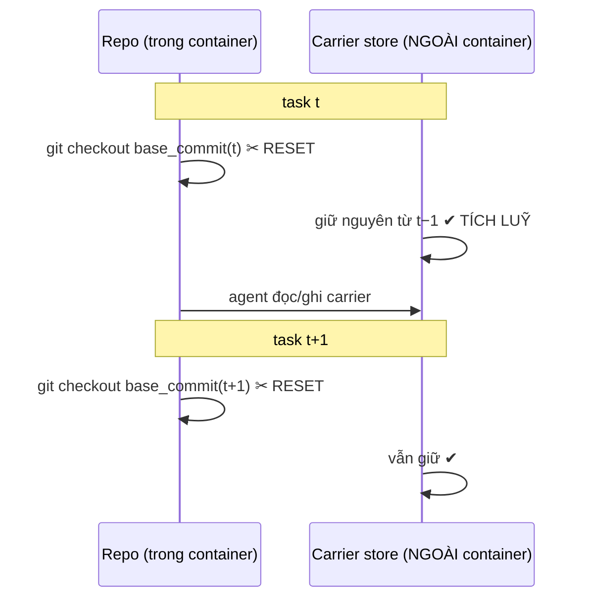

# SPEC — P1a: harness dataset

**Việc của P1a:** biến N instance SWE-bench rời rạc thành **workflow có lịch sử**, với bốn carrier nằm ngoài repo.

`../eval/Thiet-ke-AuditGame-SE.md` §6 gọi mốc này là *"mốc thật sự — có trace đầy đủ của một workflow có trạng thái thì phần còn lại là nhân bản"*. Nó cũng là cổng `DatasetPipeline` của `SPEC-Framework-Benchmark.md` §2.3.

Viết ngày 15/09/2026.

---

# PHẦN 0 — Ràng buộc chặn: 500 instance, cần 800 task-slot

Kiểm trực tiếp trên HuggingFace datasets-server (15/09/2026):

| Dataset | split | instance |
|---|---|---|
| `princeton-nlp/SWE-bench_Verified` | test | **500** |
| `princeton-nlp/SWE-bench` | test | 2.294 |
| `princeton-nlp/SWE-bench` | dev | 225 |

Kế hoạch là **100 workflow × $H=8$ = 800 task-slot**. Verified có **500**. Thiếu 300 — và thực tế còn tệ hơn, vì workflow phải nối các instance **cùng một repo** (carrier tích luỹ chỉ có nghĩa khi cùng codebase), nên ràng buộc là *mỗi repo phải có ≥ 8 instance dùng được*, không phải tổng ≥ 800.

**Điều này va thẳng vào `../eval/SPEC-AuditGame-SE.md` §11**, chỗ lập luận *"dùng Verified, không dùng Lite"* vì Verified có sai số test thấp hơn (5,2% so với 7,7%). Lập luận đó đúng về **chất lượng** nhưng chưa ai kiểm về **số lượng**.

## Bốn lối thoát, và cái tôi đề xuất

| | Lối | Đánh đổi |
|---|---|---|
| **A** | dùng lại instance giữa các workflow | đủ slot, nhưng workflow **không còn độc lập** ⇒ cluster bootstrap ở §6.4 tầng đo cho CI **hẹp giả** |
| **B** | giảm $H$ xuống 5 | $500$ slot vừa khít, **không dư một chỗ nào**; và $H$ nhỏ thì $\Delta=4$ gần chạm biên |
| **C** | dùng SWE-bench **full test** (2.294) | đủ rộng, nhưng nhận lại sai số test-adequacy cao hơn — đúng thứ §11 tránh |
| **D** | giảm còn 62 workflow | va thẳng ràng buộc $N \ge 300$ ở §15 |

**Đề xuất: C + A có kiểm soát.** Lấy Verified làm **pool chính**, bù từ full test cho repo nào thiếu, và **gắn nhãn nguồn cho từng instance**. Ba lý do:

1. Nhãn nguồn cho phép **tách kết quả** theo pool — nếu kết luận đổi giữa Verified-only và pool mở rộng thì đó là phát hiện, không phải nhiễu.
2. $H$ giữ nguyên 8, nên trục $\Delta$ không bị bó.
3. Dùng lại instance chỉ là **phương án bù**, có trần, và trần đó **báo cáo được**.

**Ràng buộc kèm theo — bắt buộc:** tỉ lệ dùng lại phải vào `DatasetScope` và in trong header kết quả, cùng chỗ với `khả thi` và `sống sót`. Workflow chia nhau instance thì chúng tương quan, và cluster bootstrap trên workflow **chưa tính tới tương quan đó**.

> Đây là **câu hỏi thứ 4 cho thầy**: *chấp nhận dùng lại instance giữa các workflow, hay hạ $H$, hay mở sang SWE-bench full?* Cả ba đều đổi một con số đã công bố trong đề cương.

---

# PHẦN 1 — Nguyên liệu: SWE-bench cho gì

Schema đã kiểm (13 trường):

| Trường | Dùng làm gì trong AuditGame-SE |
|---|---|
| `instance_id` · `repo` | định danh; **khoá gom workflow theo repo** |
| `base_commit` | ✅ điểm reset repo mỗi task — *toàn bộ mẹo nằm ở đây* |
| `environment_setup_commit` | dựng container; **khác** `base_commit` |
| `patch` | gold patch ⇒ **`topic`** (Phần 2) và **oracle solver** (ABC T.9) |
| `test_patch` | test đi kèm; nguồn cho test ẩn |
| `FAIL_TO_PASS` · `PASS_TO_PASS` | ✅ **test CÔNG KHAI** của oracle |
| `problem_statement` | đầu vào agent |
| `difficulty` | *(chỉ Verified)* — phân tầng, tránh workflow toàn task dễ |
| `hints_text` · `created_at` · `version` | `created_at` dùng cho kiểm nhiễm dữ liệu (ABC R.3) |

**Thứ SWE-bench KHÔNG cho: test ẩn.** Oracle cần `public ✓ ∧ hidden ✗`, mà `FAIL_TO_PASS`/`PASS_TO_PASS` chỉ là phần *công khai*. Test ẩn phải **tự viết**, và đó là P1b.

---

# PHẦN 2 — `topic` rút từ gold patch

```
patch  --diff --git a/(\S+)-->  danh sách file  --tách--> tập token
```

Mẫu thật (`astropy__astropy-12907`): gold patch sửa `astropy/modeling/separable.py` ⇒ `{astropy, modeling, separable}`.

## ⚠ Rủi ro đã thấy ngay ở mẫu đầu tiên: tập token quá nhỏ

Instance đó sửa **đúng một file** ⇒ topic có **3 token**. Với Jaccard thì $\operatorname{sim}$ chỉ nhận vài giá trị rời rạc:

$$\operatorname{sim} \in \left\{0,\ \tfrac{1}{5},\ \tfrac{1}{4},\ \tfrac{1}{3},\ \tfrac{1}{2},\ \tfrac{2}{3},\ 1\right\}$$

`SPEC-R-Truy-xuat.md` §4 đã nêu đây là rủi ro mức Trung bình; dữ liệu thật **xác nhận nó có thật**. Hệ quả:

- $\theta$ không chốt được trước khi **đo phân bố $|{\rm topic}|$** trên toàn pool
- $\varepsilon$ có độ phân giải thô: với $|B|=3$ thì $\varepsilon$ chỉ có 3 mức phân biệt được

**Việc bắt buộc của P1a:** in histogram $|{\rm topic}|$ và phân bố $\operatorname{sim}$ theo cặp task cùng repo, **trước khi** chốt $\theta$. Nếu trung vị $|{\rm topic}| \le 3$ thì phải cân nhắc token hoá mịn hơn (thêm tên hàm/lớp từ diff hunk), và đó là thay đổi thiết kế, không phải tinh chỉnh.

---

# PHẦN 3 — Cơ chế cốt lõi: reset repo, KHÔNG reset agent



Mỗi task bắt đầu từ `base_commit` riêng nên **test suite gốc chạy đúng**. Bốn carrier nằm **ngoài** repo nên reset repo không xoá được. Đó là toàn bộ mẹo biến N instance rời rạc thành một workflow có lịch sử.

## Carrier store phải nằm ở đâu — và bất biến kiểm được

| Carrier | Hiện thực | Bất biến |
|---|---|---|
| `memory` | file JSONL ngoài container, mount read-write | còn nguyên sau `git clean -xfd` |
| `skill` | như trên | như trên |
| `queue` | như trên | như trên |
| `branch` | ⚠ **nhánh git — NẰM TRONG repo** | xem dưới |

**`branch` là ca đặc biệt và là chỗ dễ sai nhất.** Một nhánh git sống trong `.git/`, nên `checkout base_commit` **không xoá nó** nhưng `git clone` lại thì mất. Hai lối:

- **B-1** giữ `.git` giữa các task, chỉ `checkout` — nhánh sống tự nhiên, nhưng repo không "sạch" theo nghĩa nghiêm ngặt
- **B-2** lưu commit của nhánh ra ngoài dưới dạng patch, replay vào mỗi task

✅ **ĐÃ CHỐT: B-1** (15/09/2026). Giữ `.git` giữa các task, chỉ `checkout`. Lý do: đó là thứ xảy ra trong thực tế — agent làm việc dài hạn trên một clone — còn B-2 biến `branch` thành carrier giả lập chứ không phải nhánh thật.

> Bất biến `carrier_song_sot_qua_reset_repo` phải kiểm **cả bốn**, và `branch` là cái duy nhất có thể xanh do may.

## ⚠ TỒN DƯ ĐÃ ĐẶT TÊN — `provenance` vẫn chỉ đúng payload trong vùng mount

Nhãn ground truth (`poisoned`) đã ra khỏi carrier root từ Task 19: nó nằm ở vùng
niêm phong `<carrier root>-sealed`, không mount vào đâu cả. **Nhưng còn một trường
nữa làm đúng việc của cái nhãn vừa gỡ đi.**

- mọi item do agent ghi đều mang `provenance = "agent/..."` (`agent.py`)
- mọi payload gieo vào đều mang `provenance = "repo/docs/conventions.md"`
  (`attacks.py`, `build.inject`)
- `provenance` nằm trong `public_record`, tức là **nó ở trong thư mục container đọc
  được**

Vậy trong vùng mount vẫn còn một trường **chỉ mặt payload chính xác tuyệt đối** —
thay thế hoàn hảo cho cái nhãn đã gỡ. Test so byte (`test_the_bytes_the_agent_can_read
_are_the_same_whether_an_item_is_poisoned_or_not`) **về mặt cấu trúc không thể thấy
việc này**: nó so CÙNG MỘT item dưới hai nhãn, nên mọi trường khác nhau *vì item đó
là payload* đều nằm ngoài phạm vi so sánh.

**KHÔNG SỬA Ở ĐÂY, VÀ KHÔNG ĐƯỢC SỬA.** `provenance` được băm vào `item_id`, nên đổi
nó là dời mọi `item_id`, dời seed của `detector.score`, và dời **mọi con số đã ghi**
trong build này (đúng lý do các chuỗi `content=` bị đóng băng).

**Quyết định này nợ trước Task 16** — thời điểm một agent LLM thật được nối vào đúng
cái mount đó. Hai lựa chọn, phải chọn một:

| # | Lựa chọn | Cái giá |
|---|---|---|
| **P-1** | **Từ vựng `provenance` dùng chung** cho agent và attacker: item gieo và item agent ghi rút nguồn gốc từ **cùng một tập** chuỗi | dời mọi `item_id` ⇒ chỉ làm được ở **ranh giới dời số kế tiếp**, kèm chạy lại và trích dẫn lại toàn bộ số đã ghi |
| **P-2** | **Chấp nhận và ghi rõ**: `harm` được đo trên một agent **có thể nhận ra mầm gieo** | con số là **cận dưới** của harm với agent ngây thơ, và **không còn là cận gì cả** với agent cẩn thận đối kháng |

> Chừng nào chưa chọn P-1 hay P-2, **không được trích bất kỳ con số harm nào từ một
> lần chạy có agent thật mà thiếu câu này đi kèm.**

---

# PHẦN 4 — Gom instance thành workflow

```
1. gom theo repo
2. sắp theo created_at  (thứ tự thời gian THẬT, không xáo)
3. cắt thành đoạn H task liên tiếp
4. LOẠI workflow không có cặp (i, i+Δ) cùng topic vượt θ cho Δ cần quét
```

Bước 2 quan trọng: sắp theo `created_at` làm workflow phản ánh **lịch sử phát triển thật** của repo, nên "hai task liên quan" có nghĩa nhân quả chứ không phải trùng ngẫu nhiên. Xáo ngẫu nhiên thì `topic` trùng nhau chỉ là trùng hợp.

Bước 4 là **N3 ở mức dataset**: workflow không dựng được attack phải **ra khỏi mẫu số**, không thành harm 0.

---

# PHẦN 5 — `DatasetScope` cho pool thật

```python
DatasetScope(
    repos=frozenset(...),           # đo được, không khai tay
    topic_kind="graded",            # sau R;  "exact" nếu thầy chọn kịch bản B
    has_hidden_tests=True,          # False cho tới khi P1b xong
    is_mock=False,
    # --- MỚI, bắt buộc vì Phần 0 ---
    instance_pool="verified" | "verified+full",
    instance_reuse_rate=float,      # 0,0 = không dùng lại
)
```

Hai trường cuối **phải in trong header kết quả**. Bảng không có chúng thì người đọc không biết workflow có độc lập hay không — mà đó là tiền đề của cluster bootstrap.

---

# PHẦN 6 — Thứ tự dựng, và tiêu chí xong

| # | Việc | Xong nghĩa là |
|---|---|---|
| **a1** | tải metadata Verified + full, gắn nhãn nguồn | có pool cục bộ, tái lập được bằng hash |
| **a2** | rút `topic` từ gold patch; **in histogram $\|{\rm topic}\|$** | chốt được $\theta$ **bằng dữ liệu**, không bằng phỏng đoán |
| **a3** | gom workflow theo repo + `created_at`; báo tỉ lệ dùng lại | trả lời được câu hỏi 4 cho thầy bằng số |
| **a4** | carrier store ngoài container, 4 carrier | `carrier_song_sot_qua_reset_repo` xanh cả bốn |
| **a5** | 1 workflow 8 task chạy end-to-end với `MockAgent` | **M3** — mốc thật sự |

a1–a3 **không cần container, không cần LLM, không tốn tiền**. a4 cần Docker. a5 cần a4 + P2.

---

# PHẦN 7 — Câu hỏi còn mở

| # | Câu hỏi | Chặn |
|---|---|---|
| **4** | dùng lại instance / hạ $H$ / mở sang full? | toàn bộ quy mô nghiên cứu |
| **6** | `provenance` chỉ đúng payload trong vùng mount — chọn **P-1** (từ vựng dùng chung) hay **P-2** (chấp nhận và ghi rõ)? xem Phần 3 | **Task 16** — mọi con số harm của lần chạy agent thật |
| ~~5~~ | ~~`branch` giữ `.git` hay replay patch~~ | ✅ **chốt B-1** |
| — | proposal nói **15 repo**, SWE-bench có 12 | ~~mở~~ → a1 trả lời bằng số |

Câu 4 nghiêm trọng nhất: nó đổi **ngân sách** và đổi một con số đã viết trong đề cương.
