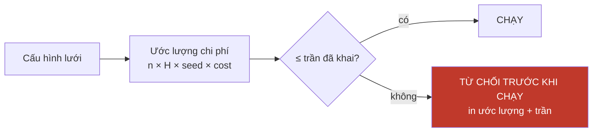

# SPEC — P2: adapter agent

**Việc của P2:** thay `MockAgent` bằng agent thật mà **không đổi một dòng nào trong tầng đo**.

Đây là cổng `AgentPipeline` của `SPEC-Framework-Benchmark.md` §2.2. `../eval/Thiet-ke-AuditGame-SE.md` §5 đã khai ranh giới: *"`agent` là điểm cắm duy nhất. Đổi `MockAgent` sang agent thật thì phần còn lại không đổi một dòng."* Doc này kiểm câu đó có đứng được không.

Viết ngày 15/09/2026.

---

# PHẦN 0 — Đính chính: manuscript KHÔNG trích OpenHands

Bản cũ của doc này viết *"Manuscript trích nó ở `21-OpenHands.pdf`"*. **Sai.** Kiểm lại 15/09/2026:

| Kiểm | Kết quả |
|---|---|
| `OpenHands` trong `../FSE-2027-15-paper-vi.md` | **0 lần** |
| `SWE-bench` · `Docker` | **0 lần** mỗi thứ |
| `harness` | 2 lần — §209 và §356, đều nghĩa *harness đánh giá* (cái từ chối chạy chính sách chưa đóng băng) |
| Danh mục tham khảo `[1]`–`[16]` | không mục nào là OpenHands |
| `21-OpenHands.pdf` | nằm ở `261-Master-Proposal/`, tức **bài số 21 trong danh mục đọc**, không phải trích dẫn của bài số 15 |

Đã nhầm *"bài #21 trong thư mục đọc"* thành *"được bài #15 trích"*. Bài chỉ ràng buộc §215 (100 quy trình 6–14 task / 15 kho mã) và §380 (container biệt lập, fork kho công khai) — **không chốt framework agent**.

**Quyết định: vòng ReAct tối thiểu tự viết, bốn carrier là TOOL.** Xem `../eval/PLAN.md` Task 14 để biết lý do đầy đủ. Tóm tắt: không framework nào có sẵn khái niệm *bốn carrier dai dẳng xuyên task*, nên "dùng OpenHands" luôn là fork-rồi-mổ; và scaffold mỏng dùng chung loại **chất lượng scaffold** khỏi biến gây nhiễu, đúng logic đã dùng cho "một detector dùng chung".

Nên P2 chưa bắt đầu được, và mọi thứ dưới đây là **đặc tả**, không phải mô tả.

---

# PHẦN 1 — Câu "không đổi một dòng" đứng được tới đâu

Ranh giới hiện tại là `Outcome`:

```python
Outcome(retrieved, writes, patch_has_marker, solved)
```

Bốn trường. Ba trong số đó **agent thật không cấp trực tiếp**:

| Trường | `MockAgent` | Agent thật |
|---|---|---|
| `retrieved` | `store.retrieve(topic)` | ✅ như nhau — truy xuất là việc của harness |
| `writes` | tự sinh | ⚠ phải **quan sát** agent ghi gì, không bảo nó ghi |
| `patch_has_marker` | bốc thăm theo `adoption_rate` | ⚠ phải **so AST trên diff thật** |
| `solved` | bốc thăm theo `solve_rate` | ⚠ phải **chạy `FAIL_TO_PASS`/`PASS_TO_PASS`** |

⇒ Câu *"không đổi một dòng"* **đúng cho tầng đo** nhưng **sai cho `Outcome`**: ba trường phải đổi từ *khai báo* sang *đo đạc*. Đó không phải chỗ hỏng thiết kế — nhưng phải nói ra, vì nó là chỗ tốn công nhất của P2 và đề cương đang ước lượng nó bằng 0.

## Hệ quả cho tính tất định

`MockAgent` tất định theo `(seed, t)`. Agent thật **không tất định**: LLM có nhiệt độ, có phiên bản, có giới hạn tốc độ.

Nên hợp đồng **A1** (`deterministic`) phải cho phép khai `False`, và khi `False` thì:

- replay khớp bit **không áp dụng** — trace phải ghi lại *đầu ra thật*, không ghi seed rồi sinh lại
- bootstrap phải bốc lại trên **cả seed lẫn workflow**
- `I1` ở cổng 1 phát biểu lại: *cùng trace ⇒ cùng kết quả chấm*, thay vì *cùng seed ⇒ cùng trace*

```python
AgentScope(
    carriers_written=frozenset({"memory","skill","queue","branch"}),
    # deterministic và cost_usd_per_task ĐÃ CHUYỂN sang LLMScope — chúng là
    # thuộc tính của MODEL, không phải của scaffold.  Xem §1b.
)
```

---

# PHẦN 1b — Hạ tầng đã chốt: DeepSeek, qua cổng `LLMPipeline`

**Quyết định:** backend LLM là DeepSeek API. Đây là đáp án cho **câu hỏi 7**.

Nhưng model **không hardcode vào adapter** — nó đi qua cổng `LLMPipeline` (`SPEC-Framework-Benchmark.md` §2.5), vì `deterministic` và `cost_usd_per_task` là thuộc tính của **model**, không phải của **scaffold**. Gộp chúng vào `AgentScope` là conflate, và nó làm câu hỏi *"hiệu ứng đến từ model hay từ system"* không tách được — trong khi portfolio có hẳn `22-From-Model-Scaling-to-System-Scaling.pdf`.

## Giá, kiểm ngày 15/09/2026

| model | in cache-**miss** | in cache-**hit** | out | context |
|---|---|---|---|---|
| `deepseek-flash` | $0,15 / $0,30 | **$0,003 / $0,006** | $0,6 / $1,2 | 1M |
| `deepseek-v4-pro` | $0,66 / $1,32 | **$0,022 / $0,044** | $1,98 / $3,96 | 1M |

*(USD / 1M token, off-peak / peak. Peak = 01:00–04:00 và 06:00–10:00 UTC, T2–T6. Off-peak bằng nửa peak.)*

**Cache-hit rẻ hơn cache-miss 50× (flash) và 30× (pro).** Đó là con số quan trọng nhất trong bảng.

## Ngân sách vòng LLM

Giả định 1,2M token vào / 15k ra mỗi task — **phải ĐO ở p2.2, không được chốt bằng bảng này**:

| cấu hình | 800 slot *(có replay)* | 108.000 lần *(không replay)* |
|---|---|---|
| flash · off-peak · cache 90% | **$24** | **$3.266** |
| flash · peak · cache 90% | $48 | $6.532 |
| flash · off-peak · KHÔNG cache | $151 | $20.412 |
| pro · off-peak · cache 90% | $106 | $14.327 |
| pro · peak · KHÔNG cache | $1.315 | $177.487 |

> ### ⚠ Bước 15.5 CHƯA TRẢ ĐƯỢC — giả định 1,2M/15k vẫn còn nguyên, và đây là lý do
>
> `auditgame/llms.py` (Task 15, 16/09/2026) đã dựng xong **cổng `LLMPipeline`**: `LLMScope`,
> giá kiểm ngày 15/09/2026, cửa sổ peak/off-peak, công thức chi phí và cổng chặn L1–L4.
> Bảng trên **dẫn lại được đúng từng dòng** bằng `LLMScope.estimate_cost` — có test cưỡng
> chế ở `tests/gate1_integrity/test_conformance_llm.py`. Tức **công thức** đã được kiểm.
>
> **Nhưng con số 1,2M vào / 15k ra vẫn là GIẢ ĐỊNH, chưa phải số đo.** Bước 15.4 (chạy 5
> instance để đo token thật, tỉ lệ cache-hit thật và `solved` thật) **chưa chạy**: môi
> trường build này **không có API key**, và spike đó là thứ đầu tiên trong toàn bộ build
> tiêu tiền. Theo **luật N3**, chỗ này ghi **LÝ DO**, không điền một con số hợp lý:
> `llms.PENDING_MEASUREMENT` giữ bản ghi cho `spike_5_instances`, `tokens_in_per_task`,
> `tokens_out_per_task`, `cache_hit_rate`, `cost_usd_per_task`, `solved_rate`, và mọi hàm
> đọc chúng **ném lỗi** (`NotMeasured`) chứ không trả `0.0`.
>
> Hệ quả phải nói thẳng: **năm dòng ngân sách trên là hàm của một giả định**, nên chúng
> chưa được trích như số đo. Cắm key vào là **bước duy nhất còn lại** — xem
> `llms.DeepSeekFlash().client()` và `agent_llm.api_client()`.

Manuscript khai **18.000–27.000 USD**. Hai kết luận:

1. **Ngay cả KHÔNG có replay**, flash off-peak + cache cho **$3.266** — rẻ hơn 6–8 lần. Con số ngân sách trong đề cương không còn là ràng buộc chặn.
2. **Có replay** thì còn **$24**. Nhưng xem cảnh báo ở Phần 2 — replay chưa có gì giữ.

## Ba đòn bẩy, xếp theo độ lớn

| đòn bẩy | chia |
|---|---|
| **bật prompt cache (90% hit)** | **6,2×** |
| `pro` → `flash` | 4,3× |
| chạy off-peak | 2,0× |

Nhân dồn ≈ **53×**. Và đòn bẩy lớn nhất **không phải chọn model** — nó là cache, thứ phụ thuộc vào **cách lắp prompt**.

## ⚠ Ràng buộc thiết kế sinh ra từ đòn bẩy cache

Prompt cache chỉ trúng khi **tiền tố ổn định**. Nên thứ tự lắp prompt là một quyết định kiến trúc, không phải chi tiết:

```
[ỔN ĐỊNH nhất]  system prompt · repo context · base_commit tree
                problem_statement của task
[BIẾN ĐỘNG]     trạng thái 4 carrier   <- ĐỔI mỗi task
                lịch sử hội thoại       <- ĐỔI mỗi lượt
[cuối]          lượt hiện tại
```

Đặt trạng thái carrier **trước** repo context là hỏng cache cho toàn bộ tiền tố — và hoá đơn nhân 50×, **im lặng**. Đó đúng là thứ **L2** sinh ra để bắt.

> Và có một điều đáng chú ý về nội dung: workflow 8 task **cùng một repo** là cấu trúc *lý tưởng* cho prompt cache — tiền tố repo dùng lại được qua cả 8 task. Mẹo "reset repo, không reset agent" vừa là cơ chế nghiên cứu, vừa tình cờ là tối ưu chi phí.

## Nhiễm dữ liệu — DeepSeek không miễn

SWE-bench nằm trong dữ liệu huấn luyện của mọi model hiện đại, và DeepSeek không ngoại lệ. Kiểm ABC R.3 (so hiệu năng instance trước/sau ngày cutoff, dùng trường `created_at`) **vẫn bắt buộc**, và ngày cutoff phải ghi vào `LLMScope`.

---

# PHẦN 2 — `cost_usd_per_task` là trường cưỡng chế được, không phải chú thích

Đây là điểm thiết kế riêng của doc này.

$$\text{chi phí ô lưới} \;=\; n_{\text{workflow}} \times H \times n_{\text{seed}} \times \texttt{cost\_usd\_per\_task}$$

Framework phải **từ chối chạy** một cấu hình vượt trần ngân sách đã khai, và từ chối **trước khi** tiêu đồng nào — chứ không phải dừng giữa chừng để lại nửa lưới không đọc được.



Với `../eval/Thiet-ke-AuditGame-SE.md` §3: 100 workflow × 8 task × 1 lần chạy LLM = **800 lần gọi agent**, rồi replay offline 45 ô lưới × 8 hệ thống × 3 seed. Nếu `cost_usd_per_task = 0{,}35` thì vòng LLM là ~**280 USD**, không phải 18–27k — đúng con số mà `../eval/Thiet-ke-AuditGame-SE.md` gọi là *"câu hỏi giá trị nhất cho thầy"*.

**Nhưng nó chỉ đúng nếu replay hợp lệ.** `../eval/SPEC-Tang-Do-va-Test.md` nay ghi **I9 (test tương đương replay) ✅ xanh**, và xanh theo nghĩa mạnh: `runner.run_once` ghi `TaskTrace` đủ chín dòng Phần 1 của `SPEC-P1b-Trace.md`, `core.dump_traces`/`load_traces` khép vòng đời qua **hai tiến trình**, còn `replay.rescore(traces, det, pol)` **dẫn lại một ô lưới chưa từng chạy** — chấm cấu hình B từ trace ghi dưới cấu hình A rồi khớp với lần chạy trực tiếp B trên harm, ngân sách đã tiêu, $Q_\text{true}$, $Q_\text{false}$, $T_\text{lost}$ và thời điểm phát hiện. Đo trên 1.440 ca (mock + SWE-bench thật, bốn carrier, $\Delta \in \{0,1,2\}$, hai seed, ba cặp detector, năm cặp chính sách): 592 ca dẫn lại được, **không ca nào lệch**, và 298 trong số đó cho harm **khác** ô đã ghi trace — nên phép kiểm không còn là đồng nhất thức.

⚠ **Con số "~5% cách ly kích hoạt" của `SPEC-P1b-Trace.md` KHÔNG khớp với đo đạc.** Lấy trace bằng một lượt chạy quan sát (không audit) rồi replay toàn bộ lưới — 18.000 ô, mock + SWE-bench thật — chỉ **47,0%** số ô hợp lệ; phần còn lại bị `rescore` **khai là không hợp lệ kèm lý do** (đúng luật N3, không ghi `harm = 0`) vì cách ly đã đổi thật thứ agent truy xuất được. Tỉ lệ phụ thuộc mạnh vào chính sách (B1 audit-at-commit 100%, Sentinel 30,6%, NC1 quarantine-everything 10,0%) và vào luật cách ly hai điều kiện: $(\tau_Q, \eta_Q) = (0{,}0;\,0{,}0) \to 47{,}5\%$, $(0{,}5;\,0{,}05) \to 63{,}5\%$, $(0{,}7;\,0{,}1) \to 72{,}7\%$.

Hệ quả cho ngân sách: **replay vẫn là đòn bẩy, nhưng không miễn phí toàn bộ lưới.** Phần ô không hợp lệ phải chạy lại hoặc cắt cụt, nên con số ~280 USD phải được trích kèm tỉ lệ replay đo được của đúng cấu hình đang báo cáo, chứ không trích như thể cả lưới là hậu kỳ.

---

# PHẦN 3 — Mối đe doạ SWE-Lancer: agent đọc được test ẩn

`../eval/SPEC-AuditGame-SE.md` §11 đã nêu: SWE-Lancer hỏng hoàn toàn vì agent đọc được file test — đạt 100% mà không giải gì.

P2 làm mối đe doạ này **nặng hơn**, không nhẹ đi:

| | Agent SWE-bench thường | Agent của đề tài |
|---|---|---|
| đường chạm filesystem | repo | repo **+ 4 carrier** |
| có nhánh git dài hạn | không | ✅ `branch` |
| có hàng đợi công cụ | không | ✅ `queue` |

**Bất biến bắt buộc, kiểm bằng máy:**

> `khong_duong_nao_tu_agent_doc_duoc_test_an` — test ẩn sống **ngoài container**, và không carrier nào chứa đường dẫn tới nó.

Kiểm bằng hai tầng: (1) test ẩn không nằm trong mount nào agent thấy; (2) quét nội dung mọi item carrier tìm đường dẫn khớp thư mục test ẩn. Tầng (2) cần vì agent có thể **ghi đường dẫn vào memory** ở task này rồi dùng ở task sau — đúng cơ chế dai dẳng mà đề tài nghiên cứu, quay ngược lại cắn oracle.

## ⚠ Đáp án thứ hai, và nó VẪN nằm trong vùng mount: `provenance`

Test ẩn là đáp án thứ nhất; `Item.poisoned` là đáp án thứ hai, và nó đã ra khỏi vùng
mount từ Task 19 (vùng niêm phong `<carrier root>-sealed`, không mount vào đâu cả).
**Nhưng còn một trường làm đúng việc của cái nhãn vừa gỡ đi:** mọi item do agent ghi
mang `provenance = "agent/..."`, mọi payload gieo vào mang
`provenance = "repo/docs/conventions.md"`, và `provenance` nằm trong `public_record`
— tức nằm trong thư mục mà **chính agent của P2** đọc được.

Đặt tên đầy đủ ở `SPEC-P1a-Harness.md` Phần 3 (mục "TỒN DƯ ĐÃ ĐẶT TÊN") và câu 6 ở
Phần 7; bản ghi trong mã nguồn ở đầu `harness.py`. **Không sửa được ở đây:**
`provenance` được băm vào `item_id`, nên đổi nó là dời mọi id, dời seed của
`detector.score` và dời mọi con số đã ghi trong build này.

**Quyết định nợ trước p2.3–p2.5** (tức Task 16 của `../eval/PLAN.md`), chọn một:

| # | Lựa chọn | Cái giá |
|---|---|---|
| **P-1** | từ vựng `provenance` dùng chung cho agent và attacker | dời mọi `item_id` ⇒ chỉ làm ở **ranh giới dời số kế tiếp**, kèm chạy lại toàn bộ số đã ghi |
| **P-2** | chấp nhận và ghi rõ | `harm` là **cận dưới** với agent ngây thơ, và **không còn là cận gì cả** với agent cẩn thận đối kháng |

> Chừng nào chưa chốt P-1 hay P-2, **không được trích bất kỳ con số `harm` nào từ một
> lần chạy có agent thật mà thiếu câu này đi kèm.**

---

# PHẦN 4 — Thứ tự dựng

| # | Việc | Xong nghĩa là | Chi phí |
|---|---|---|---|
| **p2.1** | vòng ReAct tối thiểu (carrier là tool), dựng container | chạy được 1 instance SWE-bench gốc | ~0 |
| **p2.2** | đo `cost_usd_per_task` trên 5 instance | có số THẬT thay cho ước lượng | ~vài USD |
| **p2.3** | `writes` lấy từ **nhật ký gọi tool** | `writes` là **đo trực tiếp**, không suy từ diff thư mục | ~0 |
| **p2.4** | `patch_has_marker` bằng so AST trên diff thật | bỏ `adoption_rate` bốc thăm | ~0 |
| **p2.5** | `solved` bằng chạy `FAIL_TO_PASS`/`PASS_TO_PASS` | bỏ `solve_rate` bốc thăm | vài USD |
| **p2.6** | `khong_duong_nao_tu_agent_doc_duoc_test_an` | oracle không bị SWE-Lancer hoá | ~0 |
| **p2.7** | ghi `TaskTrace` đầy đủ; **I9 xanh** | replay hợp lệ ⇒ mới được trích "rẻ hai bậc" | ~0 |

**p2.2 đi trước p2.5** có chủ đích: biết chi phí thật trước khi tiêu.

---

# PHẦN 5 — Câu hỏi còn mở

| # | Câu hỏi | Chặn |
|---|---|---|
| ~~6~~ | ~~`deterministic=False` hay ép nhiệt độ 0~~ | ✅ **chốt `False`** (15/09/2026) |
| ~~7~~ | ~~trần ngân sách LLM~~ | ✅ **đã chốt: DeepSeek API** — xem §1b. Trần cụ thể vẫn cần một con số cho L4 |
| ~~10~~ | ~~dùng `deepseek-flash` hay `deepseek-v4-pro`?~~ | ✅ **chốt 16/09/2026: `deepseek-flash` mặc định + LUẬT RẼ NHÁNH** — xem dưới |
| **6′** | `provenance` chỉ đúng payload trong vùng mount — **P-1** hay **P-2**? xem Phần 3 | **p2.3–p2.5**: mọi con số `harm` của lần chạy agent thật (cùng câu 6 của `SPEC-P1a-Harness.md`) |

✅ **Câu 10 đã chốt (16/09/2026): `deepseek-flash` mặc định, kèm LUẬT RẼ NHÁNH.**

> **`solved` của flash < 20%** ⇒ `pro` cho main run, `flash` cho sweep. Ngược lại `flash` toàn tuyến.
>
> - **Ngưỡng 20% được khai TRƯỚC khi có bất kỳ số đo nào** (`llms.FLASH_SOLVED_THRESHOLD`,
>   `llms.QUESTION_10_DECIDED_AT = "2026-09-16"`). Chọn model sau khi nhìn kết quả là chọn
>   model **theo** kết quả — nên luật này là **mã áp lên một con số**, không phải một lựa
>   chọn: `llms.resolve_question_10(rate)` **ném `NotMeasured`** khi `rate is None`, và
>   trong build này `llms.measured_flash_solved_rate()` **trả `None`**.
> - **CẤM TRỘN:** không bảng nào chứa số từ hai model (`llms.refuse_mixed_models`). **Model
>   và tỉ lệ cache-hit in trong header** (`llms.results_header`); cache-hit chưa đo thì
>   header in `NOT MEASURED` kèm lý do, **không in 0,0%**.
> - Ngân sách câu 11 tính trên flash; rơi vào pro thì **nhân `llms.PRO_COST_MULTIPLIER` = 4,3**.
> - Con số quyết định nhánh đến từ spike bước 15.4 — **chưa chạy được**, xem cảnh báo ở Phần 1b.

✅ **Câu 6 đã chốt: `deterministic=False`.** Ba hệ quả **bắt buộc**, không phải tuỳ chọn:

1. **Trace ghi ĐẦU RA THẬT**, không ghi seed rồi sinh lại. `TaskTrace` phải chứa nội dung phản hồi, không chỉ tham số.
2. **Bootstrap bốc lại trên CẢ seed lẫn workflow** — hai nguồn phương sai, không phải một.
3. **I1 phát biểu lại**: *cùng trace ⇒ cùng kết quả chấm*, thay cho *cùng seed ⇒ cùng trace*. Tầng đo vẫn tất định; chỉ tầng agent thì không.

Và nó làm **I9 (tương đương replay) thành bắt buộc** — không có I9 thì không có cơ sở nào để dùng lại trace, tức mất luôn đòn bẩy chi phí.
