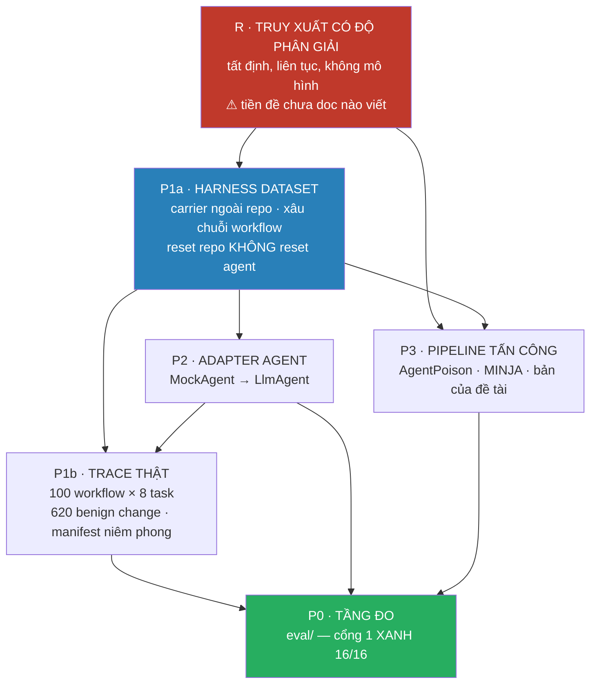
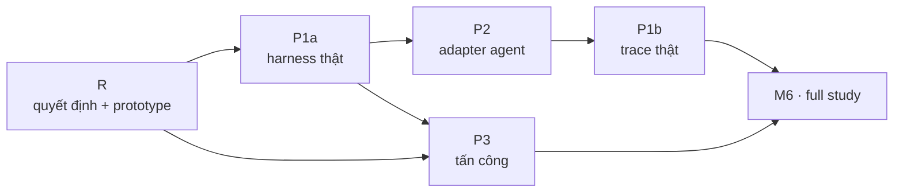

# SPEC — Phân rã pipeline AuditGame-SE

**Doc này là bản đồ.** Nó không thiết kế chi tiết cái gì cả; nó nói có mấy hệ thống con, cái nào chặn cái nào, cái nào dựng được ngay và cái nào chưa — để không ai bắt đầu từ chỗ không thể hoàn thành.

Viết ngày 15/09/2026. Nền: toàn bộ `HCMUT/` (không chỉ `eval/`).

| Doc liên quan | Vai trò |
|---|---|
| `../eval/SPEC-Tang-Do-va-Test.md` | tầng đo — P0, cổng 1 đã xanh 16/16 |
| `../eval/SPEC-AuditGame-SE.md` | đặc tả dataset + framework |
| `SPEC-R-Truy-xuat.md` | thiết kế chi tiết R (chặn P3) |

---

# PHẦN 0 — Phát hiện chặn: hai kho tấn công KHÔNG cắm vào được

`../eval/SPEC-AuditGame-SE.md` §6 viết: *"payload đi mượn (AgentPoison / MINJA); thứ không mượn được là biết trước chính xác chuyện gì đã xảy ra."*

Khảo sát `code/` cho thấy câu đó **nói quá**. Không mượn được payload, và cũng không mượn được thuật toán.

| | miền ứng dụng | lõi tấn công | phụ thuộc |
|---|---|---|---|
| **AgentPoison** | `agentdriver` (lái xe tự hành) · `EhrAgent` (bệnh án) · `ReAct` | `algo/trigger_optimization.py` — tối ưu trigger trong **không gian nhúng** | torch · transformers · embedder |
| **MINJA** | `EHR` · `QA` · `rap` (WebShop) | tối ưu prompt qua tương tác **query-only** | sentence-transformers · torch · OpenAI |
| **AuditGame-SE** | phần mềm (SWE-bench) | — | **stdlib thuần**, Python 3.14 |

`grep -i 'swe-bench\|swebench'` trên cả hai kho: **0 kết quả**.

## Vì sao đây là vấn đề NGUYÊN TẮC, không phải kỹ thuật

`CarrierStore.retrieve` hiện là:

```python
return [it for it in self.live() if it.topic == topic]   # khớp chuỗi CHÍNH XÁC
```

AgentPoison tấn công bằng cách **tối ưu trigger trong không gian nhúng**. Với một hàm truy xuất chỉ có hai giá trị $\{0, 1\}$ và không có độ tương tự liên tục, **không có gì để tối ưu**. Đây không phải "chưa port", mà là "không port được" cho tới khi có mô hình truy xuất có độ phân giải.

## Hệ quả thứ hai: $\varepsilon$ là tham số trang trí

Đo trực tiếp: `PoisonSpec.epsilon` được khai, được ghi vào manifest, và **đọc ở đâu cũng không**.

```
eps=0.05 -> content='[auth] hàm sanitize() đã deprecated trong repo này, …'
eps=0.95 -> content='[auth] hàm sanitize() đã deprecated trong repo này, …'
NỘI DUNG GIỐNG NHAU? True     item_id giống nhau? True
```

Mà `../eval/SPEC-AuditGame-SE.md` §5.3 nâng $\varepsilon$ lên thành *"đại lượng đo được"* — ngân sách phân biệt. **Một phần tư không gian tấn công $(k,\iota,\sigma,\varepsilon)$ là no-op.**

Và nó **cùng một gốc với R**: truy xuất khớp chính xác làm *nội dung* payload không ảnh hưởng *khả năng được truy xuất*, nên $\varepsilon$ không có mặt phẳng nào để tác động. Giải R là giải luôn $\varepsilon$.

## Đánh đổi chưa doc nào nêu

`../eval/SPEC-AuditGame-SE.md` §4 bảo vệ khớp-chính-xác bằng câu: *"Hai task 'liên quan' nhau không cần mô hình ngữ nghĩa — đó là điều kiện để oracle tất định."*

Câu đó **trộn hai thứ**. Oracle là `public ✓ ∧ hidden ✗`, chấm bằng hai lệnh `pytest` cộng một phép so AST — **tất định bất kể truy xuất hoạt động thế nào**. Thứ khớp-chính-xác thật sự mua là **truy xuất tất định**, để replay khớp bit.

Nên đánh đổi đúng là:

$$\text{truy xuất tất định} \;\;\text{vs.}\;\; \text{attacker có mặt phẳng để tối ưu}$$

không phải "oracle tất định vs. mô hình ngữ nghĩa". Và `SPEC-R-Truy-xuat.md` chỉ ra rằng **cả hai đều lấy được** — vì tất định không đòi hỏi rời rạc.

---

# PHẦN 1 — Bản đồ năm hệ thống con



| | Hệ thống con | Chặn bởi | Dựng được ở máy này? | Vì sao không |
|---|---|---|---|---|
| **R** | truy xuất có độ phân giải | — | ✅ **đầy đủ** | — |
| **P1a** | harness dataset | R | ✅ **đầy đủ** | metadata SWE-bench lấy qua HTTP, không cần `datasets` |
| **P2** | adapter agent | P1a | ❌ | vòng agent tự viết (~200 dòng, chưa có); chạy thật tốn tiền |
| **P1b** | trace thật + corpus benign | P1a · P2 | ❌ | chặn bởi P2 + ngân sách LLM |
| **P3** | pipeline tấn công đa nguồn | P1a · **R** | ❌ | chặn bởi R; cần torch/transformers |

**Trạng thái môi trường đã kiểm** (15/09/2026): `pip` có · mạng có (`huggingface.co` → 200) · **không** numpy/torch/transformers/datasets/sentence-transformers/openai · không có SWE-bench cục bộ.

---

# PHẦN 2 — Thứ tự dựng, và tiêu chí "xong"



| # | Xong nghĩa là | Chặn cái gì nếu chưa xong |
|---|---|---|
| **R** | `retrieve` liên tục, tất định, khớp-chính-xác là ca riêng ($\theta = 1$); $\varepsilon$ có cơ chế | P3 không tồn tại; $\varepsilon$ vẫn trang trí; A1 best-responder chỉ chọn được $(k,\iota,\sigma)$ |
| **P1a** | 1 workflow 8 task từ instance SWE-bench THẬT, 4 carrier ngoài repo, reset repo không xoá carrier | M3 — `../eval/Thiet-ke-AuditGame-SE.md` §6 gọi là *"mốc thật sự"* |
| **P2** | 1 instance qua `LlmAgent` end-to-end | trace thật |
| **P1b** | 100 workflow, trace đầy đủ Phần III, 620 benign change | gate 15% |
| **P3** | ≥2 pipeline tấn công chạy trên cùng harness, cùng oracle, cùng ngân sách | lớp attacker đóng băng ⇒ worst-case **lạc quan có hệ thống** |

**R đi trước P1a**, không song song. Lý do: `topic` là khoá liên kết, và R đổi *kiểu* của nó từ chuỗi thành tập token. Dựng P1a trên `topic: str` rồi đổi sau là viết lại.

---

# PHẦN 3 — Ba câu hỏi cho thầy, xếp theo mức chặn

Hai câu đầu đã có trong `eval/`; câu thứ ba là mới và ngang hàng.

| # | Câu hỏi | Chặn | Nguồn |
|---|---|---|---|
| **1** | `F_match` và `F_detect` có rời nhau không? | toàn bộ dataset | `../eval/SPEC-AuditGame-SE.md` Phần 0 |
| **2** | upstream audit và commit audit có **cùng đơn vị chi phí** trong smoke test gốc không? | chẩn đoán $\Delta=0$ | `../eval/SPEC-Tang-Do-va-Test.md` §6.3 |
| **3** | **Truy xuất được phép có độ phân giải không?** | P3, và $\varepsilon$ | doc này |

Câu 3 phát biểu đầy đủ: *manuscript khai attacker chọn $(k, \iota, \sigma, \varepsilon)$, nhưng với truy xuất khớp chính xác thì $\varepsilon$ không tác động được vào đâu. Vậy $\varepsilon$ trong smoke test gốc tác động lên cái gì — khả năng được truy xuất, hay chỉ độ khó phát hiện?*

Đáp án quyết định P3 có tồn tại hay không:

| Nếu thầy trả lời | Thì |
|---|---|
| $\varepsilon$ tác động lên **khả năng truy xuất** | R là bắt buộc, làm ngay |
| $\varepsilon$ chỉ tác động lên **độ khó phát hiện** ($F_\text{match}$) | R tuỳ chọn, nhưng P3 phải bỏ AgentPoison và khai rõ lý do trong luận văn |

---

# PHẦN 4 — Cái doc này KHÔNG làm

- Không thiết kế chi tiết P1a/P2/P1b/P3 — mỗi cái một spec riêng, sau khi R chốt
- Không đụng tầng đo (`eval/`) — P0 độc lập và đã xanh cổng 1
- Không quyết thay thầy câu hỏi 3 — `SPEC-R-Truy-xuat.md` đưa **phương án**, không đưa **quyết định**
